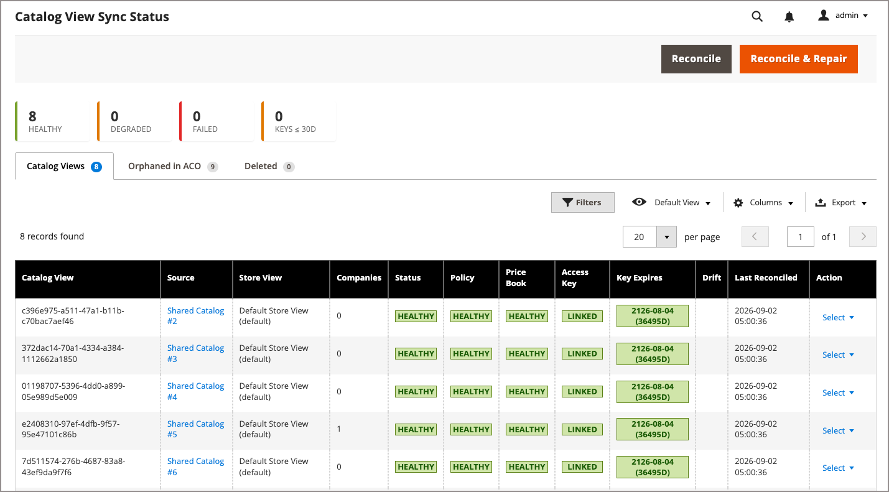

# 监控B2B共享目录的目录视图同步

在Commerce管理员中使用[!UICONTROL Catalog View Sync Status]仪表板跟踪从[!DNL Adobe Commerce]到[!DNL Adobe Commerce Optimizer]的B2B目录视图同步。

[!UICONTROL Catalog View Sync Status]验证[!DNL Adobe Commerce Optimizer]中是否存在每个B2B共享目录的目录视图、策略、价格手册引用和受限访问密钥配置，并且是否与您的[!DNL Adobe Commerce]配置匹配。 若要跟踪产品、价格和类别信息源同步，请参阅[管理数据同步](data-sync-status.md#verify-that-the-data-sync-is-working)。

## 访问同步状态页面 {#access-the-sync-status-page}

从Commerce管理员转到&#x200B;**[!UICONTROL System]** > **[!UICONTROL Data Transfer]** > **[!UICONTROL Catalog View Sync Status]**。

{width="600" zoomable="yes"}

该页面有三个选项卡： [!UICONTROL Catalog Views]、[!UICONTROL Orphaned in ACO]和[!UICONTROL Deleted]。

## 解释共享目录的同步状态 {#interpret-sync-status}

在[!UICONTROL Catalog View]选项卡上，每一行表示一个从共享目录和存储视图组合投影的自定义共享目录视图。 投影是[!DNL Commerce Optimizer Connector]导出到[!DNL Adobe Commerce Optimizer]的共享目录的目录视图、策略、价格手册引用和受限访问密钥配置数据。 使用状态信息确定发送到公司店面体验的数据是否完整和正确。 下表总结了最常见的状态值以及它们对共享目录的意义：

| 状态 | 这对您的共享目录意味着什么 |
| --- | --- |
| **已降级** | 在[!DNL Adobe Commerce Optimizer]中直接更改了某些内容，例如，政策或链接的价格手册。 在解决问题之前，公司可能会看到错误的分类或定价。 如果在Commerce Optimizer中更改了访问密钥、视图名称或源，也会发生这种情况。 |
| **失败** | 目录视图在[!DNL Adobe Commerce Optimizer]中不存在，或者如果宽限期在生成第一个投影之前过期。 （请参阅[配置ACO目录视图同步设置](#configure-aco-catalog-view-sync-settings)）。 如果目录同步状态为`Failed`，则公司无法访问此共享目录的店面体验。 |
| **正在弃用** | 您已删除[!DNL Adobe Commerce]中的共享目录。 目录视图仍可访问，直到删除宽限期到期。 默认宽限期为七天。 您可以通过更新[目录视图同步设置](#configure-aco-catalog-view-sync-settings)来修改默认值。 |
| **孤立** | 目录视图或键是直接在[!DNL Adobe Commerce Optimizer] Studio中创建的，不是由连接器创建的。 查看[查看孤立的已删除条目](#review-orphaned-and-deleted-entries)。 |

[!UICONTROL Healthy]、[!UICONTROL Pending]和[!UICONTROL Deleted]是不需要操作的信息性状态。 有关完整列表，请参阅&#x200B;*Commerce管理指南*&#x200B;中的[同步状态值](https://experienceleague.adobe.com/en/docs/commerce-admin/systems/data-transfer/data-sync/catalog-view-sync/catalog-view-sync-status#sync-status-values){target="_blank"}。

### 配置ACO目录视图同步设置 {#configure-aco-catalog-view-sync-settings}

从[!DNL Adobe Commerce] Admin （不是[!DNL Adobe Commerce Optimizer] Studio），转到&#x200B;**[!UICONTROL Stores]** > **[!UICONTROL Configuration]** > **[!UICONTROL Services]** > **[!UICONTROL ACO Catalog View Sync]**&#x200B;以控制连接器如何进行删除和创建，以及它是否自动修复漂移。

{width="600" zoomable="yes"}

- **[!UICONTROL Deletion Grace Period (days)]** — 删除的共享目录的目录视图、策略和元数据在删除前保留在[!DNL Adobe Commerce Optimizer]中的天数。 默认为7天。 设置为`0`以立即删除投影，无宽限期。

- **[!UICONTROL Creation Grace Period (days)]** — 新注册的目录视图在报告为[!UICONTROL Pending]时可等待其第一个投影到[!DNL Adobe Commerce Optimizer]的天数。 如果宽限期在没有投影的情况下失效，则状态将变为[!UICONTROL Failed]。 默认为1。

- **[!UICONTROL Enabled]** （漂移协调器） — 运行计划漂移协调器，将[!DNL Adobe Commerce Optimizer]与[!DNL Adobe Commerce]投影状态进行比较，并修复或报告差异。

- **[!UICONTROL Automatically Repair Drift]** — 当设置为&#x200B;**[!UICONTROL Yes]**&#x200B;时，计划运行会将[!DNL Adobe Commerce Optimizer]收敛回[!DNL Adobe Commerce]以进行可修复的漂移。 当设置为&#x200B;**[!UICONTROL No]**&#x200B;时，计划的运行仅检测和记录漂移；始终报告孤立条目，从不自动删除。 此设置仅影响计划协调程序。 此页面上的&#x200B;**[!UICONTROL Reconcile & Repair]**&#x200B;操作始终修复漂移。 请参阅[选择监视或修复](#choose-monitoring-or-repair)。

有关每个设置的详细信息，请参阅&#x200B;*[!DNL Commerce Admin]指南*&#x200B;中的[ACO目录视图同步配置](https://experienceleague.adobe.com/en/docs/commerce-admin/configuration-reference/services/aco-catalog-view-sync.md)。

## 选择监视或修复 {#choose-monitoring-or-repair}

[!DNL Adobe Commerce]始终是B2B共享目录的目录视图、策略、价格手册和关键配置的真实来源。 如果您或其他管理员直接在[!DNL Adobe Commerce Optimizer] Studio中更改了策略、价格手册或密钥配置设置，则协调会将配置差异报告为漂移。

- 选择&#x200B;**[!UICONTROL Reconcile]**&#x200B;以检查漂移，而不更改任何内容，这样您就可以在执行操作之前查看差异。
- 选择&#x200B;**[!UICONTROL Reconcile & Repair]**&#x200B;以恢复任何可修复漂移的预期配置。

要检查更改的内容以及更改原因，请打开目录视图的详细信息页面并检查其漂移历史记录。

## 查看孤立和删除的条目 {#review-orphaned-and-deleted-entries}

**[!UICONTROL Orphaned in ACO]**&#x200B;和&#x200B;**[!UICONTROL Deleted]**&#x200B;选项卡涵盖了连接器无法自动修复的两个情况，因为没有要协调的[!DNL Adobe Commerce]共享目录：

- **[!UICONTROL Orphaned in ACO]** — 连接器报告处于同步状态和迁移协调期间的孤立实体。 即使协调在启用修复的情况下运行，它也不会采用或自动删除它们。

  当实体存在于[!DNL Adobe Commerce Optimizer]中时，该实体将被孤立，但连接器不会跟踪它或将它与跟踪的目录视图相关联。 当通过其他集成手动创建实体，或在连接器操作中断后留下实体时，可能会发生这种情况。

  - **目录视图** — 连接器不跟踪视图。 选择目录视图链接以在[!DNL Adobe Commerce Optimizer] Studio中打开“目录视图”详细信息页。 如果不再需要目录视图，请将其删除。

  - **受限访问键** — 没有活动目录视图引用该键。 选择目录视图链接以在[!DNL Adobe Commerce Optimizer] Studio中打开“目录视图”详细信息页。 查看配置的访问密钥，如果不再需要它，请将其删除。

  - **策略** — 连接器不跟踪该策略，并且没有实时目录视图引用它。 选择策略链接以在[!DNL Adobe Commerce Optimizer] Studio中将其打开。  查看它，如果不再需要它，则将其删除。

- **[!UICONTROL Deleted]** — 您删除了[!DNL Adobe Commerce]中的共享目录，随后删除了其目录视图投影。 这些行将保留90天，以记录删除的内容。

>[!MORELIKETHIS]
>
> - [目录视图同步状态监视](https://experienceleague.adobe.com/en/docs/commerce-admin/systems/catalog-view-sync-status.md){target="_blank"} — *Commerce管理指南*&#x200B;中有关目录视图同步状态页面的完整文档参考 — >
> - [管理数据同步](data-sync-status.md) — 验证产品、价格和类别信息源同步
> - [私有目录视图](/help/optimizer/setup/private-catalog-view.md) — 了解什么是连接器管理的私有目录视图
> - [受限访问密钥](/help/optimizer/setup/restricted-access-keys.md) — 了解连接器管理的密钥的工作原理
> - [监视B2B共享目录更改](get-started-b2b-shared-catalogs.md#monitor-b2b-shared-catalog-changes) — 了解连接器自动为B2B共享目录执行哪些操作
