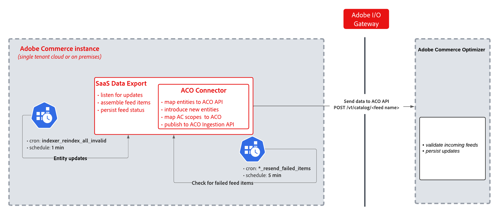

# 连接器同步管道

**[!DNL Adobe Commerce Optimizer Connector]**&#x200B;基于[[!DNL SaaS Data Export]](https://experienceleague.adobe.com/en/docs/commerce/saas-data-export/overview)构建，将[!DNL SaaS Data Export]索引器收集的数据映射到[!DNL Adobe Commerce Optimizer] [!DNL Catalog Data Ingestion API]所需的格式，并处理身份验证、批量提交和基于范围的同步控制。 以下各节将介绍该同步的工作方式。

相关上下文：

- 在[[!DNL Commerce Optimizer Connector] 概述](overview.md)主题中了解集成的业务价值、主要功能和架构。

- 有关模块包名称、馈送API端点和配置密钥路径，请参阅[连接器引用](reference/connector-reference.md)

## 同步的工作方式

下图显示了通过[!DNL Adobe I/O Gateway]从[!DNL Adobe Commerce]到[!DNL Commerce Optimizer]的数据同步。

{width="800" zoomable="yes"}

当目录数据在[!DNL Adobe Commerce]中更改时，同步将经过这些阶段。

1. **实体更改检测** — （每1分钟）Cron作业(`indexer_reindex_all_invalid`)检测[!DNL Adobe Commerce]实体更改并触发[!DNL SaaS Data Export]，该操作将组合馈送项目并跟踪其状态。
1. **转换** — [!DNL Commerce Optimizer Connector]将选取组合馈送，将[!DNL Adobe Commerce]实体和范围映射到[!DNL Commerce Optimizer] API所需的格式，并准备传输的有效负载。
1. **传输** — 转换后的数据通过HTTP POST (`/v1/catalog/<feed name>`)通过[!DNL Adobe I/O Gateway]到[!DNL Commerce Optimizer]发送，这将验证并保留传入的馈送。
1. **失败重试**（每5分钟） — 单独的cron作业(`*_resend_failed_items`)检测到任何失败的馈送项目，并通过同一管道重新提交它们。

### 计划的cron作业

两个cron组按固定计划自动执行管道。

| Cron组 | 用途 | 计划 |
| ---------- | ------- | -------- |
| `indexer_reindex_all_invalid` | 侦听实体更新，组合信息源项目，保留信息源状态 | 每1分钟 |
| `*_resend_failed_items` | 检查失败的信息源项目并将它们重新提交到[!DNL Commerce Optimizer] | 每5分钟 |

**[!DNL SaaS Data Export]**&#x200B;扩展处理馈送收集和状态跟踪。 连接器层将实体和范围映射到[!DNL Commerce Optimizer] API所需的格式，并通过`POST /v1/catalog/<feed name>`提交它们。

#### 要求

- [Commerce cron必须正在运行](https://experienceleague.adobe.com/en/docs/commerce-knowledge-base/kb/troubleshooting/miscellaneous/cron-readiness-check-issues){target="_blank"}。
- 馈送索引器必须使用&#x200B;**[!UICONTROL Update by Schedule]**&#x200B;模式。 请参阅[验证Commerce应用程序配置](../data-export/data-synchronization.md#verify-commerce-application-configuration){target="_blank"}。

## 基于范围的同步控制

`CommerceOptimizerScopeMapper`模块读取每个网站和每个商店视图的导出设置，并在信息源收集和提交期间强制执行这些设置。

- **已按照正常增量计划启用作用域**&#x200B;导出数据。
- 已从管道中排除&#x200B;**禁用的作用域**。
之前同步的实体在下次cron运行时从[!DNL Commerce Optimizer]中删除。

如果同步问题仅影响一个目录源或价格手册，请参阅[数据未同步](troubleshooting.md#data-not-syncing)。

有关自定义同步范围的详细信息，请参阅[自定义Commerce范围导出配置](get-started.md#customize-the-commerce-scopes-export-configuration)。

## 时间安排和监控

| 方案 | 典型计时 |
| -------- | -------------- |
| 例行目录更新 | 1到2个增量同步周期（索引和提交大约需要1到2分钟） |
| 瞬时故障 | 每5分钟重试一次 |
| 完全同步或大型目录 | 分钟到小时 |

从Commerce管理员的[[!UICONTROL Data Feed Sync Status]](https://experienceleague.adobe.com/en/docs/commerce-admin/systems/data-transfer/data-sync/data-feed-sync-status)页面中监视每个馈送的状态。 请参阅[验证数据同步是否正常工作](./get-started.md#verify-that-the-data-sync-is-working)。

## 馈送提交和错误处理

`FeedSubmitter`进程处理[!DNL Catalog Data Ingestion API]调用。

1. 将更新项目与删除项目分开（不同的API端点）。
1. 调用单独更新和删除端点。
1. 将每个项目的状态结果合并回单个响应。

### HTTP状态代码合并

当更新和删除调用返回不同的状态代码时，`FeedSubmitter`将按如下方式合并结果。

| 更新结果 | 删除结果 | 最终结果 |
| --------------- | --------------- | ------------- |
| 200 | 200或无 | 200项成功 |
| 200 | 400 | 200个包含删除错误 |
| 400 | 400 | 400个合并错误 |
| 其他 | 其他 | 可重试 |

| 错误类型 | 行为 |
| ---------- | -------- |
| **400** | 响应`errors`字段中列出的项目将显示在管理员中，需要引起注意。 重试批次中的其他项目。 |
| **5xx** | 已由`resync_failed_feeds_data_exporter`组中特定于信息源的`*_feed_resend_failed_items` cron作业重试。 |

>[!MORELIKETHIS]
>
> - [连接器概述](overview.md) — 了解业务上下文和范围映射
> - [连接器引用](reference/connector-reference.md) — 审核模块、API端点和配置键
> - [自定义Commerce作用域导出配置](./get-started.md#customize-the-commerce-scopes-export-configuration) — 按作用域级别配置馈送、启用和禁用行为以及管理步骤
> - [疑难解答](troubleshooting.md) — 诊断同步失败
