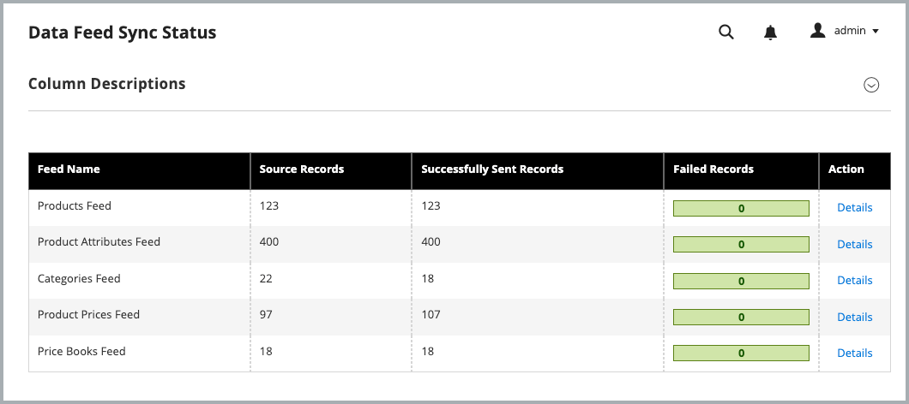
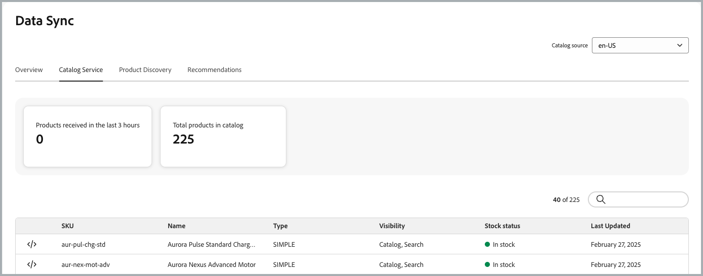

# 快速入门

安装并配置[!DNL Adobe Commerce Optimizer Connector]以将您的[!DNL Adobe Commerce]目录数据与[!DNL Adobe Commerce Optimizer]同步，然后监视数据同步状态以确保您的店面是最新的。

{{aco-integration-environment-alignment}}

## 使用该集成的要求 {#requirements-to-use-the-integration}

* [!DNL Adobe Commerce] 2.4.7+

   * PHP 8.2、8.3或8.4
   * Composer 2.x

* 具有已设置的沙盒实例的[!DNL Adobe Commerce Optimizer]许可证。

* [身份验证密钥](https://experienceleague.adobe.com/zh-hans/docs/commerce-operations/installation-guide/prerequisites/authentication-keys)以使用编辑器下载连接器中继包。

* 管理员访问[[!DNL Adobe Commerce Optimizer] 沙盒实例](../optimizer/get-started.md)。

配置集成的[!DNL Adobe Commerce]用户必须具有：

* Commerce管理员的管理员访问权限。

* [对 [!DNL Adobe Commerce] 应用程序服务器](https://experienceleague.adobe.com/zh-hans/docs/commerce-on-cloud/user-guide/project/user-access)的命令行访问权限。

* 开发人员对配置了[!DNL Adobe Commerce Optimizer]项目的[IMS组织](https://experienceleague.adobe.com/zh-hans/docs/core-services/interface/administration/organizations？)的访问权限。

>[!BEGINSHADEBOX]

## 先决条件

如果安装了以下任何扩展，请在安装[!DNL Adobe Commerce Optimizer Connector]之前卸载它们：

* [!DNL Adobe Commerce Live Search] (`magento/live-search`)
* [!DNL Adobe Commerce Product Recommendations] (`magento/product-recommendations`)
* [!DNL Adobe Commerce Catalog Service] (`magento/catalog-service`, `magento/catalog-service-installer`)
* 数据管理仪表板(`magento-catalog-sync-admin`)

与这些扩展关联的数据仍会在Commerce数据库中可用。 但是，在启用连接器时，不会将其导出到[!DNL Adobe Commerce Optimizer]。 要在启用连接器后实施这些扩展提供的搜索和促销功能，请从[[!DNL Adobe Commerce Optimizer] 管理员UI](https://experienceleague.adobe.com/zh-hans/docs/commerce/optimizer/overview#quick-tour)配置它们。

>[!IMPORTANT]
>
>如果在启用连接器之前未删除这些扩展，则您可能会看到配置屏幕损坏、[!DNL Adobe Commerce Optimizer]中数据重复（因为从连接器和现有扩展中导出相同数据）以及日志中的401或403错误（由于扩展和连接器对连接的服务进行身份验证的方式存在冲突）。

>[!ENDSHADEBOX]

## 配置步骤

按照以下步骤启用[!DNL Commerce Optimizer Connector]并开始将数据从[!DNL Adobe Commerce]同步到[!DNL Commerce Optimizer]实例。

1. **[使用编辑器安装 [!DNL Commerce Optimizer Connector] 包](#install-the-adobe-commerce-optimizer-connector-package)**&#x200B;以将您的[!DNL Adobe Commerce]实例连接到[!DNL Adobe Commerce Optimizer]。

1. 从管理员&#x200B;**[自定义数据导出配置](#customize-the-commerce-scopes-export-configuration)**。

1. **[启用 [!DNL Adobe Commerce Optimizer] 集成](#enable-the-adobe-commerce-optimizer-integration)**。

1. **[验证数据同步是否正常工作](#verify-that-the-data-sync-is-working)**。

## 安装[!DNL Commerce Optimizer Connector]包 {#install-the-adobe-commerce-optimizer-connector-package}

[!DNL Commerce Optimizer Connector]作为编辑器中继资料传递，适用于具有[!DNL Adobe Commerce Optimizer]的有效许可证的所有Commerce商家。

### 安装步骤

1. 使用编辑器添加`adobe-commerce/commerce-data-export-aco-adapter`模块：

   ```shell
   composer require adobe-commerce/commerce-data-export-aco-adapter
   ```

1. 将更改部署到[!DNL Adobe Commerce]暂存环境。

   部署完成后，[!DNL Commerce Optimizer]选项可从Commerce的“管理员”菜单使用。 选择&#x200B;**[!UICONTROL Commerce Optimizer]**&#x200B;以直接从Commerce管理员中打开您的[!DNL Adobe Commerce Optimizer]实例。

>[!NOTE]
>
>有关详细的扩展安装说明，请参阅以下指南：
>
>在云基础架构上的 [!DNL Adobe Commerce] 上[安装扩展](https://experienceleague.adobe.com/zh-hans/docs/commerce-on-cloud/user-guide/configure-store/extensions)
>
>[在 [!DNL Adobe Commerce] 内部部署](https://experienceleague.adobe.com/zh-hans/docs/commerce-operations/installation-guide/tutorials/extensions)上安装扩展

## 自定义Commerce范围导出配置 {#customize-the-commerce-scopes-export-configuration}

默认情况下，所有Commerce作用域（网站、客户组和商店视图）均启用目录数据同步。 您可以自定义导出设置，以便根据业务需求仅同步特定范围的数据。 例如，如果您有多个共享相同语言的存储视图，您可以选择仅导出一个存储视图的数据，并将其用作[!DNL Adobe Commerce Optimizer]中多个目录视图的[目录源](../optimizer/setup/catalog-source.md)。

>[!IMPORTANT]
>
>更改导出设置会触发完全重新建立索引，此过程可能需要大量时间，具体取决于您的目录大小。 Adobe建议先将Commerce范围配置为同步到[!DNL Adobe Commerce Optimizer]，然后再启用集成并启动初始数据同步。

下表描述了在每个作用域级别导出的数据：

| 范围 | 数据已导出 | 注释 |
| ----- | ------------- | ----- |
| 网站和客户组 | 价格和价格手册 | 使用命名约定`<website>::<SHA1 of customer group ID>`将每组价格导出为[价格手册](../optimizer/setup/pricebooks.md)。 包括该网站的所有客户组。 |
| 商店视图 | 产品和产品属性 | 每个存储视图在[!DNL Adobe Commerce Optimizer]中创建单独的[目录源](../optimizer/setup/catalog-source.md)。 |

{width="600" zoomable="yes"}

**要更改网站或商店视图的设置：**

1. 在Commerce管理员中，导航到&#x200B;**[!UICONTROL Stores]** > **[!UICONTROL Settings]** > **[!UICONTROL All Stores]**。

1. 选择要配置的网站或商店视图。

1. 在&#x200B;**[!DNL Adobe Commerce Optimizer]导出程序设置**&#x200B;中，根据需要使用该复选框启用或禁用数据同步。

   {width="500" zoomable="yes"}

1. 保存更改。

### 启用和禁用行为

| 操作 | 结果 |
| -------- | -------- |
| 禁用商店视图 | 目录源仍保留在[!DNL Adobe Commerce Optimizer]中，但已删除所有数据。 |
| 禁用并重新启用商店视图 | 使用完全数据重新同步重新填充同一目录源。 |

## 启用[!DNL Adobe Commerce Optimizer]集成

通过运行`aco:config:init` CLI命令启用集成并启动数据同步。 此命令完成以下步骤：

1. 使用作为命令行参数提供的凭据获取IMS访问令牌。
1. 在`https://ccm.api.commerce.adobe.com/api/v1/tenants/{tenantId}/owner/{orgId}`处调用Commerce Cloud Manager (CCM)服务以验证租户并提取引入URL和[!DNL Adobe Commerce Optimizer] Studio URL。
1. 将所有配置（已加密的客户端密钥）保存到`core_config_data`。
1. 通过使所有[!DNL Commerce Optimizer]馈送索引器失效来计划初始完全同步。

>[!IMPORTANT]
>
>完成配置后，数据同步处理会立即在后台启动。 根据目录的大小，数据同步过程可能需要几分钟到几小时。

### 获取所需的连接详细信息

从[Adobe Developer Console](https://developer.adobe.com/console)，创建一个启用[!DNL Adobe Commerce Optimizer]引入服务的新项目并生成OAuth服务器到服务器凭据。 有关详细说明，请参阅&#x200B;*促销开发人员指南*&#x200B;中的[获取IMS凭据](https://developer.adobe.com/commerce/services/optimizer/data-ingestion/authentication/#obtain-ims-credentials)。

从“身份证明”页中保存以下值：

* **组织ID** (`org_id`)
* **客户端ID** (`client_id`)
* **客户端密钥** (`client_secret`)

{width="500" zoomable="yes"}

### 获取[!DNL Adobe Commerce Optimizer]实例详细信息

从[!DNL Adobe Commerce Optimizer]实例[[!DNL Instance details] 页面](../optimizer/get-started.md#manage-instances)上的&#x200B;_[!DNL Instance Id]_&#x200B;字段或用于访问实例的URL获取_&#x200B;租户ID _。 例如，在`https://experience.adobe.com/#/@<your organization>/in:<tenant ID>/commerce-optimizer-studio/home`中。

1. 从Commerce Admin中，选择&#x200B;**[!UICONTROL Adobe Commerce Optimizer]**&#x200B;以显示包含说明的配置页面。

   ![[!DNL Adobe Commerce Optimizer]配置页面](./assets/aco-connector-admin-installation.png){width="500" zoomable="yes"}

1. 从命令行中，[使用SSH](https://experienceleague.adobe.com/zh-hans/docs/commerce-on-cloud/user-guide/develop/secure-connections)连接到[!DNL Adobe Commerce]暂存环境。

1. 运行以下[!DNL Adobe Commerce] CLI命令配置集成，将占位符值替换为[!DNL Commerce Optimizer]项目的值：

   ```terminal
   bin/magento aco:config:init --org_id=your-org --tenant_id=your-tenant --client_id=your-client-id --client_secret=your-secret
   ```

1. 通过返回Commerce管理员并选择[!UICONTROL Adobe Commerce Optimizer]选项来验证连接。

   选择该选项后，它将在新选项卡中打开[!DNL Adobe Commerce Optimizer] UI。

## 验证数据同步是否正常工作

您可以从管理员中提供的[[!UICONTROL Data Feed Sync Status]](https://experienceleague.adobe.com/zh-hans/docs/commerce-admin/systems/data-transfer/data-sync/data-feed-sync-status)页面监视和验证同步是否正常工作。

1. **在Commerce管理员中检查同步状态：**

   转到&#x200B;**[!UICONTROL System]** > **[!UICONTROL Data Transfer]** > **[!UICONTROL Data Feed Sync Status]**。

   {width="500" zoomable="yes"}

   同步运行时，馈送数据显示已成功发送的记录。 选择信息源以查看详细信息或解决同步问题。

1. **确认数据已送达[!DNL Commerce Optimizer]：**

   从[!DNL Adobe Commerce Optimizer]菜单中选择&#x200B;**[!UICONTROL Data Sync]**。

   Adobe Commerce Optimizer中的{width="500" zoomable="yes"}

   验证是否显示预期的产品、价格和属性。

>[!TIP]
>
>如果数据同步有任何问题，请参阅[疑难解答](troubleshooting.md)指南。

## 后续步骤

1. **配置[!DNL Adobe Commerce Optimizer]目录视图和策略**

   在[!DNL Adobe Commerce Optimizer]用户界面中创建目录视图和策略。 请注意，价格手册是从[!DNL Adobe Commerce]客户组自动创建的。 有关说明，请参阅&#x200B;*[!DNL Adobe Commerce Optimizer]用户指南*&#x200B;中的[目录视图](../optimizer/setup/catalog-view.md)和[策略](../optimizer/setup/policies.md)文档。

1. **在[!DNL Edge Delivery Services]**&#x200B;上设置Commerce店面

   按照[Storefront设置文档](https://experienceleague.adobe.com/developer/commerce/storefront/setup/?lang=zh-Hans){target="_blank"}将您的店面连接到[!DNL Adobe Commerce Optimizer]实例，并开始提供个性化的商务体验。

