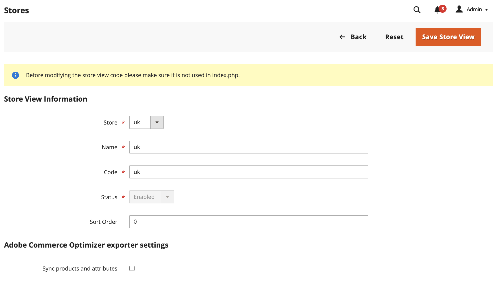

# 快速入门

安装并配置[!DNL Adobe Commerce Optimizer Connector]以将您的[!DNL Adobe Commerce]目录数据与[!DNL Adobe Commerce Optimizer]同步，然后监视数据同步状态以确保您的店面是最新的。

{{aco-integration-environment-alignment}}

>[!NOTE]
>
>本主题涵盖[!DNL Adobe Commerce Optimizer Connector]。 如果您使用[!DNL Adobe Commerce] B2B共享目录，请按照[开始使用 [!DNL Adobe Commerce Optimizer Connector for B2B]](get-started-b2b-shared-catalogs.md)说明。 B2B连接器扩展了基本目录数据同步，以支持自定义共享目录的同步。

## 使用该集成的要求 {#requirements-to-use-the-integration}

* [Adobe Commerce](https://business.adobe.com/products/magento/magento-commerce.html) 2.4.7+。 有关详细要求，请参阅[系统要求](https://experienceleague.adobe.com/en/docs/commerce-operations/installation-guide/system-requirements)。

* 具有已设置的沙盒实例的[!DNL Commerce Optimizer]许可证。

* [身份验证密钥](https://experienceleague.adobe.com/en/docs/commerce-operations/installation-guide/prerequisites/authentication-keys)以使用编辑器下载连接器中继包。

* 管理员访问[[!DNL Commerce Optimizer] 沙盒实例](../optimizer/get-started.md)。

配置集成的[!DNL Adobe Commerce]用户必须具有：

* Commerce管理员的管理员访问权限。

* [对 [!DNL Adobe Commerce] 应用程序服务器](https://experienceleague.adobe.com/en/docs/commerce-on-cloud/user-guide/project/user-access)的命令行访问权限。

* 开发人员对配置了[!DNL Commerce Optimizer]项目的[IMS组织](https://experienceleague.adobe.com/en/docs/core-services/interface/administration/organizations？)的访问权限。

>[!BEGINSHADEBOX]

## 删除冲突的扩展

{{$include /help/_includes/aco-connector/remove-conflicting-extensions.md}}

>[!ENDSHADEBOX]

## 配置步骤 {#configuration-steps}

要启用[!DNL Adobe Commerce Optimizer Connector]并开始将数据从[!DNL Adobe Commerce]同步到[!DNL Commerce Optimizer]实例，请执行以下步骤。

1. **[使用编辑器安装 [!DNL Adobe Commerce Optimizer Connector] 包](#install-the-adobe-commerce-optimizer-connector-package)**&#x200B;以将您的[!DNL Adobe Commerce]实例连接到[!DNL Commerce Optimizer]。

1. 从管理员&#x200B;**[自定义Commerce范围导出配置](#customize-the-commerce-scopes-export-configuration)**。

1. **[启用 [!DNL Commerce Optimizer] 集成](#enable-the-adobe-commerce-optimizer-integration)**。

1. **[验证数据同步是否正常工作](#verify-that-the-data-sync-is-working)**。

## 安装[!DNL Adobe Commerce Optimizer Connector]包 {#install-the-adobe-commerce-optimizer-connector-package}

[!DNL Adobe Commerce Optimizer Connector]作为编辑器中继资料传递，适用于具有[!DNL Commerce Optimizer]的有效许可证的所有Commerce商家。

### 安装步骤

1. 使用编辑器添加`adobe-commerce/commerce-data-export-aco-adapter`模块：

   ```shell
   composer require adobe-commerce/commerce-data-export-aco-adapter
   ```

1. 将更改部署到[!DNL Adobe Commerce]暂存环境。

   部署完成后，[!DNL Commerce Optimizer]选项可从Commerce的“管理员”菜单使用。 选择&#x200B;**[!UICONTROL Commerce Optimizer]**&#x200B;以直接从Commerce管理员中打开您的[!DNL Commerce Optimizer]实例。

{{install-extension-links}}

## 自定义Commerce范围导出配置 {#customize-the-commerce-scopes-export-configuration}

默认情况下，所有Commerce作用域（网站、客户组和商店视图）均启用目录数据同步。 您可以自定义导出设置，以便根据业务需求仅同步特定范围的数据。 例如，如果多个存储视图共享相同的语言，则可以导出一个存储视图的数据，并将其用作[!DNL Commerce Optimizer]中多个目录视图的[目录源](../optimizer/setup/catalog-sources.md)。

>[!IMPORTANT]
>
>更改导出设置会触发完全重新建立索引，此过程可能需要大量时间，具体取决于您的目录大小。 Adobe建议先将Commerce范围配置为同步到[!DNL Commerce Optimizer]，然后再启用集成并启动初始数据同步。

下表描述了在每个作用域级别导出的数据：

| 范围 | 数据已导出 | 注释 |
| ----- | ------------- | ----- |
| 网站和客户组 | 价格和价格手册 | 使用命名约定`&lt;website&gt;::&lt;SHA1 of customer group ID&gt;`将每组价格导出为[价格手册](../optimizer/setup/pricebooks.md)。 包括该网站的所有客户组。 |
| 商店视图 | 产品和产品属性 | 每个存储视图在[!DNL Commerce Optimizer]中创建单独的[目录源](../optimizer/setup/catalog-sources.md)。 |

{width="600" zoomable="yes"}

### 要更改作用域导出设置

1. 在Commerce管理员中，转到&#x200B;**[!UICONTROL Stores]** > **[!UICONTROL Settings]** > **[!UICONTROL All Stores]**。

1. 选择要配置的网站或商店视图。

1. 在&#x200B;**[!DNL Commerce Optimizer]导出程序设置**&#x200B;中，根据需要使用该复选框启用或禁用数据同步。

   {width="500" zoomable="yes"}

1. 保存更改。

### 启用和禁用行为

| 操作 | 结果 |
| -------- | -------- |
| 禁用商店视图 | **禁用同步将从店面中删除目录数据。** 目录源仍保留在[!DNL Commerce Optimizer]中，但在下次cron运行时所有同步的数据都将被删除。 |
| 禁用并重新启用商店视图 | 使用完全数据重新同步重新填充同一目录源。 |

## 启用[!DNL Commerce Optimizer]集成 {#enable-the-adobe-commerce-optimizer-integration}

通过运行`aco:config:init` CLI命令启用集成并启动数据同步。 此命令完成以下步骤：

1. 使用作为命令行参数提供的凭据获取IMS访问令牌。
1. 在`https://ccm.api.commerce.adobe.com/api/v1/tenants/{tenantId}/owner/{orgId}`处调用Commerce Cloud Manager (CCM)服务以验证租户并提取引入URL和[!DNL Commerce Optimizer] Studio URL。
1. 将所有配置（已加密的客户端密钥）保存到`core_config_data`。
1. 通过使所有[!DNL Commerce Optimizer]馈送索引器失效来计划初始完全同步。


{{aco-data-sync-processing-note}}

## 获取所需的连接详细信息

{{$include /help/_includes/aco-connector/connection-details.md}}

### 获取[!DNL Commerce Optimizer]实例详细信息

{{$include /help/_includes/aco-connector/configure-connection.md}}

## 验证数据同步是否正常工作 {#verify-that-the-data-sync-is-working}

{{$include /help/_includes/aco-connector/verify-optimizer-data-sync.md}}

## 后续步骤

1. **配置[!DNL Commerce Optimizer]目录视图和策略**

   在[!DNL Commerce Optimizer]用户界面中创建目录视图和策略。 请注意，价格手册是从[!DNL Adobe Commerce]客户组自动创建的。 有关说明，请参阅&#x200B;*[!DNL Commerce Optimizer]用户指南*&#x200B;中的[目录视图](../optimizer/setup/catalog-view.md)和[策略](../optimizer/setup/policies.md)文档。 要限制对目录视图的访问，请参阅[私有目录视图](../optimizer/setup/private-catalog-view.md)。

1. **在[!DNL Edge Delivery Services]**&#x200B;上设置Commerce店面

   要将店面连接到[!DNL Commerce Optimizer]实例并开始提供个性化的商务体验，请按照[店面设置文档](https://experienceleague.adobe.com/en/tools/commerce-storefront/setup/){target="_blank"}操作。
