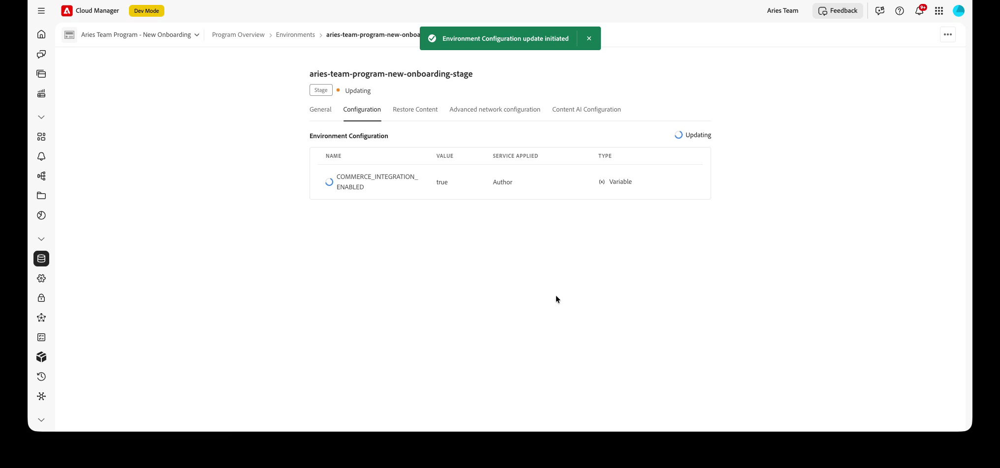
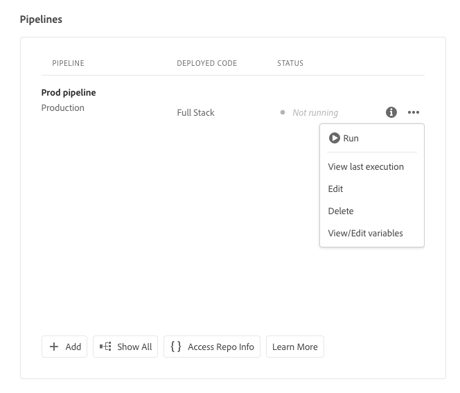

# 配置AEM Assets项目

本主题介绍如何配置AEM Assets项目，以便在AEM创作环境中使用Commerce命名空间、元数据架构和[!UICONTROL Commerce]选项卡。 有关这些资源的背景信息，请参阅AEM Assets中的[Commerce元数据](../metadata.md)。

您可以通过两个选项来配置AEM Assets项目：

* [!BADGE 推荐]{type=Positive} **自助登录** — 在AEM版本`2026.5.26309`及更高版本上，通过设置环境变量并激活具有OpenAPI功能的Dynamic Media来启用Cloud Manager中的集成。 无需自定义代码部署。 请参阅[启用Commerce集成（自助服务）](#enable-aem-commerce-self-service)。

* **手动配置** — 通过Cloud Manager管道部署`assets-commerce`包。 如果您必须部署自定义包代码，或者您使用的是`2026.5.26309`之前的AEM版本，请按照这些手动步骤操作。 请参阅[手动安装assets-commerce包](#install-the-assets-commerce-package-manually)。

>[!TIP]
>
>您可以从右上角菜单查看当前AEM版本： **[!UICONTROL Help]** > **[!UICONTROL About AEM]**。

## 启用Commerce集成（自助服务） {#enable-aem-commerce-self-service}

[!BADGE 支持]{type=Informative tooltip="支持"} AEM版本`2026.5.26309`及更高版本。

在受支持的AEM版本上，您可以从Cloud Manager启用Commerce集成，而无需部署任何自定义代码。 在Author服务上启用集成时，会自动配置Commerce命名空间、元数据架构和&#x200B;**[!UICONTROL Commerce]**&#x200B;选项卡。

### 自助服务先决条件

* [使用计划和部署管理员角色访问AEM Cloud Manager计划和环境](https://experienceleague.adobe.com/zh-hans/docs/experience-manager-cloud-service/content/onboarding/journey/cloud-manager#access-sysadmin-bo)。

* 版本`2026.5.26309`或更高版本上的AEM程序。

* Commerce实例的&#x200B;**IMS组织ID**。

  您的Commerce实例和AEM Assets创作环境必须位于同一个IMS组织中。

### 步骤1：创建项目和环境

在Cloud Manager中创建项目是一个向导过程 — 项目及其环境通过多个步骤进行配置，并在最后保存在一起。

1. 在Cloud Manager中选择&#x200B;**[!UICONTROL Add Program]**。

1. 选择&#x200B;**[!UICONTROL Set up for production]**，输入项目名称，然后选择&#x200B;**[!UICONTROL Continue]**。

1. 在&#x200B;**[!UICONTROL Solutions & Add-ons]**&#x200B;步骤中，选择项目所需的解决方案和加载项，包括&#x200B;**[!UICONTROL Dynamic Media]**，然后选择&#x200B;**[!UICONTROL Continue]**。

   {width="600" zoomable="yes"}

1. 在&#x200B;**[!UICONTROL Add Environment]**&#x200B;步骤中，输入&#x200B;**生产**&#x200B;和&#x200B;**暂存**&#x200B;环境的名称，然后选择区域。

   {width="600" zoomable="yes"}

1. 选择&#x200B;**[!UICONTROL Save]**&#x200B;以创建项目及其环境。

### 步骤2：启用Commerce集成变量

在Cloud Manager中，打开您在步骤1中创建的环境，然后：

1. 选择&#x200B;**[!UICONTROL Configuration]**&#x200B;选项卡。

1. 添加具有以下值的环境变量，然后选择&#x200B;**[!UICONTROL Add]**&#x200B;和&#x200B;**[!UICONTROL Save]**：

   | 字段 | 值 |
   |---|---|
   | 名称 | `COMMERCE_INTEGRATION_ENABLED` |
   | 值 | `true` |
   | 已应用服务 | 作者 |
   | 类型 | 变量 |

   {width="600" zoomable="yes"}

   环境将更新以应用配置。 等待环境状态返回到&#x200B;**[!UICONTROL Running]**。

### 步骤3：使用OpenAPI功能激活Dynamic Media

1. 在环境&#x200B;**[!UICONTROL General]**&#x200B;选项卡上，找到&#x200B;**[!UICONTROL Dynamic Media]**。

1. 在&#x200B;*旁边有*&#x200B;可用的OpenAPI功能，请选择&#x200B;**[!UICONTROL Click to activate]**。

   {width="600" zoomable="yes"}

   激活在后台运行。 完成后，环境即为Commerce集成做好准备。

   >[!NOTE]
   >
   > 如果&#x200B;**[!UICONTROL Click to activate]**&#x200B;不可用，请打开支持票证以启用具有OpenAPI功能的Dynamic Media。

### 步骤4：验证配置

切换到&#x200B;**AEM Assets创作环境**&#x200B;并打开任何资源。 编辑其属性，并确认默认元数据架构包含&#x200B;**[!UICONTROL Commerce]**&#x200B;选项卡，且&#x200B;**[!UICONTROL Product Data]**&#x200B;和&#x200B;**[!UICONTROL Eligible for Commerce]**&#x200B;字段可见。

## 手动安装assets-commerce包

>[!NOTE]
>
> 使用此手动方法部署自定义包代码，或者如果您使用的是`2026.5.26309`之前的AEM版本。 在支持的版本上，请改用[启用Commerce集成（自助服务）](#enable-aem-commerce-self-service)。

### 先决条件

要将`assets-commerce`包代码部署到AEM Assets as a Cloud Service AEM环境，您需要以下资源和权限：

* [使用计划和部署管理员角色访问AEM Assets Cloud Manager计划和环境](https://experienceleague.adobe.com/zh-hans/docs/experience-manager-cloud-service/content/onboarding/journey/cloud-manager#access-sysadmin-bo)。

* [本地AEM开发环境](https://experienceleague.adobe.com/zh-hans/docs/experience-manager-learn/cloud-service/local-development-environment-set-up/overview)，熟悉AEM本地开发过程。

* 了解[AEM项目结构](https://experienceleague.adobe.com/zh-hans/docs/experience-manager-cloud-service/content/implementing/developing/aem-project-content-package-structure)以及如何使用Cloud Manager部署自定义内容包。

* Commerce实例的&#x200B;**IMS组织ID**。 您的Commerce实例和AEM Assets创作环境必须位于同一个IMS组织中。

* 要启用具有OpenAPI功能的[Dynamic Media](https://experienceleague.adobe.com/zh-hans/docs/experience-manager-cloud-service/content/assets/dynamicmedia/dynamic-media-open-apis/dynamic-media-open-apis-overview#enable-dynamic-media-open-apis)：

>[!BEGINTABS]

>[!TAB 产品视觉效果]

[!BADGE 仅限SaaS]{type=Positive url="https://experienceleague.adobe.com/zh-hans/docs/commerce/user-guides/product-solutions" tooltip="仅适用于Adobe Commerce as a Cloud Service和Adobe Commerce Optimizer项目（Adobe管理的SaaS基础架构）。"}具有OpenAPI功能的Dynamic Media是AEM Assets支持的产品可视化自助服务。

1. 导航到您的Cloud Manager。

1. 选择所需的环境。

1. 启用具有OpenAPI功能的&#x200B;**Dynamic Media**。

   如果&#x200B;**具有OpenAPI功能的Dynamic Media**&#x200B;按钮未处于活动状态，请打开支持票证。

>[!TAB AEM Assets]

[!BADGE 仅限PaaS]{type=Informative tooltip="仅适用于云项目上的Adobe Commerce（Adobe管理的PaaS基础架构）。"}在AEM as a Cloud Service上，提交包含此信息的Adobe支持票证：

* Title：启用Dynamic Media OpenAPI以将Adobe Commerce与AEM Assets完全集成

  * 支持票证的内容：

    * **[!UICONTROL AEM Program ID]**
    * **[!UICONTROL Adobe Commerce URL]**
    * **[!UICONTROL AEM Environment ID]**
    * **[!UICONTROL IMS Org ID]**

提交支持工单后，Adobe将在您的Cloud Services环境中启用具有OpenAPI功能的Dynamic Media，并共享详细信息（如IMS客户端ID），以便您继续集成。

>[!ENDTABS]

### 安装步骤

1. 导航到AEM Cloud Manager，选择一个项目，然后[创建要与Adobe Commerce集成的生产和暂存环境](https://experienceleague.adobe.com/zh-hans/docs/experience-manager-cloud-service/content/onboarding/journey/create-environments#creating-environments)。

1. [克隆所选程序的Adobe托管的Git存储库](https://experienceleague.adobe.com/zh-hans/docs/experience-manager-cloud-service/content/sites/administering/site-creation/quick-site/retrieve-access#repo-access)。

   {width="600" zoomable="yes"}

   在Cloud Manager **管道**&#x200B;中，选择&#x200B;**[!UICONTROL Access Repo Info]**&#x200B;以打开&#x200B;**[!UICONTROL Repository Info]**。 复制&#x200B;**[!UICONTROL URL]**&#x200B;或&#x200B;**[!UICONTROL Git command line]**&#x200B;值，根据需要生成访问密码，然后使用Git客户端本地克隆。

1. 从GitHub中，从[AEM Assets Commerce存储库](https://github.com/ankumalh/assets-commerce)下载包代码。

1. 从您的[本地AEM开发环境](https://experienceleague.adobe.com/zh-hans/docs/experience-manager-learn/cloud-service/local-development-environment-set-up/overview)中，手动将下载的代码复制到现有的Adobe托管存储库中。

1. 在您的项目的所有`filter.xml`和`pom.xml`文件中，将所有出现的&lt;my-app>替换为应用程序名称。

   >[!NOTE]
   >
   > 或者，您也可以将自定义代码作为&#x200B;**Maven**&#x200B;包安装到AEM Assets项目配置中。

1. 提交更改并将本地开发分支推送到Cloud Manager Git存储库。

1. 配置[部署管道](https://experienceleague.adobe.com/zh-hans/docs/experience-manager-cloud-service/content/sites/administering/site-creation/quick-site/pipeline-setup#create-front-end-pipeline)，或验证您的管道是否可以将更改部署到所选环境。

   {width="600" zoomable="yes"}

   当管道存在时，打开操作菜单(**...**) 到&#x200B;**[!UICONTROL Run]**、**[!UICONTROL Edit]**、**[!UICONTROL View/Edit variables]**&#x200B;或其他操作 — 请参阅上面链接的Cloud Manager管道文档。

1. 在AEM Cloud Manager中，[使用管道更新AEM环境以部署您的代码](https://experienceleague.adobe.com/zh-hans/docs/experience-manager-cloud-service/content/implementing/using-cloud-manager/deploy-code#deploying-code-with-cloud-manager)。

1. 转到任何资源并编辑其属性以验证更改：

   * 默认元数据架构包括&#x200B;**Commerce**&#x200B;选项卡。

   * 产品SKU和`Eligible for Commerce`字段可见。

### Commerce选项卡在资产中不可见

如果&#x200B;**Commerce**&#x200B;选项卡未显示在属性中，则必须在元数据架构编辑器中手动完成以下步骤：

1. 导航到元数据架构编辑器。

1. 选择&#x200B;**编辑**&#x200B;以修改默认的元数据架构表单。

1. 创建&#x200B;**Commerce**&#x200B;选项卡，然后选择它。

1. 将&#x200B;**Product**&#x200B;组件拖放到&#x200B;**Commerce**&#x200B;选项卡中，并将其映射到属性`commerce:skus`。

1. 选中&#x200B;**显示角色**&#x200B;和&#x200B;**显示顺序**&#x200B;的复选框。

1. 将&#x200B;**checkbox**&#x200B;组件拖放到&#x200B;**Commerce**&#x200B;选项卡中，并将其映射到属性`commerce:isCommerce`。 将&#x200B;**是**&#x200B;和&#x200B;**否**&#x200B;定义为选项。

如果您遇到任何其他问题，请创建[支持票证](https://experienceleague.adobe.com/zh-hans/docs/support-resources/adobe-support-tools-guide/adobe-commerce-support/adobe-commerce-help-center-user-guide#support-case)或联系您的AEM Assets集成销售代表寻求帮助。

## 配置元数据配置文件（可选）

在AEM Assets创作环境中，通过创建元数据配置文件来设置Commerce资源元数据的默认值。 要自动使用这些默认值，请将新配置文件应用到AEM Asset文件夹。 此配置通过减少手动步骤来简化资产处理。

配置元数据配置文件时，您只需配置以下组件：

* 添加Commerce选项卡。 此选项卡启用由模板添加的Commerce特定配置设置。

* 将`Eligible for Commerce`字段添加到Commerce选项卡。

产品数据UI组件会根据模板自动添加。

### 定义元数据配置文件

1. 登录到Adobe Experience Manager创作环境。

1. 在Adobe Experience Manager工作区中，单击Adobe Experience Manager图标以转到为AEM Assets创作内容管理工作区。

   {width="600" zoomable="yes"}

1. 通过选择锤子图标打开管理员工具。

   {width="600" zoomable="yes"}

1. 通过单击&#x200B;**[!UICONTROL Metadata Profiles]**&#x200B;打开配置文件配置页面。

1. **[!UICONTROL Create]** Commerce集成的元数据配置文件。

   {width="600" zoomable="yes"}

1. 为Commerce元数据添加选项卡。

   1. 单击左侧的&#x200B;**[!UICONTROL Settings]**。

   1. 在选项卡部分中单击&#x200B;**[!UICONTROL +]**，然后指定&#x200B;**[!UICONTROL Tab Name]**、`Commerce`。

1. 将`Eligible for Commerce`字段添加到表单。

   {width="600" zoomable="yes"}

   * 单击&#x200B;**[!UICONTROL Build form]**。

   * 将`Single Line text`字段拖到表单中。

   * 通过单击&#x200B;**[!UICONTROL Field Label]**&#x200B;为标签添加`Eligible for Commerce`文本。

   * 在“设置”选项卡上，将标签文本添加到&#x200B;**字段标签**。

   * 将占位符文本设置为`yes`。

   * 在&#x200B;**[!UICONTROL Map to Property]**&#x200B;字段中，复制并粘贴以下值

     ```terminal
     ./jcr:content/metadata/commerce:isCommerce
     ```

1. 可选。 要在将已批准的Commerce资源上传到AEM Assets环境时自动对其进行同步，请将`Basic`选项卡上&#x200B;_[!UICONTROL Review Status]_&#x200B;字段的默认值设置为`approved`。

1. 保存更新。

### 将元数据配置文件应用到Commerce资源源文件夹

1. 从&#x200B;**[!UICONTROL Metadata Profiles]**&#x200B;页面中，选择Commerce集成配置文件。

1. 从操作菜单中选择&#x200B;**[!UICONTROL Apply Metadata Profiles to Folders]**。

1. 选择包含Commerce资源的文件夹。

   创建不存在的Commerce文件夹。

1. 选择&#x200B;**[!UICONTROL Apply]**。

## 后续步骤

* 仅[!BADGE PaaS]{type=Informative tooltip="仅适用于云项目上的Adobe Commerce（Adobe管理的PaaS基础架构）。"} [安装Adobe Commerce包](configure-commerce.md)。

* [!BADGE 仅限SaaS]{type=Positive url="https://experienceleague.adobe.com/zh-hans/docs/commerce/user-guides/product-solutions" tooltip="仅适用于Adobe Commerce as a Cloud Service和Adobe Commerce Optimizer项目（Adobe管理的SaaS基础架构）。"} [从管理员配置集成](setup-synchronization.md)。
