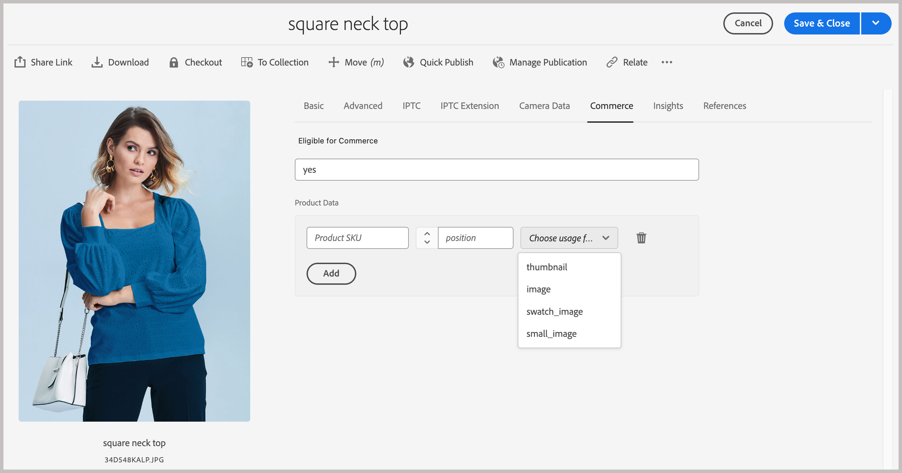
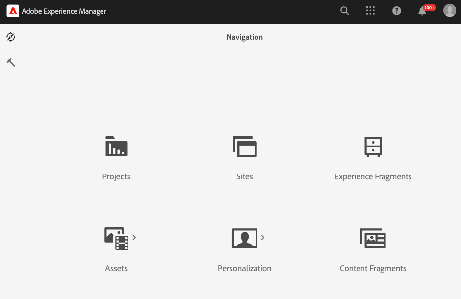
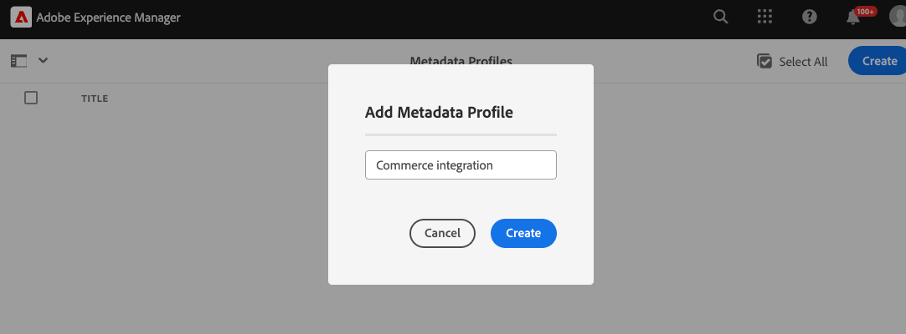

# 配置AEM Assets项目以支持Commerce元数据

当您使用AEM Assets as a Digital Asset Management System (DAM) for Commerce时，安装`assets-commerce`包允许您从AEM创作环境管理Commerce产品的图像和视频。

完成以下步骤，使用所需的包代码和元数据配置AEM Assets项目，以便从AEM创作环境管理Commerce资源：

1. [了解`assets-commerce`包内容](#aem-commerce-assets-commerce-package-contents)

1. [完成安装步骤以配置AEM Assets项目以支持Commerce元数据](#step-1-install-the-assets-commerce-package)

## AEM Commerce assets-commerce包内容

Adobe提供了AEM Commerce包代码`assets-commerce`，用于将Commerce命名空间和元数据架构资源添加到Experience Manager Assets as a Cloud Service环境配置。

此包代码可将以下资源添加到AEM Assets创作环境：

* [自定义命名空间](https://github.com/ankumalh/assets-commerce/blob/main/ui.config/jcr_root/apps/commerce/config/org.apache.sling.jcr.repoinit.RepositoryInitializer~commerce-namespaces.cfg.json)，`Commerce`用于标识与Commerce相关的属性。

   * 带有标签`Eligible for Commerce`的自定义元数据类型`commerce:isCommerce`用于标记与Adobe Commerce项目关联的Commerce资源。

   * 用于添加&#x200B;**[!UICONTROL Product Data]**&#x200B;属性的自定义元数据类型`commerce:skus`和相应的UI组件。 产品数据包含用于将Commerce资源与产品SKU关联的元数据属性。

     {width="600" zoomable="yes"}

   * 自定义元数据类型`commerce:roles`和`commerce:positions`属性，用于显示如何在Commerce中显示该资源。

   * 替换文本多字段(_[!UICONTROL Alt texts]_)元数据，以便编辑人员可以输入由Commerce商店视图代码键入的替换文本。 这不会更改在目录中为产品图像分配或设定范围的方式。 查看AEM Assets元数据中的[替换文本](#localized-alt-text-in-aem-assets-metadata)。

* 具有Commerce选项卡的元数据架构表单，包括用于标记Commerce资源的`Eligible for Commerce`和`Product Data`字段。 该表单还提供了在AEM Assets UI中显示或隐藏`roles`和`position`字段的选项。

  AEM Assets元数据架构表单的{width="600" zoomable="yes"}

* [示例已标记并批准Commerce资源](https://github.com/ankumalh/assets-commerce/blob/main/ui.content/src/main/content/jcr_root/content/dam/wknd/en/activities/hiking/equipment_6.jpg/.content.xml) `equipment_6.jpg`以支持初始资源同步。 只有已获批准的Commerce资源才能从AEM Assets同步到Adobe Commerce。

>[!NOTE]
>
> 有关&#x200B;**AEM Commerce包代码**&#x200B;的更多信息，请参阅[自述文件](https://github.com/ankumalh/assets-commerce)页。

## AEM Assets元数据中的替换文本

编辑符合条件的图像时，_[!UICONTROL Alt texts]_多字段在AEM Assets资源元数据编辑器的&#x200B;**[!UICONTROL Commerce]**选项卡上可用。

>[!IMPORTANT]
>
> 每次存储查看行为仅适用于替换文本。 AEM Assets集成不会同步每个Adobe Commerce商店视图中的其他产品图像。 AEM中的产品图像将继续同步到Commerce中，其库分配行为与此版本之前相同。

多字段在每个Commerce商店视图中包含一行。 每一行有两个输入：

* **[!UICONTROL Store View Code]** — 存储视图标识符（例如`default`或`en_US`）。

* **[!UICONTROL Alt Text]** — 该商店视图的替换文本，限制为255个字符。

选择&#x200B;**[!UICONTROL Add]**&#x200B;为其他存储视图添加更多行。 要删除某行，请选择该行上的&#x200B;**[!UICONTROL Delete]**&#x200B;图标以将其删除。

{width="600" zoomable="yes"}

保存时，如果任何行具有空的&#x200B;_[!UICONTROL Store View Code]_或如果两行使用相同的存储视图代码（不区分大小写），则客户端验证会阻止提交。

替代文本条目作为两个索引对齐的`String[]`属性保留在JCR资产元数据中：

* `commerce:altTextStoreViews`：存储每行的视图代码。
* `commerce:altTextValues`：在与`commerce:altTextStoreViews`中的每个条目相同的索引处匹配替换文本。

当这些资源同步到Adobe Commerce时，每个商店视图替换文本将写入产品媒体集，以获得匹配的商店视图代码。 底层图像映射保持不变。

## 先决条件

您需要以下资源和权限才能将`assets-commerce`包代码部署到AEM Assets as a Cloud Service AEM环境：

* [使用计划和部署管理员角色访问AEM Assets Cloud Manager计划和环境](https://experienceleague.adobe.com/en/docs/experience-manager-cloud-service/content/onboarding/journey/cloud-manager#access-sysadmin-bo)。

* [本地AEM开发环境](https://experienceleague.adobe.com/en/docs/experience-manager-learn/cloud-service/local-development-environment-set-up/overview)，熟悉AEM本地开发过程。

* 了解[AEM项目结构](https://experienceleague.adobe.com/zh-hans/docs/experience-manager-cloud-service/content/implementing/developing/aem-project-content-package-structure)以及如何使用Cloud Manager部署自定义内容包。

* Commerce实例的&#x200B;**IMS组织ID**。 您的Commerce实例和AEM Assets创作环境必须位于同一个IMS组织中。

* 要启用具有OpenAPI功能的[Dynamic Media](https://experienceleague.adobe.com/en/docs/experience-manager-cloud-service/content/assets/dynamicmedia/dynamic-media-open-apis/dynamic-media-open-apis-overview#enable-dynamic-media-open-apis)：

>[!BEGINTABS]

>[!TAB 产品视觉效果]

[!BADGE 仅限SaaS]{type=Positive url="https://experienceleague.adobe.com/en/docs/commerce/user-guides/product-solutions" tooltip="仅适用于Adobe Commerce as a Cloud Service和Adobe Commerce Optimizer项目（Adobe管理的SaaS基础架构）。"}具有OpenAPI功能的Dynamic Media是AEM Assets支持的产品可视化自助服务。

1. 导航到您的Cloud Manager。

1. 选择所需的环境。

1. 启用具有OpenAPI功能的&#x200B;**Dynamic Media**。

   如果&#x200B;**具有OpenAPI功能的Dynamic Media**&#x200B;按钮未处于活动状态，请打开支持票证。

>[!TAB AEM Assets]

[!BADGE 仅限PaaS]{type=Informative tooltip="仅适用于云项目上的Adobe Commerce（Adobe管理的PaaS基础架构）。"}在AEM as a Cloud Service上，提交包含以下信息的Adobe支持票证：

* Title：启用Dynamic Media OpenAPI以将Adobe Commerce与AEM Assets完全集成

   * 支持票证的内容：

      * **[!UICONTROL AEM Program ID]**
      * **[!UICONTROL Adobe Commerce URL]**
      * **[!UICONTROL AEM Environment ID]**
      * **[!UICONTROL IMS Org ID]**

在提交支持票证后，Adobe会在您的云服务环境中启用具有OpenAPI功能的Dynamic Media，并共享详细信息（如IMS客户端ID），以便您继续集成。

>[!ENDTABS]

## 步骤1：安装assets-commerce包

1. 导航到AEM Cloud Manager，选择一个项目，然后[创建要与Adobe Commerce集成的生产和暂存环境](https://experienceleague.adobe.com/en/docs/experience-manager-cloud-service/content/onboarding/journey/create-environments#creating-environments)。

1. 配置[部署管道](https://experienceleague.adobe.com/en/docs/experience-manager-cloud-service/content/sites/administering/site-creation/quick-site/pipeline-setup#create-front-end-pipeline)，或验证您的管道是否可以将更改部署到所选环境。

1. [克隆所选程序的Adobe托管的Git存储库](https://experienceleague.adobe.com/en/docs/experience-manager-cloud-service/content/sites/administering/site-creation/quick-site/retrieve-access#repo-access)。

1. 从GitHub中，从[AEM Assets Commerce存储库](https://github.com/ankumalh/assets-commerce)下载包代码。

1. 从您的[本地AEM开发环境](https://experienceleague.adobe.com/en/docs/experience-manager-learn/cloud-service/local-development-environment-set-up/overview)中，手动将下载的代码复制到现有的Adobe托管存储库中。

1. 在您的项目的`filter.xml`和`pom.xml files`中，将所有出现的`<my-app>`替换为您的应用程序名称。

>[!NOTE]
>
> 或者，您也可以将自定义代码作为&#x200B;**Maven**&#x200B;包安装到AEM Assets项目配置中。

1. 提交更改并将本地开发分支推送到Cloud Manager Git存储库。

1. 在AEM Cloud Manager中，[使用管道更新AEM环境以部署您的代码](https://experienceleague.dobe.com/en/docs/experience-manager-cloud-service/content/implementing/using-cloud-manager/deploy-code#deploying-code-with-cloud-manager)。

1. 转到任何资源并编辑其属性以验证更改：

   * 默认元数据架构包括&#x200B;**Commerce**&#x200B;选项卡。

   * 产品SKU和`Eligible for Commerce`字段可见。

### Commerce选项卡在资产中不可见

如果&#x200B;**Commerce**&#x200B;选项卡未显示在属性中，则必须在元数据架构编辑器中手动创建一个选项卡。

1. 导航到元数据架构编辑器。

1. 单击&#x200B;**编辑**&#x200B;修改默认的元数据架构表单。

1. 创建&#x200B;**Commerce**&#x200B;选项卡，然后选择它。

1. 将&#x200B;**Product**&#x200B;组件拖放到&#x200B;**Commerce**&#x200B;选项卡中，并将其映射到属性`commerce:skus`。

1. 选中&#x200B;**显示角色**&#x200B;和&#x200B;**显示顺序**&#x200B;的复选框。

1. 将&#x200B;**checkbox**&#x200B;组件拖放到&#x200B;**Commerce**&#x200B;选项卡中，并将其映射到属性`commerce:isCommerce`。 将&#x200B;**是**&#x200B;和&#x200B;**否**&#x200B;定义为选项。

如果您遇到任何其他问题，请创建[支持票证](https://experienceleague.adobe.com/docs/commerce-knowledge-base/kb/help-center-guide/magento-help-center-user-guide.html#submit-ticket)或联系您的AEM Assets集成销售代表寻求帮助。

## 步骤2：可选。 配置元数据配置文件

在AEM Assets创作环境中，通过创建元数据配置文件来设置Commerce资源元数据的默认值。 然后，将新配置文件应用到AEM Asset文件夹以自动使用这些默认值。 此配置通过减少手动步骤来简化资产处理。

配置元数据配置文件时，您只需配置以下组件：

* 添加Commerce选项卡。 此选项卡启用由模板添加的Commerce特定配置设置。

* 将`Eligible for Commerce`字段添加到Commerce选项卡。

产品数据UI组件会根据模板自动添加。

### 定义元数据配置文件

1. 登录到Adobe Experience Manager创作环境。

1. 在Adobe Experience Manager工作区中，单击Adobe Experience Manager图标以转到为AEM Assets创作内容管理工作区。

   {width="600" zoomable="yes"}

1. 通过选择锤子图标打开管理员工具。

   {width="600" zoomable="yes"}

1. 通过单击&#x200B;**[!UICONTROL Metadata Profiles]**&#x200B;打开配置文件配置页面。

1. **[!UICONTROL Create]** Commerce集成的元数据配置文件。

   {width="600" zoomable="yes"}

1. 为Commerce元数据添加选项卡。

   1. 单击左侧的&#x200B;**[!UICONTROL Settings]**。

   1. 在选项卡部分中单击&#x200B;**[!UICONTROL +]**，然后指定&#x200B;**[!UICONTROL Tab Name]**、`Commerce`。

1. 将`Eligible for Commerce`字段添加到表单。

   {width="600" zoomable="yes"}

   * 单击&#x200B;**[!UICONTROL Build form]**。

   * 将`Single Line text`字段拖到表单中。

   * 通过单击&#x200B;**[!UICONTROL Field Label]**&#x200B;为标签添加`Eligible for Commerce`文本。

   * 在“设置”选项卡上，将标签文本添加到&#x200B;**字段标签**。

   * 将占位符文本设置为`yes`。

   * 在&#x200B;**[!UICONTROL Map to Property]**&#x200B;字段中，复制并粘贴以下值

     ```terminal
     ./jcr:content/metadata/commerce:isCommerce
     ```

1. 可选。 要在已批准的Commerce资源上传到AEM Assets环境时自动对其进行同步，请将`Basic`选项卡上&#x200B;_[!UICONTROL Review Status]_字段的默认值设置为`approved`。

1. 保存更新。

### 将元数据配置文件应用到Commerce资源源文件夹

1. 从[!UICONTROL  Metadata Profiles]页面中，选择Commerce集成配置文件。

1. 从操作菜单中选择&#x200B;**[!UICONTROL Apply Metadata Profiles to Folders]**。

1. 选择包含Commerce资源的文件夹。

   创建不存在的Commerce文件夹。

1. 单击&#x200B;**[!UICONTROL Apply]**。

## 后续步骤

* 仅[!BADGE PaaS]{type=Informative tooltip="仅适用于云项目上的Adobe Commerce（Adobe管理的PaaS基础架构）。"} [安装Adobe Commerce包](configure-commerce.md)。

* [!BADGE 仅限SaaS]{type=Positive url="https://experienceleague.adobe.com/en/docs/commerce/user-guides/product-solutions" tooltip="仅适用于Adobe Commerce as a Cloud Service和Adobe Commerce Optimizer项目（Adobe管理的SaaS基础架构）。"} [从Commerce管理员配置集成](setup-synchronization.md)。
