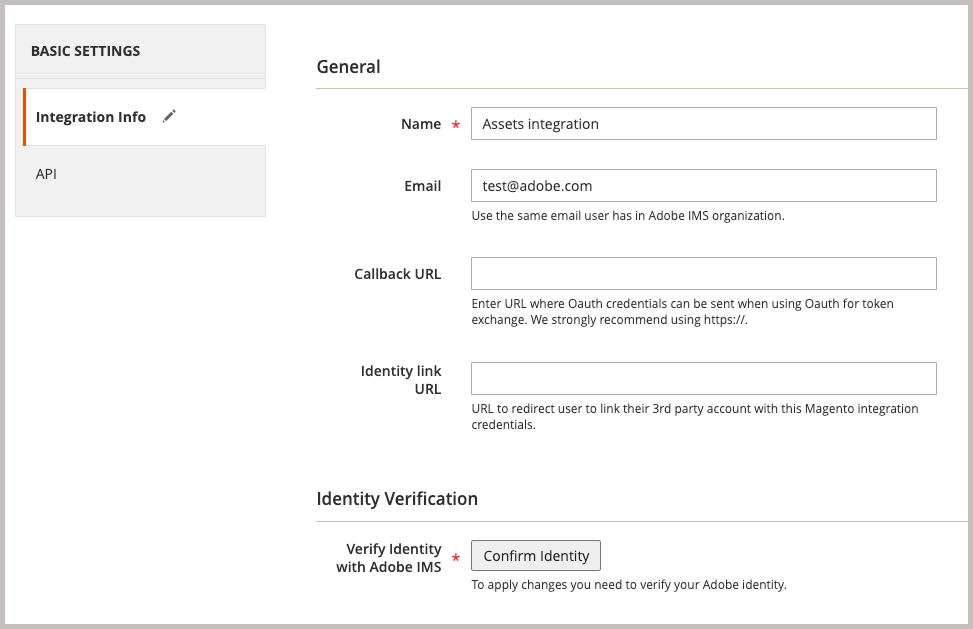

# 安装Adobe Commerce包

Commerce的这一集成支持在Adobe Commerce和Adobe Experience Manager Assets (AEM Assets)之间同步资源。 扩展提供了一系列工具和服务，用于跨两个平台管理产品图像、视频和其他媒体资产。

通过安装`aem-assets-integration` PHP扩展将此扩展添加到Commerce环境中。 您还需要启用适用于Commerce的Adobe I/O Events，并生成Adobe Commerce与Adobe Experience Manager Assets之间的通信和工作流程所需的凭据。

**访问要求**

您需要以下角色和权限来启用Commerce与AEM Assets的集成。

- [Commerce cloud项目管理员](https://experienceleague.adobe.com/en/docs/commerce-cloud-service/user-guide/project/user-access) — 安装所需的扩展，并通过管理员或命令行配置Commerce应用程序服务器。

   - 访问[repo.magento.com](https://repo.magento.com/admin/dashboard)以安装扩展。

     有关密钥生成和获取必要的权限，请参阅[获取您的身份验证密钥](https://experienceleague.adobe.com/en/docs/commerce-operations/installation-guide/prerequisites/authentication-keys)。 有关云安装，请参阅[云基础架构上的Commerce指南](https://experienceleague.adobe.com/en/docs/commerce-cloud-service/user-guide/develop/authentication-keys)

- [Commerce管理员](https://experienceleague.adobe.com/en/docs/commerce-admin/start/guide-overview) — 更新商店配置并管理Commerce用户帐户。

>[!TIP]
>
> Adobe Commerce可以配置为使用[Adobe IMS身份验证](https://experienceleague.adobe.com/en/docs/commerce-admin/start/admin/ims/adobe-ims-config)。

## 安装和配置工作流

安装Adobe Commerce包，并通过完成以下任务来准备Commerce环境：

1. [安装AEM Assets与Commerce的集成(`aem-assets-integration`)](#install-the-aem-assets-integration-extension)。

1. [配置Commerce Services Connector](#configure-the-commerce-services-connector)，以连接您的Adobe Commerce实例，并使用支持在Adobe Commerce和AEM Assets之间传输数据的服务。

1. [为Commerce配置Adobe I/O Events](#configure-adobe-io-events-for-commerce)

1. [获取API访问的身份验证凭据](#get-authentication-credentials-for-api-access)

## 安装AEM Assets集成扩展

在版本为Adobe Commerce 2.4.5+的AEM Assets实例上安装最新版本的Adobe Commerce集成扩展(`aem-assets-integration`)。 该扩展是作为[repo.magento.com](https://repo.magento.com/admin/dashboard)存储库中的编辑器中继包提供的。

>[!BEGINTABS]

>[!TAB 云基础架构]

使用此方法在Commerce Cloud实例上安装[!DNL AEM Assets Integration]扩展。

1. 在本地工作站上，转到云基础架构项目上Adobe Commerce的项目目录。

   >[!NOTE]
   >
   >有关在本地管理Commerce项目环境的信息，请参阅《云基础架构用户指南》[上的](https://experienceleague.adobe.com/en/docs/commerce-cloud-service/user-guide/develop/cli-branches)Adobe Commerce中的&#x200B;_使用CLI管理分支_。

1. 查看要使用Adobe Commerce Cloud CLI更新的环境分支。

   ```shell
   magento-cloud environment:checkout <environment-id>
   ```

1. 添加适用于Commerce的AEM Assets集成扩展。

   ```shell
   composer require "magento/aem-assets-integration" "<version-tbd>" --no-update
   ```

1. 更新包依赖关系。

   ```shell
   composer update "magento/aem-assets-integration"
   ```

1. 提交和推送`composer.json`和`composer.lock`文件的代码更改。

1. 添加、提交并将`composer.json`和`composer.lock`文件的代码更改推送到云环境。

   ```shell
   git add -A
   git commit -m "Install AEM Assets Integration extension for Adobe Commerce"
   git push origin <branch-name>
   ```

   推送更新将启动[Commerce云部署流程](https://experienceleague.adobe.com/en/docs/commerce-cloud-service/user-guide/develop/deploy/process)以应用更改。 从[部署日志](https://experienceleague.adobe.com/en/docs/commerce-cloud-service/user-guide/develop/test/log-locations#deploy-log)中检查部署状态。

>[!TAB 内部部署]

使用此方法为内部部署实例安装[!DNL AEM Assets Integration]扩展。

1. 使用编辑器将AEM Assets Integration for Commerce扩展添加到您的项目中：

   ```shell
   composer require "magento/aem-assets-integration" --no-update
   ```

1. 更新依赖项并安装扩展：

   ```shell
   composer update  "magento/aem-assets-integration"
   ```

1. 升级Adobe Commerce：

   ```shell
   bin/magento setup:upgrade
   ```

1. 清除缓存：

   ```shell
   bin/magento cache:clean
   ```

>[!TIP]
>
>部署到生产环境时，请考虑不清除编译的代码以节省时间。 在进行更改之前请始终备份系统。

>[!ENDTABS]

## 配置Commerce服务连接器

>[!NOTE]
>
>Commerce服务连接器设置是使用[Adobe Commerce SaaS服务](https://experienceleague.adobe.com/en/docs/commerce/user-guides/integration-services/saas#availableservices)所需的一次性进程。 如果您已经为其他服务配置了连接器，则可以通过选择&#x200B;**[!UICONTROL Systems]** > [!UICONTROL Services] > **[!UICONTROL Commerce Services Connector]**&#x200B;从Commerce管理员中查看现有配置。

要在您的Adobe Commerce实例与启用AEM Assets集成的服务之间传输数据，请从管理员(**[!UICONTROL System]** > [!UICONTROL Services] > **[!UICONTROL Commerce Services Connector]**)配置Commerce服务连接器。

AEM Assets集成的{width="600" zoomable="yes"}

在配置中提供以下值

- 用于身份验证的生产和沙盒API密钥
- 安全云存储的数据空间名称（SaaS标识符）
- 配置Commerce和AEM Assets环境的IMS组织ID

有关详细说明，请观看[Commerce服务连接器配置视频](https://experienceleague.adobe.com/en/docs/commerce-learn/tutorials/admin/adobe-commerce-services/configure-adobe-commerce-services-connector#configuration-faqs)，共[Commerce服务连接器](../../landing/saas.md#organizationid)文档。

在保存配置时，系统会为您的环境生成SaaS项目和数据库ID。 在Adobe Commerce和AEM Assets之间启用资源同步时需要这些值。

## 为Commerce配置Adobe I/O Events

AEM Assets集成使用Adobe I/O Events服务在Commerce实例和Experience Cloud之间发送自定义事件数据。 事件数据用于协调AEM Assets集成的工作流。

在配置Adobe I/O Events之前，请验证您的Commerce项目的RabbitMQ和cron作业配置：

- 确保已启用RabbitMQ并侦听事件。
   - 本地Adobe Commerce的[RabbitMQ设置](https://experienceleague.adobe.com/en/docs/commerce-cloud-service/user-guide/configure/service/rabbitmq)
   - 云基础架构上Adobe Commerce的[RabbitMQ设置](https://experienceleague.adobe.com/en/docs/commerce-cloud-service/user-guide/configure/service/rabbitmq)
   - 验证是否已启用[cron作业](https://developer.adobe.com/commerce/extensibility/events/configure-commerce/#check-cron-and-message-queue-configuration)。 AEM Assets集成的通信和工作流需要Cron作业。

>[!NOTE]
>
> 对于Commerce版本2.4.5上的项目，您必须[安装Adobe I/O模块](https://developer.adobe.com/commerce/extensibility/events/installation/#install-adobe-io-modules-on-commerce)。 在Commerce版本2.4.6+中，这些模块会自动加载。 对于Commerce的AEM Assets集成，您只需要安装模块。 不需要App Builder设置。


### 启用Commerce事件框架

从Commerce管理员中启用事件框架。

>[!NOTE]
>
>仅当您计划使用自定义匹配策略在App Builder和Commerce之间同步资源时，才需要AEM Assets设置。

1. 从管理员转到&#x200B;**[!UICONTROL Stores]** > [!UICONTROL Settings] > **[!UICONTROL Configuration]** > **[!UICONTROL Adobe Services]** > **Adobe I/O Events**。

1. 展开&#x200B;**[!UICONTROL Commerce events]**。

1. 将&#x200B;**[!UICONTROL Enabled]**&#x200B;设置为`Yes`。

   {width="600" zoomable="yes"}

1. 在&#x200B;**[!UICONTROL Merchant ID]**&#x200B;字段中输入商家公司名称，在&#x200B;**[!UICONTROL Environment ID]**&#x200B;字段中输入环境名称。 设置这些值时只能使用字母数字字符和下划线。

>[!BEGINSHADEBOX]

**配置自定义VCL以阻止请求**

如果使用自定义VCL代码片段阻止未知传入请求，则可能需要包含HTTP标头`X-Ims-Org-Idheader`，以允许来自Commerce的AEM Assets集成的传入连接。

>[!TIP]
>
> 您可以使用Fastly CDN模块创建一个包含要阻止的IP地址列表的Edge ACL。

以下自定义VCL代码片段（JSON格式）显示了`X-Ims-Org-Id`请求标头的示例。

```json
{
  "name": "blockbyuseragent",
  "dynamic": "0",
  "type": "recv",
  "priority": "5",
  "content": "if ( req.http.X-ims-org ~ \"<YOUR-IMS-ORG>\" ) {error 405 \"Not allowed\";}"
}
```

在基于此示例创建代码片段之前，请查看值以确定是否需要进行任何更改：

- `name`： VCL代码片段的名称。 此示例使用名称`blockbyuseragent`。

- `dynamic`：设置代码片段版本。 此示例使用`0`。 有关详细的数据模型信息，请参阅[Fastly VCL代码片段](https://www.fastly.com/documentation/reference/api/vcl-services/snippet/)。

- `type`：指定VCL代码片段的类型，该类型确定代码片段在生成的VCL代码中的位置。 此示例使用`recv`。 有关代码片段类型的列表，请参阅[Fastly VCL代码片段引用](https://www.fastly.com/documentation/reference/api/#api-section-snippet)。

- `priority`：确定VCL代码片段的运行时间。 此示例使用优先级`5`立即运行并检查管理员请求是否来自允许的IP地址。

- `content`：要运行的VCL代码片段，用于检查客户端IP地址。 如果IP位于Edge ACL中，则会阻止其访问，并显示整个网站的`405 Not allowed`错误。 允许访问所有其他客户端IP地址。

有关使用VCL代码段阻止传入请求的详细信息，请参阅[Commerce on Cloud Infrastructure指南](https://experienceleague.adobe.com/en/docs/commerce-cloud-service/user-guide/cdn/custom-vcl-snippets/fastly-vcl-blocking)中的&#x200B;_用于阻止请求的自定义VCL_。

>[!ENDSHADEBOX]

## 获取API访问的身份验证凭据

适用于Commerce的AEM Assets集成需要OAuth身份验证凭据，才能允许通过API访问Commerce实例。 使用AEM Assets集成管理资源时，需要这些凭据来验证API请求。

通过将集成添加到Commerce实例并激活它，可生成凭据。

### 将集成添加到Commerce环境

1. 从管理员中，转到&#x200B;**系统** >扩展> **集成**，然后单击&#x200B;**添加新集成**。

1. 输入有关集成的信息。

   在&#x200B;**常规**&#x200B;部分中，仅指定集成&#x200B;**名称**&#x200B;和&#x200B;**电子邮件**。 为有权访问部署Commerce和Experience Manager Assets的组织的Adobe IMS帐户使用电子邮件。

   适用于Commerce管理员配置的{width="600" zoomable="yes"}

1. 单击&#x200B;**确认身份**&#x200B;以验证您的身份。

   系统会使用您的Adobe ID向Experience Cloud进行身份验证，以验证您的身份。

1. 配置API资源。

   1. 从左侧面板中，单击&#x200B;**[!UICONTROL API]**。

   1. 选择外部媒体资源&#x200B;**[!UICONTROL Catalog > Inventory > Products > External Media]**。

      API资源的{width="600" zoomable="yes"}

1. 单击&#x200B;**[!UICONTROL Save]**。

### 生成OAuth凭据

在“集成”页面上，通过单击Assets集成的&#x200B;**激活**&#x200B;来生成OAuth身份验证凭据。 您需要这些凭据才能在Assets规则引擎服务中注册Commerce项目，并提交API请求以管理Adobe Commerce和AEM Assets之间的资源。

1. 在“集成”页面中，单击&#x200B;**[!UICONTROL Activate]**&#x200B;以生成凭据。

   为Assets集成{width="600" zoomable="yes"}

1. 如果您计划使用API，请保存使用者密钥的凭据并访问令牌，以在API客户端中配置身份验证。

   {width="600" zoomable="yes"}

1. 单击&#x200B;**[!UICONTROL Done]**。

>[!NOTE]
>
>您还可以使用Adobe Commerce API生成身份验证凭据。 有关此过程的详细信息，以及有关Adobe Commerce基于OAuth的身份验证的更多信息，请参阅Adobe Developer文档中的[基于OAuth的身份验证](https://developer.adobe.com/commerce/webapi/get-started/authentication/gs-authentication-oauth/)。

## 下一步

- [从Commerce管理员配置集成](setup-synchronization.md)
