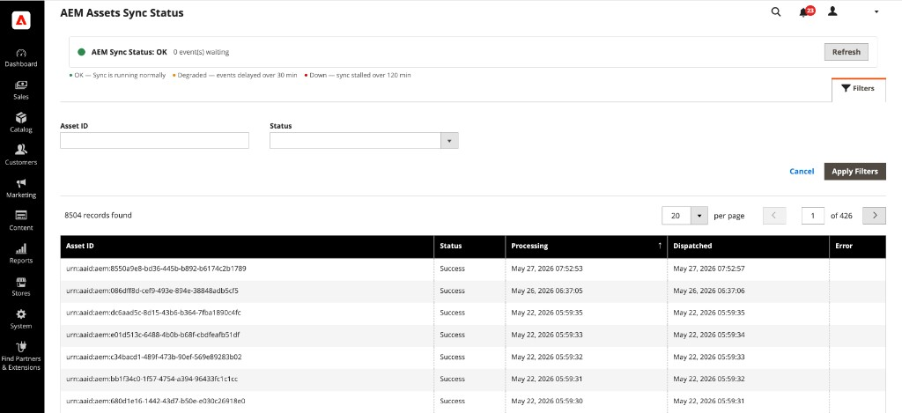

# 查看AEM Assets同步状态

**[!UICONTROL Sync Status]**&#x200B;视图提供通过AEM Assets集成同步的以资源为中心的资源列表。 使用它可按资产自己的属性查找、查看资产并对其进行故障排除，而不是在目录中按产品浏览。

{width="700" zoomable="yes"}

>[!NOTE]
>
> [!UICONTROL Sync Status]不可用于[!DNL Adobe Commerce Optimizer]。

## 打开同步状态

在&#x200B;_管理员_&#x200B;侧边栏中，导航到&#x200B;**[!UICONTROL System]** > **[!UICONTROL AEM Assets]** > **[!UICONTROL Sync Status]**。

{width="600" zoomable="yes"}

## 集成同步运行状况

在页面顶部，**AEM同步状态**&#x200B;横幅总结了管道运行状况以及等待处理的事件数。 选择&#x200B;**[!UICONTROL Refresh]**&#x200B;以更新同步运行状况横幅。

## 资源列表

网格会列出由AEM Assets同步管道处理的资源及其当前同步状态。 每一行表示一个资源及其Commerce中的同步状态。 它不代表产品记录。

| 列 | 描述 |
|--------|-------------|
| **资产ID** | AEM资源标识符（例如，`urn:aaid:aem:…`）。 |
| **状态** | 资产的最新同步尝试的结果。 可能的值为&#x200B;**成功**、**失败**&#x200B;或&#x200B;**等待**。 |
| **正在处理** | 开始处理资产的日期和时间。 |
| **已调度** | 调度同步事件的日期和时间。 |
| **错误** | **状态**&#x200B;指示失败时的错误消息；同步成功时为空。 |

### 筛选资产

1. 选择&#x200B;**[!UICONTROL Filters]**&#x200B;以展开筛选器面板。

1. 输入&#x200B;**资产ID**&#x200B;或选择&#x200B;**状态**&#x200B;值。

1. 选择&#x200B;**[!UICONTROL Apply Filters]**&#x200B;以更新网格，或选择&#x200B;**[!UICONTROL Cancel]**&#x200B;以关闭面板而不应用更改。

过滤器适用于资源级别的数据，使您能够隔离失败的同步或跟踪特定资源而不打开单个产品。

## 失败的同步

当&#x200B;**状态**&#x200B;显示失败时，请查看网格中的&#x200B;**错误**&#x200B;列，以查看同步管道返回的消息。

查看完整的错误消息和上次同步尝试详细信息以诊断故障。

仅[!BADGE PaaS]{type=Informative tooltip="仅适用于云项目上的Adobe Commerce（Adobe管理的PaaS基础架构）。"}有关其他疑难解答，请参阅[默认自动匹配](../synchronize/default-match.md)。 集成日志文件在Commerce实例的`/var/log/aem-assets-integration.log`和`/var/log/aem-assets-integration-errors.log`中可用。
