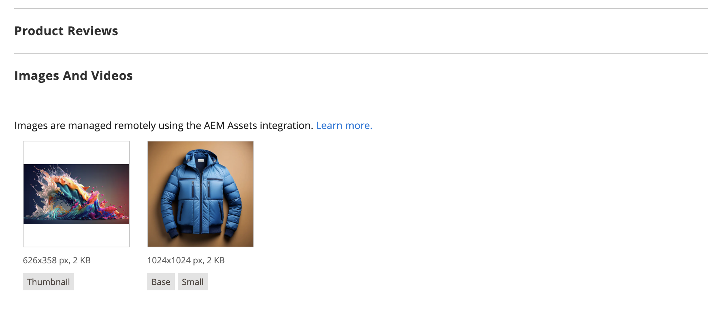
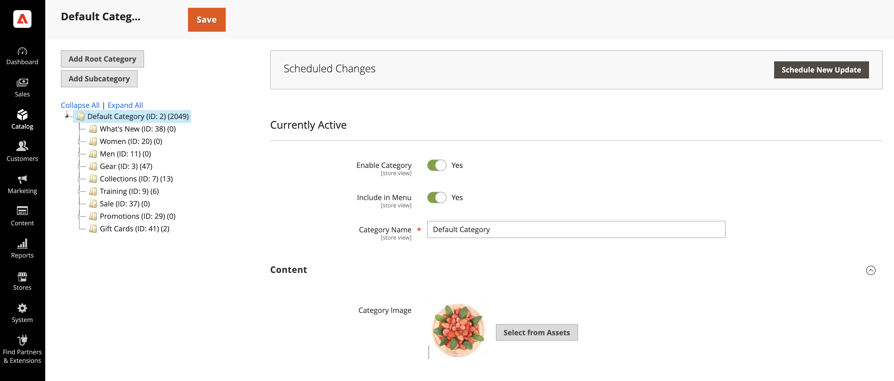

# 管理Commerce Media资源

<!--In ACAP-844, this topic was linked to from the Commerce Admin products images and videos when the Assets integration is enabled. If the URL to the topic changes, be sure to add a redirect.-->

在启用了适用于Commerce的AEM Assets集成后，您可以管理以下媒体类型：

* 产品图像
* 内容图像
* 产品视频
* 类别图像

## 产品图像

启用集成后，图像管理将集中到数字资产管理系统(DAM)中。 然后，Adobe Commerce将发挥关键参与渠道的作用，确保各店面仅使用获得批准的高质量图像。 这种设置可增强品牌一致性，最大程度地减少手动工作量，并简化内容更新，从而无需商家在Adobe Commerce中手动上传或管理图像。

### 在Adobe Commerce中查看产品图像

系统会根据预配置的匹配规则从AEM Assets中自动提取产品图像：

1. 在&#x200B;_管理员_&#x200B;侧边栏中，导航到&#x200B;**[!UICONTROL Catalog]** > **[!UICONTROL Products]**。

1. 选择产品。

1. 打开&#x200B;**图像和视频**&#x200B;部分。

   {width="600" zoomable="yes"}

   >[!NOTE]
   >
   > 将显示一条消息，指示已启用集成，从而使该部分成为&#x200B;**只读**&#x200B;部分，因为图像管理集中存储在DAM中。

### 在AEM Assets中管理产品图像

要管理与产品相关的图像，所有更改必须直接在&#x200B;**AEM Assets**&#x200B;中进行。 此过程是完全自动的，可确保任何更改同步到Adobe Commerce而无需手动干预。

### 同步SLA

有关此主题的详细信息，请查看[同步SLA](get-started/setup-synchronization.md#synchronization-sla)。

## 内容图像

Adobe Commerce将Page Builder作为&#x200B;**内容管理系统(CMS)**&#x200B;提供给未使用Adobe Experience Manager (AEM)工具集的商家。 为了增强内容创建，我们的集成利用[AEM Asset Selector](synchronize/asset-selector-integration.md)，允许营销人员直接从&#x200B;**DAM**&#x200B;无缝访问和嵌入图像。 这确保在内容创建过程中仅使用经过批准的高质量图像，从而消除了Adobe Commerce中的冗余存储需求。

### 在页面生成器中使用AEM资源选择器

[!BADGE 仅限PaaS]{type=Informative tooltip="仅适用于云项目上的Adobe Commerce(Adobe管理的PaaS基础架构)。"}使用&#x200B;**AEM资源选择器**&#x200B;嵌入图像：

1. 使用&#x200B;**页面生成器**&#x200B;导航到`content enrichment`Adobe Commerce Admin **中支持**&#x200B;的任何部分。

1. 打开[页面生成器](https://developer.adobe.com/commerce/frontend-core/page-builder/){target=_blank}。

   将提供一个名为&#x200B;**AEM资产**&#x200B;的新媒体类型。

1. 将AEM资源媒体类型拖放到内容块中。

1. 出现提示时，提供用于访问DAM的凭据。

1. 从DAM中选择图像并将其直接插入内容中。

与所选图像的关联将作为指向&#x200B;**Dynamic Media**&#x200B;的直接URL存储在Adobe Commerce中，确保：

* 图像文件无需存储在Adobe Commerce中。

* 营销人员专门处理DAM中已批准的资产。

* 内容在所有客户接触点上保持一致和最新。

>[!TIP]
>
> [DA.live （文档创作）](https://experienceleague.adobe.com/developer/commerce/storefront/merchants/storefront-builder/#dalive-document-authoring){target=_blank}还提供了一个资产选择器以扩充数据。

## 产品视频

Adobe Commerce是数字资源的关键参与渠道。 启用AEM Assets集成后，视频管理将集中到&#x200B;**DAM**&#x200B;中，从而确保各商业店面之间的一致性、合规性和优化的交付。

### 管理产品视频

1. 在&#x200B;_管理员_&#x200B;侧边栏中，导航到&#x200B;**[!UICONTROL Catalog]** > **[!UICONTROL Products]**。

1. 选择产品。

1. 打开&#x200B;**图像和视频**&#x200B;部分。

   {width="600" zoomable="yes"}

   >[!NOTE]
   >
   > 将显示一条消息，指示该集成已启用，使此分区&#x200B;**只读**，因为视频是在AEM Assets中进行控制的。

### 在AEM Assets中关联视频

1. 在AEM Assets中，导航到要与产品关联的视频。

1. 将视频链接到Adobe Commerce中的一个或多个产品。

1. 该集成会自动同步关联，在店面直接显示Dynamic Media视频播放器。 这消除了商家管理视频播放配置的需要。

### 仅API优先视频支持

目前，该集成通过API支持视频，允许合作伙伴以编程方式检索视频。

>[!WARNING]
>
> 默认情况下，视频尚未集成到现有Adobe Commerce店面解决方案中。

此集成确保商家能够以可扩展和优化的方式轻松管理产品视频，同时利用AEM Assets和Dynamic Media实现无缝交付。

### 同步SLA

有关此主题的详细信息，请查看[同步SLA](get-started/setup-synchronization.md#synchronization-sla)。

## 类别图像

Adobe Commerce使商家能够将图像与产品类别相关联，从而帮助创建具有视觉吸引力的店面。 AEM Assets集成利用AEM资产选择器，使营销人员能够直接从&#x200B;**数字资产管理系统(DAM)**&#x200B;中无缝选择资产。 这可确保仅使用批准的映像，无需将它们存储在Adobe Commerce中，从而维护所有参与渠道的一致性和效率。

### 对类别图像使用AEM资源选择器

配置[AEM资源选择器](synchronize/asset-selector-integration.md)后，您可以将其用于向目录类别内容中添加资源。

1. 在&#x200B;_管理员_&#x200B;侧边栏中，导航到&#x200B;**[!UICONTROL Catalog]** > **[!UICONTROL Categories]**。

1. 选择要更新的类别。

1. 展开扩展选择器&#x200B;**[!UICONTROL Content]**。

1. 在&#x200B;**[!UICONTROL Content]**&#x200B;部分中，找到与类别关联的&#x200B;*图像字段*。

   {width="600" zoomable="yes"}

1. 单击&#x200B;**[!UICONTROL Select from Assets]**&#x200B;以更改类别图像。

   {width="600" zoomable="yes"}

1. 从AEM资源选择器中选择图像。

   {width="600" zoomable="yes"}

1. 单击&#x200B;**[!UICONTROL Save]**&#x200B;并继续。

   有关创建类别的详细信息，请参阅[Commerce Catalog Management Guide](https://experienceleague.adobe.com/en/docs/commerce-admin/catalog/categories/create/category-create#step-3-complete-the-category-content)中的&#x200B;**完成类别内容**。

## 更新资产

在AEM Assets中更新和批准资源后，系统会使用自动匹配功能将更新自动发送到Adobe Commerce。 此流程在资产审批时触发。 要确保包括所有最终更改和元数据更新，请确保在批准资产之前重新处理该资产。

有关详细信息，请参阅以下AEM Assets文档。

* [正在重新处理数字资产](https://experienceleague.adobe.com/en/docs/experience-manager-cloud-service/content/assets/manage/reprocessing)

* [批准资产](https://experienceleague.adobe.com/en/docs/experience-manager-cloud-service/content/assets/dynamicmedia/dynamic-media-open-apis/approve-assets)
