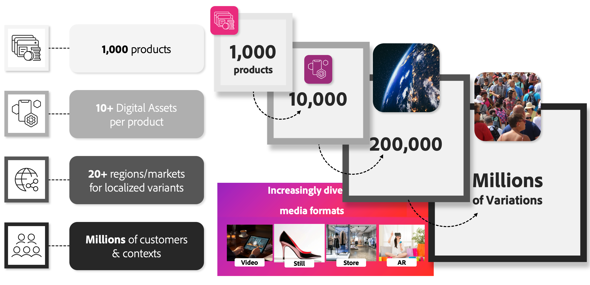

# 适用于Commerce的AEM Assets集成

在营销预算面临压力的同时，对个性化内容的需求也在迅速增长。 受地区、季节和特定区段要求的驱动，零售商和品牌正在努力跟上对产品图像变化日益增长的需求。

以一个包含1,000种产品的retailer为例。 即使在考虑属性变体之前，在考虑不同区域、客户区段和个性化工作时，所需的数字资产数量也会显着增加。 这可能会导致大量资产变化，进而高达数百万个。

{width="700" zoomable="yes"}

AEM Assets集成通过自动化资产管理工作流解决了此难题。 该集成可根据SKU或其他关键属性，确保数字资产（如产品图像和营销内容）动态链接到相应的促销实体，包括Adobe Commerce中的产品和类别。 此流程通过启用：

* **无缝安装和配置** — 销售团队和开发人员可以使用熟悉的Adobe工具和工作流程快速设置集成。

* **动态资源更新** — 产品图像和营销资源会自动反映AEM Assets中的最新更改，从而保持店面准确和相关性。

* **简化的目录管理** — 自动进行资产刷新和清理，最大程度地减少手动操作，并确保产品目录一致、维护良好。

## 使用该集成的要求

若要将此集成与[产品可视化图表或AEM Assets](https://experienceleague.adobe.com/zh-hans/docs/commerce/cloud-service/overview#product-visuals-powered-by-aem-assets)一起使用，企业必须满足以下要求：

>[!BEGINTABS]

>[!TAB 产品视觉效果]

[!BADGE 仅限SaaS]{type=Positive url="https://experienceleague.adobe.com/zh-hans/docs/commerce/user-guides/product-solutions" tooltip="仅适用于Adobe Commerce as a Cloud Service和Adobe Commerce Optimizer项目(Adobe管理的SaaS基础架构)。"}适用于Adobe Commerce、由AEM Assets提供支持的产品可视化以及[AEM Dynamic Media](https://experienceleague.adobe.com/zh-hans/docs/experience-manager-65/content/assets/dynamic/administering-dynamic-media)的有效许可证（这些许可证随[!DNL Adobe Commerce as a Cloud Service]和[!DNL Adobe Commerce Optimizer]一起现成可用）。

>[!TAB AEM Assets]

[!BADGE 仅限SaaS]{type=Positive url="https://experienceleague.adobe.com/zh-hans/docs/commerce/user-guides/product-solutions" tooltip="仅适用于Adobe Commerce as a Cloud Service和Adobe Commerce Optimizer项目(Adobe管理的SaaS基础架构)。"}Adobe Commerce、Adobe Experience Manager Assets和[AEM Dynamic Media](https://experienceleague.adobe.com/zh-hans/docs/experience-manager-65/content/assets/dynamic/administering-dynamic-media)的有效许可证。

仅[!BADGE PaaS]{type=Informative tooltip="仅适用于云项目上的Adobe Commerce(Adobe管理的PaaS基础架构)。"} Adobe Commerce 2.4.5+

* PHP 8.1、8.2、8.3和8.4

* Composer 2.x

仅[!BADGE SaaS]{type=Positive url="https://experienceleague.adobe.com/zh-hans/docs/commerce/user-guides/product-solutions" tooltip="仅适用于Adobe Commerce as a Cloud Service和Adobe Commerce Optimizer项目(Adobe管理的SaaS基础架构)。"} Adobe Experience Manager已配置[Adobe Experience Manager Assets as a Cloud Service](https://experienceleague.adobe.com/zh-hans/docs/experience-manager-cloud-service/content/assets/overview)

>[!ENDTABS]

配置集成的Adobe Commerce用户必须具有对配置了AEM Assets项目的[IMS组织](https://experienceleague.adobe.com/zh-hans/docs/core-services/interface/administration/organizations#concept_EA8AEE5B02CF46ACBDAD6A8508646255)的访问权限。

>[!BEGINSHADEBOX]

## 主要业务优势

 **无额外费用** — 此集成免费提供给符合授权要求的商家。

 **官方Adobe解决方案** — 由Adobe开发、维护和完全支持，确保稳定性并与未来的平台增强功能保持一致。

 **Adobe托管支持模型** — 协助和故障排除直接由Adobe处理，可让您高枕无忧并简化问题解决方案。

 **Adobe Storefront Builder功能** — 数字资源管理(DAM)解决方案允许在[Storefront Builder](https://experienceleague.adobe.com/developer/commerce/storefront/merchants/storefront-builder/?lang=zh-Hans#userlabs-commerce-genai-product-visuals)上使用图像、视频和其他媒体等资源。

>[!ENDSHADEBOX]

观看本视频，了解Adobe Commerce和AEM Assets如何协作以简化内容工作流：

>[!VIDEO](https://video.tv.adobe.com/v/3447898?captions=chi_hans)

## 后续步骤

启用Commerce与Experience Manager Assets的集成需要三个步骤：

1. [配置您的AEM Assets项目以支持Commerce元数据](get-started/configure-aem.md)。

1. 仅[!BADGE PaaS]{type=Informative tooltip="仅适用于云项目上的Adobe Commerce(Adobe管理的PaaS基础架构)。"} [安装Adobe Commerce包](get-started/configure-commerce.md)。

1. [配置集成](get-started/setup-synchronization.md)。

## 支持

如果您需要本指南中未涉及的信息或问题，请联系您的AEM Assets集成销售代表或创建[支持票证](https://experienceleague.adobe.com/docs/commerce-knowledge-base/kb/help-center-guide/magento-help-center-user-guide.html?lang=zh-Hans#submit-ticket)以获取其他帮助。
