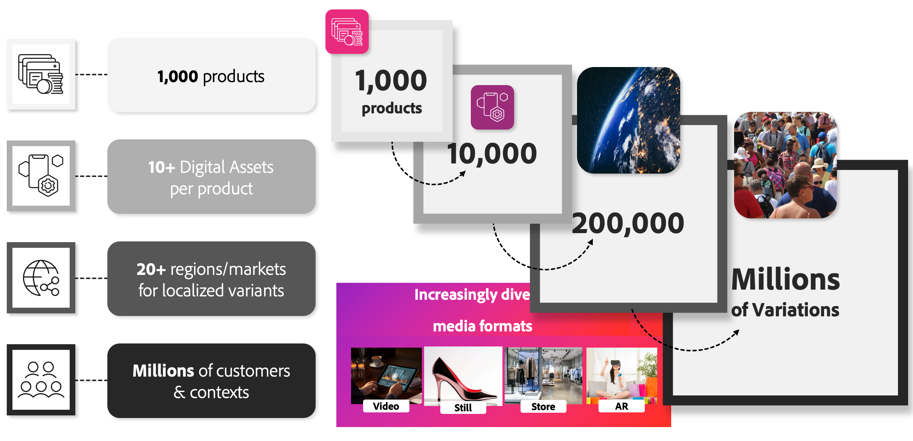

# 适用于Commerce的AEM Assets集成

在营销预算面临压力的同时，对个性化内容的需求也在迅速增长。 受地区、季节和特定区段要求的驱动，零售商和品牌正在努力跟上对产品图像变化日益增长的需求。

以一个包含1,000种产品的retailer为例。 在考虑不同地区、客户细分和个性化工作时，所需的数字资产数量会显着增加。 这种情况可能导致大量资产变异，甚至高达数百万。

{width="700" zoomable="yes"}

AEM Assets集成通过自动化资产管理工作流解决了此难题。 该集成会根据SKU或其他关键属性，动态地将数字资产链接到适当的Adobe Commerce产品和类别。 此流程通过启用：

* **无缝安装和配置** — 销售团队和开发人员可以使用熟悉的Adobe工具和工作流程快速设置集成。

* **动态资源更新** — 产品图像和营销资源会自动反映AEM Assets中的最新更改，从而保持店面准确和相关性。

* **简化的目录管理** — 自动进行资产刷新和清理，最大程度地减少手动操作，并确保产品目录一致、维护良好。

## 使用该集成的要求

若要将此集成与[产品可视化图表或AEM Assets](https://experienceleague.adobe.com/en/docs/commerce/cloud-service/overview#product-visuals-powered-by-aem-assets)一起使用，企业必须满足以下要求：

>[!BEGINTABS]

>[!TAB 产品视觉效果]

[!BADGE 仅限SaaS]{type=Positive url="https://experienceleague.adobe.com/en/docs/commerce/user-guides/product-solutions" tooltip="仅适用于Adobe Commerce as a Cloud Service和Adobe Commerce Optimizer项目（Adobe管理的SaaS基础架构）。"}适用于Adobe Commerce、由AEM Assets提供支持的产品可视化以及[AEM Dynamic Media](https://experienceleague.adobe.com/en/docs/experience-manager-65/content/assets/dynamic/administering-dynamic-media)的有效许可证（这些许可证随[!DNL Adobe Commerce as a Cloud Service]和[!DNL Adobe Commerce Optimizer]一起现成可用）。

>[!TAB AEM Assets]

[!BADGE 仅限SaaS]{type=Positive url="https://experienceleague.adobe.com/en/docs/commerce/user-guides/product-solutions" tooltip="仅适用于Adobe Commerce as a Cloud Service和Adobe Commerce Optimizer项目（Adobe管理的SaaS基础架构）。"}Adobe Commerce、Adobe Experience Manager Assets和[AEM Dynamic Media](https://experienceleague.adobe.com/en/docs/experience-manager-65/content/assets/dynamic/administering-dynamic-media)的有效许可证。

仅[!BADGE PaaS]{type=Informative tooltip="仅适用于云项目上的Adobe Commerce（Adobe管理的PaaS基础架构）。"} Adobe Commerce 2.4.5+

* PHP 8.1、8.2、8.3和8.4

* Composer 2.x

仅[!BADGE SaaS]{type=Positive url="https://experienceleague.adobe.com/en/docs/commerce/user-guides/product-solutions" tooltip="仅适用于Adobe Commerce as a Cloud Service和Adobe Commerce Optimizer项目（Adobe管理的SaaS基础架构）。"} Adobe Experience Manager已配置[Adobe Experience Manager Assets as a Cloud Service](https://experienceleague.adobe.com/zh-hans/docs/experience-manager-cloud-service/content/assets/overview)

>[!ENDTABS]

配置集成的Adobe Commerce用户必须具有对配置了AEM Assets项目的[IMS组织](https://experienceleague.adobe.com/en/docs/core-services/interface/administration/organizations#concept_EA8AEE5B02CF46ACBDAD6A8508646255)的访问权限。

>[!BEGINSHADEBOX]

## 主要业务优势

 **无额外费用** — 此集成免费提供给符合授权要求的商家。

 **官方Adobe解决方案** — 由Adobe开发、维护和完全支持，确保稳定性并与未来的平台增强功能保持一致。

 **Adobe托管支持模型** - Adobe直接处理协助和疑难解答，从而提供可靠的支持并简化问题解决方案。

 **Adobe Storefront Builder功能** — 数字资源管理(DAM)解决方案允许在[Storefront Builder](https://experienceleague.adobe.com/developer/commerce/storefront/merchants/storefront-builder/#userlabs-commerce-genai-product-visuals)上使用图像、视频和其他媒体等资源。

>[!ENDSHADEBOX]

## 教程

要了解如何设置并使用AEM Assets与Adobe Commerce的集成，请观看这些视频。

>[!BEGINTABS]

>[!TAB 云或本地教程上的Adobe Commerce]

要了解Adobe Commerce和AEM Assets如何协作以简化内容工作流，请观看此视频：

>[!VIDEO](https://video.tv.adobe.com/v/3447837)

>[!TAB Adobe Commerce as a Cloud Service教程]

了解如何将Adobe Commerce as a Cloud Service与AEM Assets集成一起使用。

>[!VIDEO](https://video.tv.adobe.com/v/3478140?quality=12&learn=on)

>[!ENDTABS]

## 后续步骤

安装和配置AEM Assets集成的流程取决于您的Adobe Commerce部署。 在所有情况下，您首先要配置AEM Assets，然后将Commerce连接到该网站。

要了解集成添加到AEM Assets环境中的命名空间、元数据架构和&#x200B;**[!UICONTROL Commerce]**&#x200B;选项卡，请在开始之前查看AEM Assets[&#128279;](metadata.md)中的Commerce元数据。

选择您的部署以按照以下顺序执行所需步骤：

>[!BEGINTABS]

>[!TAB Adobe Commerce as a Cloud Service]

仅[!BADGE SaaS]{type=Positive tooltip="仅适用于Adobe Commerce as a Cloud Service项目（Adobe管理的SaaS基础架构）。"}

1. 要支持Commerce元数据，请[配置AEM Assets项目](get-started/configure-aem.md)。 在AEM版本`2026.5.26309`及更高版本上，使用[自助入门培训](get-started/configure-aem.md#enable-aem-commerce-self-service)；在早期版本上，手动安装`assets-commerce`包。

1. [配置IMS用户权限](get-started/permissions.md)，以便资产选择器和自动填充的&#x200B;**[!UICONTROL Program ID]**&#x200B;和&#x200B;**[!UICONTROL Environment ID]**&#x200B;字段可用。

1. [在Commerce管理员中配置集成](get-started/setup-synchronization.md)。

1. 可选。 [启用product-image display](get-started/configure-storefront.md#enable-product-images)，以便由Edge Delivery Services提供支持的店面会呈现AEM管理的产品图像。

>[!TAB 云端Adobe Commerce (PaaS)]

仅[!BADGE PaaS]{type=Informative tooltip="仅适用于云项目上的Adobe Commerce（Adobe管理的PaaS基础架构）。"}

1. 要支持Commerce元数据，请[配置AEM Assets项目](get-started/configure-aem.md)。 在AEM版本`2026.5.26309`及更高版本上，使用[自助入门培训](get-started/configure-aem.md#enable-aem-commerce-self-service)；在早期版本上，手动安装`assets-commerce`包。

1. [安装Adobe Commerce包](get-started/configure-commerce.md)以添加扩展并生成所需的凭据和连接。

1. [配置IMS用户权限](get-started/permissions.md)，以便资产选择器和自动填充的&#x200B;**[!UICONTROL Program ID]**&#x200B;和&#x200B;**[!UICONTROL Environment ID]**&#x200B;字段可用。

1. [在Commerce管理员中配置集成](get-started/setup-synchronization.md)。

1. 可选。 [启用product-image display](get-started/configure-storefront.md#enable-product-images)，以便由Edge Delivery Services提供支持的店面会呈现AEM管理的产品图像。

>[!TAB Adobe Commerce Optimizer]

仅[!BADGE SaaS]{type=Positive tooltip="仅适用于Adobe Commerce Optimizer项目。"}

[!DNL Adobe Commerce Optimizer]它没有管理员配置UI。 Adobe支持部门会从您的载入票证配置集成，因此请先准备AEM Assets。

1. 要支持Commerce元数据，请[配置AEM Assets项目](get-started/configure-aem.md)。 在AEM版本`2026.5.26309`及更高版本上，使用[自助入门培训](get-started/configure-aem.md#enable-aem-commerce-self-service)；在早期版本上，手动安装`assets-commerce`包。

1. [使用您的租户ID、AEM项目ID、AEM环境ID、匹配的规则、层和区域设置提交载入支持票证](get-started/configure-aco.md#onboarding)。

1. [使用您在票证中注册的相同区域设置和层配置目录视图](get-started/configure-aco.md#onboarding)。

1. 可选。 [启用product-image display](get-started/configure-storefront.md#enable-product-images)，以便由Edge Delivery Services提供支持的店面会呈现AEM管理的产品图像。

   有关完整过程、限制和层指南，请参阅[为Commerce Optimizer配置AEM Assets](get-started/configure-aco.md)。

>[!ENDTABS]

## 支持

如果您需要本指南中未涉及的信息或问题，请联系您的AEM Assets集成销售代表或创建[支持票证](https://experienceleague.adobe.com/en/docs/support-resources/adobe-support-tools-guide/adobe-commerce-support/adobe-commerce-help-center-user-guide#support-case)以获取其他帮助。
