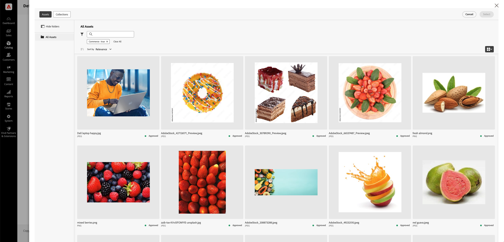

# 手动选择资源

通过&#x200B;**AEM资产选择器**，营销人员和促销人员可以轻松地将图像从AEM Assets添加到Adobe Commerce，从而简化资产管理流程。 此方法通过将资产选择限制在[!DNL DAM (Digital Asset Management system)]中审核和批准的那些资产来确保品牌一致性和合规性。

当已在AEM管理员中配置了AEM Assets项目的IMS客户端ID，并且用户具有所需的[权限和IMS身份验证](../get-started/permissions.md)时，**Commerce资产选择器**&#x200B;可用。 请参阅[配置AEM资源选择器](#configure-the-aem-asset-selector-in-adobe-commerce)。

配置&#x200B;**AEM Asset Selector**&#x200B;集成后，营销人员和商家可以：

* 轻松管理类别图像，确保它们符合品牌和活动准则。
* [!BADGE 仅限PaaS]{type=Informative tooltip="仅适用于云项目上的Adobe Commerce（Adobe管理的PaaS基础架构）。"}在页面生成器中直接分配资产，以实现视觉效果丰富的内容。
* [!BADGE 仅限SaaS]{type=Positive url="https://experienceleague.adobe.com/en/docs/commerce/user-guides/product-solutions" tooltip="仅适用于Adobe Commerce as a Cloud Service和Adobe Commerce Optimizer项目（Adobe管理的SaaS基础架构）。"}在Commerce店面中直接分配Assets（由Edge Delivery Services提供支持），以查看丰富的视觉内容。

>[!NOTE]
>
> AEM资源选择器是一个AEM资源前端组件，用于将AEM Assets与创作应用程序集成。 有关此组件的详细信息，请参阅&#x200B;*AEM as a Cloud Service用户指南*&#x200B;中的[微前端资产选择器](https://experienceleague.adobe.com/en/docs/experience-manager-cloud-service/content/assets/content-advisor/integrate-adobe-non-adobe-applications){target=_blank}。

## 主要优点

在AEM管理面板中嵌入Adobe Commerce资源选择器有几个主要优势：

* **品牌一致性** — 仅显示批准的资产，从而最大限度地降低店面图像过时或不兼容的风险。

* **效率** — 使营销人员和促销人员能够快速分配资产，而无需在不同平台之间切换。

* **简化的Collaboration** — 允许从DAM中直接选择图像，从而简化无缝团队合作，而无需手动下载和上传。

* **增强的内容质量** — 确保在产品页面、类别和页面生成器中使用高分辨率、优化的图像。

{width="600" zoomable="yes"}

## 在Adobe Commerce中配置AEM资源选择器

1. 在Commerce管理员中，导航到&#x200B;**[!UICONTROL Store]** >配置> **[!UICONTROL ADOBE SERVICES]** > **[!UICONTROL AEM Assets Integration]**。

1. 填写&#x200B;**[!UICONTROL IMS Client ID]**&#x200B;字段。 有关所需的权限以及如何获取此ID，请参阅[用户权限和IMS](../get-started/permissions.md)。

1. **保存**&#x200B;配置。

## 后续步骤

* [使用资产选择器管理类别图像](../manage-assets.md#category-images)
* [在页面生成器内容中管理图像](../manage-assets.md#using-aem-asset-selector-in-page-builder)
