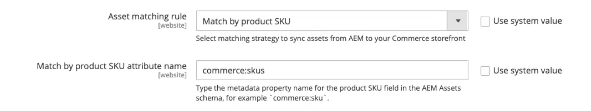

# 默认自动匹配

Commerce的AEM Assets集成提供了基于&#x200B;**[!UICONTROL Match by product SKU]** AEM Assets **元数据配置的默认自动匹配机制(**)。 此规则可实现&#x200B;**Adobe Commerce**&#x200B;和&#x200B;**AEM Assets**&#x200B;之间的无缝同步，从而确保资产自动链接到正确的促销实体。

## 配置自动匹配机制

1. 在Commerce管理员中，导航到&#x200B;**[!UICONTROL Store]** >配置> **[!UICONTROL ADOBE SERVICES]** > **[!UICONTROL AEM Assets Integration]**。

1. 将&#x200B;**[!UICONTROL Match by SKU]**&#x200B;指定为匹配规则。

   {width="600" zoomable="yes"}

1. 输入用于在AEM Assets中标识资源的元数据字段名称。

   >[!NOTE]
   >
   > 如果遵循了标准载入流程，此值应设置为`commerce:skus`。

## 自动匹配机制的工作原理

在Commerce Admin中配置&#x200B;**[!UICONTROL Match by product SKU]**&#x200B;匹配规则后，Commerce资源文件会根据为每个文件配置的资源元数据，自动从AEM Assets同步到Commerce项目。 您可以在&#x200B;**AEM创作**&#x200B;环境的AEM Assets **Commerce**&#x200B;选项卡中配置元数据：

{width="600" zoomable="yes"}

1. 在AEM Assets中，更新图像元数据以添加Adobe Commerce关联`Commerce=yes`。

1. 配置元数据（[!UICONTROL SKU]、[!UICONTROL position]和[!UICONTROL role]）以将资产链接到关联的产品SKU。

   >[!NOTE]
   >
   > 如果资产用于多个产品，请为每个关联的SKU配置元数据。

此方法可确保正确地链接数字资源并在Adobe Commerce中显示这些资源。 此外，它还可让商家和营销人员直接在AEM Assets中管理角色和资产定位，从而在所有参与渠道中提供一致的集中式图像选择和排序机制。
