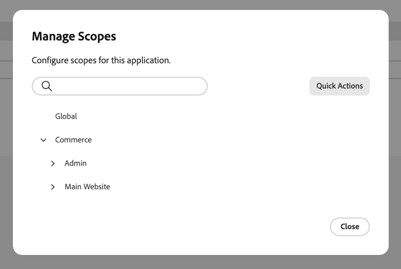

# 管理您的应用程序

应用程序管理器将App Builder应用程序与其Commerce实例关联。 配置表单会根据应用程序的架构动态呈现，因此无需自定义管理员UI开发。 应用程序管理器通过Commerce自动生成的表单来配置设置。

{width="500" zoomable="yes"}

## 在管理员中查找应用程序

在&#x200B;**[!UICONTROL Apps]** > **[!UICONTROL App Management]**&#x200B;下，每个应用程序都显示为卡片。 该列表可包含与所选Adobe IMS组织的Adobe Commerce实例关联的每个应用程序。 使用信息卡上方的控件来缩小结果范围：

| 控件 | 描述 |
| --- | --- |
| **按应用程序筛选……** | 按应用程序名称搜索。 |
| **状态** | 按生命周期状态限制卡片。 **所有状态**&#x200B;显示每个应用；其他值包括&#x200B;**关联**、**已安装**、**已部分安装**&#x200B;和&#x200B;**未关联**。 每张信息卡上的状态与列表中的彩色指示器匹配。 |
| **可扩展性模式** | 根据应用程序使用的功能限制信息卡。 **所有可扩展性模式**&#x200B;显示每个应用程序；其他值与每个卡上的徽章一致，如&#x200B;**业务配置**、**管理UI SDK**、**Webhooks**&#x200B;和&#x200B;**活动**。 |

搜索文本和两个下拉列表同时应用（逻辑AND）。 若要再次显示完整列表，请将&#x200B;**状态**&#x200B;和&#x200B;**可扩展性模式**&#x200B;设置回它们的&#x200B;**所有……**&#x200B;选项，并清除搜索字段。

## 获取应用程序

**[!UICONTROL Acquire App]**&#x200B;打开[Adobe Exchange](https://exchange.adobe.com/experiencecloud){target="_blank"}的新浏览器选项卡（或单独的浏览器视图），您可以在其中发现与Commerce相关的市场列表并将应用程序添加到您的Adobe IMS组织。 获取、批准和部署应用程序后，应用程序将在[!DNL App Management]中显示为[关联和安装](#associate-an-app)。

## 先决条件

在关联应用程序之前，请确保您满足以下条件：

| 要求 | 描述 |
|-------------|-------------|
| **管理员访问权限** | 具有[!DNL App Management]权限的Commerce管理员 |
| **已部署应用程序** | App Builder应用程序已部署到您的组织并准备好连接 |
| **组织访问权限** | 访问部署应用程序的Adobe组织 |

## 教程

观看本视频，了解如何将应用程序与Commerce实例关联并配置设置。

>[!VIDEO](https://video.tv.adobe.com/v/3478965?captions=chi_hans)

## 关联应用程序

关联过程将从Commerce导入网站、商店和商店视图，并在应用程序和Commerce实例之间创建链接。

要将App Builder应用程序链接到Commerce实例，请执行以下操作：

1. 导航到&#x200B;**[!UICONTROL Apps]** > **[!UICONTROL App Management]**。

1. 单击&#x200B;**[!UICONTROL Associate App]**。

   {width="500" zoomable="yes"}

1. 从列表中选择&#x200B;**[!UICONTROL Project]**。

1. 选择&#x200B;**[!UICONTROL Workspace]**。

1. 单击&#x200B;**[!UICONTROL Associate]**。

   {width="500" zoomable="yes"}

>[!WARNING]
>
>如果范围同步失败，则关联仍会完成。 您可以稍后从关联应用程序配置的&#x200B;**[!UICONTROL Manage Scopes]**&#x200B;视图中手动同步作用域。

## 配置设置

在[!DNL App Management]视图中关联应用程序后，通过表单配置其设置：

1. 单击关联应用上的&#x200B;**[!UICONTROL Configure]**。

1. 该表单会显示应用程序的可配置设置。

1. 根据需要修改值。

1. 单击&#x200B;**[!UICONTROL Save]**。

### 特定于范围的配置

当不同的网站、商店或商店视图需要唯一的设置时，请使用特定于范围的配置。 例如，仅为特定区域或商店视图启用某个功能，或者为每个品牌使用不同的设置。 较低作用域的设置将覆盖较高作用域的设置。

要覆盖特定范围级别的全局值，请执行以下操作：

1. 单击&#x200B;**[!UICONTROL Change Scope]**。

1. 从列表中选择一个范围。

1. 修改此范围的值。

1. 单击&#x200B;**[!UICONTROL Save]**。

## 管理范围

从应用程序详细信息屏幕访问&#x200B;**[!UICONTROL Manage Scopes]**&#x200B;以管理应用程序的范围层次结构。

{width="500" zoomable="yes"}

| 操作 | 描述 |
|--------|-------------|
| **[!UICONTROL Add root scope]** | 添加仅适用于应用程序的范围。 |
| **[!UICONTROL Sync Commerce scopes]** | 在添加或更改网站、商店和商店后，从Commerce中刷新它们视图的列表。 |
| **[!UICONTROL Import scopes]** | 从文件批量导入作用域。 |

## 取消与应用程序的关联

当您不再需要某个应用程序连接到Commerce实例时，请取消该应用程序的关联。 例如，您可能需要停用集成、切换到其他工作区或清理测试配置。

>[!WARNING]
>
> 取消关联将删除此实例的所有配置值。 无法撤消此操作。

要从Commerce实例中删除应用程序：

1. 导航到&#x200B;**[!UICONTROL Apps]** > **[!UICONTROL App Management]**。

1. 单击应用程序上的&#x200B;**[!UICONTROL Unassociate]**。

1. 确认操作。

## 相关文档

* [疑难解答 [!DNL App Management]](troubleshooting.md) — 解决与应用程序关联和配置有关的常见问题。
