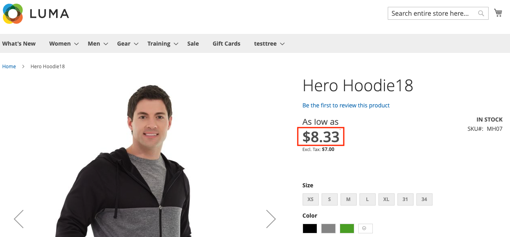

# 使用Adobe Developer App Builder的API Mesh显示计税价格

[API Mesh](https://developer.adobe.com/graphql-mesh-gateway/mesh/)使开发人员能够使用Adobe I/O Runtime将私有或第三方API和其他接口与Adobe产品集成。

在本主题中，API网格用于在产品详细信息页面上显示产品价格，并包含税费。

## 设置税率

您必须为其配置税才能在产品详细信息页面上显示。

1. [设置税率](https://experienceleague.adobe.com/zh-hans/docs/commerce-admin/stores-sales/site-store/taxes/tax-rules)。
1. 使税在目录[&#128279;](https://experienceleague.adobe.com/zh-hans/docs/commerce-admin/stores-sales/site-store/taxes/display-settings#step-1%3A-configure-catalog-prices-display-settings)中显示为，并将其设置为`Including and Excluding Tax`或`Including Tax`。

通过检查产品详细信息页面，验证目录服务是否正常工作。

产品详细信息页面上显示

## 配置API网格

如果尚未这样做，请将API网格与目录服务连接到您的实例。 请参阅API Mesh开发人员指南的[快速入门](https://developer.adobe.com/graphql-mesh-gateway/mesh/basic/)主题中的详细说明。

在`mesh.json`文件中，替换`name`、`endpoint`和`x-api-key`值。

```json
{
    "meshConfig": {
      "sources": [
        {
          "name": "<NAME_OF_MESH>",
          "handler": {
            "graphql": {
              "endpoint": "<COMMERCE_INSTANCE_GQL_ENDPOINT_URL>"
            }
          },
          "transforms": [
              {
                  "prefix": {
                      "includeRootOperations": true,
                        "value": "Core_"
                  }
              }
          ]
        },
        {
          "name": "CommerceCatalogServiceGraph",
          "handler": {
            "graphql": {
              "endpoint": "https://catalog-service-sandbox.adobe.io/graphql/",
              "operationHeaders": {
                "Magento-Store-View-Code": "{context.headers['magento-store-view-code']}",
                "Magento-Website-Code": "{context.headers['magento-website-code']}",
                "Magento-Store-Code": "{context.headers['magento-store-code']}",
                "Magento-Environment-Id": "{context.headers['magento-environment-id']}",
                "x-api-key": "API_KEY",
                "Magento-Customer-Group": "{context.headers['magento-customer-group']}"
              },
              "schemaHeaders": {
                "x-api-key": "<YOUR API_KEY>"
              }
            }
          }
        }
      ],
      "additionalTypeDefs": "extend type ComplexProductView {\n  priceWithTaxes: Core_PriceRange\n}\n extend type SimpleProductView {\n  priceWithTaxes: Core_PriceRange\n}\n",
      "additionalResolvers": [
            {  
              "targetTypeName": "ComplexProductView",
              "targetFieldName": "priceWithTaxes",
              "sourceName": "MagentoQACore",
              "sourceTypeName": "Query",
              "sourceFieldName": "Core_products",
              "requiredSelectionSet": "{\n items {\n sku, \n price_range {\n minimum_price {\n final_price {\n value\n currency\n }\n }\n }\n }\n }",
                "sourceArgs": {
                    "filter.sku.eq": "{root.sku}"
                },
                "result": "items[0].price_range"
            },
            {  
              "targetTypeName": "SimpleProductView",
              "targetFieldName": "priceWithTaxes",
              "sourceName": "MagentoQACore",
              "sourceTypeName": "Query",
              "sourceFieldName": "Core_products",
              "requiredSelectionSet": "{\n items {\n sku, \n price_range {\n minimum_price {\n final_price {\n value\n currency\n }\n }\n }\n }\n }",
                "sourceArgs": {
                    "filter.sku.eq": "{root.sku}"
                },
                "result": "items[0].price_range"
            }
        ]
     }
  }
```

此`mesh.json`配置文件：

* 转换Commerce核心应用程序以要求在其任何查询或类型之前添加“Core_”。 这样可防止与目录服务可能出现的命名冲突。
* 使用名为`priceWithTaxes`的新字段扩展`ComplexProductView`和`SimpleProductView`类型。
* 为新字段添加自定义解析程序。

使用[创建命令](https://developer.adobe.com/graphql-mesh-gateway/mesh/basic/create-mesh)和`mesh.json`文件创建网格。

### GraphQL查询

您可以使用GraphQL检索新的`priceWithTaxes`数据。

查询示例：

```graphql
query {
    products(skus:[MH07]) {
        __typename
        id
        sku
        name
        description
        shortDescription
        addToCartAllowed
        url
        ... on ComplexProductView {
            priceWithTaxes {
              minimum_price {
                final_price {
                  value
                }
              }
              maximum_price {
                final_price {
                  value
                }
              }
            }
            priceRange {
                maximum {
                    final {
                        amount {
                            value
                            currency
                        }
                    }
                    regular {
                        amount {
                            value
                            currency
                        }
                    }
                    roles
                }
                minimum {
                    final {
                        amount {
                            value
                            currency
                        }
                    }
                    regular {
                        amount {
                            value
                            currency
                        }
                    }
                    roles
                }
            }
        }
    }
}
```

查询响应：

```json
{
  "data": {
    "products": [
      {
        "__typename": "ComplexProductView",
        "id": "VFVnd053AFpHVm1ZWFZzZEEAWkRWa09Ua3hNVFl0WTJJd015MDBaRGMwTFRnME16a3RNak01TVRVNE9ESTBOemd4AGJXRnBibDkzWldKemFYUmxYM04wYjNKbABZbUZ6WlEAVFVGSE1EQTFPRFEyTVRjeA",
        "sku": "MH07",
        "name": "Hero Hoodie13",
        "description": "<p>Gray and black color blocking sets you apart as the Hero Hoodie keeps you warm on the bus, campus or cold mean streets. Slanted outsize front pockets keep your style real . . . convenient.</p>\r\n<p>* Full-zip gray and black hoodie.<br />* Ribbed hem.<br />* Standard fit.<br />* Drawcord hood cinch.<br />* Water-resistant coating.</p>",
        "shortDescription": "",
        "addToCartAllowed": true,
        "url": "http://commerce_url/hero-hoodie.html",
        "priceWithTaxes": {
          "minimum_price": {
            "final_price": {
              "value": 8.330001
            }
          },
          "maximum_price": {
            "final_price": {
              "value": 13355.524701
            }
          }
        },
        "priceRange": {
          "maximum": {
            "final": {
              "amount": {
                "value": 39.02,
                "currency": "USD"
              }
            },
            "regular": {
              "amount": {
                "value": 54,
                "currency": "USD"
              }
            },
            "roles": [
              "visible"
            ]
          },
          "minimum": {
            "final": {
              "amount": {
                "value": 39.02,
                "currency": "USD"
              }
            },
            "regular": {
              "amount": {
                "value": 54,
                "currency": "USD"
              }
            },
            "roles": [
              "visible"
            ]
          }
        }
      }
    ]
  },
  "extensions": {}
}
```
