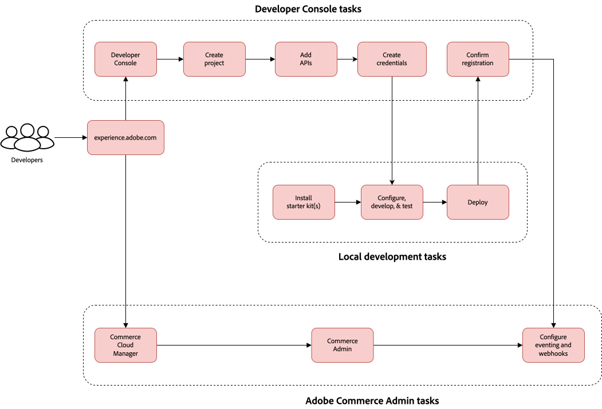

# 快速入门

[!DNL Adobe Commerce as a Cloud Service]提供大部分现成的配置。 完成几个基本设置过程后，您的存储即已启动并立即运行。 本指南将指导您逐步创建和使用实例，并帮助您设置组织以取得成功。 它确保您的团队能够正确访问[!DNL Adobe Commerce as a Cloud Service]以及开始使用所需的工具。

[!DNL Adobe Commerce as a Cloud Service]是一个云原生商务平台，为交付数字商务体验提供了灵活性、可扩展性和效率。 此SaaS产品是一个完全受管、无版本的平台，它提供了无缝升级体验，无需手动干预。

## 关键组件

[!DNL Adobe Commerce as a Cloud Service]包含以下组件：

* **[[!DNL Adobe Experience Cloud]](https://experience.adobe.com/)** — 您位于[!DNL Adobe Commerce]experience.adobe.com[的所有](https://experience.adobe.com/)产品的中心入口点
   * 单击&#x200B;[!UICONTROL **快速访问**]&#x200B;下的&#x200B;[!UICONTROL **Commerce**]&#x200B;以打开Commerce Cloud管理器
* **[[!DNL Commerce Cloud Manager]](https://experience.adobe.com/#/commerce/cloud-service)** — 创建和管理实例，访问API URL和您的Commerce管理员
* **[[!DNL Adobe Admin Console]](https://adminconsole.adobe.com/)** — 管理用户和角色
* **Commerce管理员** — 管理产品、订单、客户和商店配置
* **[店面由 [!DNL Edge Delivery Services]](./storefront.md)**&#x200B;提供支持 — 使用可为商家和开发人员提供卓越速度、SEO和用户体验的可组合的高性能系统，创建和自定义面向客户的店面
* **[[!DNL Adobe Developer App Builder]](https://developer.adobe.com/app-builder/)** — 使用[!DNL App Builder]以及其他可扩展性工具（如[集成入门工具包](https://developer.adobe.com/commerce/extensibility/starter-kit/integration/)和[[!DNL API Mesh]](https://developer.adobe.com/graphql-mesh-gateway/)）构建自定义集成

## 设置和管理

在[!DNL Adobe Commerce as a Cloud Service]设置过程中，您的系统管理员、商家和开发人员将为您的组织配置访问权限和资源，包括配置云资源以及根据用户的职责为其分配适当的角色。

### 设置和管理工作流

作为合并的组，系统管理员、商家和开发人员需要执行以下重要步骤来启动和运行Commerce实例：

1. **所有用户**： [创建实例](#create-an-instance)
1. **系统管理员**： [添加用户和分配角色](user-management.md#add-users-and-admins)
1. **商家**： [访问Commerce管理员](#access-an-instance)并[导入您的目录](#import-your-catalog)
1. **开发人员**： [设置您的店面](storefront.md)并探索[开发人员平台](overview.md#developer-platform)

#### AEM Assets和产品可视化工作流程

需要执行以下步骤才能将[!DNL Adobe Experience Manager Assets]或[!DNL Product Visuals powered by AEM Assets]与[!DNL Adobe Commerce as a Cloud Service]集成：

1. **系统管理员**： [将用户添加到 [!DNL AEM Assets] 和 [!DNL Product Visuals] 产品配置文件](user-management.md#add-a-user-to-aem-assets-or-product-visuals)
1. **开发人员**： [集成 [!DNL AEM Assets] 和 [!DNL Product Visuals]](../aem-assets-integration/overview.md)
1. **商家**： [访问您的 [!DNL AEM Assets] 和 [!DNL Product Visuals]](./user-management.md#access-the-experience-manager-interface)

### 基于角色的设置和管理任务

选择下面的选项卡以查看相应角色的高级别工作流图形：

>[!BEGINTABS]

>[!TAB 系统管理员和商家工作流]

此图表提供了系统管理员和商家如何访问和管理[!DNL Adobe Commerce as a Cloud Service]实例的简要概述。 有关管理员工作流的详细信息，请参阅[Adobe Admin Console指南](https://helpx.adobe.com/cn/enterprise/admin-guide.html)。

{zoomable="yes"}

>[!TAB 开发人员工作流程]

此图提供了开发人员如何使用App Builder为[!DNL Adobe Commerce as a Cloud Service]创建集成的简要概述。 有关详细信息，请参阅[API文档](https://developer.adobe.com/commerce/webapi/rest/)。

{zoomable="yes"}

>[!ENDTABS]

选择您的角色以查找开始设置过程的资源：

>[!BEGINTABS]

>[!TAB 系统管理员]

作为系统管理员，您负责设置组织并管理用户访问权限。

| 任务 | 描述 | 资源 |
|------|-------------|----------|
| 了解平台 | 了解Adobe Commerce as a Cloud Service架构和优势 | [概述](overview.md) |
| 比较功能 | 了解Cloud Service与其他Adobe Commerce产品之间的差异 | [功能比较](feature-comparison.md) |
| 创建实例 | 配置沙盒和生产环境 | [创建实例](#create-an-instance) |
| 设置用户管理 | 添加用户、分配角色和管理权限 | [用户管理](user-management.md) |
| 设置[!DNL AEM Assets]和[!DNL Product Visuals]（可选） | 添加用户、分配角色和管理权限 | [用户管理](user-management.md#add-a-user-to-aem-assets-or-product-visuals) |

>[!TAB 商家]

作为商人，您专注于管理产品、订单和店面内容。

| 任务 | 描述 | 资源 |
|------|-------------|----------|
| 访问实例 | 登录Commerce管理员以管理您的商店 | [访问实例](#access-an-instance) |
| 探索用例 | 了解实际的业务方案和工作流程 | [用例](./use-cases.md) |
| 导入目录 | 了解如何将产品数据导入平台 | [导入您的目录](#import-your-catalog) |
| 访问[!DNL AEM Assets]和[!DNL Product Visuals]（可选） | 访问Experience Manager以开始使用[!DNL AEM Assets]和[!DNL Product Visuals] | [访问Experience Manager界面](./user-management.md#access-the-experience-manager-interface) |

>[!TAB 开发人员]

作为开发人员，您需要了解如何构建自定义集成和扩展平台功能。

| 任务 | 描述 | 资源 |
|------|-------------|----------|
| 了解架构 | 了解平台的可扩展性和API | [概述 — 开发人员平台](overview.md#developer-platform) |
| 设置开发环境 | 创建用于开发和测试的沙盒实例 | [创建实例](#create-an-instance) |
| 构建店面 | 了解如何设置和自定义Commerce店面 | [店面设置](./storefront.md) |
| 配置您的店面 | 了解如何设置店面 | [店面设置](./storefront.md) |
| 浏览集成选项 | 了解您有权访问的App Builder、API Mesh和其他可扩展性工具 | [概述 — 开发人员平台](overview.md#developer-platform) |
| 集成[!DNL AEM Assets]和[!DNL Product Visuals]（可选） | 了解如何将[!DNL AEM Assets]和[!DNL Product Visuals]与[!DNL Adobe Commerce]集成 | [AEM Assets集成](../aem-assets-integration/overview.md) |

>[!ENDTABS]

### 后续步骤

完成特定于角色的设置任务后：

* **系统管理员**：查看[分担的责任](shared-responsibility.md)指南
* **商家**：探索[用例](use-cases.md)以了解常见的业务方案
* **开发人员**：查看[Adobe Commerce开发人员文档](https://developer.adobe.com/commerce/docs)

## Adobe Commerce as a Cloud Service基础知识

以下部分介绍了启动和运行Commerce实例所需完成的基本流程。

### 创建实例

>[!NOTE]
>
>在创建实例之前，贵组织的产品管理员或系统管理员必须将您添加为[!DNL Adobe Commerce as a Cloud Service]产品的用户。 有关详细信息，请参阅[添加用户和管理员](./user-management.md#add-users-and-admins)。

[!DNL Adobe Commerce as a Cloud Service]实例使用基于信用的系统。 您可以创建多个实例，但每个实例都需要可用的积分。 您最初拥有的积分数取决于您的订购。

1. 登录到您的[[!DNL Adobe Experience Cloud]](https://experience.adobe.com/)帐户。

1. 在[!UICONTROL Quick access]下，单击&#x200B;[!UICONTROL **Commerce**]&#x200B;以打开[!UICONTROL Commerce Cloud Manager]。

   [!UICONTROL Commerce Cloud Manager]显示您的Adobe IMS组织中可用的[!DNL Adobe Commerce as a Cloud Service]实例的列表。

1. 单击屏幕右上角的&#x200B;[!UICONTROL **添加实例**]。

   Commerce Cloud Manager中的{width="50%" align="center" zoomable="yes"}

1. 选择&#x200B;[!UICONTROL **Commerce as a Cloud Service**]。

1. 为您的实例输入&#x200B;**名称**&#x200B;和&#x200B;**描述**。

1. 为您的实例选择&#x200B;[!UICONTROL **环境类型**]。 您可以选择以下选项：

   * [!UICONTROL **沙盒**] — 仅用于设计和测试目的。 您应该使用沙盒环境开始[!DNL Adobe Commerce as a Cloud Service]历程。

   >[!NOTE]
   >
   > 沙盒实例仅用于设计和测试目的。 您不应在沙盒环境中使用任何生产数据。
   >
   >沙盒实例仅限于北美地区。

   * [!UICONTROL **生产**] — 适用于实时商店和面向客户的网站。

   >[!NOTE]
   >
   >Adobe Commerce as a Cloud Service的基础设施可在全球范围内使用。 有关您所在地区的生产环境的信息，请联系您的客户服务代表。

1. 选择要托管实例的地区。

   >[!NOTE]
   >
   >创建实例后，您将无法修改区域。

1. 单击&#x200B;[!UICONTROL **添加实例**]。

{{aem-assets-instance-mapping}}

### 访问实例

创建实例后，您可以从[!UICONTROL Commerce Cloud Manager]访问它。

1. 登录到您的[Adobe Experience Cloud](https://experience.adobe.com/)帐户。

1. 在[!UICONTROL Quick access]下，单击&#x200B;[!UICONTROL **Commerce**]&#x200B;以打开[!UICONTROL Commerce Cloud Manager]。

   [!UICONTROL Commerce Cloud Manager]显示您的Adobe IMS组织中可用的实例列表。

1. 要打开某个实例的[!UICONTROL Commerce Admin]，请单击该实例名称。

>[!TIP]
>
>要查看有关实例的信息(包括REST和GraphQL端点以及管理员URL)，请单击实例名称旁边的信息图标。

管理员和端点的基本URL因地区和环境而异，使用以下模式：

* 管理员
   * 北美生产管理员： `https://na1.admin.commerce.adobe.com`
   * 北美沙盒管理员： `https://na1-sandbox.admin.commerce.adobe.com`
   * 欧洲生产管理员： `https://eu1.admin.commerce.adobe.com`
* REST和GraphQL
   * 北美生产GraphQL： `https://na1.api.commerce.adobe.com`
   * 北美沙盒GraphQL： `https://na1-sandbox.api.commerce.adobe.com`
   * 欧洲生产GraphQL： `https://eu1.api.commerce.adobe.com`

### 导入您的目录

默认情况下，[!DNL Adobe Commerce as a Cloud Service]实例不包含任何产品数据。 在导入您自己的目录之前，为测试和学习目的创建实例时，您可以选择包含示例产品数据。

有两种方法可以将您的目录导入[!DNL Adobe Commerce as a Cloud Service]：

* [**Commerce管理员**](https://experienceleague.adobe.com/zh-hans/docs/commerce-admin/systems/data-transfer/import/data-import) — 一个用户友好的界面，允许您通过单击几下导入目录数据。
* [**导入JSON API**](https://developer.adobe.com/commerce/webapi/rest/modules/import/#import-json-api) — 一个REST API，允许您以编程方式导入目录数据。

### 设置店面

现在您已经创建了实例，可以[设置由](storefront.md)提供支持的店面[!DNL Edge Delivery Services]。

## 其他资源

* [发行说明](release-notes.md)
* [迁移指南](migration/overview.md)
* [Commerce Storefront文档](https://experienceleague.adobe.com/developer/commerce/storefront/?lang=zh-Hans)
