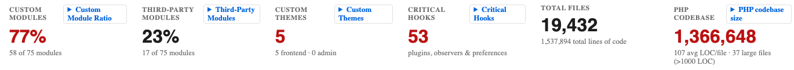
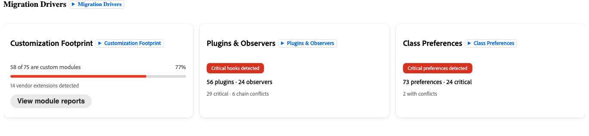
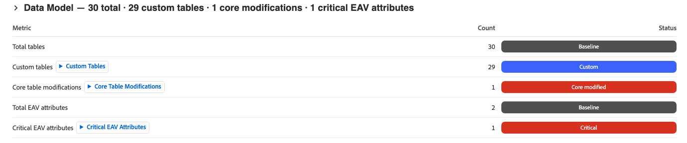
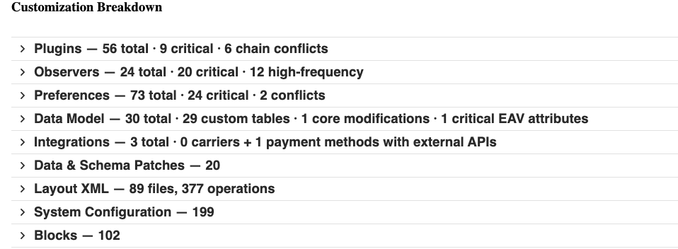

# 迁移评估工具

>[!IMPORTANT]
>
> 迁移评估仅在将[!DNL Adobe Commerce on Cloud Infrastructure]或[!DNL Adobe Commerce on-premises]项目迁移到[!DNL Adobe Commerce as a Cloud Service]时可用。

Commerce迁移评估是对您现有Adobe Commerce实施情况的自动分析。 Adobe的工具会扫描您的Commerce代码库，并生成一个结构化报表，其中清点所有已构建、自定义或修改的内容。 然后，该报告将指示对代码库所做的自定义对迁移到[!DNL Adobe Commerce as a Cloud Service]有何影响。

处理完您的代码库后，评估报告将链接到您的IMS组织ID并共享到[!DNL Adobe Experience Cloud]。 不需要访问生产环境，除非最初共享项目代码库。

IMS组织的任何成员都可以在https://experience.adobe.com/commerce-migration-assessment/shared-assessments上查看共享评估。

>[!NOTE]
>
> 您必须使用与用于迁移评估的同一IMS组织链接的用户配置文件登录到Adobe Experience Cloud，才能查看共享报告。

**评估提供：**

- 按类型和影响级别组织的商店中每个自定义模块的完整清单
- 根据风险预测指标计算的迁移复杂性评级（高、Medium或低）
- 需要规划迁移的最具影响力的后端和店面区域的优先级视图
- 每个自定义模块的描述，可将其用作Adobe AI开发人员工具的直接输入

## 访问迁移评估

Adobe将完成的迁移评估连接到您组织的Adobe IMS组织。 一旦连接了评估，该组织中的任何用户都可以在https://experience.adobe.com/commerce-migration-assessment/shared-assessments上访问报告。

## 了解迁移评估报告

报告分为三个选项卡： **[!UICONTROL Summary]**、**[!UICONTROL Module Reports]**&#x200B;和&#x200B;**[!UICONTROL Report Reliability]**。

>[!NOTE]
>
>并非报告的所有部分都适用于每个商店。 该评估旨在全面评估所有可能的自定义类型和复杂性驱动因素，但您的商店只有此处列出的部分子集。

## “摘要”选项卡

“**[!UICONTROL Summary]**”选项卡概述了按以下区域组织的关键信号：

- 迁移复杂性
- 文件类型划分
- 影响最大的模块
- 迁移驱动因素
- 自定义细分

### 迁移复杂性

迁移复杂性部分包含对存储整体的评估评级。 它解释了得分的计算方式，并强调了您的主要风险驱动因素。

**迁移复杂性和复杂性分数**

{width="600" zoomable="yes"}

复杂性分数根据迁移的难度对每个输入进行加权。 得分映射到使用固定阈值的迁移复杂性评级：

| 评级 | 得分范围 | 典型的迁移方法 |
| --- | --- | --- |
| 低 | 150或以下 | 标准迁移 — 通过支付提供商协调实现直接迁移，并将数据迁移作为并行工作流。 |
| Medium | 151-375 | 模块化迁移 — 在区段中迁移，分类高影响力的自定义模块。 |
| 高 | 375以上 | 分阶段移徙，可能持续12-24个月。 |

**自定义模块比率**

{width="600" zoomable="yes"}

专门为您的实施构建的模块的百分比。 更高的比率意味着必须审核和迁移更多的自定义代码。 客户的自定义模块平均比率约为62%。

>[!TIP]
>
>自定义模块比率是范围信号，而不是复杂性信号。 与具有40%高风险自定义模块的存储相比，具有80%的隔离低风险自定义模块的存储更容易迁移。 使用复杂性分数和链冲突数来评估难度。 使用“自定义模块比率”来估算数量。

**文件类型划分**

{width="600" zoomable="yes"}

代码库中按类型组织的文件数列表。

**影响最大的模块**

{width="600" zoomable="yes"}

存储中需要最关注迁移的特定模块的策划列表。 这些模块通常是与结账、支付或订单管理交互的模块。 每个高影响力的模块都需要自己的迁移计划。 此列表是与您的技术团队进行对话的最佳起点。

### 店面复杂性

{width="600" zoomable="yes"}

店面复杂性部分介绍了迁移店面的前端展示层所需的工作。 此工作流是与后端代码迁移截然不同的工作流，由前端开发人员解决，通常需要单独的规划对话。

>[!NOTE]
>
>存储可能具有低后端复杂性和高存储前端复杂性。 在设定迁移工作范围之前，请务必查看这两个部分。

- 自定义主题 — 商店自定义主题的命名空间（例如，BrandName_Theme）。 自定义主题的存在意味着[!DNL Adobe Commerce as a Cloud Service]需要完整主题重建。 每个具有自定义主题命名空间的评估存储都必须规划一个专用的前端迁移工作流。

- 总块数 — 存储中的块和模板(.phtml)文件的数量。 块是主要的服务器端渲染构件，每个构件代表一个离散的迁移任务。

| 块计数 | 投入 |
| --- | --- |
| 100以下 | 基线 — 标准工作 |
| 100-300 | Medium — 计划结构化的前端浪潮 |
| 超过300 | 高 — 作为专用工作流排定优先级 |

### 迁移驱动因素

{width="600" zoomable="yes"}

“迁移驱动程序”部分显示驱动复杂性评定的主要因素。

| 驱动程序 | 定义 |
| --- | --- |
| 定制占用空间 | 自定义代码相对于总体实施的整体数量 |
| 插件和观察程序 | 在运行时截获核心平台行为的代码 |
| 类首选项 | 一种脆弱的自定义模式，它完全替换核心类，在升级时静默中断 |
| 数据模型 | 自定义和修改的数据库结构 |
| 集成 | 连接到商店的外部系统 |

每个驱动程序均显示为“高”、“Medium”或“低”工作量。 在设定范围和规划时，首先解决评级最高的驱动程序问题。

### 数据模型

{width="600" zoomable="yes"}

“数据模型”部分显示自定义表的计数、对[!DNL Adobe Commerce]核心数据库表的修改以及关键实体属性值(EAV)属性。

核心表修改是最难迁移的类别，因为它们会创建对特定平台架构版本的依赖关系，并且对于复杂性分数公式影响较大。

>[!TIP]
>
>如果您的报表列出了15项以上的核心表修改，请在设定后端模块迁移的范围之前规划一个专用数据迁移工作流。

## 自定义细分

{width="600" zoomable="yes"}

“自定义细分”部分提供了您的商店中每个自定义类别的详细量度。

>[!NOTE]
>
>并非所有子部分都会显示在每个报表中，而是仅显示代码库中检测到的类别。
>
>影响前端表示层的子部分是与后端代码迁移不同的工作流，通常需要单独的Planning对话。
>
>存储可能具有低后端复杂性和高前端复杂性。 在规划迁移工作范围之前，请始终查看后端和店面相关的子部分。

### 布局XML

布局XML文件的数量及其总操作计数。 布局XML定义每个页面的结构，包括出现的块、它们出现的容器以及它们所属的页面类型。

文件数量多，操作繁多，表明必须重新构建重要的页面结构自定义。

### 核心句柄覆盖

布局XML覆盖核心[!DNL Adobe Commerce]页面句柄的地点数（例如，`checkout_cart_index`或`catalog_product_view`）。 核心句柄覆盖是风险最高的布局信号，因为它们会在平台级别修改页面结构，并且需要明确重建。

| 覆盖计数 | 投入 |
| --- | --- |
| 0 | 无核心布局覆盖 |
| 1-3 | 运行时风险 — 每个覆盖都需要显式重建布局 |
| 4个或更多 | 关键 — 规划专用布局迁移冲刺 |

### 个块

存储中的块和模板(`.phtml`)文件的数量。 块是主要的服务器端渲染构件。 每个块代表一个离散的迁移任务。

| 块计数 | 投入 |
| --- | --- |
| 100以下 | 基线 — 标准工作 |
| 100-300 | Medium — 计划结构化的前端浪潮 |
| 超过300 | 高 — 作为专用工作流排定优先级 |

### 高风险块

接触核心渲染路径的块，例如结帐渲染、购物车显示和类似的前端表面。 任何高风险块在计划之前都需要进行单独的迁移评估。

### 主题和电子邮件模板

商店自定义主题的命名空间（例如，`BrandName_Theme`）。 自定义主题的存在意味着需要重建完整主题。 每个具有自定义主题命名空间的评估存储都必须规划一个专用的前端迁移工作流。

### 模板覆盖（修改了核心）

已覆盖的核心[!DNL Adobe Commerce] `.phtml`模板数。 每个核心模板覆盖都会创建对该模板特定版本的依赖关系。 平台更新可更改模板以静默方式中断覆盖。

### 需要插入式迁移

[!DNL Adobe Commerce as a Cloud Service]对店面使用模块化插入组件架构，包括结帐、购物车和产品详细信息。 必须将这些曲面的定制作为放置元件重新构建。 这些自定义可涵盖广泛的功能，例如添加自定义结账步骤、修改购物车显示逻辑或扩展产品详细信息页面。

[!UICONTROL Drop-in migration required]字段指示哪些店面区域需要插入式重建。

>[!IMPORTANT]
>
>如果&#x200B;**签出**&#x200B;被列为放入迁移要求，请规划一个专用的签出放入工作流。 此任务是最复杂的、对业务至关重要的店面迁移任务。

## “模块报表”选项卡

{width="600" zoomable="yes"}

**[!UICONTROL Module Reports]**&#x200B;选项卡包含商店中每个自定义模块的专用条目。 与您的技术团队共享此信息。

对于每个模块，报表均会显示：

| 字段名称 | 定义 |
| --- | --- |
| 作用 | 自定义模块的用途和业务功能的描述 |
| 影响级别 | 根据模块处理的商业行为，**高**、**Medium**&#x200B;或&#x200B;**低**&#x200B;影响 |
| 挂接计数 | Webhook的数量，表示此模块拦截核心平台行为的位置数 |
| 迁移推荐 | **重新生成**，**重构**，**使用本机功能替换**，或&#x200B;**删除** |
| 依赖关系 | 此模块与哪些其他模块交互，可以告知迁移排序 |

打开模块的划分以查看其完整详细信息。 包含&#x200B;**重新生成**&#x200B;迁移建议的模块包含一个&#x200B;**[!UICONTROL Open in Developer Agent]**&#x200B;按钮，该按钮可将模块的描述直接复制到[Commerce开发人员代理](https://developer.adobe.com/commerce/extensibility/developer-agent/)中，以便您立即为替换扩展生成Blueprint。

**工作流**

1. 首先筛选到&#x200B;**高影响**&#x200B;模块。 这些带来了最大的迁移工作量和成本。
1. 对于每个自定义模块，请确定以下问题的答案：
   - 是否仍在积极使用此模块？
   - 能否将模块替换为本机[!DNL Adobe Commerce as a Cloud Service]功能？
   - 如果必须重新构建模块，其替换需要提供什么功能？
1. 确定可以弃用或替换的自定义模块。 在写入任何代码之前，每个代码都会缩小迁移范围。
1. 对于具有&#x200B;**重新生成**&#x200B;迁移建议的每个自定义模块，您可以：
   - 单击&#x200B;**[!UICONTROL Open in Developer Agent]**&#x200B;以生成Blueprint，或使用Commerce开发人员代理复制模块描述。
   - 使用&#x200B;**重新生成**&#x200B;迁移建议复制每个自定义模块的说明。 这些描述可以直接提供给Adobe的AI开发人员工具，有关详细信息，请参阅[用于Commerce扩展性的AI开发人员工具](#ai-developer-tools-for-commerce-extensibility)。

## 参考：关键术语

| 术语 | 定义 |
| --- | --- |
| **模块** | 一个自定义、自包含的功能包。 您的商店可能包含从二十个模块到数百个模块的任意位置。 |
| **插件（拦截器）** | 拦截Commerce函数并更改其行为之前、期间或之后的代码。 |
| **观察者** | 监听特定平台事件（如“下订单”）并在触发该事件时运行自定义逻辑的代码。 |
| **首选项（类覆盖）** | 一种脆弱的自定义类型，可完全替换核心Commerce类，当平台升级该类时，该类会静默中断。 |
| **链冲突** | 当两个或多个插件拦截同一函数时，其中一个插件无法将控件传递到下一个插件。 这可能会导致功能以静默方式停止工作，并且不会出现错误消息。 |
| **核心表修改** | 对Commerce的内置数据库表进行结构性更改，这将对特定平台模式版本产生不可逆的依赖关系。 这些参数具有复杂度分数公式中最高的权重。 |
| **实体属性值(EAV)** | 添加到产品或客户的灵活自定义字段，例如，自定义“保修期”字段。 高EAV数量会增加数据迁移的复杂性。 |
| **挂接密度** | 每个模块的插件和观察程序平均数。 密度越高，客户定制就越紧密地交织在核心平台中。 |
| **放置位置** | [!DNL Adobe Commerce's]个用于店面组件的模块化方法（包括结帐、购物车和产品详细信息页面）。 [!DNL Adobe Commerce on Cloud Infrastructure]或[!DNL Adobe Commerce on Premises]上的自定义签出行为通常需要[!DNL Adobe Commerce as a Cloud Service]上的放置重新生成。 |
| **App Builder** | Adobe的进程外可扩展性平台，以及构建自定义功能（替换进程内PHP扩展）的推荐方法。 |
| **布局XML** | 定义哪些块显示在哪些页面上的配置文件。 必须为[!DNL Adobe Commerce as a Cloud Service's]页面结构重新设计自定义布局XML。 |
| **核心句柄覆盖** | 版面XML自定义，可全局修改核心Commerce页面结构。 它们具有迁移风险最高的布局模式。 |

## 用于Commerce可扩展性的AI开发人员工具

您可以使用&#x200B;**[!UICONTROL Module Reports]**&#x200B;选项卡中的模块描述作为Adobe AI开发人员工具的提示。 该工具可帮助您构建和部署与[!DNL Adobe Commerce as a Cloud Service]兼容的替换扩展。

### 工具提供的功能

Adobe的[用于Commerce可扩展性的AI开发人员工具](https://developer.adobe.com/commerce/extensibility/developer-agent/coding-tools/)包含两个主要功能。

- [!DNL Adobe Commerce] [!DNL App Builder] MCP服务器 — 模型上下文协议(MCP)集成，用于将AI编码助理直接连接到[!DNL Adobe Commerce]文档、API和App Builder开发模式。 开发人员可以描述他们要构建的内容，MCP服务器在IDE中提供了可感知Commerce的代码生成、架构指导和部署自动化。
- 代理技能 — 预建的人工智能技能，涵盖常见的Commerce可扩展性模式，如REST API、签出扩展、店面组件和事件驱动集成。 技能可指导AI完成特定于[!DNL Adobe Commerce as a Cloud Service]和[!DNL App Builder]的架构、实施、测试和部署步骤。

#### 安装AI工具

有关完整说明和特定IDE配置，请参阅[安装AI开发人员工具](https://developer.adobe.com/commerce/extensibility/developer-agent/coding-tools)。

**先决条件：** Node.js 22.x、npm 9.0.0或更高版本、Adobe I/O CLI。

安装命令：

```bash
aio commerce extensibility tools-setup
```

### 从评估报告中创建提示

虽然评估为您提供了开发蓝图，但AI工具允许您的团队在最终确定完整迁移计划之前立即开始构建。

1. 打开&#x200B;**[!UICONTROL Module Reports]**&#x200B;选项卡并找到具有&#x200B;**重新生成**&#x200B;推荐的高影响力模块。
1. 阅读模块的描述，例如：

```shell-session
Manages custom shipping rate calculations based on customer account tier and order    weight thresholds.
```

1. 单击&#x200B;**[!UICONTROL Open in Developer Agent]**&#x200B;以将描述复制到[!DNL Commerce Developer Agent]中并立即生成Blueprint。

   或者，打开您的IDE，例如GitHub Copilot、Cursor或Claude，并启用Commerce可扩展性MCP服务器，然后使用模块描述手动提示AI代理。

1. 查看基架[!DNL App Builder]应用程序并与代理迭代以优化实施。

## 后续步骤

1. 打开&#x200B;**[!UICONTROL Summary]**&#x200B;选项卡。 查看迁移复杂性和影响最大的模块，然后查看自定义细分子部分。 如果您的商店有自定义主题、高风险块或列出了签出放置项，请与后端迁移一起规划一个并行前端工作流。
1. 与您的技术团队或开发合作伙伴共享&#x200B;**[!UICONTROL Module Reports]**&#x200B;选项卡。 要求他们标记任何不再主动使用或可由[!DNL Adobe Commerce as a Cloud Service]功能替换的自定义模块。
1. 开始构建自定义项。 在&#x200B;**模块报表**&#x200B;选项卡上，打开任意模块划分并选择&#x200B;**在开发人员代理中打开**，以直接从该模块的评估数据中开始构建兼容的扩展。
1. 安排与您的Adobe客户团队进行演练通话。 Adobe可与您一起查看调查结果，回答有关特定模块和店面信号的任何问题，并帮助您根据复杂性配置文件制定迁移方法。

## 资源

- [!DNL Adobe Commerce as a Cloud Service]
  - [概述](../overview.md)
  - [迁移概述](./overview.md)
  - [评级扩展教程](../tutorials/ratings-extension.md)
  - [配送方法教程](../tutorials/shipping-method-extension.md)
- 可扩展性
  - [概述](https://developer.adobe.com/commerce/extensibility/)
  - [AI开发人员工具](https://developer.adobe.com/commerce/extensibility/developer-agent/coding-tools/)
    - [最佳实践](https://developer.adobe.com/commerce/extensibility/developer-agent/best-practices)
    - [设置](https://developer.adobe.com/commerce/extensibility/developer-agent/coding-tools)
    - [技能和提示](https://developer.adobe.com/commerce/extensibility/developer-agent/skills-and-prompts)
    - [用例](https://developer.adobe.com/commerce/extensibility/developer-agent/use-cases)
  - [App Builder概述](https://developer.adobe.com/app-builder/docs/intro_and_overview/)
  - [适用于Adobe Commerce的App Builder](https://experienceleague.adobe.com/en/docs/commerce-learn/tutorials/extensibility/adobe-developer-app-builder/introduction-to-app-builder)
  - 入门工具包
    - [后端集成入门工具包](https://developer.adobe.com/commerce/extensibility/starter-kit/integration/)
    - [结账入门工具包](https://developer.adobe.com/commerce/extensibility/starter-kit/checkout/)
- 店面开发
  - [概述](https://experienceleague.adobe.com/developer/commerce/storefront/)
  - [店面人工智能技能](https://experienceleague.adobe.com/developer/commerce/storefront/boilerplate/ai-agent-skills/)

>[!TIP]
>
>请联系您的解决方案客户经理，以请求对您的现有实例进行迁移评估。
