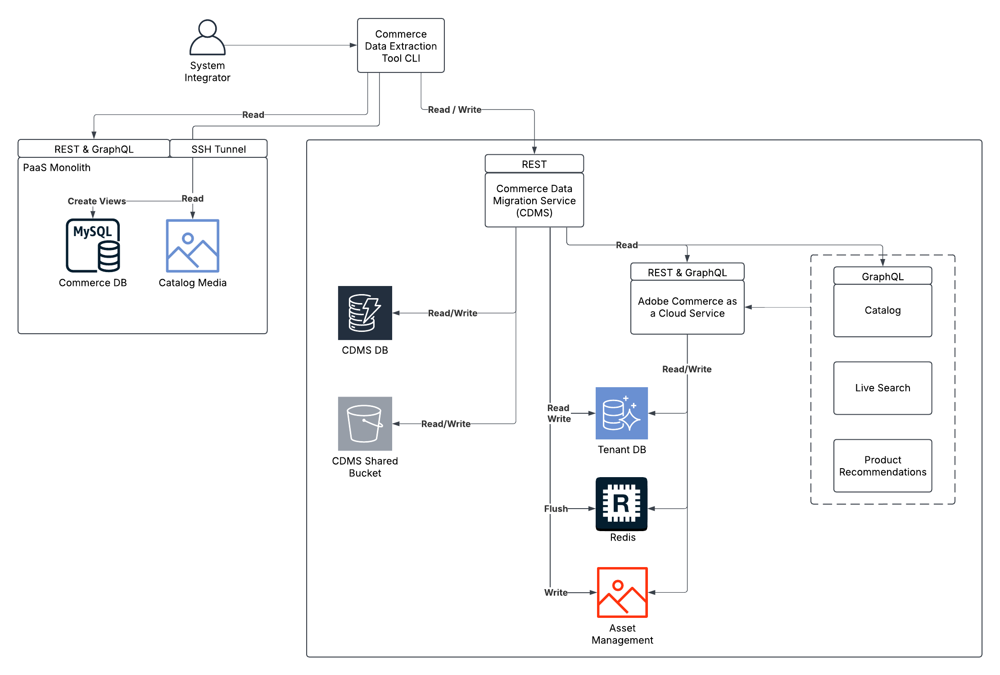

# 批量数据迁移工具

批量数据迁移工具遵循分布式架构，支持从PaaS环境到SaaS环境的安全高效数据迁移。 此工具专为解决方案实施人员设计用于将数据从云实例上的现有Adobe Commerce (PaaS)迁移到[!DNL Adobe Commerce as a Cloud Service] (SaaS)。 有关迁移过程的详细信息，请参阅[迁移概述](./overview.md)。

>[!NOTE]
>
>批量数据迁移工具仅支持迁移第一方核心商务数据。 当前不支持自定义数据迁移。

下图详细介绍了用于批量数据迁移工具的架构和关键组件。



## 迁移工作流

批量数据迁移工作流包含以下步骤：

1. 为迁移设置新环境。
1. 从旧系统复制数据。
1. 将数据移动到新系统中。
1. 使您的产品目录在新系统中可用。
1. 确认您的数据已正确迁移。

以下各节详细介绍了这些步骤。

## 访问批量数据迁移工具

批量数据迁移工具的可用性如下：

- **2025年第4季度**（尚不可用） — 在首次发布批量数据迁移工具后，您可以通过提交支持票证来访问它。
- **2025年第4季度**（尚不可用） — 在公共发布批量数据迁移工具后，可从此页面访问该工具。

## 创建目标环境

解决方案实施人员(SI)为迁移创建目标环境。 此环境用于存储从源实例迁移的数据。

首先，[创建一个新的 [!DNL Adobe Commerce as a Cloud Service] (SaaS)实例](../getting-started.md#create-an-instance)。

### 配置提取工具

提取工具用于从源实例中提取数据。

1. 从Adobe提供给您的链接下载提取工具。
1. 在提取工具中设置以下环境变量：
   - 到现有MySQL数据库的连接详细信息
   - [!DNL Adobe Commerce as a Cloud Service]实例的目标租户ID
   - 您的IMS凭据，包括：
      - 客户端ID
      - 客户端密码
      - IMS范围
      - IMS URL — 基本URL。 例如，`https://ims-na1.adobelogin.com/`。
      - IMS组织ID

   对于IMS范围和其他值，请在&#x200B;**Adobe Developer Console**&#x200B;的项目的[凭据](https://developer.adobe.com/console/)分区中选择您的OAuth类型。 提取工具所包含的`.example.env`文件中提供了更多信息。

### 提取数据

在运行提取工具之前，解决方案实施人员必须使用以下内容建立到PaaS数据库的SSH通道：

```bash
magento-cloud tunnel:open
```

然后运行提取工具，该工具将：

1. 连接到PaaS数据库，分析其架构，并将其与SaaS租户架构详细信息进行比较。
1. 根据PaaS和SaaS之间的公共架构元素生成提取和转换计划。
1. 使用目录数据管理服务(CDMS)提取数据。

### 加载数据

运行Adobe提供的加载数据工具。 此工具将：

1. 使用迁移帐户连接到SaaS租户数据库。
1. 生成加载计划。
1. 执行计划，批量将数据移动到SaaS租户数据库。
1. 处理目录媒体并将其传输到目标环境。
1. 刷新SaaS Redis缓存并使租户的数据库索引无效。

### 目录数据摄取

数据加载后，目录数据会自动从SaaS租户数据库流向目录服务。

目录服务会与实时搜索和产品推荐共享此数据。 此过程不需要手动干预。 一旦摄取完成，数据将可用于所有服务。

### 数据完整性验证

迁移后，CDMS会执行以下自动数据完整性检查，以确保迁移数据的准确性和完整性：

**基于API的验证**

在验证期间，CDMS将来自先前运行查询的REST和GraphQL API响应与来自目标实例的相应记录进行比较。 任何差异都将显示在迁移状态中。

**数据库级别验证**

在验证期间，CDMS计算提取的记录数，并将该数量与加载的记录数进行比较。

**按需验证（可选）**

您还可以手动触发对所有系统记录的全面验证：

>[!NOTE]
>
>此进程需要大量资源，应当仅在沙盒环境中使用。

全面验证包括：

- 使用所有预提取的REST和GraphQL API响应完成基于API的验证
- 发现的任何不一致的详细报告
