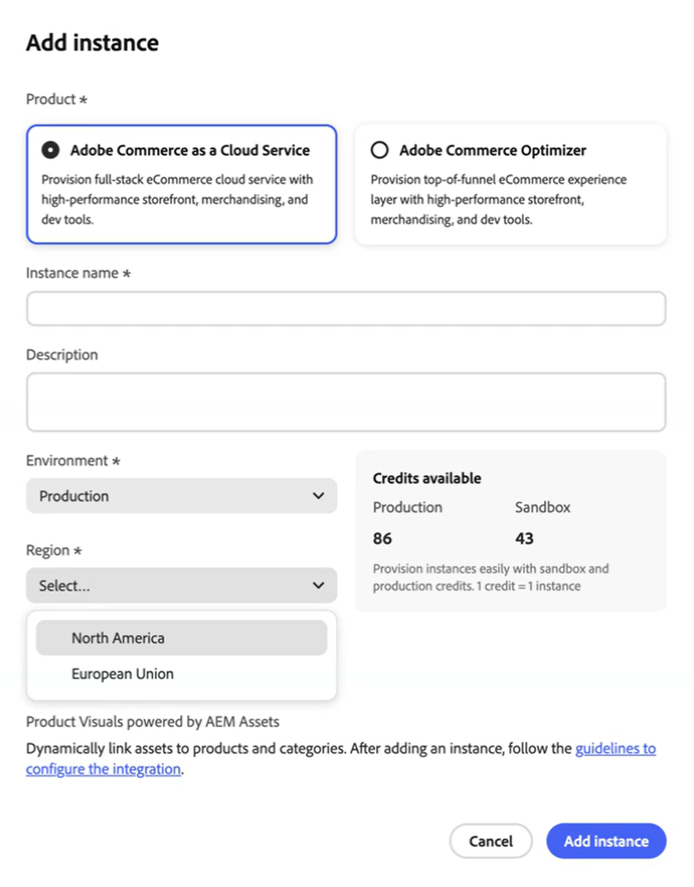

# 发行说明

以下发行说明包含[!DNL Adobe Commerce as a Cloud Service]的更新。 有关其他产品的发行信息，请参阅[Adobe Commerce Optimizer](../optimizer/release-notes.md)或[Adobe Commerce内部部署和Adobe Commerce on Cloud](https://experienceleague.adobe.com/en/docs/commerce-operations/release/notes/overview)。

## 2025年8月

**发行日期**：2025年8月28日

>[!BEGINSHADEBOX]

### 欧盟地区现已推出

欧盟地区(eu1)对客户IMS组织的支持现已可用。 在Cloud Manager中&#x200B;**添加Commerce SaaS实例**&#x200B;时，您现在可以选择&#x200B;**欧盟**&#x200B;作为[地区](./getting-started.md#create-an-instance)。 欧盟区域仅适用于生产环境。

欧盟区域的基本生产URL包括：

* 管理员： `https://eu1.admin.commerce.adobe.com`
* REST和GraphQL： `https://eu1.api.commerce.adobe.com`

{width="600" align="center" zoomable="yes"}

>[!ENDSHADEBOX]
