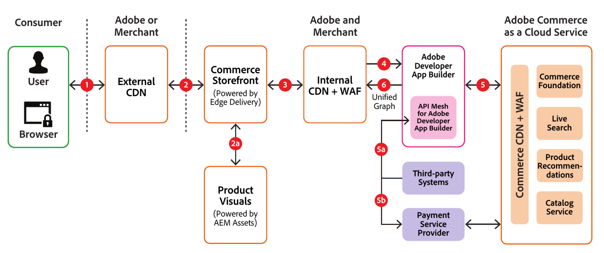

# 安全架构和数据流

以下示例说明数据通常如何在[!DNL Adobe Commerce as a Cloud Service]中流动：

## 数据流描述

**步骤1**：购物者在其浏览器中键入商户店面的URL，该URL将发送到Commerce店面的内容交付网络（外部CDN）。

**步骤2**：如果已缓存网站URL，则Storefront CDN会将其返回给购物者。 如果尚未缓存（如果这是第一个资源请求，则可能会发生这种情况），则外部CDN会将购物者的请求转发到内部CDN，并缓存后续请求的响应。

**步骤2a**：如果请求是针对图像或视频的，则它会发送到[!DNL Product Visuals]以进行履行并返回店面。

**步骤3**：如果站点URL缓存在内部CDN上，则会从该缓存返回。 如果不存在，则将其发送到[!DNL API Mesh]，并为后续请求缓存响应。

**步骤4**： [!DNL API Mesh]充当业务流程层，并决定是向[!DNL Adobe Commerce as a Cloud Service]还是向第三方系统发送请求以完成该请求。

>[!NOTE]
>
>只有在自定义了网格配置的情况下，[!DNL API Mesh]才会向第三方系统发送请求。

**步骤5**：发送给[!DNL Adobe Commerce as a Cloud Service]的请求将通过Web应用程序防火墙(WAF)阻止可疑或恶意请求。 如果所请求的URL缓存在[!DNL Commerce] CDN中，则会从该缓存中传送该URL。 如果未缓存，则从一项或多项[!DNL Adobe Commerce as a Cloud Service]微服务（例如foundation、search和recommendations）返回它，然后缓存以供将来请求使用。

**步骤5a**：如果将请求发送到第三方系统，则将返回响应[!DNL API Mesh]。

**步骤5b**：如果请求用于付款处理，则付款提供商会在店面中呈现iframe，以便购物者安全地输入信用卡信息并完成付款交易。

**步骤6**：[!DNL API Mesh]收到来自[!DNL Adobe Commerce as a Cloud Service]或第三方服务的响应后，这些响应将拼合到一个统一的图形中，并返回到[!DNL Commerce Storefront]以服务购物者的请求。
