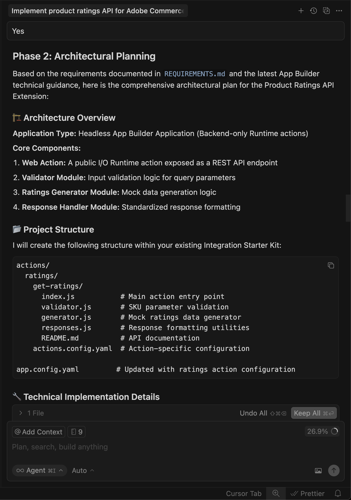
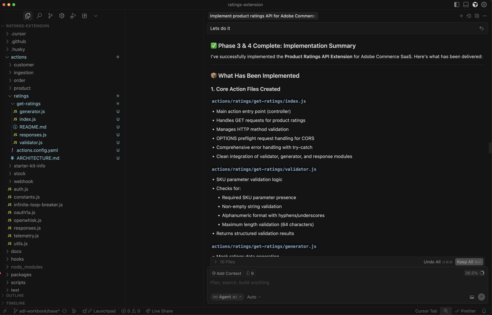
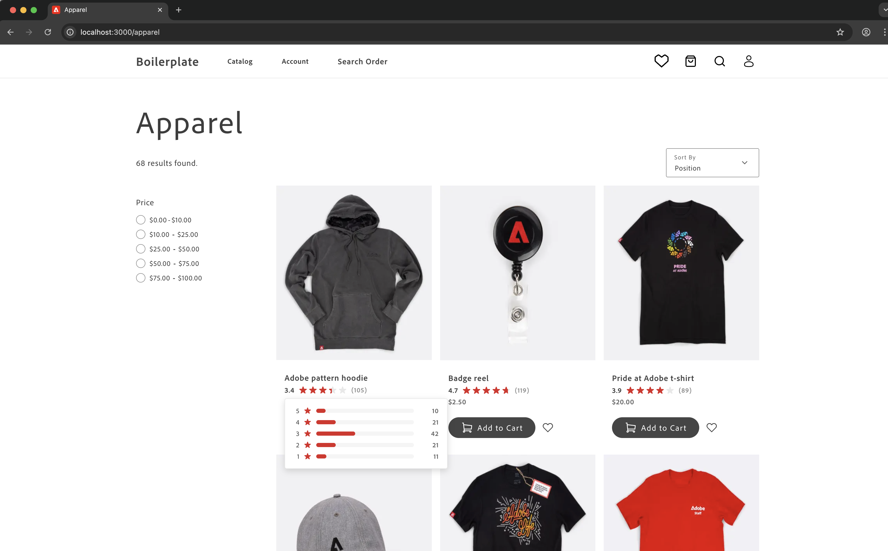

# 评级扩展教程

本教程将指导您使用[!DNL Adobe Commerce as a Cloud Service]和AI辅助开发工具为[!DNL Adobe App Builder]构建产品评级扩展。

在开始之前，请完成[先决条件](./tutorial-prerequisites.md)。

## 验证先决条件

验证是否安装了以下必备组件：

```bash
# Check Node.js version (should be 22.x.x)
node --version

# Check npm version (should be 9.0.0 or higher)
npm --version

# Check Git installation
git --version

# Check Bash shell installation
bash --version
```

如果前面的任何命令未返回预期结果，请参阅[先决条件](./tutorial-prerequisites.md)获取指导。

## 扩展开发

此部分将指导您使用AI辅助开发工具为Adobe Commerce as a Cloud Service开发评级扩展。

1. 导航到&#x200B;**[!UICONTROL Cursor]** > **[!UICONTROL Settings]** > **[!UICONTROL Cursor Settings]** > **[!UICONTROL Tools & MCP]**，并验证`commerce-extensibility`工具集是否已启用且未出现错误。 如果看到错误，请关闭和打开工具集。

   {width="600" zoomable="yes"}

   >[!NOTE]
   >
   >使用人工智能辅助开发工具时，预期代码和代理生成的响应会发生自然变化。
   >如果您遇到任何代码问题，始终可以请求代理帮助您对其进行调试。

1. 禁用光标上下文中的任何文档：

   * 导航到&#x200B;**[!UICONTROL Cursor]** > **[!UICONTROL Settings]** > **[!UICONTROL Cursor Settings]** > **[!UICONTROL Indexing & Docs]**&#x200B;并删除列出的任何文档。

   {width="600" zoomable="yes"}

1. 为产品评级扩展生成代码：
   * 从Cursor chat窗口中，选择&#x200B;**[!UICONTROL Agent]**&#x200B;模式。
   * 输入以下提示：

   ```shell-session
   Implement an Adobe Commerce as a Cloud Service extension to handle Product Ratings.
   
   Implement a REST API to handle GET ratings requests.
   
   GET requests will have to support the following query parameters:
   
   sku -> product SKU
   ```

   >[!NOTE]
   >
   >如果代理请求搜索文档，请允许搜索。

1. 准确地回答座席的问题以帮助其生成最佳代码。

   {width="600" zoomable="yes"}

   {width="600" zoomable="yes"}

1. 使用以下示例文本回答座席的问题，以设置随机评级数据：

   ```shell-session
   Yes, this headless extension is for Adobe Commerce as a Cloud Service storefront,
   but we do not need any authentication for the GET API because guest users should be able to use it on the storefront.
   
   This extension is called directly from the storefront, no async invocation, such as events or webhooks, is required.
   
   Start with just the GET API for now, we will implement other CRUD operations at a later time.
   
   We do not need a DB or storage mechanism right now, just return random ratings data between 1 and 5 and a ratings count between 1 and 1000.
   
   The API should only return the average rating for the product and the total number of ratings.
   We do not need to add tests right now.
   ```

   代理将创建一个`requirements.md`文件，用作实现的真实来源。

   AI代理创建的{width="600" zoomable="yes"}

1. 查看`requirements.md`文件并验证计划。

   如果一切看起来都正确，请指示代理移至&#x200B;**阶段2 — 架构计划**。

1. 查看体系结构计划。

1. 指示代理继续生成代码。

   代理程序会生成必要的代码并提供详细的摘要，其中包含后续步骤。

   {width="600" zoomable="yes"}

   {width="600" zoomable="yes"}

   {width="600" zoomable="yes"}

### 在本地测试扩展

以下步骤介绍了如何在部署扩展之前验证扩展的工作原理。

1. 请求代理帮助您在本地测试代码。

   ```shell-session
   Test the ratings API locally on a dev server using cURL.
   ```

1. 按照代理的说明操作，并确认API在本地工作。

   用于本地API测试的{width="600" zoomable="yes"}

   {width="600" zoomable="yes"})

### 部署扩展

使用代理将扩展部署到[!DNL Adobe I/O Runtime]。

1. 验证生成的代码后，使用以下提示部署扩展：

   ```shell-session
   Deploy the ratings API.
   ```

   代理在部署之前执行部署前就绪性评估。

   {width="600" zoomable="yes"}

1. 如果对评估结果有信心，请指示代理继续部署。

   代理使用MCP工具包自动验证、构建和部署。

   {width="600" zoomable="yes"}

### 验证部署

在将API集成到店面之前对其进行测试。 代理应提供新操作的位置和测试策略。

具有已部署的操作URL和测试命令的{width="600" zoomable="yes"}

您还可以在终端中使用cURL手动测试API：

```bash
curl -s "https://<your-site>.adobeioruntime.net/api/v1/web/ratings/ratings?sku=TEST-SKU-123"
```

{width="600" zoomable="yes"}

### 与Edge Delivery Services集成

要将评级API与由[!DNL Adobe Commerce]提供支持的[!DNL Edge Delivery Services]店面集成，请要求代理创建具有评级API要求的服务合同：

```shell-session
Create a service contract for the ratings api that I can pass on to the storefront agent. Name it RATINGS_API_CONTRACT.md
```

{width="600" zoomable="yes"}

{width="600" zoomable="yes"}

返回终端并在`extension`文件夹中运行以下命令，以将合同文件复制到`storefront`文件夹：

```bash
cp RATINGS_API_CONTRACT.md ../storefront
```

## 连接到店面

此部分将指导您使用[!DNL Edge Delivery Services]和AI辅助开发工具实施评级扩展的storefront部分。

>[!NOTE]
>
>提供的提示是起点。 虽然您可以不修改这些模板就加以使用，但可以考虑与代理进行自然对话。
>
>在使用人工智能辅助开发工具时，代理生成的代码和响应始终存在自然变化。
>
>如果您遇到任何代码问题，请要求代理帮助您对其进行调试。

### 店面先决条件

在开始店面集成之前，请验证您是否具备以下条件：

* 店面项目已连接到您的[!DNL Commerce]实例
* 使用CLI安装的Commerce storefront AI工具[](./tutorial-prerequisites.md#install-the-storefront-ai-tools)

### 设置店面工作区

准备本地店面环境以进行开发。

1. 导航到`storefront`文件夹：

   ```bash
   cd storefront
   ```

1. 在新的“光标”窗口中打开店面文件夹。

   或者，如果您安装了[Cursor CLI](https://cursor.com/docs/configuration/shell#installing-cli-commands)，请在终端中使用以下命令打开该窗口：

   ```bash
   cursor .
   ```

1. 启动本地开发服务器：

   ```bash
   npm run start
   ```

1. 在浏览器中，导航到产品页面：

   ```shell-session
   http://localhost:3000/products/llama-plush-shortie/adb336
   ```

1. 观察样板店面的产品详细信息页面(PDP)，并注意缺少可视产品评级。

### 集成评级API

使用代理将评级API集成到店面产品详细信息页面。

1. 对代理使用以下提示：

   ```shell-session
   Integrate the ratings API into the PDP to show star ratings and a review count for products. Here's the service contract: @RATINGS_API_CONTRACT.md
   ```

1. 座席会评估任务的复杂性并调用分阶段的工作流。 在&#x200B;**阶段1（要求收集）**&#x200B;期间，代理会创建一个要求文档，并询问澄清以下问题：

   * PDP上的哪个位置应该显示评级？
   * 这应该是一个新的独立块，还是现有PDP插入组件中的插槽自定义？
   * 如果API不可用或未返回任何数据，则应该进行何种回退？
   * 评级应该同时出现在PLP（产品列表）上，还是仅出现在PDP上？
   * 有没有设计规格或模型？

   根据您的项目要求回答这些问题。 代理程序将更新需求文档并将阶段标记为完成。

1. 在&#x200B;**第2阶段（体系结构规划）**&#x200B;期间，代理在建议体系结构之前会研究文档和您的代码库。 希望代理能够：

   * 在[!DNL Commerce]文档中搜索PDP放置容器、插槽和事件负载。
   * 扫描您的`blocks`目录和`scripts/initializers/`文件夹以查找现有的PDP相关代码。
   * 浏览可用容器和槽上下文形状的TypeScript定义。

   然后，代理会显示体系结构选项，例如：

   * **选项A：**&#x200B;自定义现有的PDP插入式插槽，以在产品标题附近插入评级 — 触摸更轻，更便于升级。
   * **选项B：**&#x200B;创建独立从API获取的新独立`product-ratings`块 — 更加灵活和分离。
   * **选项C：**&#x200B;创建一个同时侦听产品SKU的PDP插入事件的新块 — 一种混合方法。

   该计划还包括有关API集成、性能注意事项（延迟加载、缓存）、安全性（输入清理）和测试方法的详细信息。

   查看体系结构计划并指示代理继续。

1. 在&#x200B;**阶段3（实施方法）**&#x200B;期间，代理要求您选择：

   * **选项A：**&#x200B;在代码生成之前查看详细的实施计划（首先查看所有文件、模式和代码结构）。
   * **选项B：**&#x200B;直接继续生成代码。

   选择您首选的方法。

1. 在&#x200B;**阶段4（实现）**&#x200B;期间，代理会根据所选架构生成代码。 根据具体方法，工程师会使用多种专业技能：

   * **内容建模：**&#x200B;如果需要新块，代理将设计一个易于作者使用的内容结构，如带有API端点URL的配置表。
   * **块开发：**&#x200B;代理按照[!DNL Edge Delivery Services]约定创建块文件，包括JavaScript修饰函数、作用域CSS样式、用于辅助功能的ARIA标签以及加载和错误状态处理。
   * **插入式自定义：**&#x200B;如果体系结构使用插槽自定义，则代理将导入正确的容器，使用产品标题附近的验证插槽，并订阅当前SKU的产品数据事件。

   观察生成的代码并提问或根据需要重定向代理。 代理在代码生成完成后生成生产就绪摘要。

1. 在&#x200B;**阶段4.5（测试）**&#x200B;期间，代理提供测试实现的功能。 如果您接受，代理程序：

   * 使用正确的脚本和样式创建本地测试页。
   * 启动开发服务器。
   * 运行基于浏览器的可视化渲染、交互、响应行为、可访问性和性能验证。
   * 生成包含结果的结构化测试报告。

   在浏览器中关注以确认行为并报告任何问题。

1. 观察代码库中的变化，并观察产品页面以了解更新。

   您应在开发环境和浏览器中看到以下更改：

   * 系统会自动创建产品评级组件。
   * 组件使用[插入式插槽](https://experienceleague.adobe.com/developer/commerce/storefront/dropins/customize/slots)集成到PDP中，或者作为独立块，具体取决于选择的体系结构。
   * 星标以适当的填充比例显示，填充比例基于API中的评级值。

   {width="600" zoomable="yes"}

## 教程回顾

以下是本教程涵盖的主题摘要：

* **扩展开发：**&#x200B;了解如何使用[!DNL App Builder]向AI代理描述新功能并生成有效的REST API。
* **本地测试和部署：**&#x200B;在本地测试该API并使用MCP工具包进行部署。
* **服务合同：**&#x200B;正在创建桥接后端扩展和店面实施的API合同。
* **分阶段店面集成：**&#x200B;使用人工智能辅助技能处理需求、架构和实施。
* **插入式集成：**&#x200B;使用[!DNL Adobe Commerce]插入式容器和插槽。
* **组件可重用性：**&#x200B;正在创建跨多个块使用的共享组件。

## 后续步骤

使用以下建议可自定义评级扩展或创建自己的修改：

### 更改星形颜色

对代理使用以下提示：

```shell-session
Change the star fill color to red.
```

**预期结果：**

星星变红了。

{width="600" zoomable="yes"}

### 添加评级分布模式

以下步骤显示了代理如何处理具有可视化引用的复杂UI功能。

1. **开始之前：**&#x200B;保存以下模拟图像并将其粘贴到与店面代理的聊天中。

   {width="600" zoomable="yes"}

1. 请按照以下步骤使用参考图像作为指南来创建评级分布模式：

   * 更新API以返回表示评级分布的附加数据。
   * 更新API合同。
   * 更新店面代码库中的合同。
   * 要求店面代理使用参考图像和更新的API合同将评级分发添加到PDP页面。

1. 观察代码库中的以下更改，并查看产品页面以了解更新：

   * 代理如何解释可视化模型
   * 它是否使用适当的HTML结构来实现辅助功能
   * 如何处理定位和交互状态

#### 分发模式疑难解答

如果模式窗口的行为与预期不符，请尝试以下操作：

* 如果未显示该模式窗口，请检查浏览器控制台中是否有错误。
* 如果定位功能已关闭，请让工程师使用以下格式修复它：

  ```shell-session
  adjust the modal position to be...
  ```

{width="600" zoomable="yes"}
