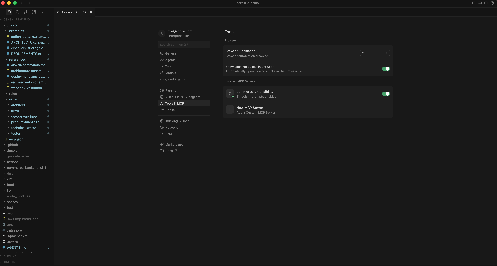
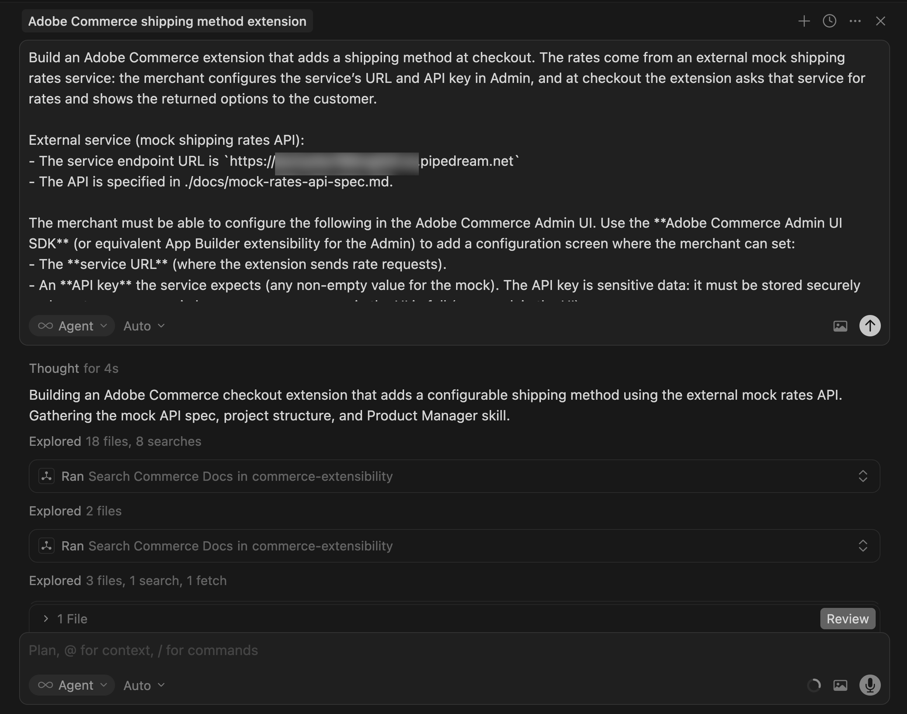

# 配送方法扩展教程

本教程将指导您使用[!DNL Adobe Commerce as a Cloud Service]、[!DNL Adobe App Builder]结帐入门工具包[和AI辅助开发工具为](https://developer.adobe.com/commerce/extensibility/starter-kit/checkout/){target="_blank"}构建送货方法扩展。

该扩展在结账时添加了一种可配置的配送方式，其中运费来自外部模拟运费服务。 商家在管理UI中配置服务URL、API密钥和仓库（发货地址），在结账时，扩展会请求该服务的费率，并向客户显示返回的选项。

在开始之前，请完成[先决条件](./tutorial-prerequisites.md)。

## 验证先决条件 {#tutorial-verify-prerequisites}

验证是否安装了以下必备组件：

```bash
# Check Node.js version (should be 22.x.x)
node --version

# Check npm version (should be 9.0.0 or higher)
npm --version

# Check Git installation
git --version

# Check Bash shell installation
bash --version
```

如果前面的任何命令未返回预期结果，请参阅[先决条件](./tutorial-prerequisites.md)获取指导。

## 创建模拟运费API

完成[先决条件](./tutorial-prerequisites.md)后，创建模拟运费API，以便在[!DNL Commerce Admin]中配置扩展时准备好服务URL和API密钥。 该扩展调用外部运费API。 在本教程中，您将使用模拟API来运行流，而无需使用实际运营商帐户。 您将使用[Pipedream](https://pipedream.com)创建模拟API（需要免费帐户）。 模拟API使用类似于典型实际运费API的请求/响应合同，因此以后将此扩展连接到实际提供商应该非常简单。

要创建模拟API，请下载[模拟速率API规范文件](../assets/mock-rates-api-spec.zip)，打开该文件，然后将`.md`文件添加到您的项目中（例如`docs/mock-rates-api-spec.md`）。

**时间：**&#x200B;创建模拟API大约需要&#x200B;**5-10分钟**。

### 创建工作流和HTTP触发器

1. 转到[pipedream.com](https://pipedream.com)并注册或登录。
1. 单击&#x200B;**新建工作流**（或&#x200B;**添加工作流**）。
1. 对于触发器，选择&#x200B;**HTTP / Webhook**。
1. 在触发器配置中，将&#x200B;**HTTP响应**&#x200B;设置为&#x200B;**从您的工作流**&#x200B;返回自定义响应。 这将允许代码步骤发送模拟JSON响应。
1. Pipedream显示唯一的&#x200B;**HTTP终结点URL**，如`https://123456.m.pipedream.net`。
1. 在Commerce管理员中配置扩展时，**复制此URL**&#x200B;并将其用作&#x200B;**服务URL**。

   {width="600" zoomable="yes"}

您不需要在触发器上配置&#x200B;**授权**；模拟API在代码步骤中验证`API-Key`标头。

### 添加代码步骤

1. 单击&#x200B;**+**&#x200B;图标以添加步骤。
1. 选择&#x200B;**运行Node.js代码** （代码步骤）。
1. **使用以下JavaScript替换**&#x200B;默认代码。

   ```javascript
   export default defineComponent({
   async run({ steps, $ }) {
      const event = steps.trigger.event;
      const body = event.body ?? {};
      const headers = event.headers ?? {};
      const apiKey = headers["api-key"] ?? body.api_key ?? "";
   
      if (!apiKey || String(apiKey).trim() === "") {
         await $.respond({
         immediate: true,
         status: 401,
         headers: { "Content-Type": "application/json" },
         body: { error: "Missing or invalid API-Key header" },
         });
         return;
      }
   
      const shipment = body.shipment;
      if (!shipment || typeof shipment !== "object") {
         await $.respond({
         immediate: true,
         status: 400,
         headers: { "Content-Type": "application/json" },
         body: { error: "Missing or invalid shipment" },
         });
         return;
      }
   
      const rates = [
         {
         service_code: "mock_standard",
         service_name: "Mock Standard",
         carrier_friendly_name: "Mock Carrier",
         shipping_amount: { amount: 5.99 },
         shipment_cost: 5.99,
         cost: 5.99,
         },
         {
         service_code: "mock_express",
         service_name: "Mock Express",
         carrier_friendly_name: "Mock Carrier",
         shipping_amount: { amount: 12.99 },
         shipment_cost: 12.99,
         cost: 12.99,
         },
      ];
   
      await $.respond({
         immediate: true,
         status: 200,
         headers: { "Content-Type": "application/json" },
         body: { rates },
      });
   },
   });
   ```

1. 单击&#x200B;**部署**。

   {width="600" zoomable="yes"}

对于包含非空`API-Key`标头和`shipment`对象的任何有效请求，模拟将返回两个速率选项（Mock Standard和Mock Express）。 您将在本教程的后面部分的[!DNL Commerce Admin]中配置API密钥。 您还将在同一配置屏幕上指定Pipedream工作流URL，因此请记下它。

## 扩展开发

本节将指导您使用[!DNL Adobe Commerce as a Cloud Service]结帐入门工具包[和AI辅助开发工具为](https://developer.adobe.com/commerce/extensibility/starter-kit/checkout/){target="_blank"}开发送货方法扩展。

1. 导航到编码代理中的MCP设置。 例如，在光标中，转到&#x200B;**[!UICONTROL Cursor]** > **[!UICONTROL Settings]** > **[!UICONTROL Cursor Settings]** > **[!UICONTROL Tools & MCP]**。 验证是否已启用`commerce-extensibility`工具集且未出现错误。 如果看到错误，请关闭和打开工具集。

   {width="600" zoomable="yes"}

   >[!NOTE]
   >
   >使用人工智能辅助开发工具时，预期代码和代理生成的响应会发生自然变化。
   >
   >如果您遇到任何代码问题，始终可以请求代理帮助您对其进行调试。

1. 如果有任何文档添加到光标上下文中，请禁用它。 导航到&#x200B;[!UICONTROL **Cursor**] > [!UICONTROL **设置**] > [!UICONTROL **Cursor设置**] > [!UICONTROL **索引和文档**]，并删除列出的任何文档。

   {width="600" zoomable="yes"}

1. 为代理提供对模拟速率API规范的访问权限，以便正确实现客户端。 如果您尚未这样做，请下载[模拟费率API规范文件](../assets/mock-rates-api-spec.zip)，打开该文件，然后将`.md`文件添加到您的项目中（例如`docs/mock-rates-api-spec.md`），然后在您的提示中引用该文件。

1. 生成配送方式扩展：

   - 从代理的聊天窗口中，选择&#x200B;**计划**&#x200B;模式（如果可用）。 这样可以防止座席在没有计划的情况下继续工作。
   - 输入以下提示：

   ```shell-session
   Build an Adobe Commerce extension that adds a shipping method at checkout. The rates come from an external mock shipping rates service: the merchant configures the service's URL and API key in Admin, and at checkout the extension asks that service for rates and shows the returned options to the customer.
   
   External service (mock shipping rates API):
   - The service endpoint URL is configurable by the merchant (for example https://123456.m.pipedream.net).
   - The API is specified in ./docs/mock-rates-api-spec.md.
   
   The merchant must be able to configure the following in the Adobe Commerce Admin UI. Use the Adobe Commerce Admin UI SDK (or equivalent App Builder extensibility options for the Admin) to add a configuration screen where the merchant can set:
   - The service URL (where the extension sends rate requests).
   - An API key the service expects (any non-empty value for the mock). The API key is sensitive data: it must be stored securely and must never appear in logs, error messages, or in the UI in full (e.g. mask in the UI).
   - The warehouse (ship-from) address: name, phone, street, city, state, postal code, country. This is the origin used when requesting rates.
   ```

   >[!NOTE]
   >
   >如果代理请求搜索文档，请允许搜索。

   {width="600" zoomable="yes"}

1. 准确地回答座席的问题以帮助其生成最佳代码。 如果代理询问要使用哪个工具包或模板，请将其定向到具有发运域和管理员UI SDK扩展的[签出入门工具包](https://developer.adobe.com/commerce/extensibility/starter-kit/checkout/){target="_blank"}，以便同时实施发运webhook和商家配置屏幕。

   代理可能会创建一个`requirements.md`（或等效的）文件，用作实现的真实来源。

1. 查看`requirements.md`（或等效项）文件并验证计划。 如果一切看起来都正确，请指示代理转移到体系结构规划（或&#x200B;**阶段2**）。 确认：

   - **shipping-methods**&#x200B;操作（或等效操作）处理Commerce webhook并调用外部费率API。
   - **shipping-config**（或等效操作）操作支持GET（读取配置、API密钥被掩盖）和SET（保存服务URL、API密钥、仓库地址），并且配置可以安全地存储，例如在运行时状态。
   - 管理员UI包含一个&#x200B;**模拟发货**（或类似选项卡），该选项卡具有用于服务URL、API密钥（密码/掩码）和仓库地址的字段。

   {width="600" zoomable="yes"}

1. 在代理程序提供架构计划时，查看该架构计划。

   模拟运费扩展的{width="600" zoomable="yes"}

1. 指示代理继续生成代码。 代理应将一个&#x200B;**模拟**&#x200B;承运人添加到允许Commerce接受返回方法的装运承运人配置中，并使用webhook方法`plugin.magento.out_of_process_shipping_methods.api.shipping_rate_repository.get_rates`（webhook类型&#x200B;**after**，必需&#x200B;**可选**）。

   代理会生成必要的代码并提供有关后续步骤(包括安装依赖项、注册模拟运营商、配置Commerce webhook和部署)的详细摘要。

   {width="600" zoomable="yes"}

   {width="600" zoomable="yes"}

### 部署前清理

在部署之前，请删除应用程序不需要的代码。 结账入门套件可能包括未使用的域（例如付款、税或事件）和基架。 让代理删除这些部件，并使用如下提示仅保留装运部件和[!DNL Admin UI]部件：

```shell-session
Proceed with Phase 5 cleanup.
```

代理会生成清理报告，删除未使用的操作、配置和脚本，并更新项目。 请在部署之前完成此步骤。

{width="600" zoomable="yes"}

### 部署扩展

1. 验证生成的代码后，使用以下提示部署扩展：

   ```shell-session
   Deploy the app.
   ```

   代理执行部署前准备情况评估(例如，如果使用Admin UI或Commerce API，则检查`.env`、`COMMERCE_WEBHOOKS_PUBLIC_KEY`和OAuth/IMS变量的`COMMERCE_BASE_URL`)。

   Mock Shipping扩展的{width="600" zoomable="yes"}

1. 如果对评估结果有信心，请指示代理继续部署。 代理使用MCP工具包自动验证、构建和部署。

   {width="600" zoomable="yes"}

### 部署后

部署后，请完成以下步骤以注册模拟运营商，配置webhook和[!DNL Admin UI]，并在签出时验证扩展。

1. **在Commerce中注册模拟运营商**（部署后运行一次）：

   ```bash
   npm run create-shipping-carriers
   ```

   确保您的`.env`具有`COMMERCE_BASE_URL`和有效的OAuth/IMS凭据，以便脚本可以注册运营商。

1. **在[!DNL Commerce Admin]中配置送货webhook：**

   - 转到&#x200B;**商店** >设置> **配置** > **Adobe服务** > **Commerce Webhook**。
   - 添加webhook：
      - **Webhook方法：** `plugin.magento.out_of_process_shipping_methods.api.shipping_rate_repository.get_rates`
      - **Webhook类型：** **晚于**
      - **URL：**&#x200B;已部署的&#x200B;**shipping-methods** Web操作URL（来自部署输出或[!DNL Adobe Developer Console]）。
      - **必需：** **可选** — 如果外部API未返回任何费率，这将允许签出仍然有效。

   模拟运费的{width="600" zoomable="yes"}

1. **配置[!DNL Admin UI SDK]扩展：**

   - 在[!DNL Commerce Admin]中，转到&#x200B;**商店** >设置> **配置**。
   - 打开&#x200B;**Adobe Services** > **Admin UI SDK**。
   - 将&#x200B;**启用管理UI SDK**&#x200B;设置为&#x200B;**是**，然后单击&#x200B;**保存配置**（如果尚未启用）。
   - 单击&#x200B;**配置扩展**，选择应用程序部署到的工作区，然后单击&#x200B;**应用**。 您还可以选择&#x200B;**自定义**&#x200B;选项并输入工作区名称。
   - 在列表中选择您的[!DNL App Builder]应用并保存。 如果未显示应用程序，请单击&#x200B;**刷新注册**，然后重试。

   {width="600" zoomable="yes"}

1. **在Adobe Commerce管理UI中配置Mock Shipping方法：**
   - 打开&#x200B;**应用**&#x200B;并选择您的应用。
   - 打开&#x200B;**Mock Shipping**&#x200B;选项卡（或等效选项卡）。
   - 输入以下详细信息：
      - **服务URL：**&#x200B;您复制的Pipedream工作流URL（例如`https://123456.m.pipedream.net`）。
      - **API密钥：**&#x200B;模拟的任何非空值，例如`tutorial-key`。
      - **仓库（发货方）地址：**&#x200B;姓名、电话、街道、城市、州/省、邮政编码、国家/地区。
   - 单击&#x200B;**保存**。 该配置存储在Runtime State中，并由shipping-methods操作使用。

   {width="600" zoomable="yes"}

1. **结帐时验证：**&#x200B;将产品添加到购物车，转到结帐并输入送货地址。 您应该看到模拟送货选项，例如&#x200B;**Mock Standard**&#x200B;和&#x200B;**Mock Express**。

   {width="600" zoomable="yes"}

### 故障排除

- **配置未保存在管理UI中：**&#x200B;如果您在保存后看到“响应无效‘message/http’”或值未更新，请使用类似于以下内容的命令检查配置操作的运行时激活日志：

  ```bash
  aio app logs --action CustomMenu/shipping-config --limit 20
  ```

  常见原因包括网关需要特定的响应格式（例如字符串正文和`Content-Type: application/json`）或状态库需要字符串值 — 请确保该操作将配置存储为字符串并在读取时对其进行解析，并且shipping-methods操作使用相同的解析。 查看代理聊天或日志以了解确切的原因和修复。

- **“响应必须至少包含一个操作”**（在webhook日志中）： Commerce要求shipping webhook至少返回一个操作。 要求代理确保shipping-methods操作从不返回空操作数组（例如，当外部API不返回任何速率时通过返回回退速率）。

- **结账时没有运费：**&#x200B;请确认webhook URL和方法正确，模拟运营商已注册(`npm run create-shipping-carriers`)，并且模拟运费配置已在[!DNL Admin UI]中设置。 检查运行时日志以了解API或验证错误的配送方式操作，确保操作至少返回一个操作，因此[!DNL Commerce]不显示“响应必须至少包含一个操作”。

### 教程回顾

以下是本教程涵盖的主题摘要：

- **先决条件和设置：**&#x200B;验证工具并创建模拟运费API。
- **代理驱动开发：**&#x200B;使用commerce-extensibility工具集为发货webhook和管理UI生成要求、实施计划和代码。
- **阶段5清理：**&#x200B;在部署之前删除未使用的签出启动工具包域和基架。
- **部署：**&#x200B;部署前评估和MCP工具包部署。
- **部署后配置：**&#x200B;注册模拟运营商，配置[!DNL Commerce] webhook，启用[!DNL Admin UI SDK]扩展，并在[!DNL Admin UI]中设置模拟发运（服务URL、API密钥、仓库）。
- **验证：**&#x200B;确认模拟送货选项出现在结帐时。

### 后续步骤

有关本教程的进一步试验，请考虑以下事项：

- 使用挂接自动进行部署后设置，该挂接在[!DNL Commerce]中注册模拟承运人并在每次部署后配置装运webhook。
- 通过在[!DNL Admin UI]中更改服务URL和API密钥，将扩展指向实际运费API。
- 扩展[!DNL Admin UI]以显示运营商状态或测试到费率服务的连接。
