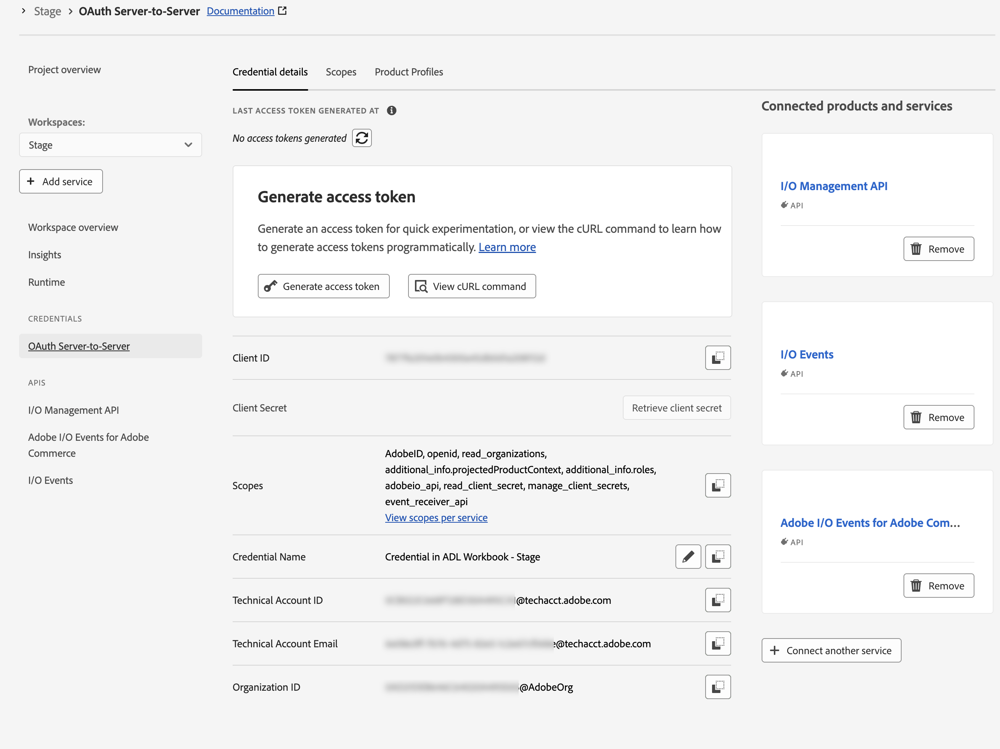

# 教程先决条件

此页面列出了[!DNL Adobe Commerce as a Cloud Service]教程的先决条件和设置步骤，如[评级扩展教程](./ratings-extension.md)和[送货方法扩展教程](./shipping-method-extension.md)。

## 一般先决条件

在本教程中，扩展和店面开发都需要以下工具。

* [!DNL Node.js] （版本`22.x.x`）和npm （`9.0.0`或更高版本）：使用以下命令验证您的安装：

  ```bash
  node --version
  npm --version
  ```

* 安装[Git](https://git-scm.com) — 验证您的安装：

  ```bash
  git --version
  ```

* Bash shell
   * macOS/Linux：无需安装
   * Windows：使用[Git Bash](https://git-scm.com/install)或[用于Linux (WSL)的Windows子系统](https://learn.microsoft.com/en-us/windows/wsl/install)

* 下载AI辅助的IDE，如[Cursor](https://cursor.com/download)（推荐）。 其他IDE（如Claude Code、Gemini CLI或Copilot）也受支持，但可能需要修改提示和教程中的其他步骤。

## [!DNL Adobe Commerce as a Cloud Service]先决条件

* 安装[!DNL Adobe I/O CLI]

  ```bash
  npm install -g @adobe/aio-cli
  ```

* 安装[Adobe I/O CLI Commerce](https://github.com/adobe-commerce/aio-cli-plugin-commerce)、[Adobe I/O CLI Runtime](https://github.com/adobe/aio-cli-plugin-runtime)和[App Builder CLI](https://github.com/adobe/aio-cli-plugin-app-dev)插件：

  ```bash
  aio plugins:install https://github.com/adobe-commerce/aio-cli-plugin-commerce @adobe/aio-cli-plugin-app-dev @adobe/aio-cli-plugin-runtime
  ```

安装[!DNL Adobe I/O CLI]和所需的插件后，设置可扩展性工作区。 Adobe建议使用自动设置以获得最快的体验。

* **[自动设置](#automated-setup) （推荐）** — 运行单个命令以自动配置工作区。
* **[手动设置](#manual-setup)** — 按照分步说明单独配置每个组件。

### 自动设置（推荐） {#automated-setup}

>[!TIP]
>
>如果您遇到自动设置问题，请按照以下[手动设置](#manual-setup)步骤操作。

`app-setup`命令可自动执行工作区设置过程，包括创建[!DNL Adobe Developer Console]项目、添加所需的API、配置[!DNL Adobe I/O CLI]、克隆入门工具包、连接本地工作区以及安装可扩展性人工智能工具。

`app-setup`命令将指导您完成以下步骤：

* 选择或创建具有所需API的[!DNL Adobe Developer Console]项目
* 使用您的组织、项目和工作区配置[!DNL Adobe I/O CLI]
* 克隆适当的入门套件并设置项目
* 配置环境并将本地工作区连接到远程工作区
* 安装Commerce可扩展性工具和编码代理技能

运行以下命令并按照交互式提示操作：

```bash
aio commerce extensibility app-setup
```

命令完成后，导航到项目目录并重新启动编码代理以加载新的MCP工具和技能。 如果您的教程需要店面，请重新运行命令并选择[!DNL AEM Boilerplate Commerce]入门工具包。

以下示例安装显示了checkout starter kit的交互式提示和输出。

+++示例安装（签出入门工具包）

```shell-session
aio commerce extensibility app-setup

🚀 Adobe Commerce Extensibility App Setup

✔ Logged in
📁 Working directory: /Users/username/projects/my-commerce-project

✔ Which starter kit would you like to use? Checkout Starter Kit
✔ Enter a name for your project directory: my-extension
✔ Which coding agent would you like to install the skills for? Cursor

📦 Cloning Checkout Starter Kit...
   ✔ Repository cloned
   Using npm (package-lock.json found)
   ✔ Dependencies installed

📋 Current Adobe I/O Console configuration:
   Org: My Organization (1234567)
   Project: My Commerce Project (1234567890123456789)
   Workspace: Stage (9876543210987654321)
✔ Do you want to continue with this configuration? (Answer "No" to select a different org/project/workspace)
No

🔧 Selecting Adobe I/O Console org, project, and workspace...

? Select Org: My Organization
Org selected My Organization
You are currently in:
1. Org: My Organization
2. Project: <no project selected>
3. Workspace: <no workspace selected>

? Select Project: My Commerce Project
Project selected : My Commerce Project
You are currently in:
1. Org: My Organization
2. Project: My Commerce Project
3. Workspace: <no workspace selected>

? Select Workspace: Stage
Workspace selected Stage
You are currently in:
1. Org: My Organization
2. Project: My Commerce Project
3. Workspace: Stage

✅ Console configured:
   Org: My Organization
   Project: My Commerce Project
   Workspace: Stage

🔐 Configuring workspace credentials and services...
   ✔ Workspace configuration loaded
   ✔ OAuth server-to-server credentials already configured
   ✔ All required services available in organization
   ✔ Subscribed to: Adobe Commerce as a Cloud Service

📋 Configuring Checkout Starter Kit...
   Creating .env from env.dist...
✔ Select tenant (type to search) My Commerce Instance:
https://<region>.api.commerce.adobe.com/<tenant-id>/graphql
   ✔ Commerce instance configured
✔ Enter the event prefix for your workspace: my-prefix
   ✔ Workspace IDs configured
   ✔ OAuth credentials configured
   ✔ Checkout Starter Kit configured

🔧 Installing Commerce Extensibility tools and agent skills...
   ✔ Commerce Extensibility tools installed

🎉 App setup complete!

📁 Project directory: /Users/username/projects/my-commerce-project/my-extension

Next steps:
   1. cd into your project directory
   2. Restart your coding agent to load the Commerce Extensibility tools and skills
```

+++

### 手动设置 {#manual-setup}

以下各节将介绍如何手动设置可扩展性工作区的每个组件。 如果您希望手动配置，或者遇到[自动设置](#automated-setup)的问题，请按照以下步骤操作。

### Adobe Developer Console先决条件

在Adobe Developer Console中设置具有所需API和凭据的项目。

1. 导航到[Adobe Developer Console](https://developer.adobe.com/console){target="_blank"}。
1. 使用您的电子邮件和密码登录。

#### 创建新项目

在Adobe Developer Console中创建一个App Builder项目来托管您的扩展。

1. 导航到[Adobe Developer Console](https://developer.adobe.com/)。
1. 单击&#x200B;**[!UICONTROL Create project from a template]**。
1. 选择&#x200B;**[!UICONTROL App Builder]**&#x200B;模板。
1. 输入&#x200B;**[!UICONTROL Project Title]**&#x200B;和&#x200B;**[!UICONTROL App Name]**。
1. 确保选中&#x200B;**[!UICONTROL Include Runtime]**&#x200B;复选框。

   {width="600" zoomable="yes"}

1. 单击&#x200B;**[!UICONTROL Save]**。

#### 将API添加到工作区

将所需的API添加到暂存工作区，以进行事件管理和Commerce集成。

1. 单击&#x200B;**[!UICONTROL Stage]**&#x200B;工作区，然后对每个API重复以下步骤。

   {width="600" zoomable="yes"}

1. 单击&#x200B;**[!UICONTROL Add Service]**&#x200B;并选择&#x200B;**[!UICONTROL API]**。

1. 选择以下API之一。 对下面列出的每个API重复此过程：

   * **[!UICONTROL Adobe Services]**&#x200B;筛选器：
      * **[!UICONTROL I/O Management API]**
      * **[!UICONTROL I/O Events]** API
   * **[!UICONTROL Experience Cloud]**&#x200B;筛选器：
      * **[!UICONTROL Adobe I/O Events for Adobe Commerce]** API

1. 单击&#x200B;**[!UICONTROL Next]**。

1. 单击&#x200B;**[!UICONTROL Save configured API]**。

1. 重复上述步骤，直到您将所有API添加到工作区为止。

   {width="600" zoomable="yes"}

### 配置Adobe I/O CLI

将[!DNL Adobe I/O CLI]连接到您的组织、项目和工作区。

1. 清除任何现有配置：

   ```bash
   aio config clear
   ```

1. 使用[!DNL Adobe I/O CLI]登录：

   ```bash
   aio auth login -f
   ```

1. 使用以下每个命令选择您的组织、项目和工作区：

   ```bash
   aio console org select
   ```

   ```bash
   aio console project select
   ```

   ```bash
   aio console workspace select
   ```

   {width="600" zoomable="yes"}

### 克隆入门工具包

为您正在构建的扩展克隆以下Commerce starter kit存储库之一，并准备项目：

集成入门工具包：

```bash
git clone https://github.com/adobe/commerce-integration-starter-kit.git extension
cd extension
```

结帐入门工具包：

```bash
git clone https://github.com/adobe/commerce-checkout-starter-kit.git extension
cd extension
```

>[!BEGINTABS]

>[!TAB 集成入门工具包]

### 创建.env文件

创建环境配置文件：

```bash
cp env.dist .env
```

在文本编辑器中打开`.env`文件并添加以下OAuth凭据：

```bash
OAUTH_CLIENT_ID=
OAUTH_CLIENT_SECRET=
OAUTH_TECHNICAL_ACCOUNT_ID=
OAUTH_TECHNICAL_ACCOUNT_EMAIL=
OAUTH_ORG_ID=
```

通过单击工作区上的&#x200B;**[!UICONTROL Credential details]**&#x200B;选项卡，从[Developer Console](https://developer.adobe.com/)中的&#x200B;**[!UICONTROL OAuth Server-to-Server]**&#x200B;页面复制这些值。

Adobe Developer Console中的{width="600" zoomable="yes"}

#### 添加Commerce配置

将以下Commerce实例详细信息添加到您的`.env`文件：

```bash
COMMERCE_BASE_URL=
COMMERCE_GRAPHQL_ENDPOINT=
```

要查找这些值，请执行以下操作：

1. 导航到[Commerce Cloud服务实例](https://experience.adobe.com/#/@commerce/commerce/cloud-service/instances)。
1. 单击实例旁边的信息图标。
1. 将REST终结点复制为`COMMERCE_BASE_URL`。
1. 将GraphQL端点复制为`COMMERCE_GRAPHQL_ENDPOINT`。

#### 设置事件前缀

为事件前缀设置临时值：

```bash
EVENT_PREFIX=test
```

### 下载工作区配置

运行以下命令下载工作区配置文件：

```bash
aio console workspace download workspace.json
```

将工作区配置文件复制到`scripts`目录：

```bash
cp workspace.json scripts/
```

### 将本地工作区连接到远程工作区

将本地项目链接到远程工作区：

```bash
aio app use workspace.json -m
```

{width="600" zoomable="yes"}

>[!TAB 结帐入门工具包]

### 将本地工作区连接到远程工作区

将本地项目链接到远程工作区。 从项目根目录（`extension`文件夹）中，运行：

```bash
aio app use --merge
```

出现提示时，选择使用您在配置Adobe I/O CLI时选择的组织、项目和工作区的选项。 这会将工作区配置写入应用程序中，以便部署和本地开发使用该工作区。

{width="600" zoomable="yes"}

>[!ENDTABS]

### 安装可扩展性人工智能工具

此进程创建MCP配置(`.<agent>/mcp.json`)、技能目录(`.<agent>/skills/`)，并将`AGENTS.md`添加到项目根目录。 系统将提示您选择入门套件、编码代理和包管理器。


1. 使用以下命令在`extension`文件夹中设置AI辅助开发工具：

   ```bash
   cd extension
   ```

   ```bash
   aio commerce extensibility tools-setup
   ```

   {width="600" zoomable="yes"}

1. 安装完成后，请重新启动编码代理，以便加载新的MCP工具和技能。 Commerce App Builder工具现在可在您的环境中使用。

   >[!NOTE]
   >
   >如果您看到一则警告，指出未找到入门工具包的技能，则说明出现了问题，这通常是因为安装程序在克隆入门工具包以外的文件夹中运行。 从`aio commerce extensibility tools-setup`文件夹（入门套件项目根）运行`extension`并在出现提示时选择相应的入门套件。

   {width="600" zoomable="yes"}

## 店面手动设置

本节介绍如何为[Ratings扩展教程](./ratings-extension.md)和其他店面教程手动配置店面。

要自动配置店面，请运行`app-setup`自动设置[部分中描述的](#automated-setup)命令，然后选择[!DNL AEM Boilerplate Commerce]入门工具包。

### 先决条件

要完成[评级扩展教程](./ratings-extension.md#connect-to-the-storefront)的[storefront](./ratings-extension.md)部分并在您的商店中显示产品评级，需要以下项目。

* [Google Chrome](https://www.google.com/chrome/) — 测试店面所需

* 店面项目已连接到您的[!DNL Commerce]实例。 如果您没有店面项目，请按照[创建店面](https://experienceleague.adobe.com/developer/commerce/storefront/get-started/create-storefront/){target="_blank"}中的步骤操作，包括[将存储库链接到商务数据](https://experienceleague.adobe.com/developer/commerce/storefront/get-started/create-storefront/#link-repo-to-commerce-data){target="_blank"}部分。

### 克隆店面存储库

打开终端并克隆存储库：

```bash
git clone https://github.com/hlxsites/aem-boilerplate-commerce.git storefront
cd storefront
```

### 安装依赖项

安装项目依赖项：

```bash
npm install
```

### 安装店面人工智能工具

在`storefront`文件夹中设置AI辅助开发工具。

从样板项目的根目录运行以下命令。 该命令将`@adobe-commerce/commerce-extensibility-tools`包作为开发依赖项安装，将技能文件复制到代理的技能目录中，并配置MCP（模型上下文协议），以便代理可以访问Commerce文档搜索工具。

```bash
aio commerce extensibility tools-setup
```

该命令将引导您完成两个提示：

1. **选择入门工具包** — 选择&#x200B;**AEM样板Commerce**。

1. **选择编码代理** — 从支持的代理列表中选择代理。
