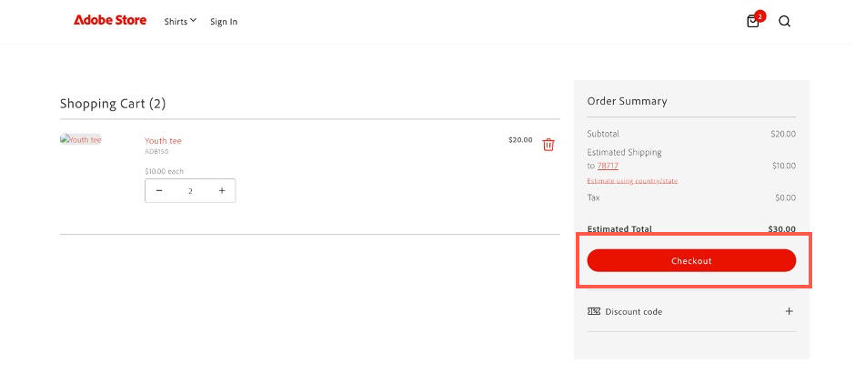
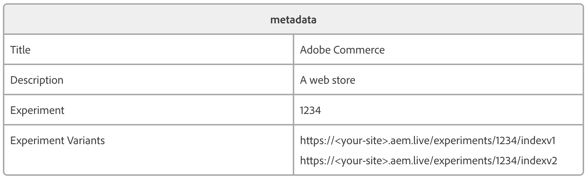
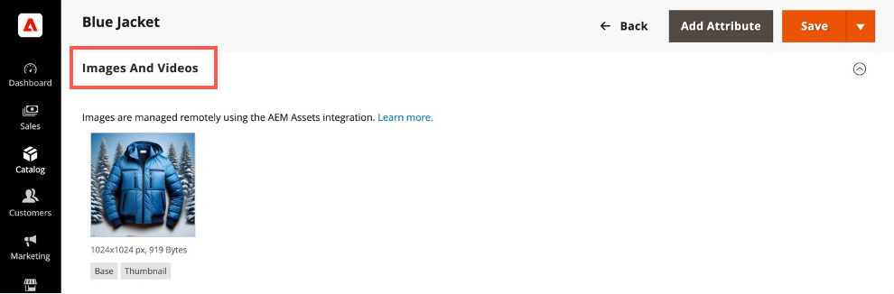

# 用例

{{accs-early-access}}

以下用例演示了[!DNL Adobe Commerce as a Cloud Service]支持的核心功能和业务场景，使您能够加快开发并启动高影响力的体验。

如果您遇到任何问题，请查看[疑难解答](#troubleshooting)部分以获取指导。

## 先决条件

在尝试任何这些用例之前，必须完成以下先决条件：

1. [使用以下选项创建您的Cloud Service实例](./getting-started.md#create-an-instance)：
   1. 在&#x200B;[!UICONTROL **环境**]&#x200B;下拉列表中选择&#x200B;[!UICONTROL **沙盒**]。
   1. 在&#x200B;[!UICONTROL **测试数据**]&#x200B;下拉列表中选择&#x200B;[!UICONTROL **Adobe Store**]。
1. [登录到您的Adobe Experience Cloud帐户](https://experience.adobe.com)
1. [使用以下选项设置您的Cloud Service店面](./storefront.md)：
   1. 为模板选择[!UICONTROL `adobe-commerce/adobe-demo-store`]。
   1. 选择&#x200B;[!UICONTROL **为连接方法选择一个可用的实例(Mesh -> SaaS)**]。

## 签出工作流

此工作流演示了从店面购买产品的客户的结账过程，以及作为管理员，如何确认订单。

### 启用付款服务

1. 在Commerce管理员中，导航到&#x200B;[!UICONTROL **商店**] > [!UICONTROL Settings] > [!UICONTROL **配置**] > [!UICONTROL **付款方式**]。

1. 在&#x200B;[!UICONTROL **常规配置**]&#x200B;部分中，输入您的`Payment Services Sandbox ID`和`Payment Services Sandbox Key`。 您可以按照[沙盒载入](../payment-services/sandbox.md#sandbox-onboarding)中描述的步骤获取这些ID

1. 将&#x200B;[!UICONTROL **启用**]&#x200B;下拉列表设置为&#x200B;[!UICONTROL **是**]。

1. 单击&#x200B;[!UICONTROL **保存配置**]。

### 购买产品

1. 转到您在先决条件中创建的[店面](./storefront.md)。

1. 查找并选择产品。 进行任何必要的自定义选择。 然后单击&#x200B;[!UICONTROL **添加到购物车**]。

   {width="600" zoomable="yes"}

1. 选择购物车图标以查看您的购物车。

   {width="600" zoomable="yes"}

1. 单击&#x200B;[!UICONTROL **签出**]。

   {width="600" zoomable="yes"}

1. 输入所需的联系人详细信息和送货信息。 您可以为此订单使用虚构的信息。

1. 要结帐，请选择&#x200B;[!UICONTROL **支票/汇票**]。 如果要使用信用卡，请使用Paypal[&#128279;](https://developer.paypal.com/tools/sandbox/card-testing/#link-teststaticcardnumbers)提供的测试卡之一。 您可以将其与任何将来的到期日期和任何CVC一起使用。

   {width="600" zoomable="yes"}

   {width="600" zoomable="yes"}

1. 单击&#x200B;[!UICONTROL **下单**]。

### 确认订单

1. 打开Commerce管理员： `<your store URL>/admin`。

1. 使用您的Adobe ID登录。

1. 导航到&#x200B;[!UICONTROL **销售**] > [!UICONTROL **订单**]。

   {width="600" zoomable="yes"}

1. 查找您下达的订单并确认详细信息。

   {width="600" zoomable="yes"}

## 更新店面内容

直接创建、编辑内容并将其发布到店面。

1. 打开您在先决条件中创建的[店面](./storefront.md)。

1. 打开店面生成器。 导航到`https://da.live/#/<GitHub User Name>/<Repository Name>/main/da/index.md`。

1. 打开&#x200B;[!UICONTROL **索引**]&#x200B;页。

1. 在轮播块下方，通过编辑“欢迎使用Adobe Store演示”行输入新标题。

1. 单击发送图标，然后单击&#x200B;[!UICONTROL **预览**]。

1. 查看预览页面，然后单击&#x200B;[!UICONTROL **发布**]。

1. 刷新店面页面，并确认您的更改现已生效。

## 情境实验

Adobe Commerce的情境式试验功能允许您在店面中创建和管理试验，以测试不同的内容和配置。

### 先决条件

* 安装[AEM Sidekick扩展](https://www.aem.live/docs/sidekick)

1. 在Storefront Builder中，选择您的索引页并单击&#x200B;[!UICONTROL **复制**]。

1. 在主文件夹下创建一个&#x200B;[!UICONTROL **试验**]&#x200B;文件夹，方法是单击&#x200B;[!UICONTROL **新建**]&#x200B;按钮并选择&#x200B;[!UICONTROL **文件夹**]。

1. 在&#x200B;[!UICONTROL **试验**]&#x200B;文件夹中创建名为&#x200B;**1234**&#x200B;的文件夹。

1. 将索引页的两个副本粘贴到&#x200B;**1234**&#x200B;文件夹中。

1. 打开每个页面，并将它们重命名为“homev1”和“homev2”。 这些是您的[挑战者](https://www.aem.live/docs/experimentation#create-your-challenger-page)。

1. 修改每个页面以包含不同的内容。 例如，更改主页图像或文本。 您需要能够识别每个页面之间的差异。

1. 发布您的每个挑战者页面。

1. 打开控制页，即原始索引页。

1. 添加标题为&#x200B;[!UICONTROL **元数据**]&#x200B;的新块。

1. 将以下信息添加到元数据块的行

   * 标题 — Adobe Commerce
   * 描述 — 网络商店
   * 试验 — 1234
   * 试验变体
      * `https://<your-site>.aem.live/experiments/1234/indexv1`
      * `https://<your-site>.aem.live/experiments/1234/indexv2`

   {width="600" zoomable="yes"}

1. 打开无痕浏览或专用浏览窗口，然后导航到您的主页。

1. 关闭专用浏览窗口并重复上一步骤。 每次打开页面时，您都会看到自己创建的随机变体。

## 增强店面内容

借助AEM Assets、Adobe Express和Firefly，您现在可以通过简单的自驱动工作流快速更改店面中显示的图像。

### 先决条件

* 需要访问AEM Assets、Adobe Express和Adobe Firefly。

### 自定义图像的背景

假设您想快速修改产品图像的背景。 Adobe Commerce、AEM Assets和Adobe Express的组合允许您通过几个简单的步骤来进行此更改。

1. 打开您在先决条件中创建的[店面](./storefront.md)，然后导航到要更改的项目。 记下SKU或产品代码项。

1. 通过在[Adobe Experience Cloud](https://experience.adobe.com/#/home)中选择打开[!UICONTROL AEM Assets]。

   {width="600" zoomable="yes"}

1. 单击[!UICONTROL Assets]。

   {width="600" zoomable="yes"}

1. 按&#x200B;**SKU**&#x200B;或&#x200B;**产品代码**&#x200B;搜索该项目。

1. 选择要编辑的项目，然后单击&#x200B;[!UICONTROL **在Adobe Express中打开**]。

   在adobe express中{width="600" zoomable="yes"}

1. 在&#x200B;[!UICONTROL **图像**]&#x200B;面板中，选择&#x200B;[!UICONTROL **插入对象**]。

   {width="600" zoomable="yes"}

1. 在文本框中，描述要添加图像。 例如，“雪松树”。

   {width="600" zoomable="yes"}

1. 调整[!UICONTROL Brush size]并绘制要添加生成图像的位置。 在本例中，围绕现有对象绘制以选择背景。

1. 单击&#x200B;[!UICONTROL **生成**]&#x200B;以查看结果。

1. 通过选择所需的选项并单击&#x200B;[!UICONTROL **保留**]，从不同的结果中进行选择。

1. 单击&#x200B;[!UICONTROL **您的资料**]&#x200B;以返回图像编辑器。

1. 单击&#x200B;[!UICONTROL **保存**]&#x200B;以指定图像类型。

1. 再次单击&#x200B;[!UICONTROL **保存**]&#x200B;以保存更改。

1. 在&#x200B;[!UICONTROL **保存资源**]&#x200B;对话框中，选择Commerce [!UICONTROL **目标文件夹**]。

   {width="600" zoomable="yes"}

1. 单击&#x200B;[!UICONTROL **另存为新资产**]&#x200B;以保存图像。

#### 将图像添加到Commerce AEM Assets

1. 在AEM as a Cloud Service的[导航面板](https://experienceleague.adobe.com/zh-hans/docs/experience-manager-cloud-service/content/sites/authoring/basic-handling#navigation-panel)中，选择&#x200B;**Assets** > **文件** > **Commerce**，然后单击您在上一节中创建的资源。

   {width="600" zoomable="yes"}

1. 单击&#x200B;[!UICONTROL **属性**]。

   {width="600" zoomable="yes"}

1. 选择&#x200B;[!UICONTROL **Commerce**]&#x200B;选项卡。

   {width="600" zoomable="yes"}

1. 确保Adobe Commerce中是否存在&#x200B;[!UICONTROL **？**]&#x200B;字段设置为&#x200B;[!UICONTROL **是**]。

1. 单击&#x200B;[!UICONTROL **添加**]，然后输入要将该资产添加到的产品SKU。

   {width="600" zoomable="yes"}

1. 选择资产的职位和资产类型。

1. 选择&#x200B;[!UICONTROL **基本**]&#x200B;选项卡并将&#x200B;[!UICONTROL **审核状态**]&#x200B;选项卡更改为&#x200B;[!UICONTROL **已批准**]。

   {width="600" zoomable="yes"}

1. 单击&#x200B;[!UICONTROL **保存并关闭**]。

#### 在Commerce中确认图像

1. 在Adobe Commerce [!UICONTROL **管理员**]&#x200B;中，导航到&#x200B;[!UICONTROL **目录**] > [!UICONTROL **产品**]。

1. 在上一部分中选择将图像添加到的产品。

1. 展开&#x200B;[!UICONTROL **图像和视频**]&#x200B;部分。

   {width="600" zoomable="yes"}

1. 确认您的图像现在在图像列表中可用。

1. 返回到店面，并导航到已修改产品的页面。

1. 确认新图像是否显示。

   {width="600" zoomable="yes"}

## 生成变体

Adobe Commerce的生成变体利用生成人工智能，自动生成高质量内容、微调消息传递并将资源无缝发布到您的店面。

### 生成文本

1. 使用[通用编辑器](https://experienceleague.adobe.com/zh-hans/docs/experience-manager-cloud-service/content/implementing/developing/universal-editor/introduction)打开您的店面站点。

1. 选择要编辑的文本块。

1. 在&#x200B;[!UICONTROL **属性**]&#x200B;面板中，单击&#x200B;[!UICONTROL **生成变体**]。

1. 单击&#x200B;[!UICONTROL **生成**]&#x200B;按钮。

1. 选择或自定义生成的文本。

1. 单击&#x200B;[!UICONTROL **发布**]&#x200B;以更新店面。

### 生成内容和图像

1. 打开[生成变体](https://experienceleague.adobe.com/zh-hans/docs/experience-manager-cloud-service/content/generative-ai/generate-variations)

1. 选择&#x200B;[!UICONTROL **主页横幅**]&#x200B;模板。

1. 在&#x200B;[!UICONTROL **解释用户交互**]&#x200B;文本框中，输入：“Adobe员工和合作伙伴购买Adobe品牌齿轮的Experience！”。

1. 在域知识&#x200B;**的** URL中，输入&#x200B;**www.adobestore.com**。

1. 单击&#x200B;[!UICONTROL **生成**]。

1. 选择内容变体并单击&#x200B;[!UICONTROL **生成图像**]。

1. 从&#x200B;[!UICONTROL **图像大小**]&#x200B;下拉列表中，选择&#x200B;[!UICONTROL **宽屏(16:9)**]。

1. 从&#x200B;[!UICONTROL **内容类型**]&#x200B;下拉列表中，选择&#x200B;[!UICONTROL **照片**]。

1. 对于&#x200B;[!UICONTROL **样式**]&#x200B;参考图像，选择现有的Adobe商店横幅。

1. 选择要使用的生成图像，然后单击&#x200B;[!UICONTROL **保存**]。

1. 对其他参考图像重复此过程以生成更多变体。

## 故障排除

使用下列建议来解决您在尝试这些教程时遇到的任何问题。

* 如果您需要有关命令或标志的指导：
   1. 运行`aio --help`以查看所有可用的命令和标志。
   1. 对于特定命令，请使用`--help`标志。 例如：
      * `aio console --help`
      * `aio commerce –help`

* 如果您遇到无效的登录问题：
   1. 运行`aio config clear `。
   1. 运行`aio auth login –-force `。
   1. 登录浏览器。
   1. 选择您的个人资料。
   1. 切换回终端以继续。

* 如果`init`命令失败：
   1. 运行`aio api-mesh delete`。
   1. 重新运行`aio commerce init`。

* 如果在运行`init`命令之前选择了错误的组织、项目或工作区：
   1. 运行`aio console org select`。
   1. 运行`aio console project select`。
   1. 运行`aio console workspace select`。

* 如果您的租户选择无效：
   1. 按&#x200B;**Ctrl-C**&#x200B;取消当前CLI执行。
   1. 运行`aio commerce init`。

* 如果您遇到无效的API Mesh安装：
   * 运行`aio api-mesh update mesh-config.json`。
