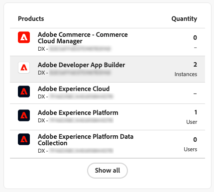
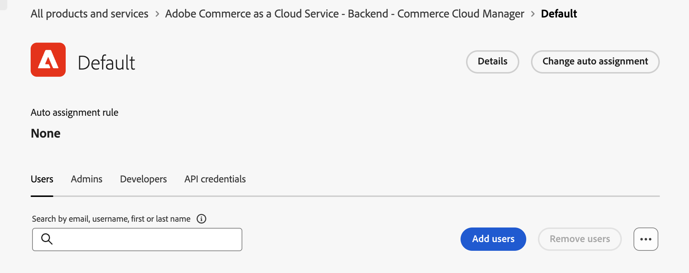

# User和Identity Management

要允许用户在[!DNL Adobe Commerce as a Cloud Service]中访问管理员，请将他们添加为您的组织中的用户，并确保他们有权访问[Adobe Admin Console](https://adminconsole.adobe.com){target="_blank"}中的Cloud Service产品。

此进程需要具有[!DNL Adobe Commerce as a Cloud Service]访问权限的IMS组织。 只有组织的系统管理员或产品管理员可以执行这些流程。

>[!TIP]
>
>要同时添加多个用户，您可以执行[批量CSV上传](https://helpx.adobe.com/cn/enterprise/using/bulk-upload-users.html){target="_blank"}。
>
> 您还可以通过创建[用户组](https://helpx.adobe.com/cn/enterprise/using/user-groups.html){target="_blank"}将多个用户添加到角色。 然后，您可以将&#x200B;[!UICONTROL **Adobe Commerce - Commerce Cloud Manager**]&#x200B;产品添加到用户组。

## 了解角色

以下角色可用于[!DNL Adobe Commerce as a Cloud Service]。 要查看或编辑这些角色，请在Commerce管理员中导航到&#x200B;[!UICONTROL **系统**] > [!UICONTROL **权限**] > [!UICONTROL **用户角色**]。

* **用户** — 用户具有Commerce管理员的管理员访问权限，但在Admin Console中无法管理产品级别的访问权限。 用户还可以使用积分在[中](./getting-started.md#create-an-instance)创建实例[!DNL Commerce Cloud Manager]。

  >[!NOTE]
  >
  >所有Commerce用户（包括开发人员和管理员）还必须具有分配给他们的用户角色。 基本Commerce权限需要此项。

* [**开发人员**](https://helpx.adobe.com/cn/enterprise/using/manage-developers.html#Adddevelopers){target="_blank"} — 开发人员具有用户权限，并且作为开发人员用户添加到Commerce实例。 他们可以使用[[!DNL Admin UI SDK]](https://developer.adobe.com/commerce/extensibility/admin-ui-sdk/){target="_blank"}、[配置事件](https://developer.adobe.com/commerce/extensibility/events/){target="_blank"}和[创建Webhook](https://developer.adobe.com/commerce/extensibility/webhooks/){target="_blank"}。

* 管理员 — 管理员分为三种类型：
   * [系统管理员](https://helpx.adobe.com/cn/enterprise/using/admin-roles.html){target="_blank"} — 系统管理员可以通过Admin Console访问组织中的所有产品和产品配置文件。
   * [产品管理员](#add-a-product-admin) — 产品管理员可以在[中](#add-users)管理产品的用户、角色和权限[!DNL Adobe Admin Console]，在Commerce管理员中[管理用户](https://experienceleague.adobe.com/zh-hans/docs/commerce-admin/systems/user-accounts/permissions-users-all#create-a-user){target="_blank"}。
   * [产品配置文件管理员](#add-developers-and-product-profile-admins) — 产品配置文件管理员无权访问Adobe Commerce管理员，但可以在[!DNL Adobe Admin Console]中管理产品的用户。

有关授予Adobe Commerce中每个角色的权限的详细信息，请参阅[用户权限](#user-permissions)。

## 添加产品管理员

>[!BEGINTABS]

>[!NOTE]
>
>将产品管理员添加为产品管理员之前，请为其分配[用户角色](#add-users)。 基本Commerce权限需要用户角色。

>[!TAB GA（2025年10月13日之后配置）]

1. 导航到<https://adminconsole.adobe.com>并使用您的Adobe ID登录。

1. 选择您的组织。

1. 选择&#x200B;[!UICONTROL **用户**]&#x200B;选项卡。

1. 选择&#x200B;[!UICONTROL **管理员**]&#x200B;选项卡。

1. 单击&#x200B;[!UICONTROL **添加管理员**]。

1. 输入要添加为管理员的用户名或电子邮件地址，然后单击&#x200B;[!UICONTROL **下一步**]。

1. 选择&#x200B;[!UICONTROL **产品配置文件管理员**]&#x200B;角色。

1. 单击&#x200B;[!UICONTROL **+**]&#x200B;添加产品。

1. 选择要将管理员添加到的现有Commerce实例。 Commerce实例使用以下格式： `Adobe Commerce - <instance-name> - ACCS - <environment-type> - <tenant-id>`。

1. 选择产品配置文件。

1. 单击&#x200B;[!UICONTROL **应用**]。

1. 单击&#x200B;[!UICONTROL **保存**]。

>[!TAB 提前访问（2025年10月13日之前配置）]

1. 导航到<https://adminconsole.adobe.com>并使用您的Adobe ID登录。

1. 选择您的组织。

1. 在&#x200B;[!UICONTROL **产品**]&#x200B;选项卡的&#x200B;[!UICONTROL **产品和服务**]&#x200B;下，选择&#x200B;[!UICONTROL **Adobe Commerce - Commerce Cloud Manager**]&#x200B;产品。

   Admin Console中的{width="600" zoomable="yes"}

1. 选择&#x200B;[!UICONTROL **管理员**]&#x200B;选项卡。

1. 单击&#x200B;[!UICONTROL **添加管理员**]。

1. 输入要添加为管理员的用户名或电子邮件地址，然后单击&#x200B;[!UICONTROL **保存**]。

>[!ENDTABS]

## 添加用户

以下说明提供了有关如何将用户添加到[!DNL Commerce Cloud Manager]和Commerce管理员的信息。 [!DNL Commerce Cloud Manager]界面允许您创建和管理Commerce实例。 所有用户（包括开发人员和管理员）都需要执行此流程。

>[!NOTE]
>
>只有产品管理员和系统管理员可以将用户和开发人员添加到Adobe Commerce as a Cloud Service产品。

>[!BEGINTABS]

>[!TAB GA（2025年10月13日之后配置）]

1. 导航到<https://adminconsole.adobe.com>并使用您的Adobe ID登录。

1. 选择您的组织。

1. 选择&#x200B;[!UICONTROL **产品**]&#x200B;选项卡。

1. 选择&#x200B;[!UICONTROL **Adobe Commerce**]&#x200B;产品。

1. 如果要将用户添加到Commerce Cloud Manager界面(用户可以在该界面中创建和管理Commerce实例)，请选择Manager产品，或者选择要将用户添加到的现有Commerce实例。 Commerce实例使用以下格式： `Adobe Commerce - <instance-name> - ACCS - <environment-type> - <tenant-id>`。

1. 选择&#x200B;[!UICONTROL **用户**]&#x200B;选项卡，然后单击&#x200B;[!UICONTROL **添加用户**]。

1. 输入要添加的用户的用户名或电子邮件地址，然后单击&#x200B;[!UICONTROL **保存**]。

1. 选择所需的产品配置文件。

1. 单击&#x200B;[!UICONTROL **应用**]。

1. 单击&#x200B;[!UICONTROL **保存**]。

>[!TAB 提前访问（2025年10月13日之前配置）]

1. 导航到<https://adminconsole.adobe.com>并使用您的Adobe ID登录。

1. 选择您的组织。

1. 在&#x200B;[!UICONTROL **产品**]&#x200B;选项卡的&#x200B;[!UICONTROL **产品和服务**]&#x200B;下，选择&#x200B;[!UICONTROL **Adobe Commerce - Commerce Cloud Manager**]&#x200B;产品。

   Admin Console中的{width="600" zoomable="yes"}

1. 单击&#x200B;[!UICONTROL **默认 — Cloud Manager**]&#x200B;产品配置文件。

1. 选择&#x200B;[!UICONTROL **用户**]&#x200B;选项卡，然后单击&#x200B;[!UICONTROL **添加用户**]。

   {width="600" zoomable="yes"}

1. 输入要添加的用户的用户名或电子邮件地址，然后单击&#x200B;[!UICONTROL **保存**]。

>[!ENDTABS]

### 添加开发人员和产品配置文件管理员

要添加开发人员和产品配置文件管理员，请重复[添加用户](#add-users)过程，但选择&#x200B;[!UICONTROL **开发人员**]&#x200B;或&#x200B;[!UICONTROL **管理员**]&#x200B;选项卡，而不是&#x200B;[!UICONTROL **用户**]&#x200B;选项卡。

>[!NOTE]
>
>产品配置文件管理员无权访问Commerce管理员。 有关详细信息，请参阅[了解角色](#understanding-roles)。
>
>在将开发人员添加为开发人员之前，为其分配用户角色。 基本Commerce权限需要用户角色。

Admin Console中的{width="600" zoomable="yes"}

## 角色资源

以下列表描述了默认角色在[!DNL Adobe Commerce]管理员中有权访问的资源。 要编辑每个角色的默认权限，请在Commerce管理员中导航到&#x200B;[!UICONTROL **系统**] > [!UICONTROL **权限**] > [!UICONTROL **用户角色**]。

**用户**

* 目录
   * 库存
      * 产品
         * 读取产品价格

**开发人员**

* 目录
   * 库存
      * 产品
         * 读取产品价格
* 系统
   * 数据传输
      * 导入历史记录
* Adobe IO事件配置
   * 配置检查
   * 创建事件提供程序
   * 配置更新
   * 同步事件
   * 获取事件提供程序列表
* 事件框架
   * 事件列表
   * 测试事件连接
   * 订阅事件
   * 取消订阅事件
   * 事件状态
   * 用于获取事件订阅的API
   * 查看事件订阅管理UI
   * 创建事件订阅管理UI
   * 请求新的事件管理员UI
* Webhooks
   * Webhooks数字签名
      * Webhooks数字签名设置
      * Webhooks数字签名生成密钥
   * Webhooks管理
      * Webhooks网格
      * Webhooks编辑
      * 测试Webhook
      * API订阅webhook
      * 从webhook取消订阅API
      * Webhooks列表
      * 请求新Webhook
      * Webhooks日志
      * 获取Webhook列表

**管理员**

管理员有权访问所有权限。

## 向[!DNL AEM Assets]或[!DNL Product Visuals]添加用户

[!DNL Adobe Experience Manager Assets]和[!DNL Product Visuals powered by AEM Assets]用户需要以下设置。

如果您的帐户有权访问[[!DNL Adobe Experience Manager as a Cloud Service]](https://experienceleague.adobe.com/zh-hans/docs/experience-manager-cloud-service)，并且您希望允许用户访问[[!DNL AEM Assets]](https://experienceleague.adobe.com/zh-hans/docs/commerce/aem-assets-integration/overview){target="_blank"}以及[!DNL Adobe Commerce as a Cloud Service]的高级功能，请完成以下过程：

>[!NOTE]
>
>没有适当资产权限的用户将无法访问[!DNL AEM Assets]的高级功能，例如[AI图像生成](https://experienceleague.adobe.com/zh-hans/docs/experience-manager-cloud-service/content/generative-ai/generative-ai-in-aem){target="_blank"}、[生成的变量](https://experienceleague.adobe.com/zh-hans/docs/experience-manager-cloud-service/content/generative-ai/generate-variations-integrated-editor){target="_blank"}等。

>[!TIP]
>
>要同时添加多个用户，您可以执行[批量CSV上传](https://helpx.adobe.com/cn/enterprise/using/bulk-upload-users.html){target="_blank"}。
>
>您还可以通过创建[用户组](https://helpx.adobe.com/cn/enterprise/using/user-groups.html){target="_blank"}将多个用户添加到角色。 然后，您可以将&#x200B;[!UICONTROL **Adobe Experience Manager as a Cloud Service - Cloud Manager**]&#x200B;产品添加到用户组。

1. 导航到<https://adminconsole.adobe.com>并使用您的Adobe ID登录。

1. 选择您的组织。

1. 在&#x200B;[!UICONTROL **产品**]&#x200B;选项卡的&#x200B;[!UICONTROL **产品和服务**]&#x200B;下，选择&#x200B;[!UICONTROL **Adobe Experience Manager as a Cloud Service - Cloud Manager**]&#x200B;产品。

   Admin Console中的{width="600" zoomable="yes"}

1. 选择&#x200B;[!UICONTROL **用户**]&#x200B;选项卡。

1. 单击&#x200B;[!UICONTROL **添加用户**]。

1. 输入要添加的用户的用户名或电子邮件地址。

1. 单击&#x200B;[!UICONTROL **添加产品**]。

1. 选择将[!DNL AEM Assets]与Commerce集成所需的以下产品配置文件：

   * 业务负责人 — 创建和管理项目所需。
   * 部署管理员 — 将代码从存储库部署到AEM时需要此项。

   如果您添加的开发人员不需要访问Cloud Manager或Experience Manager界面，您可以为他们分配开发人员角色。

   >[!NOTE]
   >
   >有关这些权限对您访问[!DNL AEM Assets]有何影响的更多信息，请参阅[Cloud Manager产品配置文件](https://experienceleague.adobe.com/zh-hans/docs/experience-manager-cloud-service/content/onboarding/concepts/aem-cs-team-product-profiles#cloud-manager-product-profiles){target="_blank"}。

1. 单击&#x200B;[!UICONTROL **应用**]。

1. 单击&#x200B;[!UICONTROL **保存**]。

要确认用户具有访问权限，请单击用户的名称以打开其配置文件页面。 在&#x200B;[!UICONTROL **Products**]&#x200B;部分中，[!UICONTROL **Adobe Experience Manager as a Cloud Service - Cloud Manager**]&#x200B;产品下的&#x200B;[!UICONTROL **Completed**]&#x200B;应该为。 添加用户后，可能需要几秒钟才能看到其配置文件上的状态更新。 刷新页面可查看已更新的状态。

{width="600" zoomable="yes"}

## 访问Experience Manager界面

将用户添加到[!DNL AEM Assets]后，他们可以通过导航到[!DNL Experience Manager]https://experience.adobe.com/[来访问](https://experience.adobe.com/){target="_blank"}界面。

1. 在&#x200B;[!UICONTROL **快速访问**]&#x200B;部分中，单击&#x200B;[!UICONTROL **Experience Manager**]，如果没有看到&#x200B;[!UICONTROL **Experience Manager**]，请单击&#x200B;[!UICONTROL **查看全部**]。 然后单击&#x200B;[!UICONTROL **Cloud Manager**]&#x200B;或直接导航到[https://my.cloudmanager.adobe.com](https://my.cloudmanager.adobe.com){target="_blank"}。

1. 从&#x200B;[!UICONTROL **Cloud Manager**]&#x200B;页面，单击&#x200B;[!UICONTROL **添加程序**]&#x200B;以开始。

1. [创建新程序](https://experienceleague.adobe.com/zh-hans/docs/experience-manager-cloud-service/content/onboarding/journey/create-program){target="_blank"}。

1. [创建新环境](https://experienceleague.adobe.com/zh-hans/docs/experience-manager-cloud-service/content/screens-as-cloud-service/onboarding-screens-cloud/creating-an-environment){target="_blank"}。

1. 创建环境后，返回到[Admin Console](https://adminconsole.adobe.com){target="_blank"}并选择&#x200B;[!UICONTROL **Adobe Experience Manager as a Cloud Service**]。

1. 您现在应该会看到新的产品配置文件。 选择包含`- author -`的。 例如，`<environment-name> - author - <program-id> - <environment-id>`。

1. [将用户添加到产品配置文件](https://experienceleague.adobe.com/zh-hans/docs/experience-manager-cloud-manager/content/requirements/users-and-roles){target="_blank"}。

* [配置 [!DNL AEM Assets] 以支持Commerce元数据](https://experienceleague.adobe.com/zh-hans/docs/commerce/aem-assets-integration/get-started/configure-aem)
* [将 [!DNL AEM Assets] 与Commerce集成以进行资源同步](https://experienceleague.adobe.com/zh-hans/docs/commerce/aem-assets-integration/get-started/setup-synchronization)

{{aem-assets-instance-mapping}}

## 身份管理和单点登录配置

{{ims-identity-and-sso-config}}

