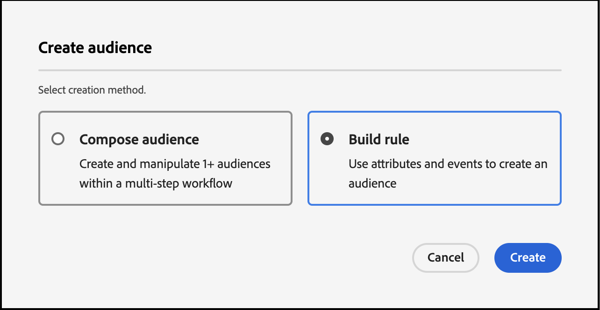

# 使用[!DNL Commerce]事件数据在Real-Time CDP中创建受众

使用从您的[!DNL Commerce]存储区中捕获的事件数据在Real-Time CDP中创建受众。 捕获的数据基于浏览行为、过去的购买、配置文件属性、转化为或转化的倾向、忠诚度状态、高和低客户价值等。

## 应考虑使用哪些数据？

在Real-Time CDP中使用店面、后台和配置文件事件中的数据创建受众。

| 数据类型 | 店面数据（行为事件） | 后台数据（服务器端事件） | 客户个人资料和区段数据 |
|---|---|---|---|
| **定义** | 客户在您的网站上采取的点击或操作。 | 关于生命周期的信息和每个订单的详细信息（过去和当前）。 | 您的购物者是谁，他们符合哪些区段的条件。 |
| Adobe Commerce捕获的&#x200B;**事件** | [productPageView](events.md#productpageview) [addToCart](events.md#addtocart) | [placeOrder](events.md#completecheckout) [orderplaced](events-backoffice.md#orderplaced) [orderLineItemRefrained](events-backoffice.md#orderlineitemrefunded) [已取消订单](events-backoffice.md#ordercancelled) [订单历史记录](connect-data.md#send-historical-order-data) | [createAccount](events.md#createaccount) [editAccount](events.md#editaccount) [个人资料记录](events-profilerecord.md) |

## 其他客户取得了哪些成就？

Adobe [!DNL Commerce]客户通过激活内置于Real-Time CDP中的受众并将它们部署到其[!DNL Commerce]实例中，实现了显着的业务影响。

一家全球多品牌服装零售商实现了：

- 一个拥有数百万统一客户档案的真实来源
- 创建了40多个独特的“高意图客户”受众来参与各个渠道

一家全球饮料公司收集到：

- 来自100多个国家/地区的9,800万客户档案

## 让我们开始吧

在本篇文章中，您将了解如何：

- 根据事件收集的[!DNL Commerce]数据在Real-Time CDP中创建受众
- 为您的[!DNL Commerce]存储激活该受众
- 使用[!DNL Commerce]中的受众通知购物车价格规则

>[!IMPORTANT]
>
>使用您的[!DNL Commerce]沙盒环境完成本文中所述的任务。 这可确保您发送到Experience Platform的店面和后台事件数据不会稀释生产事件数据。

### 先决条件

在开始之前，请确保：

- 您已配置为使用Real-Time CDP。 如果您不确定，请咨询您的系统集成商或管理项目和环境的开发团队。
- 您[已在[!DNL Commerce]中安装](install.md)并[配置了](connect-data.md) [!DNL Data Connection]扩展。
- 您[已确认](connect-data.md#confirm-that-event-data-is-collected)您的[!DNL Commerce]事件数据已到达Experience Platform Edge。

### 1.创建受众

受众是指一组具有相似行为或特征的客户。 在本练习中，您将创建一个受众，该受众可使对您商店中的特定产品感兴趣的人员符合条件。

要简化此练习，请使用[productPageView](events.md#productpageview)事件中的事件数据。 此事件可捕获有关所查看产品的详细信息，如产品名称、SKU、价格等。

使用此事件数据指定受众包括至少有一个“产品查看”事件的个人，其中SKU（产品标识符）等于网站上的特定产品，并且该事件发生在前一天。&#x200B;AEM

1. 打开Experience Platform并从左侧导航菜单中选择&#x200B;**[!UICONTROL Audiences]**。

   

1. 单击&#x200B;**[!UICONTROL Create Audience]**。

   

   将显示&#x200B;**区段生成器**&#x200B;工作区。

1. 在&#x200B;**区段生成器**&#x200B;工作区中，选择&#x200B;**生成规则**&#x200B;创建方法。

   

   在&#x200B;**区段生成器**&#x200B;工作区中，您可以为受众定义规则和条件&#x200B;。 这些规则和条件基于Commerce存储中的事件和配置文件数据，并定义了用于确定用户是否符合受众条件的条件。 例如，您可以创建一个规则，以包含查看过特定产品的用户或在特定时间段内购买过产品的用户。 了解有关[区段生成器](https://experienceleague.adobe.com/zh-hans/docs/experience-platform/segmentation/ui/segment-builder)以及规则和条件的更多信息。

1. 选择[事件](https://experienceleague.adobe.com/zh-hans/docs/experience-platform/segmentation/ui/segment-builder#events)选项卡。

   

1. 搜索“产品查看”事件类型。 然后，将其拖放到&#x200B;**区段生成器**&#x200B;工作区中。

1. 返回&#x200B;**事件**&#x200B;选项卡并搜索“SKU”，它是`productListItems`字段下的数据字段。 将其拖放到&#x200B;**产品视图**&#x200B;事件上的&#x200B;**区段生成器**&#x200B;工作区。

   此时将显示&#x200B;**事件规则**&#x200B;部分，您可以在其中指定要从中构建受众的特定产品。

   

1. 通过单击&#x200B;**任意时间**&#x200B;并选择值为&#x200B;*1*&#x200B;的&#x200B;*In last*，将时间间隔设置为1天。

   构建受众时，您可以指定时间间隔来捕获最近的活动。 通过设置时间间隔，可根据用户最近在特定时间范围内的交互或行为来定位用户。

1. 在工作区右侧的&#x200B;**受众属性**&#x200B;部分中，通过为受众提供名称、描述和评估方法来设置受众属性。

1. 要保存受众，请单击&#x200B;**[!UICONTROL Save and Close]**。

   受众的详细信息显示在&#x200B;**受众**&#x200B;仪表板上。

### 2.将受众激活到[!DNL Commerce]目标

您通过为[!DNL Commerce]目标激活受众，使其在[!DNL Commerce]中可用。

>[!IMPORTANT]
>
>如果您尚未将[!DNL Commerce]设置为接收数据的可用目标，请参阅[Adobe [!DNL Commerce] 连接](https://experienceleague.adobe.com/zh-hans/docs/experience-platform/destinations/catalog/personalization/adobe-commerce)主题。

1. 在受众的&#x200B;**详细信息**&#x200B;选项卡中，单击&#x200B;**激活到目标**。

1. 选择您的[!DNL Commerce]目标。 然后，单击&#x200B;**下一步**。

1. 单击&#x200B;**[!UICONTROL Finish]**&#x200B;完成激活过程。

## 3.在受众功能板中查看受众

在[!DNL Commerce]中，您可以使用&#x200B;**Real-Time CDP Audiences**&#x200B;仪表板查看可为您的[!DNL Commerce]实例个性化的所有[活动](https://experienceleague.adobe.com/zh-hans/docs/experience-platform/destinations/ui/activate/activate-edge-personalization-destinations)受众。

要访问&#x200B;**Real-Time CDP受众**&#x200B;仪表板，请转到&#x200B;_管理员_&#x200B;侧栏，然后转到&#x200B;**[!UICONTROL Customers]** > **[!UICONTROL Real-time CDP Audience]**。

在仪表板中，查找您创建的受众。 请注意，购物车价格规则或动态块中并未使用它。 在下一部分中，您将受众链接到购物车价格规则。

### 4.根据受众创建购物车价格规则

此部分将向您展示如何根据新受众创建购物车价格规则。

1. 确认新受众显示在&#x200B;**Real-Time CDP Audiences**&#x200B;仪表板中。
1. [创建购物车价格规则](https://experienceleague.adobe.com/zh-hans/docs/commerce-admin/marketing/promotions/cart-rules/price-rules-cart-create)。
1. [使用新受众设置购物车价格规则的条件](https://experienceleague.adobe.com/zh-hans/docs/commerce-admin/marketing/promotions/cart-rules/price-rules-cart-create#use-real-time-cdp-audiences-to-set-a-condition)。
1. [设置将产品添加到购物车时要执行的操作](https://experienceleague.adobe.com/zh-hans/docs/commerce-admin/marketing/promotions/cart-rules/price-rules-cart-create#step-3-define-the-actions)。
1. 继续配置购物车价格规则。
1. 转到沙盒实例的客户视图。
1. 将基于受众的产品添加到购物车。 请注意，购物车价格规则已启用。

## 总结

在本练习中，您在Real-Time CDP中创建了一个受众并将其激活到[!DNL Commerce]目标。 然后，在[!DNL Commerce]管理员中，您根据该受众创建了一个购物车价格规则，并在您的沙盒环境中启用了该规则。
