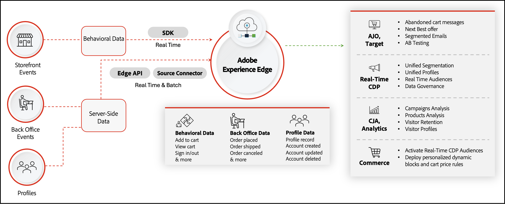

# [!DNL Data Connection]简介

>[!IMPORTANT]
>
>Experience Platform连接器已重命名为[!DNL Data Connection]。

[!DNL Data Connection]扩展将您的Adobe Commerce Web实例连接到Adobe Experience Platform和Edge Network。 对于移动设备应用程序开发人员，您可以将Adobe Experience Platform Mobile SDK与Commerce结合使用，以捕获Commerce数据并将其发送到Experience Platform。 [了解详情](./mobile-sdk-epc.md)。

多网站商家可以为每个网站配置适用的[!DNL Data Connection]设置，包括Experience Platform沙盒选择。 对于全局与网站范围的字段，请参阅[将Commerce数据连接到Adobe Experience Platform](connect-data.md#configuration-scope)。

您的Commerce商店包含大量数据。 有关您的购物者如何浏览、查看以及最终购买您网站上的产品的信息可能会揭示创造更个性化购物体验的机会。 虽然这些数据可以为本机Commerce功能（如购物车价格规则和动态块）提供信息，但数据仍会孤立在您的Commerce实例中。

Adobe Experience Platform提供了一套技术，当与Commerce商店中的数据结合后，可以将这些数据通过Edge Network分发到其他Adobe DX产品，以解锁关于购物者购买行为的洞察。 借助这些深入的见解，您可以跨所有渠道创建更加个性化的购物体验。

下图显示了安装和配置[!DNL Data Connection]扩展后，Commerce数据如何从您的商店流向其他Adobe DX产品。

在上图中，您的行为、后台和客户配置文件数据使用SDK、API和源连接器发送到Experience Platform Edge。 您无需完全了解这些部分的工作方式，因为扩展会为您处理数据共享的复杂性。 当事件数据位于边缘时，您可以在下游Adobe DX产品（如[Real-Time CDP](https://experienceleague.adobe.com/docs/experience-platform/rtcdp/intro/rtcdp-intro/overview.html?lang=zh-Hans#)、[Customer Journey Analytics](https://experienceleague.adobe.com/docs/analytics-platform/using/cja-overview/cja-overview.html?lang=zh-Hans)、[Adobe Analytics](https://experienceleague.adobe.com/docs/analytics/analyze/admin-overview/analytics-overview.html?lang=zh-Hans)和[Journey Optimizer](https://experienceleague.adobe.com/docs/journey-optimizer/using/get-started/get-started.html?lang=zh-Hans)）中使用它。 有关引导式示例，请参阅[使用Adobe Journey Optimizer发送放弃的购物车电子邮件](using-ajo.md)和[使用Commerce事件数据在Real-Time CDP中创建受众](create-audience.md)。

## 将Experience Platform数据提取回Commerce

使用[!DNL Data Connection]扩展将Commerce数据发送到Experience Platform是Commerce数据共享功能的一部分。 另一端（可选扩展）称为[Audience Activation](https://experienceleague.adobe.com/docs/commerce-admin/customers/audience-activation.html?lang=zh-Hans)。 利用此扩展，可在Real-Time CDP中构建受众，并将这些受众部署到Commerce商店，以告知购物车价格规则、相关产品规则和动态块。

从较高层面来看，从Commerce存储到Experience Platform并通过Audience Activation扩展返回的数据流如下所示：

![[!DNL Data Connection]流量](assets/data-connection.png)

在设置Commerce到Experience Platform和Experience Platform到Commerce之间的连接后，数据将继续流动。 您无需重新连接，除非升级时要求重新连接。

## 概念

在这两个系统之间共享数据需要您了解多个概念。

- **数据类型** — [!DNL Data Connection]从浏览器收集&#x200B;**行为（店面）**&#x200B;数据、从Commerce服务器收集&#x200B;**后台**&#x200B;数据和&#x200B;**配置文件**&#x200B;数据。 管理员标签店面集合&#x200B;**店面活动**。 有关完整分类，请参阅[Commerce数据的类型](data-ingestion.md)。

- **行为（店面）数据** — 从网站上的购物者交互中捕获，如`addToCart`、`pageView`、`startCheckout`和`completeCheckout`。 查看[店面活动](events.md#storefront-events)。

- **后台数据** — 已在Commerce服务器上捕获，包括[订单状态](events-backoffice.md#order-status)事件，如[`orderPlaced`](events-backoffice.md#orderplaced)和[`orderShipped`](events-backoffice.md#ordershipmentcompleted)。 查看[后台事件](events-backoffice.md)。

- **配置文件记录** — 在Commerce中创建购物者配置文件时发送的快照数据。 查看[配置文件记录](events-profilerecord.md)和[更新配置文件记录架构](profile-data.md)。

- **配置文件事件** — 服务器上配置文件生命周期更改的时间系列事件。 查看[客户个人资料事件](events-backoffice.md#customer-profile-events)。

- **Experience Platform和Edge Network** — 大多数Adobe DX产品的数据仓库。 发送到Experience Platform的数据会通过Experience Platform Edge Network传播到Adobe DX产品中。 例如，您可以启动Journey Optimizer，从边缘检索特定的Commerce事件数据，并在Journey Optimizer中构建一个弃用的购物车电子邮件。 然后，如果Commerce商店中有任何放弃的购物车，Journey Optimizer可以发送该电子邮件。 了解有关[Experience Platform和Edge Network](https://experienceleague.adobe.com/docs/platform-learn/data-collection/web-sdk/overview.html?lang=zh-Hans)的更多信息。

- **架构** — 架构描述正在发送的数据的结构。 在Experience Platform能够摄取Commerce数据之前，您必须构建一个描述数据结构的架构并为每个字段中可以包含的数据类型提供限制。 架构由一个基类以及零个或多个架构字段组组成。 该架构使用XDM结构，所有Adobe DX产品均可读取该结构。 该架构可确保所有DX产品均可识别发送到Experience Platform的数据。 了解有关[架构](https://experienceleague.adobe.com/docs/experience-platform/xdm/home.html?lang=zh-Hans)的更多信息。

- **数据集** — 数据集合的存储和管理结构，通常是包含架构（列）和字段（行）的表。 数据集还包含描述其存储的数据的各个方面的元数据。 所有成功引入Adobe Experience Platform的数据都包含在数据集中。 了解有关[数据集](https://experienceleague.adobe.com/docs/experience-platform/catalog/datasets/overview.html?lang=zh-Hans)的更多信息。

- **数据流** — 允许数据从Adobe Experience Platform流向其他Adobe DX产品的ID。 此ID必须关联到您的特定Adobe Commerce实例中的特定网站。 创建此数据流时，请指定您在上面创建的XDM架构。 了解有关[数据流](https://experienceleague.adobe.com/docs/experience-platform/datastreams/overview.html?lang=zh-Hans)的更多信息。

## 支持的架构

[!DNL Data Connection]扩展在以下体系结构上可用：

- PHP/Luma
- [PWA Studio](https://developer.adobe.com/commerce/pwa-studio/integrations/adobe-commerce/aep/)
- [AEM](https://experienceleague.adobe.com/docs/experience-manager-cloud-service/content/content-and-commerce/integrations/aep.html?lang=zh-Hans)

>[!BEGINSHADEBOX]

## 先决条件

要使用[!DNL Data Connection]扩展，您必须具备以下条件：

- Adobe Commerce 2.4.4或更高版本
- Adobe ID和组织ID
- 收集店面事件数据所需的[Adobe客户端数据层(ACDL)](https://experienceleague.adobe.com/docs/experience-platform/tags/extensions/client/client-data-layer/overview.html?lang=zh-Hans)
- 对其他Adobe DX产品的权限。

>[!ENDSHADEBOX]

## 启用扩展 {#enable-extension}

从较高层面来看，启用[!DNL Data Connection]扩展涉及以下步骤：

1. [安装](install.md) [!DNL Data Connection]扩展。
1. [登录](https://helpx.adobe.com/cn/manage-account/using/access-adobe-id-account.html)您的Adobe帐户并[查看以确认](https://experienceleague.adobe.com/docs/core-services/interface/administration/organizations.html?lang=zh-Hans#concept_EA8AEE5B02CF46ACBDAD6A8508646255)您的组织ID。 组织ID是与您配置的Experience Cloud公司关联的ID。 此ID是由24个字符组成的字母数字字符串，其后跟（且必须包括）`@AdobeOrg`。
1. 确保您具有Experience Platform[&#128279;](https://experienceleague.adobe.com/docs/experience-platform/collection/permissions.html?lang=zh-Hans)中数据收集的权限。
1. 查看您可以收集和发送的[类型数据](data-ingestion.md)。
1. 使用特定于Commerce的字段组创建或更新您的[时间序列事件架构](update-xdm.md)或[配置文件记录数据架构](profile-data.md)。
1. [根据您创建或更新的架构创建数据集](https://experienceleague.adobe.com/docs/platform-learn/implement-mobile-sdk/experience-cloud/platform.html?lang=zh-Hans#create-a-dataset)。 此数据集包含发送到Experience Platform Edge的Commerce数据。
1. [创建数据流](https://experienceleague.adobe.com/docs/experience-platform/datastreams/overview.html?lang=zh-Hans)并选择包含Commerce特定字段组的XDM架构。
1. [连接到Commerce服务](../landing/saas.md)。
1. [连接到Adobe Experience Platform](connect-data.md)。

本指南的其余部分将更详细地介绍所有这些步骤，以便您快速了解并开始在Commerce商店中使用Adobe DX产品的强大功能。

>[!NOTE]
>
>对于移动设备开发人员，了解如何[将](./mobile-sdk-epc.md) Adobe Experience Platform Mobile SDK与Commerce集成。

## HIPAA准备就绪

[!DNL Data Connection]扩展允许您与Experience Platform共享[!DNL Commerce]后台数据并维护HIPAA合规性。 [了解详情](hipaa-readiness.md)。

## 受众

本指南专为希望丰富和个性化其Commerce商店以提升客户购物体验的Adobe Commerce商家而设计。

## 支持

如果您需要本指南中未涉及的信息或问题，请使用以下资源：

- [帮助中心](https://experienceleague.adobe.com/docs/commerce-knowledge-base/kb/overview.html?lang=zh-Hans){target="_blank"}
- [支持票证](https://experienceleague.adobe.com/docs/commerce-knowledge-base/kb/help-center-guide/magento-help-center-user-guide.html?lang=zh-Hans#submit-ticket){target="_blank"} — 提交票证以接收其他帮助。
