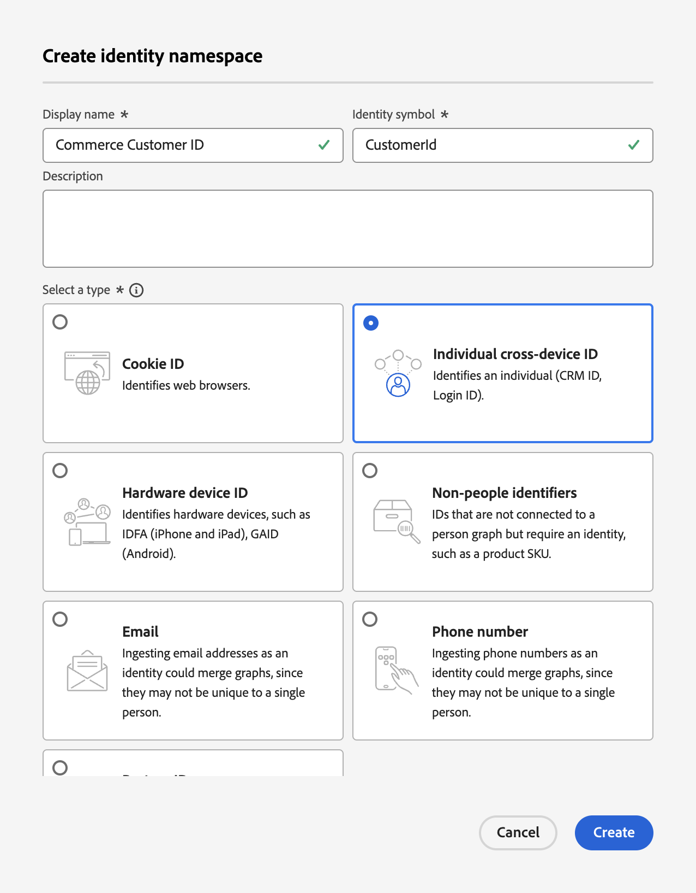

# 更新Commerce数据摄取的配置文件记录架构

当您的购物者在Commerce网站中创建配置文件时，将创建配置文件记录并捕获数据。 您必须先创建特定于配置文件记录的架构和数据集，然后才能将该配置文件数据流式传输到Experience Platform。

1. [创建](https://experienceleague.adobe.com/zh-hans/docs/experience-platform/xdm/ui/resources/schemas)架构并将类设置为&#x200B;**个人资料**。

1. [添加](https://experienceleague.adobe.com/zh-hans/docs/experience-platform/xdm/ui/resources/schemas)以下特定于配置文件的字段组：

   - identityMap
   - 人口统计详细信息
   - 个人联系人详细信息
   - 用户帐户详细信息

1. [为配置文件启用](https://experienceleague.adobe.com/zh-hans/docs/experience-platform/xdm/ui/resources/schemas)架构。

   为配置文件启用某个架构后，从该架构创建的任何数据集都将参与Real-Time CDP，后者将合并来自不同源的数据，以构建每个客户的完整视图。

1. [基于您创建或更新的架构创建数据集](https://experienceleague.adobe.com/zh-hans/docs/platform-learn/implement-mobile-sdk/experience-cloud/platform)。

   数据集是用于数据集合的存储和管理结构，通常是包含架构（列）和字段（行）的表。 数据集还包含描述其存储的数据的各个方面的元数据。

1. 在Experience Platform中创建包含以下值的[自定义命名空间](https://experienceleague.adobe.com/zh-hans/docs/experience-platform/identity/features/namespaces#create-namespaces)：

   - **显示名称**：_Commerce客户ID_
   - **标识符号**： _CustomerId_
   - **类型**： _单个跨设备ID_

   {width="700" zoomable="yes"}

   单击&#x200B;**[!UICONTROL Create]**。 统一配置文件服务使用自定义命名空间来拼合配置文件片段。

为客户个人资料记录数据配置了架构、数据集和自定义命名空间，您可以[配置](connect-data.md#data-collection)您的Commerce实例以收集该数据并将该数据发送到Experience Platform。

要为行为和后台事件数据创建架构、数据集和数据流，请参阅为Commerce数据引入更新[时序事件架构](update-xdm.md)。
