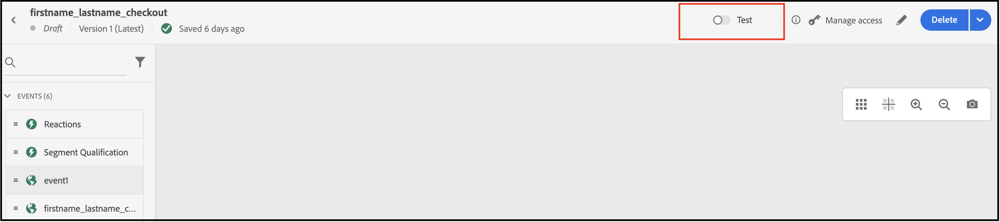

# 使用Adobe Journey Optimizer发送放弃的购物车电子邮件

了解如何在购物车或浏览器会话已被放弃时发送个性化的重新参与电子邮件或通知。 在本篇文章中，您将使用从查看过许多产品和类别、参与过某个产品或在一个页面上花费时间的客户那里生成的数据。

## 应考虑使用哪些数据？

使用店面和后台事件的数据构建放弃的购物车、浏览电子邮件或通知。

| 数据类型 | 店面数据（行为事件） | 后台数据（服务器端事件） |
|---|---|---|
| **定义** | 客户在您的网站上采取的点击或操作。 | 关于生命周期的信息和每个订单的详细信息（过去和当前）。 |
| Adobe Commerce捕获的&#x200B;**事件** | [pageView](https://experienceleague.adobe.com/en/docs/commerce/data-connection/event-forwarding/events#pageview)<br>[productPageView](https://experienceleague.adobe.com/en/docs/commerce/data-connection/event-forwarding/events)<br>[addToCart](https://experienceleague.adobe.com/en/docs/commerce/data-connection/event-forwarding/events#addtocart)<br>[openCart](https://experienceleague.adobe.com/en/docs/commerce/data-connection/event-forwarding/events#opencart)<br>[startCheckout](https://experienceleague.adobe.com/en/docs/commerce/data-connection/event-forwarding/events#startcheckout)<br>[completeCheckout](https://experienceleague.adobe.com/en/docs/commerce/data-connection/event-forwarding/events#completecheckout) | [订购位置](https://experienceleague.adobe.com/en/docs/commerce/data-connection/event-forwarding/events-backoffice#orderplaced)<br>[订购历史记录](https://experienceleague.adobe.com/en/docs/commerce/data-connection/fundamentals/connect-data#send-historical-order-data) |

### 其他客户取得了哪些成就？

Adobe [!DNL Commerce]客户通过使用Adobe [!DNL Commerce]、Adobe [!DNL Journey Optimizer]和Adobe [!DNL Real-Time CDP]实施个性化的放弃促销活动，取得了显着的业务影响。

一家全球多品牌服装零售商实现了：

- 来自新营销活动的1.9倍点击转化率
- 来自全渠道弃用之旅的收入增加57%
- 重新参与活动的转化率提高41%
- 每周有1000多名新购物者参与

一家全球饮料公司实现了：

- 36%的重新参与电子邮件打开率
- 点进率提高21%
- 转化率提升了8.5%
- 89%的重新参与放弃者改变了

## 让我们开始吧

此特定用例侧重于使用来自[!DNL Commerce]实例的数据创建已放弃的购物车电子邮件，并将其发送到Adobe [!DNL Journey Optimizer]。

### 什么是Adobe Journey Optimizer？

[Adobe Journey Optimizer](https://experienceleague.adobe.com/docs/journey-optimizer/using/get-started/get-started.html)帮助您为购物者打造个性化的商业体验。 例如，您可以使用Journey Optimizer创建和投放计划的营销活动，如零售商店的每周促销活动，或者，如果客户将产品添加到购物车，但未完成结账过程，则生成放弃的购物车电子邮件。

在本主题中，您将学习如何通过侦听从您的[!DNL Commerce]实例生成的`checkout`事件并在Journey Optimizer中响应该事件来构建放弃的购物车电子邮件。

>[!IMPORTANT]
>
>出于演示目的，请使用您的[!DNL Commerce]沙盒环境，以便不会将生产事件数据稀释为您发送到Experience Platform的店面和后台事件数据。

### 先决条件

在开始这些步骤之前，请确保：

- 您已配置为使用Adobe [!DNL Journey Optimizer]。 如果您不确定，请咨询您的系统集成商或管理项目和环境的开发团队。
- 您[已在[!DNL Commerce]中安装](install.md)并[配置了](connect-data.md) [!DNL Data Connection]扩展。
- 您[已确认](connect-data.md#confirm-that-event-data-is-collected)您的[!DNL Commerce]事件数据已到达Experience Platform Edge。

## 步骤1：在[!DNL Commerce]沙盒环境中创建用户

在您的沙盒环境中创建一个用户，并确认该用户帐户信息显示在Experience Platform中。 请确保您指定的电子邮件有效，因为稍后在此部分中会使用该电子邮件发送放弃的购物车电子邮件。

1. 在[!DNL Commerce]沙盒环境中登录或创建帐户。

   {width="700" zoomable="yes"}

   安装并配置[!DNL Data Connection]扩展后，此帐户信息将作为配置文件发送到Experience Platform。

1. 确认您的用户帐户信息显示在Experience Platform的&#x200B;**[!UICONTROL Profile]**&#x200B;部分中。

   转到Adobe Experience Platform中的&#x200B;**[!UICONTROL Profiles]**。 单击配置文件中的&#x200B;**[!UICONTROL Detail]**&#x200B;查看您创建的配置文件。

   {width="700" zoomable="yes"}

## 步骤2：在Journey Optimizer中查看事件

在您的[!DNL Commerce]沙盒环境中，通过查看产品页面、将项目添加到购物车以及完成购物者将执行的各种其他活动来触发店面上的事件。 然后，确认这些事件正在流入Journey Optimizer。

1. 启动[Adobe Journey Optimizer](https://experienceleague.adobe.com/docs/journey-optimizer/using/get-started/user-interface.html)。
1. 选择&#x200B;**[!UICONTROL Profiles]**。
1. 将&#x200B;**[!UICONTROL Identity namespace]**&#x200B;设置为`Email`。
1. 将&#x200B;**[!UICONTROL Identity value]**&#x200B;设置为您的电子邮件地址。
1. 选择您的个人资料，然后选择&#x200B;**[!UICONTROL Events]**&#x200B;选项卡。

   {width="700" zoomable="yes"}

   查找`commerce.checkouts`事件并检查事件有效负载：

   ```json
   "personID": "84281643067178465783746543501073369488", 
   "eventType": "commerce.checkouts", 
   "_id": "4b41703f-e42e-485b-8d63-7001e3580856-0", 
   "commerce": { 
       "cart": {}, 
       "checkouts": { 
           "value": 1 
       } 
   ```

   如您所见，完整的事件有效负载包含丰富的事件数据。 在下一部分中，您将配置Journey Optimizer中的事件以侦听和响应从您的[!DNL Commerce]店面生成的`commerce.checkouts`事件。

## 步骤3：在Journey Optimizer中配置事件

在Journey Optimizer中配置两个事件：一个事件侦听Commerce中的`commerce.checkouts`事件，另一个是基本超时事件，该事件在触发放弃的购物车电子邮件之前等待特定时间的传递。

### 创建监听程序事件

1. 启动[Adobe Journey Optimizer](https://experienceleague.adobe.com/docs/journey-optimizer/using/get-started/user-interface.html)。

1. 单击左窗格&#x200B;**[!UICONTROL Administration]**&#x200B;部分下的&#x200B;**[!UICONTROL Configurations]**。

1. 在&#x200B;**[!UICONTROL Events]**&#x200B;图块中，单击&#x200B;**[!UICONTROL Manage]**。

   {width="700" zoomable="yes"}

1. 在&#x200B;**[!UICONTROL Events]**&#x200B;页面上，单击&#x200B;**[!UICONTROL Create Event]**。

1. 在右侧导航中，按如下方式设置您的事件：

   1. 将&#x200B;**[!UICONTROL Name]**&#x200B;设置为： `firstname_lastname_checkout`。
   1. 将&#x200B;**[!UICONTROL Type]**&#x200B;设置为&#x200B;**[!UICONTROL Unitary]**。
   1. 将&#x200B;**[!UICONTROL Event id typ]e**&#x200B;设置为&#x200B;**[!UICONTROL Rule based]**。
   1. 将&#x200B;**[!UICONTROL Schema]**&#x200B;设置为您的[!DNL Commerce] [架构](update-xdm.md)。
   1. 选择&#x200B;**[!UICONTROL Fields]**&#x200B;以打开&#x200B;**[!UICONTROL Fields]**&#x200B;页面。 然后，选择对此事件有用的字段。 例如，选择&#x200B;**[!UICONTROL Product list items]**、**[!UICONTROL Commerce]**、**[!UICONTROL eventType]**&#x200B;和&#x200B;**[!UICONTROL Web]**&#x200B;下的所有字段。
   1. 单击&#x200B;**[!UICONTROL OK]**&#x200B;以保存所选字段。
   1. 在&#x200B;**[!UICONTROL Event id condition]**&#x200B;字段中单击。 然后，创建一个条件： `eventType`等于`commerce.checkouts`且`personalEmail.address`等于您在上一部分中创建该配置文件时使用的电子邮件地址。

      {width="700" zoomable="yes"}

   1. 单击&#x200B;**[!UICONTROL OK]**。
   1. 单击&#x200B;**[!UICONTROL Save]**&#x200B;以保存您的事件。

### 创建超时事件

1. 像之前一样在Journey Optimizer中创建事件。

1. 在右侧导航中，按如下方式设置您的事件：

   1. 将&#x200B;**[!UICONTROL Name]**&#x200B;设置为： `firstname_lastname_timeout`。
   1. 将&#x200B;**[!UICONTROL Type]**&#x200B;设置为&#x200B;**[!UICONTROL Unitary]**。
   1. 将&#x200B;**[!UICONTROL Event id type]**&#x200B;设置为&#x200B;**[!UICONTROL Rule based]**。
   1. 将&#x200B;**[!UICONTROL Schema]**&#x200B;设置为您的[!DNL Commerce] [架构](update-xdm.md)。
   1. 将&#x200B;**[!UICONTROL Schema]**、**[!UICONTROL Fields]**&#x200B;和&#x200B;**[!UICONTROL Event id condition]**&#x200B;设置为与上述相同。
   1. 单击&#x200B;**[!UICONTROL Save]**&#x200B;以保存您的事件。

配置这两个事件后，创建一个历程，以发送放弃的购物车电子邮件。

## 步骤4：构建结账历程

创建监听`commerce.checkouts`事件的历程，然后在经过指定时间后发送放弃的购物车电子邮件。

1. 在Journey Optimizer中，选择&#x200B;**J[!UICONTROL OURNEY MANAGEMENT]**&#x200B;下的&#x200B;**[!UICONTROL Journeys]**。
1. 单击&#x200B;**[!UICONTROL Create Journey]**。
1. 指定历程的名称。
1. 单击&#x200B;**[!UICONTROL OK]**&#x200B;以保存历程。
1. 在左侧导航中的&#x200B;**[!UICONTROL EVENTS]**&#x200B;部分下，搜索您之前创建的签出事件`firstname_lastname_checkout`，并将其拖放到画布上。

   >[!TIP]
   >
   >双击事件会自动将其添加到画布。

1. 搜索超时事件并将其添加到画布。
1. 双击超时事件。

   1. 在&#x200B;**[!UICONTROL Timeout]**&#x200B;部分中，选中&#x200B;**[!UICONTROL Define the event time]**&#x200B;复选框。
   1. 在&#x200B;**[!UICONTROL Wait for]**&#x200B;字段中输入`1`和`Minute`。
   1. 选中&#x200B;**[!UICONTROL Set a timeout path]**&#x200B;复选框。

   使用此超时配置，执行结账但未在一分钟内完成订单的购物者将触发此超时分支。 在实际生产环境中，您需要设置更长的时间段，如24小时。

1. 在&#x200B;**[!UICONTROL ACTIONS]**&#x200B;下的左侧导航中，将&#x200B;**[!UICONTROL Email]**&#x200B;操作添加到超时分支。 您的历程应如下所示：

   {width="700" zoomable="yes"}

### 创建放弃的购物车电子邮件

创建在检测到放弃的购物车时发送的放弃的购物车电子邮件。

1. 在上面创建的历程中，双击画布上的&#x200B;**[!UICONTROL Email]**&#x200B;图标。

1. 按照Journey Optimizer指南中的[步骤](https://experienceleague.adobe.com/docs/journey-optimizer/using/content-management/personalization/personalization-use-cases/personalization-use-case-helper-functions.html#configure-email)创建放弃的购物车电子邮件。

现在，您在Journey Optimizer中有一个历程，该历程侦听来自您的[!DNL Commerce]商店的`commerce.checkouts`事件，以及一个在一段时间后发送的已放弃购物车电子邮件。 下一部分将向您展示如何测试旅程。

## 步骤5：实时触发签出事件

在此部分中，您将实时测试事件。

1. 在Journey Optimizer中，切换测试模式。

   {width="700" zoomable="yes"}

1. 要实时测试此历程，请打开另一个浏览器选项卡，然后转到沙盒环境中的[!DNL Commerce]网站。

   1. 将产品添加到购物车。
   1. 转到结帐页面。
   1. 在结账页面中，通过返回主页或关闭选项卡来放弃购物车。

      旅程现在会触发。 要进行确认，请在Journey Optimizer中打开包含您的旅程的选项卡。 您应该会看到一个绿色箭头，其中显示用户经历的路径。

1. 检查收件箱中的电子邮件。
