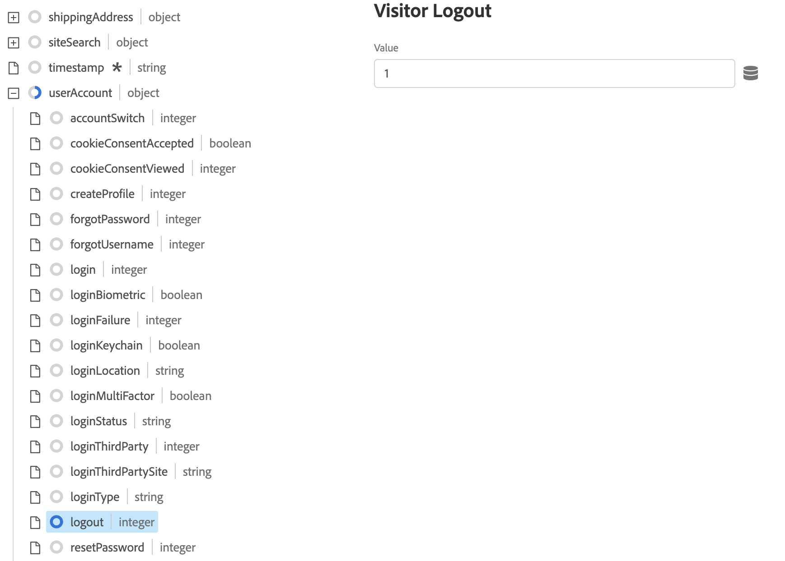
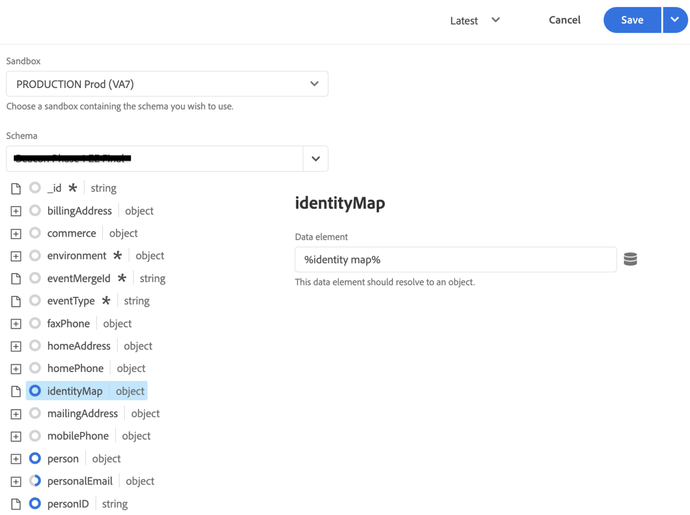

# 使用Adobe Experience Platform Tags收集Commerce数据

虽然您可以使用[!DNL Data Connection]扩展发布和订阅店面活动，但一些商家可能已经在使用数据收集解决方案，例如[Adobe Experience Platform标记](https://experienceleague.adobe.com/docs/platform-learn/data-collection/tags/create-a-property.html)。 对于这些商家，Adobe Commerce在使用Adobe Commerce Event SDK的[!DNL Data Connection]扩展中提供仅发布选项。

![[!DNL Data Connection]扩展数据流](assets/tags-data-flow.png)
_[!DNL Data Connection]带有标记的扩展数据流_

在本主题中，您将了解如何将[!DNL Data Connection]扩展提供的店面事件值映射到您已在使用的Adobe Experience Platform标记解决方案。

## 从Adobe Commerce收集事件数据

收集Commerce事件数据：

- 安装[Adobe Commerce Events SDK](https://github.com/adobe/commerce-events/tree/main/packages/storefront-events-sdk)。 有关PHP店面，请参阅[安装](install.md)主题。 有关PWA Studio店面，请参阅[PWA Studio指南](https://developer.adobe.com/commerce/pwa-studio/integrations/adobe-commerce/aep/)。

  >[!NOTE]
  >
  > 请&#x200B;**不** [配置](connect-data.md)组织ID和数据流ID。

## 将Commerce店面数据映射到Adobe Experience Platform

要将Commerce店面数据映射到Adobe Experience Platform，请从Adobe Experience Platform标记中配置并安装以下内容：

1. [在Adobe Experience Platform数据收集中设置标记属性](https://experienceleague.adobe.com/docs/platform-learn/implement-in-websites/configure-tags/create-a-property.html)。

1. 在&#x200B;**创作**&#x200B;下，选择&#x200B;**扩展**&#x200B;并安装和配置以下扩展：

   - [Adobe客户端数据层](https://experienceleague.adobe.com/docs/experience-platform/tags/extensions/client/client-data-layer/overview.html)

   - [Adobe Experience Platform Web SDK](https://experienceleague.adobe.com/docs/experience-platform/edge/fundamentals/installing-the-sdk.html)

1. [将标记](https://experienceleague.adobe.com/docs/experience-platform/tags/publish/overview.html)发布到开发环境。

1. 按照下面的&#x200B;**事件映射**&#x200B;步骤配置特定事件的数据元素和规则。

### 事件映射

由于使用标记的数据收集与使用Adobe Commerce事件SDK的数据收集不同，因此了解这两个框架中使用的等效术语很重要。

| Adobe Experience Platform标记术语 | Adobe Commerce事件SDK术语 |
|---|---|
| _数据元素_ | 上下文 |
| _规则_ | 事件 |
|  | _规则条件_ — 事件侦听器（从ACDL）<br><br>_规则操作_ — 事件处理程序(发送到Adobe Experience Platform) |

使用特定于Adobe Commerce的事件数据更新Adobe Experience Platform标记中的数据元素和规则时，您需要执行一些常用步骤。

例如，让我们将Adobe Commerce `signOut`事件添加到Adobe Experience Platform标记。 除了您设置的特定值之外，下面列出的步骤说明了如何添加[数据元素](https://experienceleague.adobe.com/docs/experience-platform/collection/e2e.html#data-element)和[规则](https://experienceleague.adobe.com/docs/experience-platform/collection/e2e.html#create-a-rule)，这些规则适用于您添加到标记的所有Adobe Commerce事件。

1. 创建数据元素：

   
   _创建新数据元素_

1. 将&#x200B;**Name**&#x200B;设置为`sign out`。

1. 将&#x200B;**扩展**&#x200B;设置为`Adobe Experience Platform Web SDK`。

1. 将&#x200B;**数据元素类型**&#x200B;设置为`XDM object`。

1. 选择要更新的&#x200B;**沙盒**&#x200B;和&#x200B;**架构**。

1. 在&#x200B;**用户帐户** > **注销**&#x200B;下，将&#x200B;**访客注销**&#x200B;中的&#x200B;**值**&#x200B;设置为`1`。

   
   _更新注销值_

1. 选择&#x200B;**保存**。

1. 创建规则：

   
   _创建新规则_

1. 选择&#x200B;**EVENTS**&#x200B;下的&#x200B;**添加**。

1. 将&#x200B;**扩展**&#x200B;设置为`Adobe Client Data Layer`。

1. 将&#x200B;**事件类型**&#x200B;设置为`Data Pushed`。

1. 选择&#x200B;**特定事件**&#x200B;并将&#x200B;**事件/密钥设置为`sign-out`以注册**。

1. 选择&#x200B;**保留更改**&#x200B;以保存新规则。

1. 添加操作。

1. 将&#x200B;**扩展**&#x200B;设置为`Adobe Experience Platform Web SDK`。

1. 将&#x200B;**操作类型**&#x200B;设置为`Send Event`。

1. 将&#x200B;**实例**&#x200B;设置为`Alloy`。

1. 将&#x200B;**Type**&#x200B;设置为`userAccount.logout`。

1. 将&#x200B;**XDM数据**&#x200B;设置为`%sign out%`。

1. 单击&#x200B;**保存**。

   您在架构中为来自Adobe Commerce的`signOut`事件创建了一个数据元素。 此外，您还创建了一个规则，该规则具有从Adobe Commerce店面触发该事件时应发生的特定操作。

在标签中，为下述每个Adobe Commerce事件重复上述步骤。

## 可用事件

对于以下每个事件，请按照上述步骤将Adobe Commerce事件映射到您的XDM。

- [&#39;注销&#39;](#signout)
- [&#39;登录&#39;](#signin)
- [&#39;createAccount&#39;](#createaccount)
- [&#39;编辑帐户&#39;](#editaccount)
- [&#39;页面视图&#39;](#pageview)
- [&#39;产品视图&#39;](#productview)
- [&#39;searchRequestSent&#39;](#searchrequestsent)
- [&#39;searchResponseReceived&#39;](#searchresponsereceived)
- [&#39;addToCart&#39;](#addtocart)
- [&#39;openCart&#39;](#opencart)
- [&#39;查看购物车&#39;](#viewcart)
- [&#39;removeFromCart&#39;](#removefromcart)
- [&#39;initiateCheckout&#39;](#initiatecheckout)
- [&#39;下单&#39;](#placeorder)

### 注销

购物者尝试注销时触发。

#### 数据元素

创建以下数据元素：

1. 注销：

   - **名称**： `Sign out`
   - **扩展**： `Adobe Experience Platform Web SDK`
   - **数据元素类型**： `XDM object`
   - **字段组**：`userAccount` > `logout`
   - **访客注销**： **值** = `1`

#### 规则 

- **名称**： `Sign out`
- **扩展**： `Adobe Client Data Layer`
- **事件类型**： `Data Pushed`
- **特定事件**： `sign-out`

##### 操作

- **扩展**： `Adobe Experience Platform Web SDK`
- **操作类型**： `Send event`
- **类型**： `userAccount.logout`
- **XDM数据**： `%sign-out%`

### 登录

购物者尝试登录时触发。

#### 数据元素

创建以下数据元素：

1. 帐户电子邮件：

   - **名称**： `account email`
   - **扩展**： `Adobe Client Data Layer`
   - **数据元素类型**： `Data Layer Computed State`
   - **[可选]路径**： `accountContext.emailAddress`

1. 帐户类型：

   - **名称**： `account type`
   - **扩展**： `Adobe Client Data Layer`
   - **数据元素类型**： `Data Layer Computed State`
   - **[可选]路径**： `accountContext.accountType`

1. 帐户ID：

   - **名称**： `account id`
   - **扩展**： `Adobe Client Data Layer`
   - **数据元素类型**： `Data Layer Computed State`
   - **[可选]路径***： `accountContext.accountId`

1. 登录：

   - **名称**： `sign in`
   - **扩展**： `Adobe Experience Platform Web SDK`
   - **数据元素类型**： `XDM object`
   - **字段组**：`person` > `accountID`
   - **帐户ID**： **值** = `%account id%`
   - **字段组**：`person` > `accountType`
   - **帐户类型**： **值** = `%account type%`
   - **字段组**：`person` > `personalEmailID`
   - **个人电子邮件地址**： **值** = `%account email%`
   - **字段组**：`personalEmail` > `address`
   - **地址**： **值** = `%account email%`
   - **字段组**：`userAccount` > `login`
   - **访客登录**： **值** = `1`

#### 规则 

- **名称**： `sign in`
- **扩展**： `Adobe Client Data Layer`
- **事件类型**： `Data Pushed`
- **特定事件**： `sign-in`

##### 操作

- **扩展**： `Adobe Experience Platform Web SDK`
- **操作类型**： `Send event`
- **类型**： `userAccount.login`
- **XDM数据**： `%sign in%`

### createAccount

购物者尝试创建帐户时触发。

#### 数据元素

创建以下数据元素：

1. 帐户电子邮件：

   - **名称**： `account email`
   - **扩展**： `Adobe Client Data Layer`
   - **数据元素类型**： `Data Layer Computed State`
   - **[可选]路径**： `accountContext.emailAddress`

1. 帐户类型：

   - **名称**： `account type`
   - **扩展**： `Adobe Client Data Layer`
   - **数据元素类型**： `Data Layer Computed State`
   - **[可选]路径**： `accountContext.accountType`

1. 帐户ID：

   - **名称**： `account id`
   - **扩展**： `Adobe Client Data Layer`
   - **数据元素类型**： `Data Layer Computed State`
   - **[可选]路径**： `accountContext.accountId`

1. 创建帐户：

   - **名称**： `Create account`
   - **扩展**： `Adobe Experience Platform Web SDK`
   - **数据元素类型**： `XDM object`
   - **字段组**：`person` > `accountID`
   - **帐户ID**： **值** = `%account id%`
   - **字段组**：`person` > `accountType`
   - **帐户类型**： **值** = `%account type%`
   - **字段组**：`person` > `personalEmailID`
   - **个人电子邮件地址**： **值** = `%account email%`
   - **字段组**：`personalEmail` > `address`
   - **地址**： **值** = `%account email%`
   - **字段组**：`userAccount` > `createProfile`
   - **帐户配置文件创建**： **值** = `1`

#### 规则 

- **名称**： `Create account`
- **扩展**： `Adobe Client Data Layer`
- **事件类型**： `Data Pushed`
- **特定事件**： `create-account`

##### 操作

- **扩展**： `Adobe Experience Platform Web SDK`
- **操作类型**： `Send event`
- **类型**： `userAccount.createProfile`
- **XDM数据**： `%create account%`

### editAccount

购物者尝试编辑帐户时触发。

#### 数据元素

创建以下数据元素：

1. 帐户电子邮件：

   - **名称**： `account email`
   - **扩展**： `Adobe Client Data Layer`
   - **数据元素类型**： `Data Layer Computed State`
   - **[可选]路径**： `accountContext.emailAddress`

1. 帐户类型：

   - **名称**： `account type`
   - **扩展**： `Adobe Client Data Layer`
   - **数据元素类型**： `Data Layer Computed State`
   - **[可选]路径**： `accountContext.accountType`

1. 帐户ID：

   - **名称**： `account id`
   - **扩展**： `Adobe Client Data Layer`
   - **数据元素类型**： `Data Layer Computed State`
   - **[可选]路径**： `accountContext.accountId`

1. 编辑帐户：

   - **名称**： `Edit account`
   - **扩展**： `Adobe Experience Platform Web SDK`
   - **数据元素类型**： `XDM object`
   - **字段组**：`person` > `accountID`
   - **帐户ID**： **值** = `%account id%`
   - **字段组**：`person` > `accountType`
   - **帐户类型**： **值** = `%account type%`
   - **字段组**：`person` > `personalEmailID`
   - **个人电子邮件地址**： **值** = `%account email%`
   - **字段组**：`personalEmail` > `address`
   - **地址**： **值** = `%account email%`
   - **字段组**：`userAccount` > `updateProfile`
   - **帐户配置文件创建**： **值** = `1`

#### 规则

- **名称**： `Edit account`
- **扩展**： `Adobe Client Data Layer`
- **事件类型**： `Data Pushed`
- **特定事件**： `edit-account`

##### 操作

- **扩展**： `Adobe Experience Platform Web SDK`
- **操作类型**： `Send event`
- **类型**： `userAccount.updateProfile`
- **XDM数据**： `%edit account%`

### pageView

任何页面加载时触发。

#### 数据元素

创建以下数据元素：

1. 页面名称：

   - **名称**： `page name`
   - **扩展**： `Adobe Client Data Layer`
   - **数据元素类型**： `Data Layer Computed State`
   - **[可选]路径**： `pageContext.pageName`

#### 规则 

- **名称**： `page view`
- **扩展**： `Adobe Client Data Layer`
- **事件类型**： `Data Pushed`
- **特定事件**： `page-view`

##### 操作

- **扩展**： `Adobe Experience Platform Web SDK`
- **操作类型**： `Send event`
- **类型**： `web.webPageDetails.pageViews`
- **XDM数据**： `%page view%`

### 产品视图

任何产品页面加载时触发。

#### 数据元素

创建以下数据元素：

1. 产品名称：

   - **名称**： `product name`
   - **扩展**： `Adobe Client Data Layer`
   - **数据元素类型**： `Data Layer Computed State`
   - **[可选]路径**： `productContext.name`

1. 产品SKU：

   - **名称**： `product sku`
   - **扩展**： `Adobe Client Data Layer`
   - **数据元素类型**： `Data Layer Computed State`
   - **[可选]路径**： `productContext.sku`

1. 产品图像URL：

   - **名称**： `product image`
   - **扩展**： `Adobe Client Data Layer`
   - **数据元素类型**： `Data Layer Computed State`
   - **[可选]路径**： `productContext.mainImageUrl`

1. 产品货币：

   - **名称**： `product currency`
   - **扩展**： `Adobe Client Data Layer`
   - **数据元素类型**： `Data Layer Computed State`
   - **[可选]路径**： `productContext.pricing.currencyCode`

1. 货币代码：

   - **名称**： `currency code`
   - **扩展**： `Core`
   - **数据元素类型**： `Custom Code`
   - **打开编辑器**：

   ```bash
   return _satellite.getVar('product currency') || _satellite.getVar('storefront').storeViewCurrencyCode
   ```

1. 特价：

   - **名称**： `special price`
   - **扩展**： `Adobe Client Data Layer`
   - **数据元素类型**： `Data Layer Computed State`
   - **[可选]路径**： `productContext.pricing.specialPrice`

1. 正常价格：

   - **名称**： `regular price`
   - **扩展**： `Adobe Client Data Layer`
   - **数据元素类型**： `Data Layer Computed State`
   - **[可选]路径**： `productContext.pricing.regularPrice`

1. 产品价格：

   - **名称**： `product price`
   - **扩展**： `Core`
   - **数据元素类型**： `Custom Code`
   - **打开编辑器**：

   ```bash
   return _satellite.getVar('product regular price') || _satellite.getVar('product special price')
   ```

1. 产品视图：

   - **名称**： `product view`
   - **扩展**： `Adobe Experience Platform Web SDK`
   - **数据元素类型**： `XDM object`
   - **字段组**： `productListItems`。 选择&#x200B;**提供单个项目**&#x200B;并单击&#x200B;**添加项目**&#x200B;按钮。 由于此视图适用于PDP，因此您可以使用单个项目进行填充。
   - **字段组**：`productListItems` > `name`
   - **名称**： **值** = `%product name%`
   - **字段组**：`productListItems` > `SKU`
   - **SKU**： **值** = `%product sku%`
   - **字段组**：`productListItems` > `priceTotal`
   - **总价**：**值** = `%product price%`
   - **字段组**：`productListItems` > `currencyCode`
   - **货币代码**： **值** = `%currency code%`
   - **字段组**：`productListItems` > `ProductImageUrl`
   - **ProductImageUrl**： **值** = `%product image%`
   - **字段组**：`commerce` > `productViews` > `value`
   - **值**： **值** = `1`

#### 规则 

- **名称**： `product view`
- **扩展**： `Adobe Client Data Layer`
- **事件类型**： `Data Pushed`
- **特定事件**： `product-page-view`

##### 操作

- **扩展**： `Adobe Experience Platform Web SDK`
- **操作类型**： `Send event`
- **类型**： `commerce.productViews`
- **XDM数据**： `%product view%`

### searchRequestSent

由“键入时搜索”弹出框中的事件以及搜索结果页面上的事件触发。

#### 数据元素

创建以下数据元素：

1. 搜索输入

   - **名称**： `search input`
   - **扩展**： `Adobe Client Data Layer`
   - **数据元素类型**： `Data Layer Computed State`
   - **[可选]路径**： `searchInputContext.units[0]`

1. 搜索输入短语

   - **名称**： `search input phrase`
   - **扩展**： `Core`
   - **数据元素类型**： `Custom Code`
   - **打开编辑器**：

   ```bash
   return _satellite.getVar('search input').phrase;
   ```

1. 搜索输入排序

   - **名称**： `search input sort`
   - **扩展**： `Core`
   - **数据元素类型**： `Custom Code`
   - **打开编辑器**：

   ```bash
   const searchInput = _satellite.getVar('search input');
   const sortFromInput = searchInput ? searchInput.sort : [];
   const sort = sortFromInput.map((searchSort) => {
       return {
           attribute: searchSort.attribute,
           order: searchSort.direction,
       };
   });
   return sort;
   ```

1. 搜索输入筛选器

   - **名称**： `search input filters`
   - **扩展**： `Core`
   - **数据元素类型**： `Custom Code`
   - **打开编辑器**：

   ```bash
   const searchInput = _satellite.getVar('search input');
   const filtersFromInput = searchInput ? searchInput.filter : [];
   const filters = filtersFromInput.map(
       (searchFilter) => {
           let value = [];
           let isRange = false;
           if (searchFilter.eq) {
               value.push(searchFilter.eq);
           } else if (searchFilter.in) {
               value = searchFilter.in;
           } else if (searchFilter.range) {
               isRange = true;
               value.push(String(searchFilter.range.from));
               value.push(String(searchFilter.range.to));
           }
           return {
               attribute: searchFilter.attribute,
               value,
               isRange,
           };
       }
   );
   
   return filters;
   ```

1. 搜索请求：

   - **名称**： `search request`
   - **扩展**： `Adobe Experience Platform Web SDK`
   - **数据元素类型**： `XDM object`
   - **字段组**：`siteSearch` > `phrase`
   - **值**：尚不可用
   - **字段组**： `siteSearch` > `sort`。 选择&#x200B;**提供整个对象**。
   - **字段组**： `siteSearch` > `filter`。 选择&#x200B;**提供整个对象**。
   - **字段组**：`searchRequest` > `id`
   - **唯一标识符**： **值** = `%search request ID%`
   - **字段组**：`searchRequest` > `value`
   - **值**： **值** = `1`

#### 规则 

- **名称**： `search request sent`
- **扩展**： `Adobe Client Data Layer`
- **事件类型**： `Data Pushed`
- **特定事件**： `search-request-sent`

##### 操作

- **扩展**： `Adobe Experience Platform Web SDK`
- **操作类型**： `Send event`
- **类型**： `searchRequest`
- **XDM数据**： `%search request%`

### searchResponseReceived

当Live Search返回“键入时搜索”弹出框或搜索结果页面的结果时触发。

#### 数据元素

创建以下数据元素：

1. 搜索结果：

   - **名称**： `search results`
   - **扩展**： `Adobe Client Data Layer`
   - **数据元素类型**： `Data Layer Computed State`
   - **[可选]路径**： `searchResultsContext.units[0]`

1. 产品的搜索结果编号：

   - **名称**： `search result number of products`
   - **扩展**： `Core`
   - **数据元素类型**： `Custom Code`
   - **打开编辑器**：

   ```bash
   return _satellite.getVar('search result').products.length;
   ```

1. 搜索结果产品：

   - **名称**： `search result products`
   - **扩展**： `Core`
   - **数据元素类型**： `Custom Code`
   - **打开编辑器**：

   ```bash
   const searchResult = _satellite.getVar('search result');
   const productsFromResult = searchResult.products ? searchResult.products : [];
   const products = productsFromResult.map(
       (product) => {
           return { SKU: product.sku, name: product.name };
       }
   );
   return products;
   ```

1. 搜索结果建议：

   - **名称**： `search result products`
   - **扩展**： `Core`
   - **数据元素类型**： `Custom Code`
   - **打开编辑器**：

   ```bash
   const searchResult = _satellite.getVar('search result');
   const suggestionsFromResult = searchResult.suggestions ? searchResult.suggestions : [];
   const suggestions = suggestionsFromResult.map((suggestion) => suggestion.suggestion);
   return suggestions;
   ```

1. 产品图像URL：

   - **名称**： `product image`
   - **扩展**： `Adobe Client Data Layer`
   - **数据元素类型**： `Data Layer Computed State`
   - **[可选]路径**： `productContext.mainImageUrl`

1. 搜索响应：

   - **名称**： `search response`
   - **扩展**： `Adobe Experience Platform Web SDK`
   - **数据元素类型**： `XDM object`
   - **字段组**： `siteSearch` > `suggestions`。 选择&#x200B;**提供整个对象**。
   - **数据元素**： `%search result suggestions%`
   - **字段组**：`siteSearch` > `numberOfResults`
   - **值**： `%search result number of products%`
   - **字段组**： `productListItems`。 选择&#x200B;**提供整个对象**。
   - **字段组**：`productListItems` > `ProductImageUrl`
   - **ProductImageUrl**： **值** = `%product image%`
   - **数据元素**： `%search result products%`
   - **字段组**：`searchResponse` > `id`
   - **唯一标识符**： **值** = `%search response ID%`
   - **字段组**：`searchResponse` > `value`
   - **值**： **值** = `1`

#### 规则 

- **名称**： `search response received`
- **扩展**： `Adobe Client Data Layer`
- **事件类型**： `Data Pushed`
- **特定事件**： `search-response-received`

##### 操作

- **扩展**： `Adobe Experience Platform Web SDK`
- **操作类型**： `Send event`
- **类型**： `searchResponse`
- **XDM数据**： `%search response%`

### addToCart

将产品添加到购物车时或购物车中的产品数量每次递增时触发。

#### 数据元素

创建以下数据元素：

1. 产品名称：

   - **名称**： `product name`
   - **扩展**： `Adobe Client Data Layer`
   - **数据元素类型**： `Data Layer Computed State`
   - **[可选]路径**： `productContext.name`

1. 产品SKU：

   - **名称**： `product sku`
   - **扩展**： `Adobe Client Data Layer`
   - **数据元素类型**： `Data Layer Computed State`
   - **[可选]路径**： `productContext.sku`

1. 货币代码：

   - **名称**： `currency code`
   - **扩展**： `Adobe Client Data Layer`
   - **数据元素类型**： `Data Layer Computed State`
   - **[可选]路径**： `productContext.pricing.currencyCode`

1. 产品特价：

   - **名称**： `product special price`
   - **扩展**： `Adobe Client Data Layer`
   - **数据元素类型**： `Data Layer Computed State`
   - **[可选]路径**： `productContext.pricing.specialPrice`

1. 产品图像URL：

   - **名称**： `product image`
   - **扩展**： `Adobe Client Data Layer`
   - **数据元素类型**： `Data Layer Computed State`
   - **[可选]路径**： `productContext.mainImageUrl`

1. 产品正常价格：

   - **名称**： `product regular price`
   - **扩展**： `Adobe Client Data Layer`
   - **数据元素类型**： `Data Layer Computed State`
   - **[可选]路径**： `productContext.pricing.regularPrice`

1. 产品  价格：

   - **名称**： `product price`
   - **扩展**： `Core`
   - **数据元素类型**： `Custom Code`
   - **打开编辑器**：

   ```bash
   return _satellite.getVar('product regular price') || _satellite.getVar('product special price') 
   ```

1. 购物车：

   - **名称**： `cart`
   - **扩展**： `Adobe Client Data Layer`
   - **数据元素类型**： `Data Layer Computed State`
   - **[可选]路径**： `shoppingCartContext`

1. 购物车ID：

   - **名称**： `cart id`
   - **扩展**： `Core`
   - **数据元素类型**： `Custom Code`
   - **打开编辑器**：

   ```bash
   return _satellite.getVar('cart').id
   ```

1. 添加到购物车：

   - **名称**： `add to cart`
   - **扩展**： `Adobe Experience Platform Web SDK`
   - **数据元素类型**： `XDM object`
   - **字段组**： `productListItems`。 选择&#x200B;**提供单个项目**&#x200B;并单击&#x200B;**添加项目**&#x200B;按钮。 由于此视图适用于PDP，因此您可以使用单个项目进行填充。
   - **字段组**：`productListItems` > `name`
   - **名称**： **值** = `%product name%`
   - **字段组**：`productListItems` > `SKU`
   - **SKU**： **值** = `%product sku%`
   - **字段组**：`productListItems` > `priceTotal`
   - **总价**：**值** = `%product price%`
   - **字段组**：`productListItems` > `currencyCode`
   - **字段组**：`productListItems` > `ProductImageUrl`
   - **ProductImageUrl**： **值** = `%product image%`
   - **货币代码**： **值** = `%currency code%`
   - **字段组**：`commerce` > `cart` > `cartID`
   - **购物车ID**： **值** = `%cart id%`
   - **字段组**：`commerce` > `productListAdds` > `value`
   - **值**： **值** = `1`

#### 规则 

- **名称**： `add to cart`
- **扩展**： `Adobe Client Data Layer`
- **事件类型**： `Data Pushed`
- **特定事件**： `add-to-cart`

##### 操作

- **扩展**： `Adobe Experience Platform Web SDK`
- **操作类型**： `Send event`
- **类型**： `commerce.productListAdds`
- **XDM数据**： `%add to cart%`

### openCart

创建新购物车时触发，在将产品添加到空购物车时发生。

#### 数据元素

创建以下数据元素：

1. 打开购物车：

   - **名称**： `open cart`
   - **扩展**： `Adobe Experience Platform Web SDK`
   - **数据元素类型**： `XDM object`
   - **字段组**：`commerce` > `productListOpens` > `value`
   - **值**： **值** = `1`
   - **字段组**：`commerce` > `cart` > `cartID`
   - **购物车ID**： **值** = `%cart id%`
   - **字段组**： `productListItems`。 对于`productListItems`，可以预计算多个项。 选择&#x200B;**productListItems** > **提供整个数组**。

#### 规则 

- **名称**： `open cart`
- **扩展**： `Adobe Client Data Layer`
- **事件类型**： `Data Pushed`
- **特定事件**： `open-cart`

##### 操作

- **扩展**： `Adobe Experience Platform Web SDK`
- **操作类型**： `Send event`
- **类型**： `commerce.productListOpens`
- **XDM数据**： `%open cart%`

### viewCart

任何购物车页面加载时触发。

#### 数据元素

创建以下数据元素：

1. 店面：

   - **名称**： `storefront`
   - **扩展**： `Adobe Client Data Layer`
   - **数据元素类型**： `Data Layer Computed State`
   - **[可选]路径**： `storefrontInstanceContext`

1. 产品图像URL：

   - **名称**： `product image`
   - **扩展**： `Adobe Client Data Layer`
   - **数据元素类型**： `Data Layer Computed State`
   - **[可选]路径**： `productContext.mainImageUrl`

   1. 购物车：

   - **名称**： `cart`
   - **扩展**： `Adobe Client Data Layer`
   - **数据元素类型**： `Data Layer Computed State`
   - **[可选]路径**： `shoppingCartContext`

1. 购物车ID：

   - **名称**： `cart id`
   - **扩展**： `Core`
   - **数据元素类型**： `Custom Code`
   - **打开编辑器**：

   ```bash
   return _satellite.getVar('cart').id
   ```

1. 产品列表项：

   - **名称**： `product list items:`
   - **扩展**： `Core`
   - **数据元素类型**： `Custom Code`
   - **打开编辑器**：

   ```bash
   const storefrontContext = _satellite.getVar('storefront');
   const cart = _satellite.getVar('cart');
   
   const returnList = [];
   cart.items.forEach(item => {
       const selectedOptions = [];
       item.configurableOptions?.forEach(option => {
           selectedOptions.push({
               attribute: option.optionLabel,
               value: option.valueLabel,
           });
       });
   
       const productListItem = {
           SKU: item.product.sku,
           name: item.product.name,
           quantity: item.quantity,
           priceTotal: item.prices.price.value * item.quantity,
           currencyCode: item.prices.price.currency ? item.prices.price.currency : storefrontContext.storeViewCurrencyCode,
           selectedOptions: selectedOptions,
       };
   
       returnList.push(productListItem);
   });
   return returnList;
   ```

1. 查看购物车：

   - **名称**： `view cart`
   - **扩展**： `Adobe Experience Platform Web SDK`
   - **数据元素类型**： `XDM object`
   - **字段组**： `productListItems`。 对于`productListItems`，可以存在多个预先计算的项。 选择&#x200B;**productListItems** > **填充整个数组**。
   - **数据元素**： `%product list items%`
   - **字段组**：`productListItems` > `ProductImageUrl`
   - **ProductImageUrl**： **值** = `%product image%`
   - **字段组**：`commerce` > `cart` > `cartID`
   - **购物车ID**： **值** = `%cart id%`
   - **字段组**：`commerce` > `productListViews` > `value`
   - **值**： **值** = `1`

#### 规则

- **名称**： `view cart`
- **扩展**： `Adobe Client Data Layer`
- **事件类型**： `Data Pushed`
- **特定事件**： `shopping-cart-view`

##### 操作

- **扩展**： `Adobe Experience Platform Web SDK`
- **操作类型**： `Send event`
- **类型**： `commerce.productListViews`
- **XDM数据**： `%view cart%`

### removeFromCart

当从购物车中删除产品或每次购物车中的产品数量减少时触发。

#### 数据元素

创建以下数据元素：

1. 产品名称：

   - **名称**： `product name`
   - **扩展**： `Adobe Client Data Layer`
   - **数据元素类型**： `Data Layer Computed State`
   - **[可选]路径**： `productContext.name`

1. 产品SKU：

   - **名称**： `product sku`
   - **扩展**： `Adobe Client Data Layer`
   - **数据元素类型**： `Data Layer Computed State`
   - **[可选]路径**： `productContext.sku`

1. 货币代码：

   - **名称**： `currency code`
   - **扩展**： `Adobe Client Data Layer`
   - **数据元素类型**： `Data Layer Computed State`
   - **[可选]路径**： `productContext.pricing.currencyCode`

1. 产品特价：

   - **名称**： `product special price`
   - **扩展**： `Adobe Client Data Layer`
   - **数据元素类型**： `Data Layer Computed State`
   - **[可选]路径**： `productContext.pricing.specialPrice`

1. 产品正常价格：

   - **名称**： `product regular price`
   - **扩展**： `Adobe Client Data Layer`
   - **数据元素类型**： `Data Layer Computed State`
   - **[可选]路径**： `productContext.pricing.regularPrice`

1. 产品  价格：

   - **名称**： `product price`
   - **扩展**： `Core`
   - **数据元素类型**： `Custom Code`
   - **打开编辑器**：

   ```bash
   return _satellite.getVar('product regular price') || _satellite.getVar('product special price') 
   ```

1. 购物车：

   - **名称**： `cart`
   - **扩展**： `Adobe Client Data Layer`
   - **数据元素类型**： `Data Layer Computed State`
   - **[可选]路径**： `shoppingCartContext`

1. 购物车ID：

   - **名称**： `cart id`
   - **扩展**： `Core`
   - **数据元素类型**： `Custom Code`
   - **打开编辑器**：

   ```bash
   return _satellite.getVar('cart').id
   ```

1. 从购物车中移除：

   - **名称**： `remove from cart`
   - **扩展**： `Adobe Experience Platform Web SDK`
   - **数据元素类型**： `XDM object`
   - **字段组**： `productListItems`。 选择&#x200B;**提供单个项目**&#x200B;并单击&#x200B;**添加项目**&#x200B;按钮。 由于此视图适用于PDP，因此您可以使用单个项目进行填充。
   - **字段组**：`productListItems` > `name`
   - **名称**： **值** = `%product name%`
   - **字段组**：`productListItems` > `SKU`
   - **SKU**： **值** = `%product sku%`
   - **字段组**：`productListItems` > `priceTotal`
   - **总价**：**值** = `%product price%`
   - **字段组**：`productListItems` > `currencyCode`
   - **货币代码**： **值** = `%currency code%`
   - **字段组**：`commerce` > `cart` > `cartID`
   - **购物车ID**： **值** = `%cart id%`
   - **字段组**：`commerce` > `productListRemovals` > `value`
   - **值**： **值** = `1`

#### 规则 

- **名称**： `remove from cart`
- **扩展**： `Adobe Client Data Layer`
- **事件类型**： `Data Pushed`
- **特定事件**： `remove-from-cart`

##### 操作

- **扩展**： `Adobe Experience Platform Web SDK`
- **操作类型**： `Send event`
- **类型**： `commerce.productListRemovals`
- **XDM数据**： `%remove from cart%`

### initiateCheckout

购物者单击结帐按钮时触发。

#### 数据元素

创建以下数据元素：

1. 店面：

   - **名称**： `storefront`
   - **扩展**： `Adobe Client Data Layer`
   - **数据元素类型**： `Data Layer Computed State`
   - **[可选]路径**： `storefrontInstanceContext`

1. 产品图像URL：

   - **名称**： `product image`
   - **扩展**： `Adobe Client Data Layer`
   - **数据元素类型**： `Data Layer Computed State`
   - **[可选]路径**： `productContext.mainImageUrl`

1. 购物车：

   - **名称**： `cart`
   - **扩展**： `Adobe Client Data Layer`
   - **数据元素类型**： `Data Layer Computed State`
   - **[可选]路径**： `shoppingCartContext`

1. 购物车ID：

   - **名称**： `cart id`
   - **扩展**： `Core`
   - **数据元素类型**： `Custom Code`
   - **打开编辑器**：

   ```bash
   return _satellite.getVar('cart').id
   ```

1. 产品列表项：

   - **名称**： `product list items`
   - **扩展**： `Core`
   - **数据元素类型**： `Custom Code`
   - **打开编辑器**：

   ```bash
   const storefrontContext = _satellite.getVar('storefront');
   const cart = _satellite.getVar('cart');
   
   const returnList = [];
   cart.items.forEach(item => {
       const selectedOptions = [];
       item.configurableOptions?.forEach(option => {
           selectedOptions.push({
               attribute: option.optionLabel,
               value: option.valueLabel,
           });
       });
   
       const productListItem = {
           SKU: item.product.sku,
           name: item.product.name,
           quantity: item.quantity,
           priceTotal: item.prices.price.value * item.quantity,
           currencyCode: item.prices.price.currency ? item.prices.price.currency : storefrontContext.storeViewCurrencyCode,
           selectedOptions: selectedOptions,
       };
   
       returnList.push(productListItem);
   });
   return returnList;
   ```

1. 启动签出：

   - **名称**： `initiate checkout`
   - **扩展**： `Adobe Experience Platform Web SDK`
   - **数据元素类型**： `XDM object`
   - **字段组**： `productListItems`。 对于`productListItems`，可以存在多个预先计算的项。 选择&#x200B;**productListItems** > **填充整个数组**。
   - **数据元素**： `%product list items%`
   - **字段组**：`productListItems` > `ProductImageUrl`
   - **ProductImageUrl**： **值** = `%product image%`
   - **字段组**：`commerce` > `cart` > `cartID`
   - **购物车ID**： **值** = `%cart id%`
   - **字段组**：`commerce` > `checkouts` > `value`
   - **值**： **值** = `1`

#### 规则 

- **名称**： `initiate checkout`
- **扩展**： `Adobe Client Data Layer`
- **事件类型**： `Data Pushed`
- **特定事件**： `initiate-checkout`

##### 操作

- **扩展**： `Adobe Experience Platform Web SDK`
- **操作类型**： `Send event`
- **类型**： `commerce.checkouts`
- **XDM数据**： `%initiate checkout%`

### placeOrder

购物者下订单时触发。

#### 数据元素

创建以下数据元素：

1. 帐户电子邮件：

   - **名称**： `account email`
   - **扩展**： `Adobe Client Data Layer`
   - **数据元素类型**： `Data Layer Computed State`
   - **[可选]路径**： `accountContext.emailAddress`

1. 店面：

   - **名称**： `storefront`
   - **扩展**： `Adobe Client Data Layer`
   - **数据元素类型**： `Data Layer Computed State`
   - **[可选]路径**： `storefrontInstanceContext`

1. 产品图像URL：

   - **名称**： `product image`
   - **扩展**： `Adobe Client Data Layer`
   - **数据元素类型**： `Data Layer Computed State`
   - **[可选]路径**： `productContext.mainImageUrl`

1. 购物车：

   - **名称**： `cart`
   - **扩展**： `Adobe Client Data Layer`
   - **数据元素类型**： `Data Layer Computed State`
   - **[可选]路径**： `shoppingCartContext`

1. 购物车ID：

   - **名称**： `cart id`
   - **扩展**： `Core`
   - **数据元素类型**： `Custom Code`
   - **打开编辑器**：

   ```bash
   return _satellite.getVar('cart').id
   ```

1. 顺序：

   - **名称**： `order`
   - **扩展**： `Adobe Client Data Layer`
   - **数据元素类型**： `Data Layer Computed State`
   - **[可选]路径**： `orderContext`

1. Commerce订单：

   - **名称**： `commerce order`
   - **扩展**： `Core`
   - **数据元素类型**： `Custom Code`
   - **打开编辑器**：

   ```bash
   const order = _satellite.getVar('order');
   const storefront = _satellite.getVar('storefront');
   
   if (order.payments && order.payments.length) {
       payments = order.payments.map(payment => {
           return {
               paymentAmount: payment.total,
               paymentType: payment.paymentMethodCode,
               transactionID: order.orderId.toString(),
           };
       });
   } else {
       payments = [
           {
               paymentAmount: order.grandTotal,
               paymentType: order.paymentMethodCode,
               transactionID: order.orderId.toString(),
           },
       ];
   }
   
   return {
       purchaseID: order.orderId.toString(),
       currencyCode: storefront.storeViewCurrencyCode,
       payments,
   };
   ```

1. 订单运输：

   - **名称**： `order shipping`
   - **扩展**： `Core`
   - **数据元素类型**： `Custom Code`
   - **打开编辑器**：

   ```bash
   const order = _satellite.getVar('order');
   return {
       shippingMethod: order.shipping.shippingMethod,
       shippingAmount: order.shipping.shippingAmount || 0,
   }
   ```

1. 促销ID：

   - **名称**： `promotion id`
   - **扩展**： `Core`
   - **数据元素类型**： `Custom Code`
   - **打开编辑器**：

   ```bash
   return _satellite.getVar('order').appliedCouponCode
   ```

1. 产品列表项：

   - **名称**： `product list items`
   - **扩展**： `Core`
   - **数据元素类型**： `Custom Code`
   - **打开编辑器**：

   ```bash
   const storefrontContext = _satellite.getVar('storefront');
   const cart = _satellite.getVar('cart');
   
   const returnList = [];
   cart.items.forEach(item => {
       const selectedOptions = [];
       item.configurableOptions?.forEach(option => {
           selectedOptions.push({
               attribute: option.optionLabel,
               value: option.valueLabel,
           });
       });
   
       const productListItem = {
           SKU: item.product.sku,
           name: item.product.name,
           quantity: item.quantity,
           priceTotal: item.prices.price.value * item.quantity,
           currencyCode: item.prices.price.currency ? item.prices.price.currency : storefrontContext.storeViewCurrencyCode,
           selectedOptions: selectedOptions,
       };
   
       returnList.push(productListItem);
   });
   return returnList;
   ```

1. 下单：

   - **名称**： `place order`
   - **扩展**： `Adobe Experience Platform Web SDK`
   - **数据元素类型**： `XDM object`
   - **字段组**： `productListItems`。 对于`productListItems`，可以存在多个预先计算的项。 选择&#x200B;**productListItems** > **填充整个数组**。
   - **数据元素**： `%product list items%`
   - **字段组**：`productListItems` > `ProductImageUrl`
   - **ProductImageUrl**： **值** = `%product image%`
   - **字段组**：`commerce` > `order`
   - **唯一标识符**： **值** = `%commerce order%`
   - **字段组**：`commerce` > `shipping`
   - **唯一标识符**： **值** = `%order shipping%`
   - **字段组**：`commerce` > `promotionID`
   - **促销活动ID**： **值** = `%promotion id%`
   - **字段组**：`commerce` > `purchases` > `value`
   - **值**： **值** = `1`
   - **个人电子邮件地址**： **值** = `%account email%`
   - **字段组**：`personalEmail` > `address`
   - **地址**： **值** = `%account email%`

#### 规则 

- **名称**： `place order`
- **扩展**： `Adobe Client Data Layer`
- **事件类型**： `Data Pushed`
- **特定事件**： `place-order`

##### 操作

- **扩展**： `Adobe Experience Platform Web SDK`
- **操作类型**： `Send event`
- **类型**： `commerce.order`
- **XDM数据**： `%place order%`

## 在店面活动中设置标识

店面事件包含基于`personalEmail`（对于帐户事件）和`identityMap`（对于所有其他店面事件）字段的配置文件信息。 [!DNL Data Connection]扩展将基于这两个字段加入并生成配置文件。 但是，每个字段在创建用户档案时需要遵循的不同步骤：

>[!NOTE]
>
>如果您以前的设置依赖于不同的字段，则可以继续使用这些字段。

- `personalEmail` — 仅适用于帐户事件。 按照上面[列出的步骤、规则和操作操作](#createaccount)
- `identityMap` — 适用于所有其他店面事件。 请参阅以下示例。

### 示例

以下步骤显示如何在[!DNL Data Connection]扩展中使用`identityMap`配置`pageView`事件：

1. 使用适用于ECID的自定义代码配置数据元素：

   
   _使用自定义代码配置数据元素_

1. 选择[!UICONTROL Open Editor]并添加以下自定义代码：

   ```javascript
   return alloy("getIdentity").then((result) => {
       var identityMap = {
           ECID: [
           {
               id: ecid,
               primary: true
           }
           ],
           email: [
           {
               id: email,
               primary: false
           }
           ]
       };
     _satelite.setVar("identityMap", identityMap);
   });
   ```

1. 使用设置为ECID的`identityMap`更新XDM架构：

   
   _将identityMap设置为ECID_

1. 定义检索ECID的规则操作：

   
   _检索ECID_

## 在后台事件中设置身份

与使用ECID标识和链接用户档案信息的店面事件不同，后台事件数据基于SaaS，因此无ECID可用。 对于后台活动，您必须使用电子邮件来唯一标识购物者。 在此部分中，您将了解如何使用电子邮件将后台事件数据链接到ECID。

1. 创建身份映射元素。

   
   _创建后台标识映射_

1. 选择[!UICONTROL Open Editor]并添加以下自定义代码：

```javascript
const IdentityMap = {
  "ECID": [
    {
      id:  _satellite.getVar('ECID'),
      primary: true,
    },
  ],
};
 
if (_satellite.getVar('account email')) {
    IdentityMap.email = [
        {
            id: _satellite.getVar('account email'),
            primary: false,
        },
    ];
}
return IdentityMap;
```

1. 将此新元素添加到每个`identityMap`字段。

   
   _更新每个identityMap_

## 设置同意

在Adobe Commerce中安装[!DNL Data Connection]扩展时，默认情况下会启用数据收集同意。 选择退出通过[`mg_dnt` Cookie](https://experienceleague.adobe.com/docs/commerce-admin/start/compliance/privacy/compliance-cookie-law.html)进行管理。 如果您选择使用`mg_dnt`管理同意，则可以按照此处列出的步骤操作。 [Adobe Experience Platform Web SDK文档](https://experienceleague.adobe.com/docs/experience-platform/edge/consent/supporting-consent.html)提供了多个用于管理同意的其他选项。

1. 为`mg_dnt` Cookie创建&#x200B;**核心自定义代码**&#x200B;数据元素(`%do not track cookie%`)：

   
   _创建不跟踪数据元素_

1. 创建一个&#x200B;**Core Custom Code**&#x200B;数据元素(`%consent%`)，如果设置了Cookie，则返回`out`，否则返回`in`：

   
   _创建同意数据元素_

1. 使用`%consent%`数据元素配置Adobe Experience Platform Web SDK扩展：

   
   _经同意更新SDK_

## 警告

- 未执行步骤以关闭Experience Platform收集结果，导致事件被重复计数
- 未按照本主题所述设置映射/事件可能会影响Adobe Analytics展示板
- 如果禁用了数据收集，则无法通过[!DNL Data Connection]扩展设置Target
