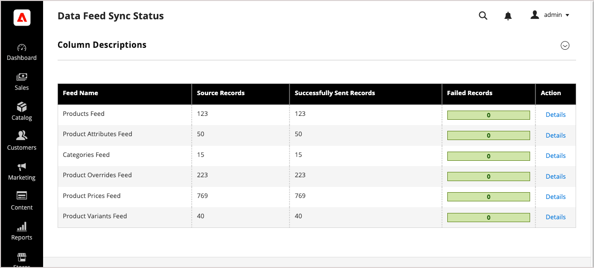
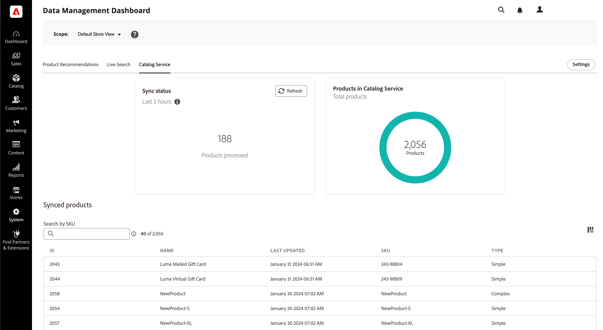

# 查看和管理同步过程

大多数同步活动都使用完全同步、部分同步或重试失败的项目同步自动处理。 有关每个类型运行时间的详细信息，请参阅[同步类型](sync-overview.md#synchronization-types)。 [!DNL SaaS Data Export]还提供了用于监视、管理和排除进程故障的工具。 您可以使用用于部署的仪表板查看同步状态并管理数据同步过程。

>[!BEGINTABS]

>[!TAB Adobe Commerce]

对于云上的Adobe Commerce、内部部署或Adobe Commerce as a Cloud Service部署，请从以下Commerce管理资源查看和管理同步过程：

- **[数据馈送同步状态页面](../optimizer/setup/data-sync.md)** — 检查与[!DNL Live Search]、[!DNL Product Recommendations]或[!DNL Catalog Service]连接的部署的信息馈送导出状态。 此仪表板显示每个馈送的信息源导出状态，包括遇到的任何错误。 详细信息视图可显示各个馈送项目的馈送导出状态。

- **[数据管理仪表板](https://experienceleague.adobe.com/en/docs/commerce-admin/systems/data-transfer/data-sync/data-dashboard)** — 管理员用户可以查看和跟踪已成功导出并同步到连接的Commerce服务的数据。 此仪表板显示同步到Commerce Services的产品数据。

>[!NOTE]
>
>只有在安装了[!DNL Live Search]、[!DNL Product Recommendations]或[!DNL Catalog Service]的情况下，数据管理功能板和数据馈送同步状态页面才可用。

>[!TAB Adobe Commerce与Commerce Optimizer]

对于与[!DNL Commerce Optimizer]集成的Commerce云上部署或内部部署，请使用以下资源查看和管理同步过程：

- **[数据馈送同步状态页面](../optimizer/setup/data-sync.md)** — 对于使用[!DNL Commerce Optimizer]的Commerce项目，请从[!DNL Commerce Optimizer]的数据馈送同步状态页面检查店面的目录数据可用性。 此仪表板显示数据导出馈送的同步状态。

- **[数据同步页面](../optimizer/setup/data-sync.md)** — “数据同步”页面概述了从上游目录源到[!DNL Commerce Optimizer]的产品数据的同步状态。

有关如何使用这些仪表板验证数据同步是否工作以及手动重新同步数据的详细信息，请参阅&#x200B;_Adobe Commerce Optimizer Connector指南_&#x200B;中的[管理同步](../aco-connector/data-sync-manage.md)。

>[!ENDTABS]

## 验证数据同步是否正常工作 {#verify-that-the-data-sync-is-working}

要验证数据同步是否正常工作，请确认已成功从[!DNL Adobe Commerce]导出数据，并且数据已成功传递到连接的Commerce服务。 使用部署中的功能板检查这两个步骤。

从导出开始，然后确认投放。

1. 在Commerce管理员中检查同步状态。

   转到&#x200B;**[!UICONTROL System]** > **[!UICONTROL Data Transfer]** > **[!UICONTROL Data Feed Sync Status]**。

   {width="800" zoomable="yes"}

   同步运行时，馈送数据显示已成功发送的记录。 选择信息源以查看详细信息或解决同步问题。

1. 确认数据已传送到“连接的Commerce服务”。

   从Commerce管理员转到&#x200B;**[!UICONTROL System]** > **[!UICONTROL Data Transfer]** > **[!UICONTROL Data Management Dashboard]**。

   {width="700" zoomable="yes"}

   验证是否显示预期的产品、价格和属性。

>[!TIP]
>
>如果数据同步有任何问题，请参阅[查看日志和疑难解答](troubleshooting/logging.md)。

## 手动重新同步数据

如果部分同步和自动重试不能解决同步问题，则可以从Commerce管理员手动重新同步数据，也可以使用Commerce CLI命令手动重新同步数据。 可用选项取决于您的部署。

### 可用的手动重新同步选项 {#manual-resync-options-commerce}

使用以下选项可手动重新同步馈送数据。

| 任务 | 选项 | 注释 |
| --- | --- | --- |
| 重新同步选定的馈送项目失败或有问题 | **[!UICONTROL Data Feed Sync Status]页** | 从Commerce管理员中监视和重新同步选定的信息源项目。 请参阅[验证数据同步是否正常工作](#verify-that-the-data-sync-is-working)。 |
| 完全重新同步所有信息源 | **[!UICONTROL Data Management Dashboard]** | 从Commerce管理员对所有信息源执行完全重新同步；Adobe建议主要在您首次连接到Commerce服务时这样做。 请参阅[验证数据同步是否正常工作](#verify-that-the-data-sync-is-working)。 |
| 具有操作控制的目标馈送重新同步 | **Commerce CLI** | 使用`saas:resync`命令进行目标馈送重新同步。 请参阅[使用Commerce CLI同步源](data-export-cli-commands.md)。 |

>[!MORELIKETHIS]
>
> - [同步的工作方式](sync-overview.md) — 了解同步模式、完全同步、部分同步和重试失败的项。
> - [使用Commerce CLI同步馈送](data-export-cli-commands.md) — 使用`saas:resync`命令进行目标馈送重新同步。
> - [查看日志并排除故障](troubleshooting/logging.md) — 诊断数据导出和SaaS导出错误。
> - [管理与 [!DNL Commerce Optimizer]](../aco-connector/data-sync-manage.md)的同步 — 验证目录数据同步并手动重新同步连接器馈送。

