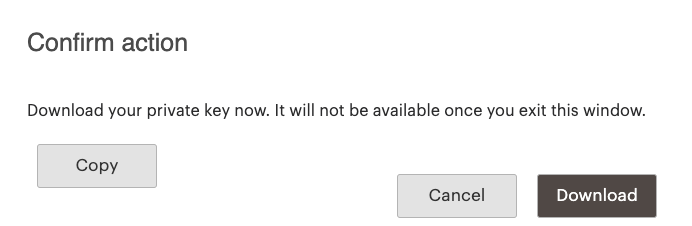

# [!DNL Commerce Services Connector]

某些Adobe Commerce和Magento Open Source功能由[!DNL Commerce Services]提供支持，并部署为SaaS（软件即服务）。 若要使用这些服务，必须使用生产和沙盒API密钥连接[!DNL Commerce]实例，并在[配置](#saas-configuration)中指定数据空间。 您只需为每个实例配置一次连接即可。

## 可用服务 {#availableservices}

下面列出了可通过[!DNL Commerce Services Connector]访问的[!DNL Commerce]功能：

| 服务 | 可用性 |
| ---|--- |
| 由Adobe Sensei支持的[[!DNL Product Recommendations]](/help/product-recommendations/overview.md) | Adobe Commerce |
| 由Adobe Sensei支持的[[!DNL Live Search]](/help/live-search/overview.md) | Adobe Commerce |
| [[!DNL Payment Services]](/help/payment-services/overview.md) | Adobe Commerce和Magento Open Source |
| [[!DNL Site-Wide Analysis Tool]](https://experienceleague.adobe.com/en/docs/commerce-operations/tools/site-wide-analysis-tool/intro) | Adobe Commerce |
| [[!DNL Catalog Service]](/help/catalog-service/overview.md) | Adobe Commerce |
| [[!DNL Data Connection]](/help/data-connection/overview.md) | Adobe Commerce |

## 架构

从较高层面来看，[!DNL Commerce Services Connector]由以下核心元素组成：

以下部分将更详细地讨论其中各个元素。

## 凭据 {#apikey}

生产和沙盒API密钥从[许可证所有者](https://experienceleague.adobe.com/en/docs/commerce-cloud-service/start/onboarding)的[!DNL Commerce]帐户生成。 Commerce帐户由唯一的[!DNL Commerce] ID (MageID)标识。 商户组织的许可证所有者可以为产品推荐或实时搜索等服务生成API密钥，前提是帐户处于良好状态。

这些密钥可在“需要知道”的基础上与系统集成商或代表许可证持有人管理项目和环境的开发团队共享。 已被许可证所有者授予[!DNL Shared Access]的开发者无法代表他们生成密钥，即使商户的组织位于其帐户上的[!DNL Switch Accounts]下拉列表中。

此外，解决方案集成商也有权使用[!DNL Commerce Services]。 如果您是解决方案集成商，[!DNL Commerce]合作伙伴合同的签名者应生成API密钥。

>[!NOTE]
>密钥标识符&#x200B;*Production*&#x200B;和&#x200B;*Sandbox*&#x200B;未引用您的环境。 对于每个环境（例如本地、开发、暂存或生产环境），您要将同一组API密钥使用到。
>
>许可证所有者通常是Adobe Commerce客户的主要联系人，并不总是与Adobe Commerce on cloud infrastructure项目的项目所有者相同。

### 生成生产和沙盒API密钥 {#genapikey}

1. 在[https://account.magento.com](https://account.magento.com/customer/account/login){:target="_blank"}登录到您的[!DNL Commerce]帐户。

1. 在&#x200B;**Magento**&#x200B;选项卡下，在侧栏中选择&#x200B;**API门户**。

1. 从&#x200B;_环境_&#x200B;菜单中，选择&#x200B;**生产**&#x200B;或&#x200B;**沙盒**。

   >[!NOTE]
   >
   >*生产*&#x200B;和&#x200B;*沙盒*&#x200B;是指将数据存储在Adobe SaaS后端系统中的数据空间环境。 它并非指您将使用键的商务环境。

1. 在&#x200B;_API密钥_&#x200B;部分中输入名称，然后单击&#x200B;**新增**&#x200B;打开对话框下载新密钥。

   

   >[!WARNING]
   >
   > 此对话框提供了复制或下载密钥的唯一机会。

1. 单击&#x200B;**下载**，然后单击&#x200B;**取消**。

1. 对每个环境（生产和沙盒）重复上述步骤。

   **API密钥**&#x200B;部分现在显示您的API（公共）密钥。 当您[在与许可证关联的任何环境或安装中选择或创建SaaS项目](#createsaasenv)时，需要所有四个密钥（生产和沙盒密钥，Public+Private）。

## SaaS配置 {#saasenv}

[!DNL Commerce]实例必须配置有SaaS项目和SaaS数据空间，以便[!DNL Commerce Services]能够将数据发送到正确的位置。 SaaS项目对所有SaaS数据空间进行分组。 SaaS数据空间用于收集和存储使[!DNL Commerce Services]能够工作的数据。 某些此类数据可从[!DNL Commerce]实例中导出，而某些数据可从店面的购物者行为中收集。 然后，该数据将保留到安全云存储中。

对于[!DNL Product Recommendations]，SaaS数据空间包含目录和行为数据。 通过在[!DNL Commerce]配置中选择[实例](https://experienceleague.adobe.com/en/docs/commerce-admin/config/services/saas)，您可以将[!DNL Commerce]实例指向SaaS数据空间。

>[!WARNING]
>
> 请仅在生产[!DNL Commerce]安装中使用&#x200B;**生产SaaS数据空间**&#x200B;以避免数据冲突。 否则，您可能会用测试数据污染生产站点数据，从而导致部署延迟。 例如，可能会从暂存数据（如暂存URL）错误地覆盖您的生产产品数据。
> 如果发生这种情况，[提交支持请求](https://experienceleague.adobe.com/en/docs/commerce-knowledge-base/kb/overview)以请求数据清理。

### SaaS数据空间配置

所有Adobe Commerce商家均可访问每个SaaS项目的一个生产数据空间和两个测试数据空间。

您可以在任何非生产环境中使用测试数据空间，但前提是不同时在多个环境中使用相同的数据空间。 要在其他环境中使用测试数据空间，请先执行数据清理，然后再在该环境中选择和配置数据空间。

对于具有多个暂存环境的Adobe Commerce Cloud Pro项目，您可以通过[提交支持请求](https://experienceleague.adobe.com/home?support-tab=home#support)，为每个暂存环境请求额外的测试数据空间。 但是，如果您只有一个暂存环境并且需要额外的测试数据空间，则可以使用以下选项：
- 联系客户成功团队或您指定的客户成功经理以请求额外的暂存环境。
- [提交支持请求](https://experienceleague.adobe.com/home?support-tab=home#support)以请求额外的测试数据空间，并指明额外数据空间的业务理由。 此请求有待审批。

使用Adobe支付服务的Magento Open Source客户可能还会请求一个额外的数据空间。 在提交[支持请求](https://experienceleague.adobe.com/home?support-tab=home#support)以请求测试数据空间之前，请与付款团队联系，以请求其他数据空间。

拥有多个云项目或内部部署（实时/生产）安装的客户还可以通过[提交支持请求](https://experienceleague.adobe.com/home?support-tab=home#support)，为每个项目或实例请求额外的生产和测试数据空间。

### 选择或创建SaaS项目 {#createsaasenv}

要选择或创建SaaS项目，请从存储的[!DNL Commerce]许可证所有者请求[!DNL Commerce] API密钥：

>[!NOTE]
>
> 如果在[!DNL Commerce]配置中未看到&#x200B;**[!UICONTROL Commerce Services Connector]**&#x200B;部分，则必须为所需的[[!DNL Commerce] 服务](#availableservices)安装[!DNL Commerce]模块。

1. 在&#x200B;_管理员_&#x200B;侧边栏上，转到&#x200B;**系统** >服务> **Commerce服务连接器**。

   如果在[!DNL Commerce]配置中未看到&#x200B;**[!UICONTROL Commerce Services Connector]**&#x200B;部分，请为所需的[[!DNL Commerce] 服务](#availableservices)安装[!DNL Commerce]模块。 另外，确保已安装`magento/module-services-id`包。

1. 在&#x200B;_[!UICONTROL Sandbox API Keys]_&#x200B;和_[!UICONTROL Production API Keys]_&#x200B;部分中，粘贴您的键值。

   - 私钥必须在密钥的开头包含`----BEGIN PRIVATE KEY---`，在密钥的结尾包含`----END PRIVATE KEY----`。
   - 如果您没有实际密钥的副本，请向帐户所有者索取这些密钥，然后将值插入配置。

   >[!WARNING]
   >
   > 如果通过查询数据库备份或快照并将这些值粘贴到配置中来添加密钥值，则会应用额外的加密层，并且密钥将无法正常工作。

1. 单击&#x200B;**保存**。

与您的密钥关联的任何SaaS项目都显示在&#x200B;**SaaS标识符**&#x200B;部分的&#x200B;**项目**&#x200B;字段中。

1. 如果不存在任何SaaS项目，请单击&#x200B;**创建项目**。 然后在&#x200B;**项目**&#x200B;字段中，输入SaaS项目的名称。

>[!NOTE]
>
>为避免混淆，请勿使用特定的Commerce服务作为项目的名称，例如&#x200B;*实时搜索*、*产品推荐*&#x200B;或&#x200B;*数据连接*。  除非已为多个SaaS项目配置了您的许可证，否则您可以为多个服务使用同一SaaS项目。

1. 选择要用于[!DNL Commerce]存储当前配置的&#x200B;**数据空间**。

>[!NOTE]
>
>如果您有单独的实例要与Commerce服务集成，请[提交支持票证](https://experienceleague.adobe.com/en/docs/commerce-knowledge-base/kb/help-center-guide/magento-help-center-user-guide#submit-ticket)，以便为每个额外的实例请求新的SaaS项目。 在支持人员创建SaaS项目后，请使用相同的API密钥为实例配置Commerce Services集成，并为数据空间选择新的SaaS项目。

>[!WARNING]
>
> 如果您在“我的帐户”的“API门户”部分生成新密钥，请立即更新管理员配置中的API密钥。 如果您在管理员中生成新密钥但未更新它们，则SaaS扩展不再有效，并且您会丢失宝贵的数据。

若要更改SaaS项目或数据空间的名称，请单击其中任一项目或数据空间旁边的&#x200B;**重命名**。 更改名称不会影响您的服务，因为名称只是一个标签，可帮助您识别和区分项目和数据空间。

## IMS组织（可选） {#organizationid}

要将您的Adobe Commerce实例连接到Adobe Experience Platform，请使用您的Adobe ID登录到Adobe帐户。 登录后，与您的Adobe帐户关联的IMS组织将显示在此部分中。

## SaaS数据导出

当您的[!DNL Commerce]实例成功连接到[!DNL Commerce Services]时，SaaS数据导出过程会将Commerce数据从[!DNL Commerce]服务器导出到[!DNL Commerce SaaS Services]，以便将其同步到连接的Commerce服务。 在Admin中，您可以使用[数据管理仪表板](https://experienceleague.adobe.com/en/docs/commerce-admin/systems/data-transfer/data-dashboard)检查同步状态。 有关详细信息，请参阅[SaaS数据导出指南](../data-export/overview.md)。
