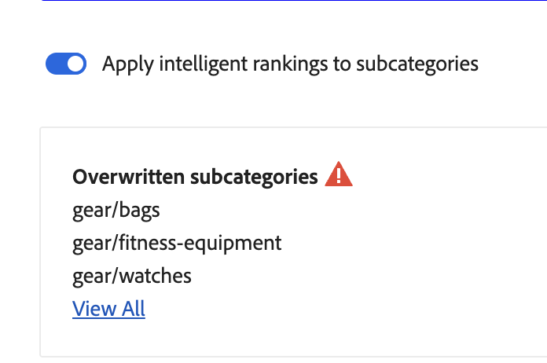
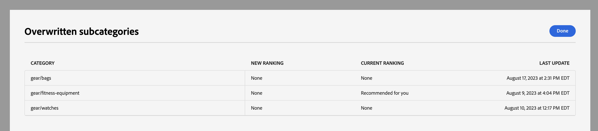
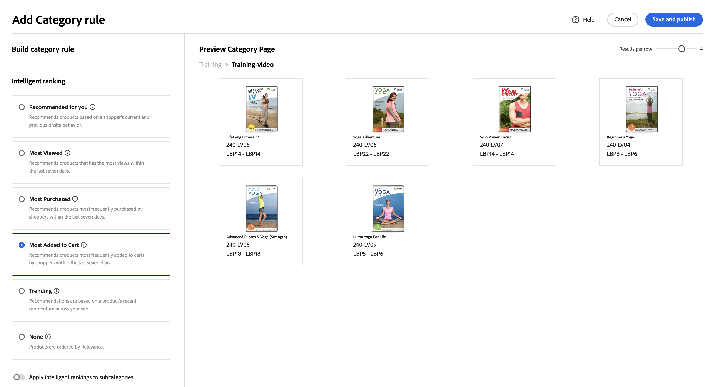

# 类别促销

类别促销允许商店所有者将[!DNL Live Search]智能排名[规则](rules.md)应用于产品类别和子类别。

本视频介绍了类别推销。

>[!VIDEO](https://video.tv.adobe.com/v/3424617)

可在管理员中访问该功能，其地址为： **营销** > SEO和搜索> **[!DNL Live Search]** > **类别促销**。

>[!NOTE]
>
>类别促销可用于[!DNL Live Search] [3.0.0或更高版本](release-notes.md)。 如果您看到类别促销工作区，但它未填充数据，请更新[!DNL Live Search]模块。

“类别促销”视图显示定义的类别规则，其中包含以下列：

* 类别
* 排名策略
* 继承的排名
* 上次更新时间
* 操作

您可以在“按类别搜索”字段中搜索类别或子类别。

## 排名策略

类别促销使用与[单个产品](rules-workspace.md)相同的排名类型。
排名有两种类型：智能和手动。

**智能排名**&#x200B;利用[Adobe AI](https://business.adobe.com/ai.html)的店面行为数据分析，通过特定算法对选定类别中的所有产品进行排序。 选择智能排名后，产品的特定顺序会随着时间的推移而改变，因为[!DNL Adobe AI]会持续重新分析基础数据。 例如，随着购物者偏好变化，热门趋势产品会随着时间的推移自动变化。
智能排名方法有：

* 购买次数最多：按购物者在过去7天内购买产品的频率对产品进行排名。
* 添加到购物车次数最多：按购物者在过去七天内将产品添加到购物车的频率对产品进行排名。
* 查看次数最多：按购物者过去7天查看产品的频率对产品进行排名。
* 为您推荐：根据每位购物者之前和当前在网站上的行为，按购物者与每位购物者交互的可能性对产品进行排名。
* 趋势：根据查看次数对产品进行排名，按最近受欢迎程度的上升进行排名。
* 无：按默认顺序对产品进行排名。

要调整行为信号对任何智能排名方法（除&#x200B;**无**&#x200B;之外）的产品订单影响的程度，请在规则编辑器中设置&#x200B;**[!UICONTROL Intelligent Ranking Boost]**。 有关默认值、限制、预览行为以及提升与&#x200B;**手动排名**&#x200B;的比较方式的详细信息，请参阅[智能排名提升](rules-add.md#intelligent-ranking-boost)。

**手动排名**&#x200B;允许用户通过定义手动pin、提升、隐藏和隐藏规则来覆盖自动产品排序顺序。

## 继承的排名

作为推销商，请选择所有女装类别来按“趋势”排序。 这包括“女士裤子”、“女士衬衫”和“女士配饰”等子类别。 男性的类别不应受到影响。 您可以使用继承的排名来实现这一点。

为具有子类别的类别或子类别选择智能排名方法时，您可以打开&#x200B;**将智能排名应用于子类别**&#x200B;选项。 这会将排名方法应用于所有子类别。

现在，这些子类别会从父类别继承该规则（继承排名列中的“是”）。 在“操作”列中，唯一可用的选项是&#x200B;**编辑规则**&#x200B;和&#x200B;**查看详细信息**。 已针对子类别的继承规则禁用&#x200B;**删除**&#x200B;选项。 删除子类别继承需要从父类别中撤消继承。

每个类别或子类别一次最多可以应用一个智能排名。 它还可以同时应用一个或多个“手动”排名。

如果将智能排名应用于某个类别并启用[!UICONTROL Apply intelligent ranking to subcategories]，则该类别的智能排名将替换已应用于其子类别的任何智能排名。

{width="700"}

如果单击“**查看全部**”，将打开一个对话框，其中包含建议更改的详细信息。

将智能排名直接添加到具有继承的智能排名的类别时，继承将被新的智能排名覆盖。

从类别中删除智能排名时，将重新建立继承。
在这两种情况下，都会保留任何手动排名。

如果在启用[!UICONTROL Apply intelligent ranking to subcategories]时从类别中删除智能排名，则只会删除其子类别继承的智能排名。 任何手动排名都将保留，因为它们不会继承。

此时将显示一个对话框，说明哪些继承的子类别会受到您对更高级别类别所做的任何更改的影响。

{width="1200"}

## 创建类别规则

要创建类别规则，请执行以下操作：

1. 单击&#x200B;**添加规则**&#x200B;按钮。
1. 在&#x200B;_选择类别_&#x200B;视图中，单击类别和子类别。
1. 选中此复选框可选择要排名的类别。
1. 单击&#x200B;**应用**。

   

1. 在&#x200B;_添加类别规则_视图中，选择要应用于类别的智能排名方法。
类别预览页面使用您的[!DNL Live Search]数据显示所选排名的实际结果。
1. 单击&#x200B;**保存并发布**&#x200B;以保存规则。

[!DNL Live Search]服务处理该规则并在完成后在存储上激活它。

## 修改类别规则

要修改现有规则，请执行以下操作：

1. 单击“操作”列中的&#x200B;**...**，然后选择&#x200B;**编辑**。
1. 在“编辑类别”规则视图中，进行任何必需的更改，然后单击&#x200B;**保存并发布**。

当[!DNL Live Search]处理更改时，更改会反映在存储中。

## 删除类别规则

要删除类别规则，请执行以下操作：

1. 单击“操作”列中的&#x200B;**...**，然后选择&#x200B;**删除**。
1. 在&#x200B;_删除规则_&#x200B;模式中，选择&#x200B;**删除**&#x200B;以删除该规则，或选择&#x200B;**取消**&#x200B;以取消操作。

## 手动排名

手动排名允许您覆盖由智能排名规则（如果有）确定的产品订单，并手动控制产品在结果中的显示位置。

事件是在满足定义的条件时修改搜索结果的操作。 手动排名最多可以包含25个事件。

* 提升：将产品在搜索结果中上移。
* 嵌入：将产品在搜索结果中下移。
* 固定产品：将产品移动到结果中的特定位置。
* 隐藏产品：从搜索结果中排除产品。

创建手动排名：

1. 如上所述，为类别设置智能排名规则。

   查询的结果显示在“预览类别”页面视图中。 这将使用您的实际实时搜索数据预览结果。

1. 在预览类别页面视图中单击并拖动产品。 将其拖放到所需位置。 Product和Position字段会自动填充到Events窗格中。

您还可以单击大头针图标以将产品锁定到其当前位置。 使用省略号上下文菜单“固定到顶部”或“固定到底部”。

手动添加事件：

1. 在“手动排名”下，单击&#x200B;**选择事件**&#x200B;菜单，然后选择满足相关条件时要发生的事件。
1. 输入要影响的产品的名称。 产品随您的键入一起推荐。
1. 对于多个事件，选择满足条件时要触发的任何其他事件。

>[!NOTE]
>
>当在店面中打开特定类别并且存在该类别的规则时，将应用规则。 对于类别促销规则，默认排序顺序为“排序依据：职位”。 如果购物者更改排序顺序，则所有隐藏、固定和隐藏的产品将不再排序。
