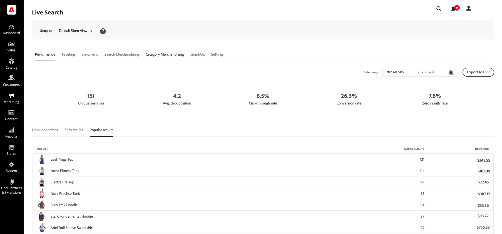

# 性能

*性能*&#x200B;工作区提供了有关购物者使用的搜索词的洞察信息。 此信息可用于识别趋势、增加点进次数并提高转化率。 性能工作区提供特定日期范围的搜索度量的快照，并包括以下报表：

* 独特搜索
* 零个结果
* 常见结果

您还可以参考[数据管理功能板](https://experienceleague.adobe.com/docs/commerce-admin/systems/data-transfer/data-dashboard.html)，了解有关数据同步的更多数据。

>[!NOTE]
>
>性能工作区每12小时更新一次。

## 查看报表

1. 要输入&#x200B;**日期范围**，请单击日历（）并执行以下操作之一：

   * 要指定单个日期，请双击日历上的日期。
   * 要指定日期范围，请单击日历上的第一个日期和最后一个日期。

>[!NOTE]
>
>日期范围不能超过一年。

## 字段描述

| 快照数据 | 描述 |
|--- |--- |
| 独特搜索 | 指定日期范围的唯一搜索总数。 如果间隔超过一小时，则由同一购物者执行的多次搜索（即使针对同一查询）均会被视为唯一。 |
| 点进率 | 以购物者单击产品结束的搜索的百分比。 例如，如果购物者搜索“pants”和“shirt”，然后在“shirt”搜索中单击一个结果，则点进率为50%。 |
| 转化率 | 购物者在指定日期范围内购买的产品与购物者点击的产品数的百分比。 例如，如果购物者在弹出窗口中查看了6个产品，单击了1个产品并执行了购买，则交互的转化率为100%。   转化率不受给定产品查看次数的影响。 例如，如果购物者使用搜索，但不单击任何产品，则转化率将保持不变。 |
| 零结果率 | 在指定日期范围内未返回任何结果的唯一搜索的百分比。 例如，如果购物者搜索“fjjjjfjf”两次（没有结果）和“pants”一次（有结果），则零结果率为66.67%。 |
| 平均 点击位置 | 基于指定日期范围的唯一搜索的平均点进率的相对位置。 |

| 报告 | 描述 |
|--- |--- |
| 独特搜索 | 列出在指定日期范围内使用的唯一搜索查询。 报表数据的计算方式与唯一搜索快照数据的计算方式相同。 如果购物者两次键入相同的搜索查询，但间隔超过一小时，则该搜索被视为两次唯一搜索。 报告限制：前500个术语 |
| 零个结果 | 列出未返回结果的搜索查询以及在指定日期范围内使用的次数。 报告限制：前500个术语 |
| 常见结果 | 列出在指定日期范围内查看次数最多的产品的名称。 热门结果仅根据展示次数计算，不受点击次数或收入的影响。 报告限制：前500个术语 |
