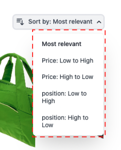
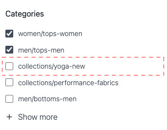

# 产品列表页面小组件

[!DNL Live Search Product Listing Page Widget] (PLP)使用Commerce Services平台提供高性能、可搜索且可彩块化的产品列表页面。 本主题介绍如何启用和设置PLP小组件的样式。

## 启用PLP小组件

安装[!DNL Live Search]服务后，默认搜索功能会自动转换为[!DNL Live Search]。

默认情况下，新安装已启用[!DNL Live Search] PLP小组件。

如果您正在升级[!DNL Live Search]，并且PLP构件已关闭，则它仍将处于关闭状态。 要将其打开，请执行以下操作：
1. 在Adobe Commerce管理员中，转到存储→设置→配置。
1. 在左侧导航中，单击&#x200B;**[!UICONTROL Live Search]** > **[!UICONTROL Storefront Features]**。
1. 单击[!UICONTROL Storefront Features]部分。
1. 设置[!UICONTROL Enable Product Listing Widget] =是
1. 保存配置
1. 如果出现提示，请刷新缓存（转到“系统”>“工具”>“缓存管理”>[!UICONTROL Flush Magento Cache]）。

>[!IMPORTANT]
>
>启用[!DNL Live Search Product Listing Page Widget]后，无法更改产品列表页面上的排序顺序方向。

## 构件功能

PLP小组件提供以下开箱即用的功能：

- 添加到购物车按钮 — 仅适用于简单产品。
- 每个产品有多个图像 — 为可配置产品选择不同颜色时，图像可能会发生更改。
- 支持颜色样本 — 请注意，color属性的拼写必须为`color`才能正确验证代码。

### 自定义构件

除了PLP小组件的现成功能外，您还可以进一步自定义该小组件以包含以下功能：

- 按属性筛选
- 多语言支持
- 价格滑块

有关如何自定义PLP构件以处理上述功能的信息，请参阅以下`storefront-product-listing-page`存储库[中的](https://github.com/adobe/storefront-product-listing-page/)自述文件。 此存储库中的自述文件提供了一个示例，说明如何自定义PLP构件并将这些自定义项部署到您的站点。

>[!WARNING]
>
>如果使用存储库中提供的代码自定义PLP小组件，则需负责维护以及所需的任何更新。 Adobe发布的任何新PLP构件功能可能与您的自定义实施不兼容。

## 样式设置示例

您可以使用[CSS](https://developer.adobe.com/commerce/frontend-core/guide/css/)自定义PLP小组件的外观，以匹配您的网站。

>[!NOTE]
>
>不会继承Adobe Commerce主题中自定义类的元素。 这些元素必须由其特定类定位以匹配自定义类；主操作类不适用于构件按钮。 CSS中的常规目标元素是继承的；`button`适用于构件按钮。

高亮显示的div包含目标类`ds-sdk-product-item__product-name`。


通过添加规则使其变为大写来自定义产品名称。

```css
.ds-sdk-product-item__product-name {
 text-transform: uppercase;
}
```


## CSS类

### 产品列表

- `.ds-sdk-product-list`：外部div
- `.ds-sdk-product-list__grid`：内部div


#### 产品列表分页

- `.ds-plp-pagination`


- `.ds-plp-pagination_item`


- `.ds-plp-pagination_item--current`


### 小组件

- `.ds-widgets`：外部div
- `.ds-widgets__actions`：左侧内div
- `.ds-widgets__results`：右侧内div


### 排序下拉列表

- `.ds-sdk-sort-dropdown`


- `.ds-sdk-sort-dropdown__button`


- `.ds-sdk-sort-dropdown__items`



- `.ds-sdk-sort-dropdown__items--item`


- `.ds-sdk-sort-dropdown__items--item-selected`


- `.ds-sdk-sort-dropdown__items--item-active`


### Facet

- `.ds-plp-facets`
- `.ds-plp-facets__header`
- `.ds-plp-facets__header_title`
- `.ds-plp-facets__header__clear-all`

{width="350"}

- `.ds-plp-facets__pills`
- `.ds-sdk-pill`

{width="350"}

- `.ds-sdk-pill__label`
- `.ds-sdk-pill__cta`

{width="350"}

- `.ds-plp-facets__list`

{width="350"}

- `.ds-sdk-input`
- `.ds-sdk-input__label`
- `.ds-sdk-product-item__product-swatch-group`
- `ds-sdk-product-item__product-swatch-item`
- `.ds-sdk-input_fieldset_show-more`


- `.ds-sdk-labelled-input`



- `.ds-sdk-labelled-input__input`
- `.ds-sdk-labelled-input__label`


### 产品项目

- `.ds-sdk-product-item`
- `.ds-sdk-product-item__image`
- `.ds-sdk-product-item__product-name`
- `.ds-sdk-product-item__product-options`
- `.ds-sdk-product-price`
   - `.ds-sdk-product-price--no-discount`
   - `.ds-sdk-product-price--grouped`
   - `.ds-sdk-product-price--bundle`
   - `.ds-sdk-product-price--discount`


### 正在加载

- `.ds-sdk-loading`
- `.ds-sdk-loading__spinner`
- `.ds-sdk-loading__spinner-label`


## 禁用PLP构件

要禁用PLP小组件，请执行以下操作：

1. 转到&#x200B;**商店** >设置> **配置** > **[!DNL Live Search]** > **店面功能**&#x200B;并将&#x200B;**启用产品列表小组件**&#x200B;设置为“否”。
1. 选择&#x200B;**保存配置**&#x200B;以保存设置。
