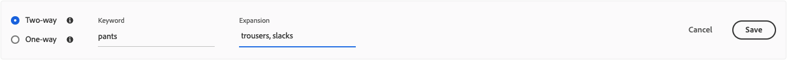

# 添加同义词

通过添加您自己策划的[!DNL Live Search]同义词列表来提高客户参与度。 [!DNL Live Search]可以管理每个`Data Space ID`最多200个同义词。

![[!DNL Live Search]同义词](assets/synonym-workspace.png)

## 步骤1：添加同义词

1. 在管理员中，转到&#x200B;**营销** > SEO和搜索> **[!DNL Live Search]**。
1. 对于多个存储，将&#x200B;**作用域**&#x200B;设置为应用同义词设置的[存储视图](https://experienceleague.adobe.com/docs/commerce-admin/start/setup/websites-stores-views.html#scope-settings)。
1. 单击&#x200B;**同义词**&#x200B;选项卡。
1. 单击&#x200B;**添加同义词**&#x200B;按钮。

## 步骤2：按类型定义同义词

按照要创建的同义词[类型](synonyms-type.md)的说明进行操作。

### 双向同义词

1. 接受默认的&#x200B;**双向**&#x200B;选项。

   

1. 输入要匹配的&#x200B;**关键字**&#x200B;词或短语。
1. 输入要作为关键字的同义词添加的&#x200B;**扩展**&#x200B;术语。 用逗号分隔多个术语。
在此示例中，要匹配的关键字是“pants”，而扩展术语集是“trousers， slacks”。

   

1. 完成后，单击&#x200B;**保存**。
该同义词集显示在列表中，每个术语之间有一个双向箭头，这意味着术语可以互换。

   

### 单向同义词

1. 单击&#x200B;**单向**&#x200B;同义词类型。

   

1. 输入&#x200B;**关键字**&#x200B;和&#x200B;**扩展**&#x200B;术语。 用逗号分隔多个术语。

   

   在此示例中，关键字是“pants”，而单向扩展术语“capris， peddle-pushers”是“pants”的子集，但具有特定含义。

1. 完成后，单击&#x200B;**保存**。
同义词集合出现在列表中，有一个从展开项指向关键字的单向箭头，指示这些项是关键字的子集。 每个扩展项之间用加号隔开。

   

## 步骤3：发布更改

1. 当同义词完成时，单击&#x200B;**发布更改**。
1. 等待长达两个小时，您的更新才会在店面中出现。

## 字段描述

| 字段 | 描述 |
|--- |--- |
| [类型](synonyms.md) | 确定同义词与关键字的含义相同，还是关键字的子集。 选项： 双向（默认） — 与关键字具有相同含义并返回相同搜索结果的术语 单向 — 是关键字的子集的术语。 单向同义词返回的特定产品列表更窄。 |
| 关键词 | 通常与目录中的一系列产品相关的单词。 |
| 扩展 | 与关键字具有相同或相似含义的其他术语。 |
