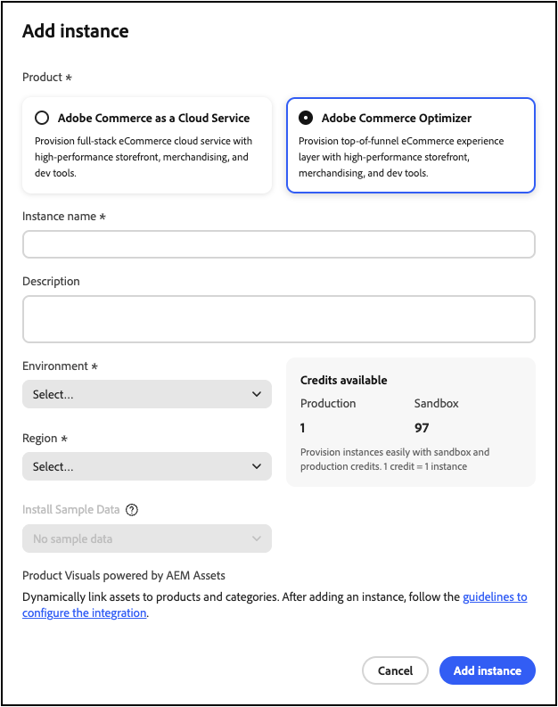
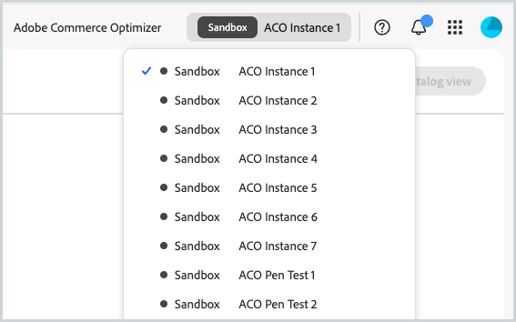

# 开始使用

本指南将指导您从头到尾设置[!DNL Adobe Commerce Optimizer]。 虽然本指南涵盖所有角色，但有关特定于开发人员的详细内容，请参阅[开发人员文档](https://developer.adobe.com/commerce/services/optimizer/)。

## 先决条件

在开始之前，请确保您已：

- 具有&#x200B;**权限的** Adobe Experience Cloud帐户[!DNL Adobe Commerce Optimizer]
- **组织管理员访问权限**&#x200B;以创建实例和管理用户
- 用于加载示例数据和店面开发的&#x200B;**GitHub帐户**
- **基本了解**&#x200B;电子商务概念

## 快速入门指南

请按照以下重要步骤运行[!DNL Adobe Commerce Optimizer]环境：

### 步骤1. 创建实例

1. 登录到[Adobe Experience Cloud](https://experience.adobe.com/)。
1. 导航到&#x200B;**Commerce** > **Commerce Cloud Manager**。
1. 单击&#x200B;**添加实例** > **Commerce Optimizer**。

   {width="60%" zoomable="yes"}

1. 配置实例设置：
   - **名称**：描述性名称（例如，“My Company Sandbox”）
   - **描述**：用途的简短描述
   - **地区**：选择您的首选地区
   - **环境类型**：从用于测试的&#x200B;**沙盒**&#x200B;环境开始

1. 单击&#x200B;**添加实例**。

   Cloud Manager将更新以包含您的新实例。 有关访问和管理实例的详细信息，请参阅[管理实例](#manage-an-instance)。

>[!NOTE]
>
>沙盒实例仅限于北美地区。 创建后无法更改区域。

### 步骤2. 设置环境

创建实例后：

1. 从Commerce Cloud Manager [管理您的实例](#manage-an-instance)。
1. 使用[用户管理指南](./user-management.md)配置用户访问权限。

### 步骤3. 添加示例数据（可选）

若要进行测试和学习，请按照[加载示例数据](#add-sample-data)说明操作。

## 基于角色的工作流

[!DNL Adobe Commerce Optimizer]设置和管理依赖三个关键角色。 每个角色都有特定的任务和责任：

{zoomable="yes"}

### 管理员任务

管理员管理实例、用户和组织设置。

| 任务 | 描述 | 链接 |
|---|---|---|
| **管理用户** | 添加用户、开发人员和管理员 | [用户管理](./user-management.md) |
| **创建实例** | 设置沙盒和生产环境 | [创建实例](#create-an-instance) |
| **管理实例** | 检查状态，更新实例名称和描述，并获取用于应用程序和API访问的密钥URL | [管理实例](#manage-instances) |
| **配置访问** | 设置目录视图和策略 | [目录视图](./setup/catalog-view.md) |

### 开发人员任务

开发人员负责技术实施和数据集成，包括平台架构任务。

| 任务 | 描述 | 链接 |
|---|---|---|
| **访问Developer Console** | 创建项目并生成凭据 | [Developer Console](https://developer.adobe.com/developer-console/docs/guides/getting-started) |
| **摄取目录数据** | 从现有系统导入产品数据 | [数据摄取API](https://developer.adobe.com/commerce/services/optimizer/data-ingestion/) |
| **设置店面** | 配置Edge Delivery Services店面 | [店面设置](./storefront.md) |

### 促销员任务

商家通过产品发现和推荐，优化和个性化购物体验。 他们还可以使用购物者数据和分析来制定有关店面的产品放置、定价和促销的战略决策。

| 任务 | 描述 | 链接 |
|---|---|---|
| **产品发现** | 配置搜索和筛选 | [促销概述](./merchandising/overview.md) |
| **推荐** | 设置AI支持的产品推荐 | [产品推荐](./merchandising/recommendations/overview.md) |
| **性能跟踪** | 监测成功量度 | [成功量度](./manage-results/success-metrics.md) |

## 管理实例

从Commerce Cloud管理器管理实例。

>[!NOTE]
>
>并非所有Adobe Commerce Optimizer用户都具有访问Cloud Manager的权限。 访问权限取决于分配给用户帐户的角色和权限。

1. 登录到[Adobe Experience Cloud](https://experience.adobe.com/)。

1. 打开Commerce Cloud Manager：

   - 在&#x200B;**快速访问**&#x200B;下，单击&#x200B;**Commerce**。
   - 查看可用的实例。

### 搜索和筛选实例

登录后，功能板显示组织中可用的所有Commerce产品实例。
“产品”列指示为实例配置的Commerce应用程序。

{zoomable="yes"}

使用过滤器和搜索工具按创建日期、区域、创建者、产品类型、环境或状态快速查找特定实例。

### 访问[!DNL Adobe Commerce Optimizer]应用程序

应用程序打开后，可在沙盒和生产等环境之间轻松切换以查看每个环境的数据和设置，而无需返回Commerce Cloud Manager。

1. 在Commerce Cloud管理器中，单击实例名称以打开[!DNL Adobe Commerce Optimizer]应用程序。

1. 在不离开应用程序的情况下在[!DNL Adobe Commerce Optimizer]实例之间切换。

   实例下拉列表列出了组织中可用的所有Optimizer实例。 选择要查看的实例。

   {zoomable="yes"}

### 获取实例详细信息

单击实例名称旁边的信息图标可查看实例详细信息。

{width="60%" zoomable="yes"}

请注意以下关键信息：

- **GraphQL端点**，以使用促销API检索Commerce目录数据
- 使用REST API进行数据摄取的&#x200B;**目录服务终结点**
- **Commerce Optimizer URL**&#x200B;以访问[!DNL Adobe Commerce Optimizer]应用程序
- **实例ID**&#x200B;标识该实例的唯一租户ID

如果您是开发人员，则需要这些详细信息来设置开发环境并连接到[!DNL Adobe Commerce Optimizer] API。

>[!NOTE]
>
>要访问实例详细信息，您必须在Adobe IMS组织中拥有必要权限。 如果您看不到实例详细信息或无法访问应用程序，请与您的组织管理员联系。

### 编辑实例名称和描述

根据需要更新实例名称和描述。

1. 单击实例名称旁边的&#x200B;**编辑**&#x200B;图标。
1. 根据需要更新&#x200B;**实例名称**&#x200B;和&#x200B;**描述**。
1. 单击&#x200B;**保存**。

## 添加示例数据

Adobe提供了一个GitHub存储库，其中包含示例数据和工具，以帮助您学习和测试[!DNL Adobe Commerce Optimizer]功能。
示例数据基于[Carvelo业务方案](./use-case/admin-use-case.md)，包括：

- 具有汽车部件的产品目录
- 多个价格手册和定价方案
- 针对不同经销商的目录视图和策略
- 完整的端到端工作流示例

**加载示例数据：**

1. 访问[示例目录数据摄取](https://github.com/adobe-commerce/aco-sample-catalog-data-ingestion) GitHub存储库。

1. 按照存储库自述文件中的设置说明完成以下任务：

   - 设置环境
   - 完成数据摄取过程
   - 使用示例数据创建目录视图和策略
   - 通过检查[数据同步](./setup/data-sync.md)页上的目录服务数据来验证数据摄取

## 后续步骤

完成设置后：

1. 设置您的店面：
   - 配置[Edge Delivery Services店面](./storefront.md)
   - 连接到您的目录数据

1. 探索Carvelo用例：
   - 遵循[端到端工作流](./use-case/admin-use-case.md)
   - 在真实情景中实践

1. 配置推销：
   - 设置[产品发现](./merchandising/overview.md)
   - 创建[推荐](./merchandising/recommendations/overview.md)

1. 监控性能：
   - 跟踪[成功量度](./manage-results/success-metrics.md)
   - 分析[搜索性能](./manage-results/search-performance.md)

## 故障排除

### 常见问题

| 问题 | 解决方案 |
|---|---|
| **无法创建实例** | 验证您是否拥有[!DNL Adobe Commerce Optimizer]权限和管理员权限。 |
| **实例未出现** | 检查您的Adobe IMS组织并刷新页面。 |
| **无法访问实例** | 确保您在Admin Console中添加为用户。 |
| **示例数据未加载** | 验证您的实例凭据和API端点。 |

### 获取帮助

- **开发人员资源**： [开发人员文档](https://developer.adobe.com/commerce/services/optimizer/)
- **店面资源**： [Commerce店面文档](https://experienceleague.adobe.com/developer/commerce/storefront/?lang=zh-Hans)
- **教程**： [Commerce Optimizer教程](https://experienceleague.adobe.com/zh-hans/docs/commerce-learn/tutorials/adobe-commerce-optimizer/overview)
- **支持**： [Adobe Commerce支持资源](https://experienceleague.adobe.com/zh-hans/docs/commerce-knowledge-base/kb/overview)
