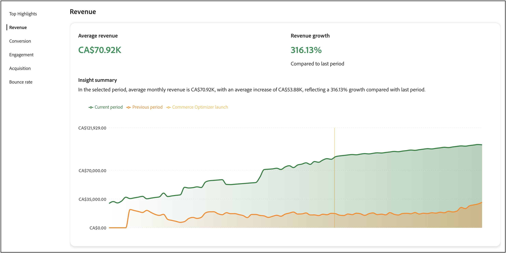

# 成功量度

本页提供了[!DNL Adobe Commerce Optimizer]存储的关键性能量度概览。 目标是让您快速了解实施[!DNL Adobe Commerce Optimizer]的结果，然后帮助您和您的团队发现增长机会，并突出显示优化区域。


报告中的量度是从店面事件数据中提取的。 [了解有关](../setup/events/overview.md)所收集事件数据的更多信息。

## 了解您的量度

成功量度报表提供了对直接影响业务结果的五个关键性能领域的可操作见解。 每个量度都会揭示客户行为和商店绩效的模式，帮助您发现机会并应对挑战。 利用这些见解推动更明智的决策并优化您的商务体验。

**热门亮点**&#x200B;总结了每个性能区域的关键量度。 利用本节快速找出您的最大改进机会。

关键绩效指标包括：

- **收入** — 显示总销售业绩的主要财务指标。
- **转化** — 完成购买的访客百分比。
- **参与度** — 用户与您的网站的交互活跃程度。
- **客户获取** — 客户获取工作的有效性。
- **跳出率** — 仅查看一个页面后离开的访客百分比。

### 数据新鲜性和准确性

**更新频率：**&#x200B;在收集和处理storefront事件时，定期处理和更新成功指标数据。

**何时检查量度：**&#x200B;要获得最准确的趋势分析，请在经过足够的时间后检查量度，以收集有意义的数据。 每日波动是正常的；专注于战略决策的每周或每月趋势。

**数据准确性：**&#x200B;量度是根据通过店面事件捕获的实际客户交互计算的。 请确保存储已配置正确的[事件跟踪](../setup/events/overview.md)以便生成准确的报告。

## 生成报表

1. 从左边栏中选择&#x200B;**成功量度**。
1. 在&#x200B;**报表配置**&#x200B;下，根据您的区域设置指定&#x200B;**日期范围**、**目录源**&#x200B;和&#x200B;**货币**。
1. 单击&#x200B;**[!UICONTROL Apply]**。

   **热门亮点**、**收入**、**转化**、**参与度**、**客户获取**&#x200B;和&#x200B;**跳出率**&#x200B;都基于您的报表配置进行更新。

1. 单击&#x200B;**[!UICONTROL Export]**&#x200B;以将报表另存为PDF。

## 将成功量度和Sites Optimizer结合使用

成功量度和Sites Optimizer （[机会](opportunities.md)）是旨在协同工作的互补工具，可帮助您提高商务网站的性能。 了解这些功能之间的区别有助于您做出更好的决策并取得可衡量的结果。

### 主要差异

| 长宽比 | 成功量度 | Sites Optimizer（机会） |
|---|---|---|
| **目的** | 衡量绩效和成果 | 确定问题并提供建议 |
| **类型** | 分析仪表板 | 主动问题检测 |
| **它显示的内容** | 关键绩效指标（收入、转化、参与、获取、跳出率） | 对影响站点性能的问题提供AI支持的建议 |
| **数据源** | 店面事件数据 | 产品目录、搜索日志、推荐数据 |
| **使用时间** | 您希望随时间跟踪结果 | 您希望识别并修复特定问题 |

### 如何将这些功能结合使用

最有效的方法是在一个持续的改进周期中将这两种工具结合在一起：

1. **使用成功量度进行测量**：首先查看您的成功量度仪表板，以了解您当前的性能。 确定哪些KPI需要改进（例如，低转化率或高跳出率）。

1. **通过机会诊断**：导航到“机会”页面以发现可能导致性能不佳的特定问题。 Sites Optimizer会扫描产品目录、搜索日志和推荐数据以识别问题，例如缺少产品数据、搜索相关性低或导航问题。

1. **实施推荐**：遵循Opportunity中提供的AI驱动型推荐以解决检测到的问题。 这些可能包括修复产品数据质量问题、改进SEO或优化搜索和发现。

1. **跟踪改进**：返回到“成功量度”以监视这些更改如何随着时间影响您的KPI。 使用日期范围选择器可比较实施推荐之前和之后的性能。

1. **迭代和优化**：继续此循环，使用机会识别新问题，使用成功量度衡量优化的影响。

### 工作流示例

商家注意到其成功量度中的转化率正在下降。 以下是他们可以使用这两项功能解决该问题的方式：

1. **识别问题**：“成功量度”仪表板显示过去一个月转化率下降了15%。

1. **查找原因**：“机会”页面显示若干问题：
   - 多个产品缺少影响搜索相关性的关键属性。
   - 热门搜索查询返回较差结果。
   - 类别页面上的页面加载速度较慢。

1. **采取行动**：商家将优先解决产品数据质量问题，因为Sites Optimizer将这些问题归类为影响搜索和推荐的高影响力机会。

1. **度量结果**：在更新产品属性并实施建议的更改后，商家每周监控成功量度。 在接下来的一个月内，转化率将提高12%，搜索参与量度将显着改善。

1. **继续优化**：随着转化率的提高，商家将焦点转移到机会中显示的下一个优先级 — 优化页面加载速度以降低跳出率。

### 何时使用每个功能

**在需要**&#x200B;时使用成功量度

- 跟踪整体业务绩效。
- 衡量一段时间内变化的影响。
- 确定您的业务需要关注的领域。
- 与利益相关者共享绩效报表。
- 了解客户行为趋势。

**当您想要：**&#x200B;时使用Sites Optimizer （机会）

- 发现影响性能的特定问题。
- 获取切实可行的建议以解决问题。
- 了解某些量度下降的原因。
- 确定优先处理哪些优化。
- 利用AI识别您可能手动遗漏的问题。

这些功能共同提供了一个完整的解决方案：成功量度可告知您&#x200B;*正在发生什么*，而Sites Optimizer则可告知您&#x200B;*为什么发生这种情况*&#x200B;以及&#x200B;*如何修复这种情况*。

## 后续步骤和优化策略

使用成功量度数据发现改进机会并实施有针对性的优化策略。 以下部分提供了适用于每个量度区域的具体、可操作的指导。

>[!BEGINTABS]

>[!TAB 收入优化]

对于收入，您的目标是增加总销售额和平均订单价值。



### 了解收入量度

**它衡量的内容：**&#x200B;所选时段内你的商店产生的总收入。

**计算方式：**&#x200B;收入是报告期间销售的所有产品的所有已完成订单(基本价格×数量)的总和。 该计算使用从您的店面捕获的`place-order`事件的数据。

>[!IMPORTANT]
>
>收入计算不包括未捕获`place-order`事件的已取消订单、退货和订单。 由于同意设置、浏览器问题（广告拦截器、脚本失败）或技术处理错误，可能缺少事件。

**公式：**

```
Total Revenue = Sum of (Product Base Price × Quantity) for all completed orders
```

**数据源：**&#x200B;店面事件（尤其是`place-order`个事件）

**包含的内容：**

- 选定日期范围内的所有已完成订单。
- 基本产品价格乘以购买数量。
- Commerce Optimizer跟踪的所有销售渠道的收入。

**重要说明：**

- 收入根据店面事件中获取的基本价格计算。
- 报告期间由您在报表配置中选择的日期范围确定。
- 处理新订单事件时，收入量度会更新。

### 策略

- **实施AI支持的推荐**：使用优化程序的推荐引擎来呈现提高转化率的相关产品。 部署&#x200B;*查看了这个项目，也查看了*&#x200B;和&#x200B;*购买了此项目，并购买了那*&#x200B;个推荐类型以增加交叉销售机会。

- **创建促销规则**：使用[促销规则](../merchandising/rules/overview.md)提升搜索结果中的高利润产品。 将畅销商品固定在高流量查询的搜索结果顶部。

- **优化产品发现**：使用[智能Facet](../merchandising/facets/overview.md)帮助客户更高效地查找产品，从而提高转化率和收入。

- **利用季节性商机**：创建基于时间的促销规则，以便在购物高峰期促销季节性或促销项目。

>[!TAB 转化率提升]

为了提高转化率，您的目标是将更多访客转化为客户。


### 了解转化率量度

**它衡量的指标：**&#x200B;查看产品并完成购买的访客百分比，表明您的商店将浏览器转化为购买者的效率。

**计算方式：**&#x200B;转化率将购买产品的独特访客数与查看产品的独特访客数进行比较。

**公式：**

```
Conversion Rate = (Total Number of Orders ÷ Total Unique Visitors) × 100
```

**数据源：**&#x200B;店面事件。

**工作方式：**

- 在访客查看产品页面（使用&#x200B;**个事件）时，将跟踪**&#x200B;产品查看次数`product-view`。
- 在订单完成（使用&#x200B;**个事件）时跟踪**&#x200B;购买`place-order`。
- 该计算会将查看特定产品的用户与购买这些产品的用户进行匹配。

**重要说明：**

- 查看多个产品但购买一次的访客会计为一次转化。
- 量度使用基于浏览器的标识符跟踪独特访客。
- 产品查看事件始终包括点击，因此查看次数表示真正的用户兴趣。

### 策略

- **优化搜索相关性**：实施[同义词](../merchandising/synonyms/overview.md)以确保客户找到他们要查找的内容，即使使用不同的搜索词也是如此。 使用动态彩块化提供相关的筛选选项。

- **策略推荐位置**：在高流量页面（如产品详细信息页面和类别页面）上部署推荐单元。 使用&#x200B;*查看次数最多*&#x200B;和&#x200B;*购买次数最多*&#x200B;的建议来建立信任和紧迫性。

- **提高产品可见性**：使用促销规则确保最畅销和高转化率产品在搜索结果中突出显示。

- **A/B测试推荐类型**：试验不同的推荐类型和投放位置，找出最适合受众的推荐类型。

>[!TAB 参与增强功能]

为了提高参与度，您的目标是增加客户互动和现场停留时间。


### 了解参与量度

**它衡量的内容：**&#x200B;用户与您的商店交互的积极程度，跟踪从初始浏览到结账过程中有意义的操作。

**计算方式：** Engagement跟踪指示您商店中活跃参与的所有交互，包括产品浏览、购物车活动和结账操作。

**数据源：**&#x200B;店面事件

**什么算作参与：**

参与包括以下事件类别和操作：

- **产品交互：**&#x200B;产品查看次数、产品点击次数和产品比较次数。
- **购物车活动：**&#x200B;将商品添加到购物车、更新数量、删除商品。
- **签出操作：**&#x200B;正在启动签出，正在完成签出步骤。
- **类别浏览：**&#x200B;查看类别页面，按Facet筛选。
- **愿望清单活动：**&#x200B;正在添加到愿望清单，查看愿望清单项目。

**事件跟踪详细信息：**

当事件具有以下特征时，系统会跟踪参与：

- 类别： `product`、`shopper`、`shopping-cart`或`checkout`。
- 属性： `Product`、`Checkout`、`Cart`、`Category`或`Wishlist`。

**重要说明：**

- 参与度越高，转化率越高。
- 参与量度可帮助确定用户在历程中最活跃的位置。
- 使用参与数据优化高流量页面并改善用户体验。

### 策略

- **推荐类型多样化**：避免重复显示相同的推荐。 混合使用&#x200B;*为您推荐的内容*、*趋势*&#x200B;和&#x200B;*最近查看的内容*，让内容保持新鲜、引人入胜。

- **实施智能搜索**：使用AI驱动的动态分面和结果重新排名，根据购物者行为实时调整搜索结果。

- **创建个性化体验**：在主页和整个客户历程中部署“为您推荐”单元，以提供个性化的产品建议。

- **优化搜索体验**：使用同义词改善搜索相关性并确保客户快速找到他们要找的内容。

>[!TAB 客户获取增长]

为获得更多增长，您的目标是吸引更多新客户并提高收购效率。


### 了解客户获取量度

**衡量指标：**&#x200B;访问您商店的新独特访客数量，帮助您了解营销和客户获取工作的效果。

**计算方式：**&#x200B;客户获取根据首次访问您的商店时分配的浏览器标识符计算独特访客。

**数据源：**&#x200B;店面事件。

**工作方式：**

- 每个访客的浏览器都通过第一方Cookie接收唯一标识符(`domain_userid`)。
- 新访客在其会话索引等于1（首次访问）时进行识别。
- 系统会跟踪这些标识符，以区分新访客和回访访客。

**重要说明：**

此跟踪方法具有一些已知限制：

- **跨设备用户：**&#x200B;从不同设备（桌面、移动设备、平板电脑）或浏览器访问的同一用户将被计为多个独特访客，因为每个设备和浏览器都会收到不同的标识符。
- **Cookie清除：**&#x200B;为清除浏览器Cookie的用户分配了新标识符，并再次计为新访客。
- **隐私设置：**&#x200B;可能无法跟踪具有严格隐私设置或Cookie阻止程序的用户。

**最适合：**

- 随时间跟踪新访客趋势。
- 分析营销活动有效性。
- 了解流量增长模式。

**诠释提示：**&#x200B;虽然由于上述限制而不能完全准确，但客户获取量度能够可靠识别趋势，并比较大多数用户在同一设备上浏览且不经常清除Cookie的时段。

### 策略

- **利用搜索性能数据**：使用[搜索性能](../manage-results/search-performance.md)报告识别趋势产品和常用搜索词。 创建促销规则以突出显示这些项目。

- **优化推荐性能**：监视[推荐性能](../manage-results/recommendation-performance.md)度量以识别哪些推荐类型产生的流量和转化率最高。

- **突出显示新项目和促销项目**：使用促销规则在搜索结果中增加新产品或促销项目以吸引新访客的关注。

- **跟踪流量源**：使用事件数据了解哪些渠道带来了最有价值的流量，并相应地优化营销工作。

>[!TAB 跳出率降低]

要降低跳出率，您的目标是保持访客参与度并减少单页面访问量。


### 了解跳出率量度

**衡量指标：**&#x200B;仅查看一个页面后离开您网站的访客百分比，表明用户体验、页面相关性或网站参与度可能存在问题。

**计算方式：**&#x200B;跳出率将单页面会话与总会话数进行比较，以确定访客离开时没有进一步交互的百分比。

**公式：**

```
Bounce Rate = (Number of Bounced Sessions ÷ Total Sessions) × 100
```

**数据源：**&#x200B;店面事件。

**工作方式：**

- 如果访客在整个访问期间仅查看了一个页面，则会计为&#x200B;**跳出的会话**。
- 系统跟踪每个会话中的页面查看次数，以识别单页面访问。
- 会话由用户活动和交互之间的时间决定。

**导致退回的原因：**

- 访客登陆不相关的页面（搜索/广告定位不佳）。
- 页面加载时间缓慢。
- 用户体验差或导航混乱。
- 无需进一步探索即可快速查找信息。
- 技术问题。

**重要说明：**

- 高跳出率并不总是负数 — 某些页面（如联系信息或特定产品规范）可能会自然具有高跳出率。
- 比较不同页面类型和流量源的跳出率，以识别问题区域。
- 跳出率突然上升通常表明存在技术问题或营销活动定位不佳。

**跳出率是多少？**&#x200B;这因行业和页面类型而异，但通常情况下：

- 40-60%：电子商务网站的平均值。
- 低于40%：出色的参与度。
- 超过70%：可能表示需要调查的问题。

### 策略

- **改进搜索相关性**：使用同义词和智能分面以确保客户快速找到相关产品。 搜索结果不佳是高跳出率的主要原因。

- **实施推荐单元**：在类别和搜索结果页面上部署推荐单元，以提供其他产品选项并保持访客参与。

- **优化产品发现**：使用促销规则确保最相关和最受欢迎的产品首先出现在搜索结果中。

- **创建引人入胜的主页体验**：在主页中使用“为您推荐”和“趋势”推荐类型立即让访客参与相关内容。

>[!ENDTABS]

## 故障排除和优化

### 当指标递减时

**收入下降**：

- 检查推荐单元是否仍然有效且性能良好。
- 审查促销规则，确保促销高利润的产品。
- 分析搜索性能，以确定热门产品是否仍排名良好。

**转化率下降**：

- 验证是否保持了搜索相关性（检查同义词和Facet）。
- 确保推荐单元正确显示。
- 查看任何冲突或问题的促销规则。

**高跳出率**：

- 检查搜索结果相关性并根据需要实施同义词。
- 确保正确加载推荐单元。
- 审查产品数据质量和可用性。

**低参与度**：

- 使推荐类型多样化，以防止客户疲劳。
- 实施更个性化的推荐策略。
- 通过更好的Facet和同义词优化搜索体验。

## 字段描述

### 报告配置

| 字段 | 描述 |
|---|---|
| 日期范围 | 选项包括&#x200B;**过去3个月**、**过去7天**、**过去30天**、**过去6个月**、**过去12个月**&#x200B;以及&#x200B;**年初至今**。 使用较短的范围可立即获得优化见解，使用较长的范围可进行趋势分析。 |
| 国家/地区 | 基于为[目录视图](../setup/catalog-view.md)指定的目录源。 选择适当的市场以进行准确的性能分析。 |
| 货币 | 为您的目录视图指定的货币。 确保这与您的目标市场匹配，以实现准确的收入报告。 |
| 导出 | 将报告另存为PDF，以便与利益相关者共享或进行离线分析。 |

## 更多此类内容

- [搜索性能](../manage-results/search-performance.md) — 分析搜索词并优化搜索相关性。
- [推荐性能](../manage-results/recommendation-performance.md) — 监视和优化推荐有效性。
- [推荐概述](../merchandising/recommendations/overview.md) — 了解AI支持的产品推荐。
- [促销规则](../merchandising/rules/overview.md) — 在搜索结果中提升、隐藏、固定或隐藏产品。
- [Facet](../merchandising/facets/overview.md) — 通过智能筛选增强搜索。
- [同义词](../merchandising/synonyms/overview.md) — 改进搜索相关性和客户体验。
- [事件概述](../setup/events/overview.md) — 了解支持量度的数据。
