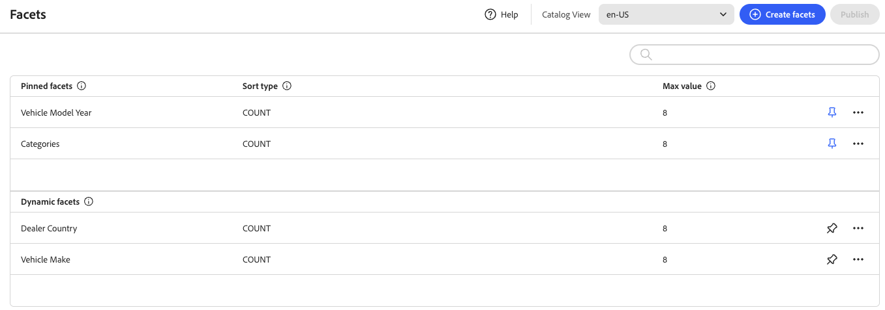

# Facet Workspace

*Facet*&#x200B;工作区列出了当前可用的所有Facet，并允许访问设置和管理Facet所需的工具。 固定多面首先出现在现有Facet列表中，然后是动态Facet。 您可以搜索Facet列表。

## 字段描述

| 字段 | 描述 |
|--- |--- |
| 创建Facet | 打开[方面编辑器](add.md)。 |
| 标签 | 可以编辑店面中显示的[Facet标签](type.md#facet-labels)，以便与您的品牌保持一致。 |
| 排序类型 | 用于[排序](type.md#sort-type)方面的方法。 所有[!DNL Adobe Commerce Optimizer]店面都按字母顺序和`Count`对Facet进行排序。 选项： 按字母顺序 — 按字母顺序对Facet进行排序。 计数 — 根据找到的匹配数对Facet进行排序。 |
| 最大值 | 可在店面中显示的每个Facet的最大值数。 表示一组值的多面均匀分布。 有效条目： 0 - 100；默认值： 8。 |

## 控件

| 控件 | 描述 |
|--- |--- |
|  | 将Facet固定或取消固定到&#x200B;*筛选器*&#x200B;列表的顶部。 |
|  | 显示一个菜单，其中包含可应用于选定小平面的更多操作。 选项：编辑、删除 |
