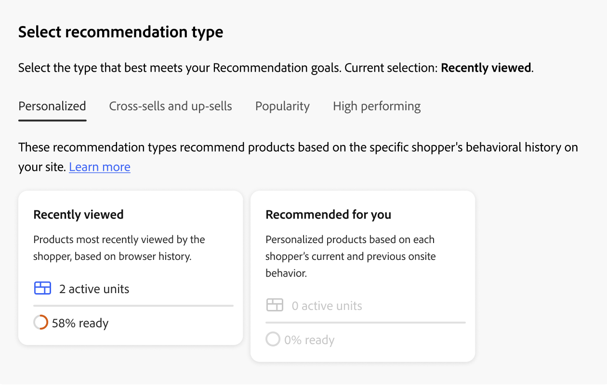

# 创建和管理推荐

在创建推荐时，您创建了一个包含推荐产品&#x200B;_项_&#x200B;的&#x200B;_推荐单元_，或构件。

_推荐单元_

激活推荐单元后，Adobe Commerce将开始[收集数据](../../manage-results/recommendation-performance.md)以测量展示次数、查看次数、点击次数等。 “推荐”表显示每个推荐单位的量度，以帮助您做出明智的业务决策。

1. 在&#x200B;_Adobe Commerce Optimizer_&#x200B;侧边栏上，转到&#x200B;_促销_ > **推荐**&#x200B;以显示&#x200B;_推荐_&#x200B;工作区。

1. 单击&#x200B;**创建推荐**。

1. 在&#x200B;_为您的推荐命名_&#x200B;部分中，输入描述性名称以供内部引用，如`Home page most popular`。

1. 在&#x200B;_选择推荐类型_&#x200B;部分中，根据您的策略指定所需的[推荐类型](types.md)。

1. 在&#x200B;_店面显示标签_&#x200B;部分中，输入购物者可见的[标签](best-practice.md#recommendation-labels)，例如“最畅销商品”。

1. 在&#x200B;_选择产品数_&#x200B;部分中，使用滑块指定要在推荐单元中显示的产品数。

   默认值为`5`，最大值为`20`。

1. （可选）在&#x200B;_筛选器_&#x200B;部分中，[应用筛选器](filters.md)以控制推荐单元中显示的产品。

1. 完成后，单击下列选项之一：

   - **另存为草稿**&#x200B;以便稍后编辑推荐单元。 您无法修改处于草稿状态的推荐单位的推荐类型。

   - **激活**&#x200B;以在您的店面启用推荐单元。

1. 出现提示时，复制推荐ID。 使用此ID可帮助您识别您的Edge Delivery Services店面的推荐下拉列表中正在使用的推荐单元。

>[!IMPORTANT]
>
>某些浏览器可能会阻止阻止阻止推荐按预期工作的关键脚本。

## 管理现有推荐

您可以编辑、停用或删除现有推荐。

1. 在&#x200B;_Adobe Commerce Optimizer_&#x200B;侧边栏上，转到&#x200B;_促销_ > **推荐**。

1. 选择要修改的推荐。

1. 单击（）更多选择器。

1. 在菜单中，您可以&#x200B;**停用**、**删除**&#x200B;或&#x200B;**编辑**&#x200B;推荐。 如果选择&#x200B;**编辑**，则可以根据需要调整以下设置：

   - 推荐名称
   - 店面标签
   - 产品数量
   - 筛选产品

   您无法更改推荐类型。

1. 完成后，单击&#x200B;**保存更改**。

## 就绪指示器

就绪指示器根据可用的目录和行为数据显示哪些推荐类型将表现最佳。 您还可以使用就绪指示器来确定您是否遇到与[事件收集](../../setup/events/overview.md)有关的问题，或者您是否没有足够的流量来填充推荐类型。

就绪指示器可分为[基于静态的](#static-based)或[基于动态的](#dynamic-based)。 基于静态的仅使用目录数据；而基于动态的则使用来自购物者的行为数据。 该行为数据用于[训练机器学习模型](../../setup/events/overview.md)以构建个性化推荐并计算其准备程度分数。

### 就绪指示器的计算方式

准备情况指示指示指示对模型进行多少培训。 指标取决于所收集的事件类型、与之交互的产品宽度和目录大小。

就绪指示器百分比的计算方法可指明根据推荐类型可推荐的产品数量。 产品统计是根据目录的总体大小、交互数量（例如查看次数、点击次数、添加到购物车的次数）以及在特定时间范围内注册这些事件的SKU的百分比来应用的。 例如，在节假日流量高峰期，就绪指示器显示的值可能高于正常流量时的值。

由于这些变量，就绪指示器百分比可能会波动。 这解释了为何您可能会看到推荐类型进出“准备部署”。

就绪指标的计算基于两个因素：

- 足够的结果集大小：在大多数情况下返回的结果是否足够以避免使用[备份建议](../../setup/events/overview.md#backuprecs)？
- 充分的结果集多样性：返回的产品是否代表您目录中的各种产品？ 此因素的目标是避免少数产品成为整个站点中唯一推荐的项目。

基于上述因素，就绪值计算并显示如下：

- 75%或更高的比例意味着针对该建议类型提出的建议将具有高度相关性。
- 至少50%意味着针对该建议类型提出的建议将不那么相关。
- 不足50%意味着为该建议类型提出的建议可能没有相关性。 在这种情况下，使用了[备份推荐](../../setup/events/overview.md#backuprecs)。

了解有关[为何就绪指示器可能较低的更多信息](#what-to-do-if-the-readiness-indicator-percent-is-low)。

### 基于静态

以下推荐类型基于静态，因为它们只需要目录数据。 不使用行为数据。

- _更多此类内容_

### 基于动态

以下推荐类型基于动态，因为它们使用店面行为数据。

过去六个月的店面行为数据：

- _查看了这个项目，也查看了那个项目_
- _查看了这个项目，但购买了那个项目_
- _已购买，已购买_
- _为您推荐_

过去七天的店面行为数据：

- _查看次数最多_
- _购买次数最多_
- _添加到购物车的次数最多_
- _趋势_
- _查看购买转换_
- _查看到购物车的转换_

最近的购物者行为数据（仅限视图）：

- _最近查看的项目_

### 可视化进度

为了帮助您可视化每种推荐类型的培训进度，_选择推荐类型_&#x200B;部分显示每种类型的就绪程度度量。

_推荐类型_

>[!NOTE]
>
>指标可能永远不会达到100%。

依赖目录数据的推荐类型的就绪指示器百分比变化不大，因为商人的目录变化不频繁。 但是，基于购物者行为数据的推荐类型的就绪指示器百分比可能会经常更改，具体取决于每日购物者活动。

#### 如果就绪指示器百分比很低，该怎么办

就绪性百分比低表示您的目录中符合此推荐类型推荐条件的产品不多。 这意味着，如果仍部署此推荐类型，则返回[备用推荐](../../setup/events/overview.md#backuprecs)的可能性很高。

>[!IMPORTANT]
>
>不支持&#x200B;_捆绑包_、_分组_&#x200B;和自定义产品类型。 如果您的目录包含大量此类产品类型，则就绪性得分可能较低。 此外，任何包含空格的SKU都可能会降低推荐的相关性，应避免使用。

下面列出了常见低就绪分数的可能原因和解决方案：

- **基于静态** — 这些指示器的百分比较低可能是由于缺少可显示产品的目录数据所致。 如果它们低于预期值，则完全同步可以修复此问题。
- **基于动态** — 基于动态的指示器的低百分比可能是由以下原因造成的：

   - 在必需的[storefront事件](../../setup/events/overview.md)中缺少相应推荐类型（requestId、产品上下文等）的字段。
   - 存储区上的低流量，因此我们收到的行为事件量很低。
   - 您商店中不同产品的店面行为事件多样性很低。 例如，如果在大多数情况下仅查看或购买了10%的产品，则相应的就绪指示器将会较低。

## 预览推荐

>[!IMPORTANT]
>
>此功能尚不可用。

_推荐的产品预览_&#x200B;面板始终随示例产品选择提供，这些产品在部署到店面时可能会出现在推荐单元中。

要在非生产环境中工作时测试推荐，您可以从其他源获取推荐数据。 这允许商家在部署到生产环境之前试验规则并预览推荐。

| 字段 | 描述 |
|---|---|
| 名称 | 产品的名称。 |
| SKU | 分配给产品的库存单位 |
| 价格 | 产品的价格。 |
| 结果类型 | 主要 — 表明收集的训练数据足以显示推荐。 备份 — 表明收集的训练数据不足，因此使用备份推荐来填充插槽。 转到[行为数据](../../setup/events/overview.md)了解有关机器学习模型和备份推荐的更多信息。 |

在创建推荐单元时，请尝试使用推荐类型和过滤器，以立即实时获取有关将包含的产品的反馈。 当您开始了解要显示哪些产品时，可以配置推荐单元以满足您的业务需求。

[!DNL Adobe Commerce Optimizer] [筛选器](filters.md)建议，以避免在单个页面上部署多个推荐单元时显示重复的产品。 因此，预览面板中显示的产品可能与店面中显示的产品不同。
