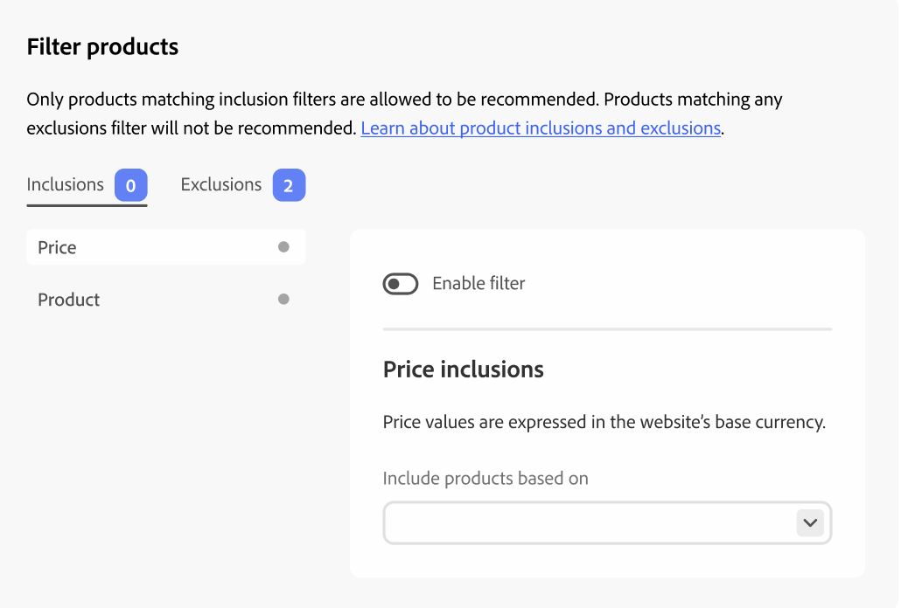

# 筛选产品

[!DNL Adobe Commerce Optimizer]自动将不可配置的默认筛选器应用于推荐单元。 如果您将多个推荐单元部署到页面，则[!DNL Adobe Commerce Optimizer]会过滤掉这些单元中重复的所有产品。 仅使用对重复产品的第一次引用，以便为推荐其他产品腾出空间。 [!DNL Adobe Commerce Optimizer]还会过滤掉任何以前购买过的产品和购物车中的产品。

当您[创建](create.md)推荐单元时，您可以定义用于控制可在推荐中显示哪些产品的过滤器。 这些过滤器基于您定义的一组包含或排除条件。 只有符合所有包含条件的产品才会出现在推荐中。 不建议使用符合任何排除条件的产品。

您可以通过选择每个过滤器页面上的切换来配置多个过滤器，并仅启用所需的过滤器。 这允许您创建过滤器草稿以供将来使用。 每个选项卡上会显示已启用的过滤器的数量。

## 条件

条件可以是静态或动态。

- 静态条件使用现有的产品属性来确定哪些产品可以显示在设备中。 例如，您可以指定只有价格超过$25的库存产品才会出现在单位中。

- 动态条件可关闭购物者的当前上下文，例如当前查看的类别或产品。 例如，在创建要在产品详细信息页面上部署的产品推荐时，您可以创建一个条件，以仅推荐在当前查看的产品相对价格范围内的产品。

### 逻辑运算符

逻辑运算符`AND`和`OR`用于连接多个条件。 如果同时使用包含和排除过滤器，则会先评估包含内容，以确定所有可能推荐的产品，然后从列表中删除与任何排除过滤器匹配的产品。

- `AND` — 加入两个包含过滤条件
- `OR` — 加入两个排除筛选条件

## 筛选器类型

### 产品

产品筛选器指定哪些特定产品符合条件或不符合条件，以便显示在推荐中。 您无法选择已禁用或无法单独显示的产品，因为这些产品永远不会显示在推荐中。

>[!NOTE]
>
>可配置产品的子产品不显示在推荐单元中，因为这些子产品具有&#x200B;_不可见_&#x200B;的可见性。

### 价格

基于产品价格的过滤器使用最终价格来执行比较。 最终价格包括匿名购物者可以享受的任何折扣或特殊价格。

<!--### Attribute

You can filter products based on attribute criteria, including attribute values. Selected values use OR logic to either include or exclude products when any of the specified values are found.-->
