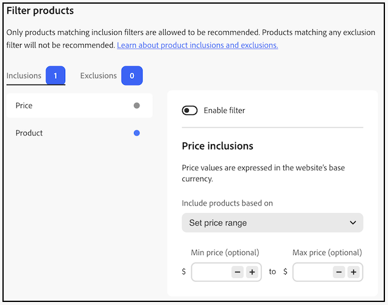
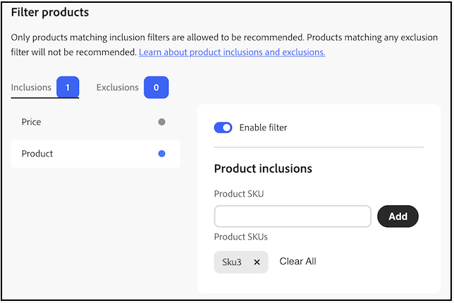

# 筛选产品

[!DNL Adobe Commerce Optimizer]自动将不可配置的默认筛选器应用于推荐单元。 如果您将多个推荐单元部署到页面，则[!DNL Adobe Commerce Optimizer]会过滤掉这些单元中重复的所有产品。 仅使用对重复产品的第一次引用，以便为推荐其他产品腾出空间。 [!DNL Adobe Commerce Optimizer]还会过滤掉任何以前购买过的产品和购物车中的产品。

当您[创建](create.md)推荐单元时，您可以定义用于控制可在推荐中显示哪些产品的过滤器。 这些过滤器基于您定义的一组包含或排除条件。 只有符合所有包含条件的产品才会出现在推荐中。 不建议使用符合任何排除条件的产品。

您可以通过选择每个过滤器页面上的切换来配置多个过滤器，并仅启用所需的过滤器。 这允许您创建过滤器草稿以供将来使用。 每个选项卡上会显示已启用的过滤器的数量。

## 条件

条件可以是静态或动态。

- 静态条件使用现有的产品属性来确定哪些产品可以显示在设备中。 例如，您可以指定只有价格超过$25的库存产品才会出现在单位中。

- 动态条件可关闭购物者的当前上下文，例如当前查看的类别或产品。 例如，在创建要部署在产品详细信息页面上的产品推荐时，您可以使用[动态价格过滤器](#dynamic-price-filters-relative-to-current-product)来包含或排除当前查看的产品相对价格范围内的产品。

### 逻辑运算符

逻辑运算符`AND`和`OR`用于连接多个条件。 如果跨过滤器类型同时使用包含和排除过滤器，则会先评估包含以确定所有可能推荐的产品，然后从列表中删除与任何排除过滤器匹配的产品。 **价格**&#x200B;筛选器在价格规则间使用不同的顺序：先是排除项，然后是包含项。 请参阅[如何包含和排除规则使用价格](#how-include-and-exclude-rules-use-price)。

- `AND` — 加入两个包含过滤条件
- `OR` — 加入两个排除筛选条件

## 筛选器类型

每种过滤类型都针对目录的不同方面，如产品和价格，因此您可以缩小或扩大哪些产品符合套餐条件。 选择与您的促销目标匹配的类型，然后根据需要组合包含和排除条件；下面的子部分描述了每个类型的行为方式以及[!DNL Adobe Commerce Optimizer]如何应用它。

>[!NOTE]
>
>只能推荐与&#x200B;**包含**&#x200B;过滤器匹配的产品，并且删除与&#x200B;**排除**&#x200B;过滤器匹配的任何产品。

### 价格 {#price}

>[!IMPORTANT]
>
>价格过滤为测试版。

价格筛选使用店面的&#x200B;**有效价格手册**&#x200B;中每个产品的&#x200B;**最终计算价格**，这是分配给呈现推荐单位的店面的价格手册。

该值：

- **包括**&#x200B;在该价格手册中定义的折扣、促销和特殊定价（不限于价目表价格）。
- **不包括**&#x200B;配送和购物车级别的调整。
- **仅适用于**&#x200B;该店面的有效价格手册；不使用其他店面或价格手册。

配置如何将价格手册映射到目录中的店面和[价格手册](../../setup/pricebooks.md)设置。

#### 如何包含和排除规则使用价格 {#how-include-and-exclude-rules-use-price}

- **排除规则** — 将首先删除最终价格&#x200B;**与任何**&#x200B;定义的价格排除匹配的产品。
- **包含规则** — 在剩余的候选产品中，只有最终价格&#x200B;**与所有**&#x200B;定义的价格包含条件相匹配的产品才符合条件。 这包括每个启用的包含过滤器（例如，您的价格规则以及任何其他包含规则）。

价格规则&#x200B;**筛选**&#x200B;推荐候选集；它们&#x200B;**不会**&#x200B;对产品重新排名。 引擎将生成一个排名列表，根据包含和排除价格规则从列表中删除产品，其余产品的相对顺序保持不变。 如果合格产品少于设备请求，则只显示有效项目。 如果没有符合条件的单位，则不会呈现单位（无空占位符）。

推荐单位中产品的价格与该店面价格簿中的&#x200B;**最终价格**&#x200B;相同，因此购物者看到的与用于筛选的值相匹配。 在管理员预览中，当变体价格不同时，可配置产品可能会显示价格范围；请参阅预览中的[可配置产品](#configurable-products-in-preview)。

#### 静态价格范围

如果您希望以商店的基本货币设定固定的最小值或最大值（与购物者正在查看的产品无关），请使用&#x200B;**静态**&#x200B;价格筛选器。

##### 设置静态价格过滤器

1. 在[创建或编辑](create.md)推荐单元时，打开&#x200B;**[!UICONTROL Filter products]**（或转到单元工作流中的&#x200B;_筛选器_&#x200B;步骤）。
1. 选择&#x200B;**[!UICONTROL Inclusions]**&#x200B;或&#x200B;**[!UICONTROL Exclusions]**&#x200B;选项卡，具体取决于您是希望仅允许价格范围内的产品，还是希望阻止价格范围内的产品。 每个选项卡上的徽章会显示已启用该类型过滤器的数量。
1. 在左侧的列表中，选择&#x200B;**[!UICONTROL Price]**。
1. 打开&#x200B;**[!UICONTROL Enable filter]**。

   价格值使用&#x200B;**网站的基本货币**，如页面上所述。

1. 打开&#x200B;**[!UICONTROL Include products based on]** （在&#x200B;**[!UICONTROL Inclusions]**&#x200B;选项卡上）或&#x200B;**[!UICONTROL Exclusions]**&#x200B;选项卡上的等效控件，然后选择&#x200B;**[!UICONTROL Set price range]**。
1. 使用货币符号旁边的字段设置可选&#x200B;**[!UICONTROL Min price]**&#x200B;和/或&#x200B;**[!UICONTROL Max price]**。 您可以键入金额或使用&#x200B;**-**&#x200B;和&#x200B;**+**&#x200B;控件来调整值。 如果不需要最小值或最大值，请将绑定留空。 该范围会与店面活跃价格手册中每个产品的最终计算价格进行比较。
1. 完成推荐单元配置，并像往常一样保存或发布，以使过滤器生效。

#### 动态价格过滤器（相对于当前产品） {#dynamic-price-filters-relative-to-current-product}

当推荐相对于产品详细信息页面(PDP)上当前已查看的&#x200B;**产品**&#x200B;应有限制时，请使用&#x200B;**动态**&#x200B;价格筛选器。 筛选器使用该产品的最终价格作为&#x200B;**锚点**，并将推荐的产品与您定义的边界进行比较。

动态运算符仅适用于在产品上下文中运行的[SKU相关推荐类型](types.md)，例如：

- 查看了这个项目，也查看了那个项目
- 查看了这个项目，购买了那个项目
- 购买了此项，也购买了此项
- 更多此类内容
- 视觉相似度

这些单位&#x200B;**不**&#x200B;适用于基于热门程度的类型（例如，**查看次数最多**&#x200B;或&#x200B;**购买次数最多**），因为这些单位没有单个当前产品来定位过滤器。

在店面，推荐插件从PDP上下文中读取当前产品的价格，并随推荐请求发送该价格。 在评估动态价格规则时，[!DNL Adobe Commerce Optimizer]使用该值作为锚点。 对于可配置产品，锚点为&#x200B;**最低变体**&#x200B;的最终价格(`priceRange.minimum`)。

##### 运算符

在&#x200B;**[!UICONTROL Include products based on]**（或等效的排除项）中，您可以选择：

| 操作员 | 用途 |
| --- | --- |
| **小于或等于当前产品价格** | 包括或排除位于或低于从固定价格加上抵销得出的边界的产品。 |
| **大于或等于当前产品价格** | 包括或排除位于或高于从固定价格加上抵销得出的边界的产品。 |
| **在当前产品的值范围内** | 包含或排除最终价格在锚点周围的固定货币范围内（与当前价格抵销）的产品。 |
| **在当前产品的百分比范围内** | 包含或排除最终价格在锚点周围某个百分比范围内的产品。 |

##### 偏移语义

对于&#x200B;**小于或等于当前产品价格**&#x200B;和&#x200B;**大于或等于当前产品价格**，您输入的值为添加到锚点价格&#x200B;**的**&#x200B;数字偏移量以形成边界：

- **负**&#x200B;偏移量将边界&#x200B;**移动到当前产品价格**&#x200B;以下。
- **正**&#x200B;偏移将边界&#x200B;**移动到当前产品价格**&#x200B;上方。
- **Empty**&#x200B;或&#x200B;**0**&#x200B;表示该侧&#x200B;**没有限制**；后端对它们的处理方式相同。
- 不能使用&#x200B;**0**&#x200B;表示“与当前产品价格完全相同”作为界限。

这与PaaS上的[!DNL Product Recommendations]匹配。 管理员中的标签会直接反映这些语义。

##### 设置动态价格过滤器

1. [创建或编辑](create.md)部署在&#x200B;**产品详细信息**&#x200B;页面上的&#x200B;**SKU相关**&#x200B;推荐单元（或其他当前产品始终处于上下文中的投放位置）。
1. 打开&#x200B;**[!UICONTROL Filter products]**&#x200B;并选择&#x200B;**[!UICONTROL Inclusions]**&#x200B;或&#x200B;**[!UICONTROL Exclusions]**&#x200B;选项卡。
1. 选择&#x200B;**[!UICONTROL Price]**&#x200B;并打开&#x200B;**[!UICONTROL Enable filter]**。
1. 打开&#x200B;**[!UICONTROL Include products based on]**（或等效排除项）并选择动态运算符（例如，**在当前产品**&#x200B;的值范围内）。
1. 在出现提示时输入偏移或范围值。 使用预览以确认示例产品的结果。
1. 保存或发布设备。

无效值（非数字量、不支持的组合或最小值大于最大值的范围）阻止保存并显示验证错误；**[!UICONTROL Save]**&#x200B;在筛选器有效之前保持禁用状态。

##### 无可用锚价时

如果启用了动态价格过滤器，但店面无法提供当前产品价格（例如，单位在PDP上下文之外呈现），[!DNL Adobe Commerce Optimizer]不会返回未过滤的建议。 该单元显示&#x200B;**没有推荐**，因为显示未过滤的结果与您配置的规则不匹配。

##### 预览中的可配置产品 {#configurable-products-in-preview}

在管理员&#x200B;**预览**&#x200B;面板中，推荐的产品价格显示如下：

- **简单产品** - GraphQL响应中的单一最终价格。
- **可配置产品** — 如果最小和最大变体价格不同，则预览会显示一个范围（例如，`$min – $max`）。 如果两者相等，则只显示一个价格。

用于可配置产品的动态筛选器计算的固定价格始终为&#x200B;**最低**&#x200B;变量最终价格，与店面一致。

#### 价格过滤器示例

以下示例使用当前产品价格&#x200B;**$500**。 调整包含与排除以匹配您的促销目标。

| 操作员 | 选项卡 | 目标 | 示例边界 |
| --- | --- | --- | --- |
| 小于或等于当前产品价格 | 排除项 | 通过隐藏价格较低的替代产品促进追加销售 | 不包括价值500美元≤产品 |
| 小于或等于当前产品价格 | 包含项 | 提供预算友好的替代方案 | 包括500美元≤产品 |
| 大于或等于当前产品价格 | 排除项 | 避免在注重预算的流程中追加销售 | 不包括价值500美元≥产品 |
| 大于或等于当前产品价格 | 包含项 | 表面优质替代品 | 包括500美元≥产品 |
| 在当前产品的值范围内 | 排除项 | 从类似的价位转向多元化投资 | 不包括$400-$600 |
| 在当前产品的值范围内 | 包含项 | 在狭窄的范围内显示可比较的替代项 | 包括400至600美元 |
| 在当前产品的百分比范围内 | 排除项 | 减少价格相似的项目（例如±20%） | 不包括约400至600美元 |
| 在当前产品的百分比范围内 | 包含项 | 可资比较组别内之公平比较 | 包括大约400到600美元 |

### 产品

产品筛选器按&#x200B;**SKU**&#x200B;定位单个目录项。 添加一个或多个SKU以仅允许这些产品（**排除项**）或阻止这些产品（**排除项**），使用与[价格筛选器](#price)相同的&#x200B;**[!UICONTROL Filter products]**&#x200B;页面。 您不能在推荐单元中显示已禁用的产品或无法单独显示的产品；无论使用什么过滤器，这些产品都不会出现在店面上。

#### 设置产品过滤器

1. 在[创建或编辑](create.md)推荐单元时，打开&#x200B;**[!UICONTROL Filter products]**（或转到单元工作流中的&#x200B;_筛选器_&#x200B;步骤）。
1. 选择&#x200B;**[!UICONTROL Inclusions]**&#x200B;或&#x200B;**[!UICONTROL Exclusions]**&#x200B;选项卡。 每个选项卡上的徽章会显示已启用该类型过滤器的数量。
1. 在左侧的列表中，选择&#x200B;**[!UICONTROL Product]**。
1. 打开&#x200B;**[!UICONTROL Enable filter]**。

   右侧面板标题反映选项卡，例如&#x200B;**[!UICONTROL Product inclusions]**&#x200B;或排除项的等效选项卡。

1. 在&#x200B;**[!UICONTROL Product SKU]**&#x200B;中，输入SKU并单击&#x200B;**[!UICONTROL Add]**。 重复添加更多SKU。

   在&#x200B;**[!UICONTROL Product SKUs]**&#x200B;下，每个SKU都显示为可移动标记。 单击标记上的&#x200B;**X**&#x200B;删除该SKU，或单击&#x200B;**[!UICONTROL Clear All]**&#x200B;从列表中删除每个SKU。

1. 完成推荐单元配置，并像往常一样保存或发布，以使过滤器生效。

对于&#x200B;**包含**，只能推荐列出了SKU的产品（并且满足其他启用的包含过滤器要求）。 对于&#x200B;**排除项**，不建议列出SKU的任何产品，即使它符合其他条件。

>[!NOTE]
>
>可配置产品的子产品不显示在推荐单元中，因为这些子产品具有&#x200B;_不可见_&#x200B;的可见性。

<!--
### Attribute

You can filter products based on attribute criteria, including attribute values. Selected values use OR logic to either include or exclude products when any of the specified values are found.
-->
