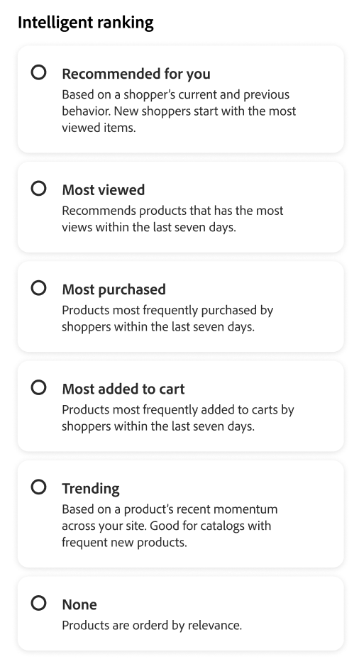

# 创建和管理规则

要构建规则，请打开规则编辑器，选择&#x200B;**规则类型**（搜索条件、默认列表或类别页面），然后定义其应用的条件和排名，测试结果并发布规则。

## 创建规则 {#create-a-rule}

1. 在左边栏中，转到&#x200B;_促销_ > **促销规则**。
1. （可选）使用&#x200B;**目录视图**&#x200B;下拉列表选择应用规则的目录视图。 您创建的规则将作用域限定于选定的视图（如果选择&#x200B;**所有视图**，则限定于所有目录视图）。 请参阅[选择目录视图](workspace.md#select-catalog-view)，了解目录视图作用域的工作方式。

   >[!IMPORTANT]
   >
   >目录视图当前处于[测试版](https://experienceleague.adobe.com/zh-hans/docs/commerce-operations/release/beta#merchandising-rules-globally-and-per-catalog-view-public-beta)中。 Beta参与者需要重新创建任何现有的促销规则，以利用新的目录视图范围。

1. 单击&#x200B;**[!UICONTROL Create rule]**&#x200B;启动规则编辑器。

### 规则类型

每个规则类型在编辑器中都有一个信息图标，简短地说明了相关说明。 使用与购物者应该看到促销逻辑的位置匹配的类型：

| 规则类型 | 用途 |
| --- | --- |
| **所有产品规则** | 当不再应用更具体的搜索或类别规则时，跨产品列表的默认排名和促销。 您只能创建一个此类规则；它不能包含条件。 |
| **类别规则** (Beta) | 将推销和排名应用于一个或多个选定的类别，从而控制这些类别页面上的产品订单。 |
| **搜索规则** | 当购物者运行与规则的查询条件匹配的搜索时，应用促销和排名。 |

在&#x200B;**构建规则**&#x200B;部分中，您可以定义规则名称、计划、规则是否适用于所有列表或特定搜索条件以及排名类型。

1. 在&#x200B;**[!UICONTROL Name]**&#x200B;字段中，输入规则的名称。 所有规则名称必须唯一。
1. 在&#x200B;**[!UICONTROL Description]**&#x200B;字段中，输入规则的描述。
1. 在&#x200B;**[!UICONTROL Date range]**&#x200B;字段中，指定您希望规则生效的日期或日期范围。
1. 在&#x200B;**[!UICONTROL Rule applies to]**&#x200B;部分中，选择要使用的[规则类型](#rule-types)。

>[!BEGINTABS]

>[!TAB 搜索规则]

当购物者执行与定义的条件匹配的搜索时，搜索规则应用推销和排名逻辑。

条件是指触发事件的要求。 一个规则最多可以有10个条件和25个事件。 默认规则不能包含任何条件。

**单个条件**

1. 在&#x200B;*生成您的规则*&#x200B;下，选择要满足的&#x200B;**条件**，然后按照说明完成该语句。

   - 搜索查询包含 — 输入购物者查询中必须包含的文本字符串。 匹配设置确定购物者的查询与目录匹配的程度。 选项： 任意 — 购物者的查询文本的任何部分都可以匹配条件。 全部 — 购物者的所有查询都必须符合条件。
   - 搜索查询为 — 输入与购物者的查询完全匹配的文本字符串。 例如：“yoga pants”。 具有`Search query is`且匹配`All`的规则只能有一个条件。
   - 搜索查询开头为 — 输入必须在购物者查询开头的字符或文本字符串。
   - 搜索查询结尾为 — 输入必须在购物者查询末尾的字符或文本字符串。

   结果会立即显示在&#x200B;*测试您的规则*&#x200B;窗格中，并按优先级进行编号。 您可以使用右上角的&#x200B;*每行结果*&#x200B;滑块来更改每行的产品数。

1. 若要测试其他查询，请更改&#x200B;*测试您的规则*&#x200B;搜索框中的查询文本，然后按&#x200B;**返回**。
最初，测试窗格从“条件”搜索框中呈现查询。 但现在，它从测试查询框呈现查询。 测试窗格一次只呈现一个查询。
1. 如果您喜欢该结果，请更新&#x200B;*条件*&#x200B;搜索框中的文本。 然后，单击页面上的任意位置以更新测试窗格中的结果。
1. 设置[智能排名](#intelligent-ranking)和[手动排名](#manual-ranking)，如以下部分所述。 相同的控件适用于类别页面，并标注出任何差异。

**多个条件**

1. 要生成包含多个条件的规则，请单击&#x200B;**添加条件**。
一个规则最多可以有10个条件。 连接两个条件的逻辑运算符基于当前*匹配*&#x200B;设置。 默认情况下，*匹配*&#x200B;为`All`，逻辑运算符为`AND`。

1. 选择第二个条件并输入所需的查询文本。

1. 要更改规则的逻辑，请更改&#x200B;**匹配**&#x200B;设置以确定购物者的搜索条件与查询条件的匹配程度。 将&#x200B;**Match**&#x200B;设置为以下项之一：

   - 任意 — （默认）规则中的所有逻辑运算符都设置为`OR`，结果显示在测试窗格中。
   - 全部 — 规则中的所有逻辑运算符均设置为`AND`，结果将显示在测试窗格中。

   *Match*&#x200B;值确定用于连接多个条件的逻辑运算符。 更改&#x200B;*Match*&#x200B;设置将更改规则中的所有逻辑运算符。 无法在同一规则中组合`AND`和`OR`。

   在本例中，不是搜索“yoga pants”，而是有两个单独的查询来搜索“yoga”或“pants”。 此规则的具体性较低，在店面触发的频率高于其他规则。

1. 要添加其他条件，请单击&#x200B;**添加条件**&#x200B;并重复该过程。
1. 设置[智能排名](#intelligent-ranking)和[手动排名](#manual-ranking)，如以下部分所述。 相同的控件适用于类别页面，并标注出任何差异。

>[!TAB 类别规则]

>[!IMPORTANT]
>
>类别规则为测试版。

类别规则控制&#x200B;**类别页面**&#x200B;上产品的订购方式。 您可以将&#x200B;**类别规则**&#x200B;与&#x200B;**智能排名**（包括AI驱动的信号）以及&#x200B;**手动**&#x200B;操作（例如pin、boost和bury）结合使用，这样您就可以在不依赖外部工具的情况下策划发现、运行促销活动并将类别页面与策略保持一致。

1. 在&#x200B;**类别**&#x200B;下，选择规则应应用的一个或多个类别。 选定的类别显示在控件下方，以便您确认范围。
1. 从显示的类别列表中，单击三个圆点，然后选择：

   - **删除** — 从规则中删除类别。
   - **应用于子类别** — 将规则应用于尚未定义活动促销规则的子类别。
   - **预览** — 显示类别页面在店面中的显示方式。

1. 设置[智能排名](#intelligent-ranking)和[手动排名](#manual-ranking)，如以下部分所述。 相同的控件适用于搜索规则，但会标注任何差异。

>[!ENDTABS]

### 智能排名 {#intelligent-ranking}

智能排名使用&#x200B;**行为信号**&#x200B;和（如果适用）AI对产品进行排序。 它适用于&#x200B;**搜索规则**、**所有产品列表**（默认规则）和&#x200B;**类别规则**（类别页面）。 对于购物者&#x200B;**搜索**，排名也将&#x200B;**文本相关性**&#x200B;加到查询中；**类别页面**&#x200B;未以相同方式使用查询文本 — 编辑者侧重于行为策略。

商店所有者可以设置如下策略。 确切的标签和时间窗口与规则编辑器匹配，并且可能因规则类型而略有不同。

- **购买次数最多** / **购买次数最多** — 最近窗口（例如，搜索上下文的前7天）中每个SKU的购买频率排名。
- **添加到购物车次数最多** — 按最近窗口中的添加到购物车活动总数排名（例如，搜索上下文的前7天）。
- **查看次数最多** — 在最近一个窗口（例如，搜索上下文的前7天）按每个SKU的查看次数排名。
- **为您推荐** — 使用`viewed-viewed`信号：查看了此SKU的购物者也查看了其他SKU；支持在可用的类别页面上个性化订购。
- **趋势** — 强调最近的热门程度(对于搜索、过去72小时内的页面查看次数（对于后台事件）以及24小时内的页面查看次数（对于前台事件）。
- **无** — 对于搜索和默认列表，产品按&#x200B;**相关性**&#x200B;排序。 对于&#x200B;**类别规则**，如果您未选择其他智能策略，则对该类别使用默认促销顺序。

选择规则的策略。 **测试您的规则**&#x200B;窗格显示面向搜索的规则的预期结果；**类别规则**&#x200B;使用类别预览。

#### 智能排名评分的工作原理（搜索）

对于&#x200B;**搜索结果**（以及规则编辑器中的测试查询），智能排名通过组合两个关键因素来确定最终产品顺序： **文本相关性**&#x200B;和&#x200B;**行为信号**。 了解这些因素如何相互作用有助于您为搜索结果设置现实的期望。

**评分组件：**

- **文本相关性**：得分中的主导因素。 这会测量产品名称、描述和属性与搜索查询的匹配程度。 文本相关性得分是无界的（没有特定的上限），并且受以下因素影响：

   - 匹配单词出现的频率。
   - 产品名称/说明的长度（以字为单位）。

- **行为信号**：在文本相关性得分之上应用的有界提升。 当您选择“查看次数最多”或“购买次数最多”等智能排名策略时，具有更高行为信号的产品会获得得分的固定提升。 然而，这种提升有一个明确的限制。

**为什么查看次数最多的产品可能不会首先显示：**

文本相关性通常主导排名，因为其分数不受限制，而行为提升是固定的。 因此，具有强文本匹配的产品通常比那些具有较高参与信号的产品更出色。 行为增强本身可能无法弥补文本相关性的巨大差距。 智能排名通过同时考虑匹配质量和购物者互动来解决这个问题，从而提高整体相关性。 但是，文本匹配质量仍然是排名的主要驱动因素。

**示例：**

商户使用“查看次数最多”的智能排名策略并搜索“蜡烛”。 他们预计产品SKU YAN-K-E-512会显示在结果顶部，因为它具有最高的查看计数。 然而，其他产品的排名更高：

- **Texas Candle** （第1个位置）：具有更短、更干净的产品名称，这会产生非常高的文本相关性分数。 尽管它的观看次数比YAN-K-E-512少，但是其优越的文本匹配超过了行为提升。

- **YAN-K-E-512**（较低位置）：尽管在“查看次数最多”行为数据中拥有最高的查看百分位数，但其基于SKU的复杂名称会生成较低的文本相关性分数。 固定行为提升不足以克服文本相关性差距。

请参阅[搜索规则](./best-practice.md#tips-to-optimize-search-rules)，了解如何使用规则提高产品可查找性。

#### 注意事项

- 查询中的撇号和引号可能会导致某些语言中的排名和相关性出现一些小问题。
- 要确保&#x200B;**搜索**&#x200B;的智能排名正常工作，请确保用于搜索或筛选(Facet)的任何属性的&#x200B;**搜索权重**&#x200B;为`5`或更少。 （本指导适用于搜索索引，而不适用于仅限类别的促销流程。）

有关设置搜索权重的信息，请参阅[元数据API](https://developer.adobe.com/commerce/services/reference/rest/)。

### 手动排名 {#manual-ranking}

**手动排名**&#x200B;事件调整&#x200B;**搜索结果**（当您的规则条件满足时）、**默认产品清单**&#x200B;和&#x200B;**类别页面**&#x200B;清单的产品顺序。 单个规则最多可以包含25个事件。

- **提升** — 将产品在列表中上移。
- **Bury** — 将SKU移到列表的下方。
- **固定产品** — 将产品修复在列表中的选定位置。
- **隐藏产品** — 从结果中排除SKU（面向搜索；确认编辑器中的类别规则的行为）。

固定产品的最简单方法是拖放。

1. 在“测试”窗格中单击并拖动产品。 将其拖放到所需位置。 产品和位置字段会自动填充到“事件”窗格中。

您还可以单击大头针图标以将产品固定到其当前位置。 使用省略号上下文菜单“固定到顶部”或“固定到底部”。

>[!NOTE]
>
>**搜索规则** — 您只能固定出现在已配置查询和规则条件的搜索结果中的产品。 产品必须已编制索引、可见、有库存，并且符合所有规则筛选器才能进行固定。 如果某个产品未出现在规则的预览或结果中，则固定它不起作用。
>
>**默认排序** — 当购物者使用默认排序方式时，将应用手动位置： **排序方式：最相关**&#x200B;用于搜索，或&#x200B;**相关性** / **位置**&#x200B;用于类别列表。 如果购物者更改排序（例如按名称、固定、提升、隐藏或隐藏行为），则可能与预览不再匹配。

或者，可以手动设置事件：

1. 在&#x200B;*Events*&#x200B;下，选择满足相关条件时要发生的&#x200B;**Event**。

   例如，选择`Hide a product`。 然后，输入要隐藏的产品名称。 产品随您的键入一起推荐。

1. 对于多个事件，选择满足条件时要触发的任何其他事件。

### 最终确定规则 {#finalizing-the-rule}

1. 在测试窗格中检查规则的结果。
1. 如果规则具有多个查询，请测试每个可能受规则影响的查询。
1. 完成后，单击&#x200B;**保存并发布**。

   该规则已添加到&#x200B;*规则*&#x200B;工作区中的列表。

1. 虽然活动规则会立即生效，但您最多可能必须等待15分钟才能刷新店面中的缓存查询结果。

>[!NOTE]
>
>当选择默认排序顺序“排序依据：最相关”时，规则和手动排名产品将应用于&#x200B;**搜索**&#x200B;结果。 如果购物者将排序顺序更改为诸如按名称排序之类的排序，则规则和手动排名不再有效。 对于&#x200B;**类别**&#x200B;列表，[手动排名](#manual-ranking)中描述了默认排序行为。

## 编辑、查看和删除规则 {#edit-view-and-delete-rules}

按照以下说明更新现有规则的属性。 创建规则后，不能更改该规则的目录视图（范围）；创建规则时会设置范围。 请参阅[选择目录视图](workspace.md#select-catalog-view)。

### 编辑规则

1. 在&#x200B;*促销规则*&#x200B;工作区上，在网格中查找要编辑的规则，然后单击&#x200B;**更多** (...)选项。
1. 单击&#x200B;**编辑**&#x200B;以访问规则编辑器。
1. 根据需要更新条件、运算符和事件。
1. 根据需要更新名称、开始和结束日期以及说明字段。 所有规则名称必须唯一。
1. 测试规则。
1. 发布更改。
该规则已添加到*规则*&#x200B;工作区中的列表。 尽管活动规则会立即生效，但刷新店面中的缓存查询结果可能需要15分钟。

### 查看详细信息

此选项提供了一种快速查看所有规则参数的方法，同时保留在&#x200B;*规则*&#x200B;表中。

1. 在&#x200B;*促销规则*&#x200B;工作区中，在网格中找到要编辑的规则，然后单击&#x200B;**更多** (...)选项。
1. 单击&#x200B;**查看详细信息**&#x200B;以查看规则参数。
1. 选择&#x200B;**编辑**&#x200B;或&#x200B;**删除**，或单击X关闭面板。

### 删除规则

1. 在&#x200B;*规则*&#x200B;工作区上，在网格中查找要编辑的规则，然后单击&#x200B;**更多** (...)选项。
1. 单击&#x200B;**删除**。

## 字段描述 {#field-descriptions}

### 条件(if)

| 条件 | 描述 |
|--- |--- |
| 搜索查询包含 | 购物者的查询中包含的字符或文本字符串。 购物者的查询只需要匹配单个字符即可满足此条件。 |
| 搜索查询为 | 与购物者的查询完全匹配的字符或文本字符串。 使用此条件时，无法组合具有多个条件的复杂查询。 |
| 搜索查询始于 | 购物者的查询以此字符或文本字符串开头。 |
| 搜索查询结束于 | 购物者的查询以这个字符或文本字符串结尾。 |

### 逻辑运算符

| 操作员 | 描述 |
|--- |--- |
| 或者 | （默认）逻辑运算符`OR`比较两个条件并满足在至少有一个条件为true时触发事件的要求。 |
| 和 | 逻辑运算符`AND`比较两个条件并满足触发事件的要求（如果两个条件均为true）。 |

### 匹配运算符

| 操作员 | 描述 |
|--- |--- |
| 任何 | 将规则中的所有逻辑运算符更改为`OR`并返回匹配产品集。 |
| 全部 | 将规则中的所有逻辑运算符更改为`AND`并返回匹配产品集。 |

### 手动排名事件

| 事件 | 描述 |
|--- |--- |
| 提升 | 将SKU或一系列SKU在列表（搜索或类别）中移到较高位置。 每个报表在测试结果中均标有“已提升”预览徽章。 |
| Bury | 将一个SKU或一系列SKU移到列表较低的位置。 测试结果中每个页面都标有一个“掩埋”预览徽章。 |
| 固定产品 | 将单个SKU附加到列表中的特定位置。 产品在测试结果中标记为“已固定”预览徽章。 |
| 隐藏产品 | 从结果中排除一个SKU或一系列SKU（面向搜索；在编辑器中确认类别规则）。 |

### 详细信息

| 字段 | 描述 |
|--- |--- |
| 名称 | 规则的名称。 规则名称必须唯一。 |
| 规则类型 | **默认值**（所有产品列表）、**查询**（特定搜索条件）或&#x200B;**类别**（类别页面），具体取决于&#x200B;**规则适用于**。 |
| 开始日期 | 规则的开始日期（如果已计划）。 |
| 结束日期 | 规则的结束日期（如果已计划）。 |
| 描述 | 规则的简要说明。 |
