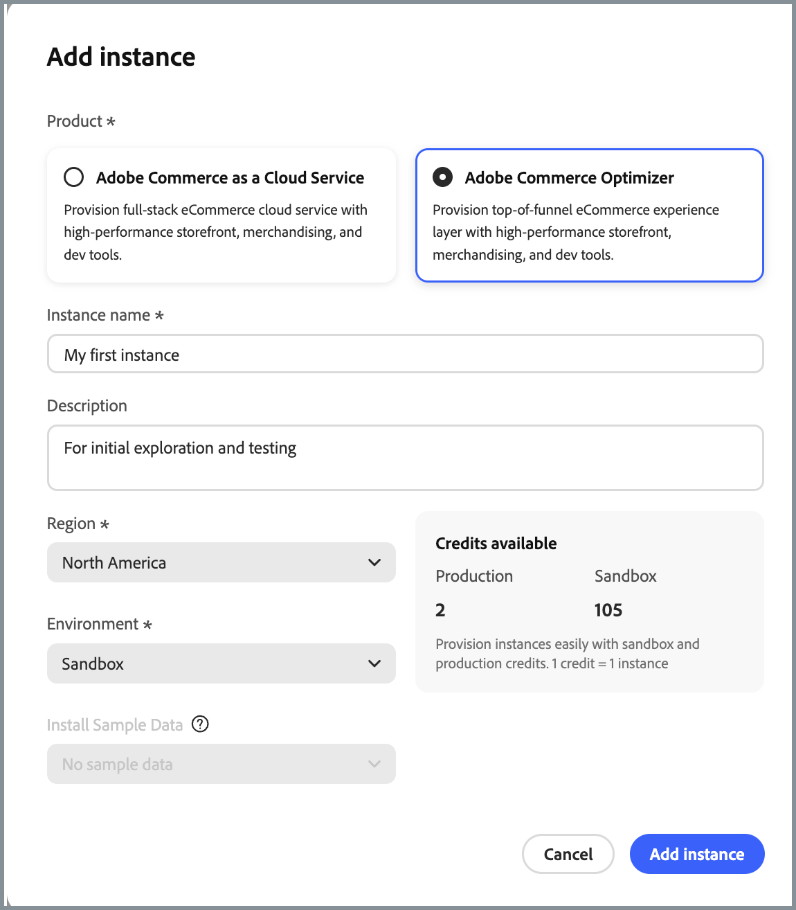

# 发行说明

以下发行说明包含[!DNL Adobe Commerce Optimizer]的更新，包括：

* [[!DNL Adobe Commerce Optimizer Studio]](overview.md#quick-tour)的新增功能和改进。
* 更新了用于storefront目录数据检索的[数据摄取REST API](https://developer.adobe.com/commerce/services/reference/rest/)和[GraphQL API](https://developer.adobe.com/commerce/services/reference/graphql/)。

  {{aco-api-updates-and-dropins}}

## 2026年6月

>[!BEGINSHADEBOX]

_2026年6月24日_

<!-- v1.3 -->

 **新`canEditQuantity`字段** — 已将`canEditQuantity`添加到目录服务GraphQL中的`ProductViewOptionValueProduct`。 它会公开Commerce管理员中捆绑选择的可选&#x200B;**用户定义**&#x200B;数量设置，以便店面使用者可以确定捆绑选择的数量是否可编辑。

### 语义搜索

[!DNL Adobe Commerce Optimizer]现在支持&#x200B;**[!UICONTROL Settings]**&#x200B;中&#x200B;[**高级搜索**](./settings.md#advanced-search)&#x200B;选项卡上的&#x200B;**[语义搜索]**。 语义搜索使用人工智能根据含义和上下文与关键字搜索匹配产品，从而减少用于自然语言查询的空搜索页面。 对于符合条件的英语目录，默认情况下会启用此选项。 您可以选择在同一选项卡上调整&#x200B;**[!UICONTROL Semantic boost]**、**[!UICONTROL Similarity threshold]**&#x200B;和&#x200B;**[!UICONTROL Fuzzy search]**。 无需属性设置或店面变更。 [了解详情](./setup/semantic-search.md)。

### 推荐价格过滤器(Beta)

产品推荐单位现在在&#x200B;**[!UICONTROL Filter products]**&#x200B;步骤中支持&#x200B;[**价格筛选器**](./merchandising/recommendations/filters.md#price)。 在产品详细信息页面上包含或排除使用&#x200B;**静态**&#x200B;最小和最大范围或&#x200B;**动态**&#x200B;规则的候选产品，这些规则会将推荐的产品与店面活动价格手册中当前查看产品的&#x200B;**最终计算价格**&#x200B;进行比较。 价格规则筛选候选集。 它们不会将产品重新排名。 [了解详情](./merchandising/recommendations/filters.md#price)。

{{aco-release}}

>[!ENDSHADEBOX]

## 2026年5月

>[!BEGINSHADEBOX]

### 智能排名提升

搜索、默认产品列表和[类别页面](./merchandising/rules/add.md#rule-types)的[促销规则](./merchandising/rules/add.md#intelligent-ranking-boost)现在包含&#x200B;**[!UICONTROL Intelligent Ranking Boost]**。 您可以调整&#x200B;**查看次数最多**&#x200B;或&#x200B;**趋势**&#x200B;等策略对产品订单的影响（相对于搜索中的文本相关性和类别列表上的行为信号）。 规则预览可反映您的设置。 提升在查询时应用，因此当您更改它时，您不需要重新同步目录。

### API更新

_2026年5月28日_

<!-- v1.2 -->

 **完整的导航树** — 当路径中存在未标记的中间节点时，已标记的后代类别现在正确地包含在系列筛选的`navigation`树中。 此修复程序可确保购物者在导航中看到所有相关类别，从而更轻松地浏览和发现商品。

 **在`categoryTree`请求中处理空概要** — 修复了[`categoryTree`](https://developer.adobe.com/commerce/services/graphql-api/merchandising-api/index.html#query-categoryTree)查询在`slugs`参数包含空字符串时返回内部服务器错误的问题。 现在会忽略空概要，因此存储前端和集成可以继续解析类别数据，而不会请求失败。

 **`searchCategory`请求返回不区分大小写、按字母顺序排列的结果**— `searchCategory`查询现在按字母顺序排列搜索结果，不区分大小写，确保排序一致且可预测。 如果名称在其他方面相同，则前缀较短的类别首先出现。

_2026年5月4日_

<!--v1.53-->

**正确的货币显示** — 店面产品价格现在显示所有产品类型的正确货币代码（例如，USD）。 以前，某些产品显示`NONE`而不是预期的货币，从而导致缺少价格。

<!--DATA-7115-->

{{aco-release}}

>[!ENDSHADEBOX]

## 2026年4月

**发行日期**：2026年4月7日

>[!BEGINSHADEBOX]

### 目录规则

[类别规则](./merchandising/rules/add.md)扩展了促销规则，以便您可以定位类别并在类别页面上控制产品订单，这些类别页面上的排名和操作（固定、提升、嵌入）与搜索相同。

### 价格过滤器(Beta)

推荐筛选器现在包括[价格范围筛选器](./merchandising/recommendations/filters.md#price)（最小值和最大值）。

### API更新

_2026年4月29日_

<!--v1.52 release-->

**需要批量处理请求** — 现在，当您检索目录数据时，GraphQL API为每个请求最多强制执行100个SKU。 查看[记录的限制和边界](https://experienceleague.adobe.com/en/docs/commerce/optimizer/boundaries-limits#product-discovery)。

<!--DATA-7156-->

_2026年4月17日_

<!--v1.51 release-->

**使用GraphQL按名称查找类别** — 新的[`searchCategory`](https://developer.adobe.com/commerce/services/reference/graphql/)查询返回匹配类别，并对店面和集成进行分页。 请参阅API引用，以了解参数和响应字段。<!--COMOPT-1819-->

_2026年4月7日_

<!--v1.50 release-->

**更简单的类别查找** — [categoryTree](https://developer.adobe.com/commerce/services/graphql-api/merchandising-api/index.html#query-categoryTree)查询将`family`视为可选的，因此您可以通过Slug解析类别，而无需提供系列。

{{aco-release}}

>[!ENDSHADEBOX]

## 2026年3月

本月没有[[!DNL Adobe Commerce Optimizer Studio]](overview.md#quick-tour)版本。 请参阅下面的API更新。

>[!BEGINSHADEBOX]

### API更新

_2026年3月24日_

动态捆绑包现在会返回计算出的价格范围。<!--DATA-7014-->

{{aco-release}}

>[!ENDSHADEBOX]

## 2026年2月

**发行日期**：2026年2月19日

>[!BEGINSHADEBOX]

### 促销规则和推荐的目录视图

现在，您可以在[创建推荐单位](./merchandising/recommendations/create.md)或[促销规则](./merchandising/rules/add.md)时指定目录视图。

### API更新

_2026年2月19日_

<!--v1.48-->

**店面更丰富的类别内容** — [categoryTree](https://developer.adobe.com/commerce/services/graphql-api/merchandising-api/index.html#query-categoryTree)查询现在返回描述、图像和SEO元标记，因此店面可以呈现更丰富的类别页面。<!--DATA-6933-->

_2026年2月12日_

<!--v1.49-->

**按类别增强了产品数据** — GraphQL API添加了[`CategoryProductView`](https://developer.adobe.com/commerce/services/graphql-api/merchandising-api/index.html#definition-CategoryProductView){target="blank"}类型，以便您可以按类别查询和筛选往返次数较少的产品。

{{aco-release}}

>[!ENDSHADEBOX]

## 2026年1月

本月没有[[!DNL Adobe Commerce Optimizer Studio]](overview.md#quick-tour)版本。 请参阅下面的API更新。

>[!BEGINSHADEBOX]

### API更新

_2026年1月19日_

* REST API支持&#x200B;**更丰富的类别** — [类别API](https://developer.adobe.com/commerce/services/reference/rest/#operation/createCategories)操作现在除了`families`之外还接受可选的`metaTags`、`images`和`description`值，因此您可以为类别提供更丰富的促销和SEO详细信息。

{{aco-release}}

>[!ENDSHADEBOX]

## 2025年12月

**发行日期**：2025年12月10日

>[!BEGINSHADEBOX]

### 机会

商家现在可以通过[Adobe Sites Optimizer](./manage-results/opportunities.md)获取AI支持的推荐，以检测站点问题并提供性能修复建议。

### 目录层

现在，商家可以使用[目录层](./setup/catalog-layer.md)覆盖产品数据，而无需编辑源目录、管理层优先级以及使用Adobe Sites Optimizer自动修复。

{{aco-release}}

>[!ENDSHADEBOX]

## 2025年11

本月没有[[!DNL Adobe Commerce Optimizer Studio]](overview.md#quick-tour)版本。 请参阅下面的API更新。

>[!BEGINSHADEBOX]

### API更新

_2025年11月21日_

**更新了数据摄取REST API的身份验证说明** — 这些说明现在引用了数据摄取服务的OAuth访问令牌和正确的Developer Console凭据范围。 如果您的凭据范围已过期，请重新生成它们以保留访问权限。

_2025年11月3日_

<!-- v1.43 -->

**GraphQL中的分层本地化产品内容** — 您现在可以从[!DNL Adobe Commerce Optimizer]提供特定于渠道的区域设置感知产品内容。

* 按客户区段定制产品内容
* 应用区域设置特定的覆盖而不复制基本目录数据
* 使用图层蒙版控制字段级覆盖
* 使用针对高级、季节和移动设备优化的内容层

未更改GraphQL API架构：通过现有`products`查询和请求标头应用层。 请参阅[目录层](./setup/catalog-layer.md)。

{{aco-release}}

>[!ENDSHADEBOX]

## 2025年10

**发行日期**：2025年10月14日

>[!BEGINSHADEBOX]

### Commerce Optimizer Salesforce Commerce连接器

[!DNL Commerce Optimizer Salesforce Commerce Connector]是一个新的App Builder入门工具包，用于将Salesforce B2C Commerce目录数据同步到[!DNL Commerce Optimizer].<!--COMOPT-536-->

管理员的&#x200B;**：**

* Salesforce目录更改（产品、价格、元数据、价格手册）会自动同步到[!DNL Commerce Optimizer]。
* 在[!DNL Adobe Commerce]之外运行，集成接触点较少。
* 计划的更新使[!DNL Commerce Optimizer]数据保持为最新的推销和推荐。

面向开发人员的&#x200B;**：**

* 用于将Salesforce目录摄取到SaaS促销服务中的可扩展框架。
* 参考实施、设计文档和代码示例，以加快构建和疑难解答速度。

### 分层搜索

* **分层搜索(GA)** — 产品搜索现在支持`startsWith`和`contains`匹配。 请参阅[分层搜索和扩展搜索类型](https://developer.adobe.com/commerce/webapi/graphql/schema/live-search/queries/product-search/#layered-search-and-expansion-of-search-types)。

### API更新

* _2025年10月17日_

  **添加REST API支持以摄取产品层** — 使用[目录层API](https://developer.adobe.com/commerce/services/reference/rest/#tag/Product-Layers)自定义和覆盖特定上下文、区域设置或业务要求的基本产品数据。 创建图层后，您可以从[Adobe Commerce Optimizer Studio](./setup/catalog-layer.md).<!--DATA-6632-->应用和管理图层

* _2025年10月14日_

  **程序化类别树** — 创建、更新和管理通过REST（全局或特定于渠道）进行导航和分组的类别树，规模可达10,000个树和每个树500个类别。 查看&#x200B;_目录数据摄取REST API引用_&#x200B;中的[类别](https://developer.adobe.com/commerce/services/reference/rest/#tag/Categories){target="blank"}。<!--DCAT-2649-->

* _2025年10月8日_

  **更清晰的数据摄取的类别映射** — 新指南说明了类别概要格式和层次结构规则，并明确说明产品`routes.path`值必须与现有的类别概要（例如，`men/clothing`）匹配。

{{aco-release}}

>[!ENDSHADEBOX]

## 2025年9月

本月没有[[!DNL Adobe Commerce Optimizer Studio]](overview.md#quick-tour)版本。 请参阅下面的API更新。

>[!BEGINSHADEBOX]

### API更新

_2025年9月23日_

* **使用REST API管理类别** — 使用[类别API](https://developer.adobe.com/commerce/services/reference/rest/#operation/createCategories)创建和管理类别。 类别将产品组织到逻辑组中，并通过基于概要文件的路径支持嵌套层次结构。 将类别分配给产品后，使用GraphQL `[navigation](https://developer.adobe.com/commerce/services/reference/graphql/#navigation)`和`[categoryTree](https://developer.adobe.com/commerce/services/reference/graphql/#categorytree)`查询检索这些类别，以呈现店面菜单和类别树。<!--DCAT-2626-->

{{aco-release}}

>[!ENDSHADEBOX]

## 2025年8月

**发行日期**：2025年8月28日

>[!BEGINSHADEBOX]

### 欧盟地区现已推出

EU生产区域(**eu1**)可用于IMS组织。 当您在Cloud Manager中[添加 [!DNL Commerce Optimizer] 实例](./get-started.md#step-1-create-an-instance)时，请选择&#x200B;**[!UICONTROL European Union]**&#x200B;作为&#x200B;**[!UICONTROL Region]**（仅限生产）。

欧盟区域的基本生产URL包括：

* 管理员： `https://eu1.admin.commerce.adobe.com`
* REST和GraphQL： `https://eu1.api.commerce.adobe.com`

{width="600" align="center" zoomable="yes"}

{{aco-release}}

>[!ENDSHADEBOX]

