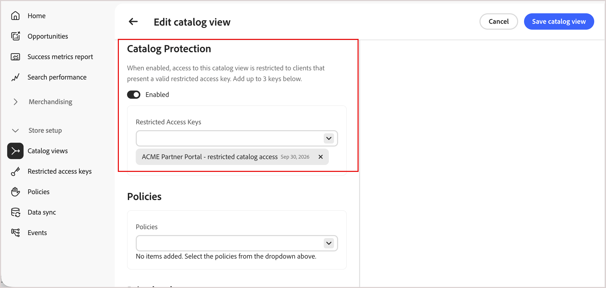

# 专用目录视图

默认情况下，[目录视图](catalog-view.md)是公用的。 限制对目录视图的访问，以便只有具有有效签名令牌的请求才能检索其数据。

目录视图通过以下两种方式之一变为专用：

- [!BADGE Private Beta]{type=Caution tooltip="需要Adobe Commerce Optimizer Connector B2B扩展，该扩展当前为私有Beta版。"} **自动，对于B2B共享目录** — 对于使用与B2B扩展的[!DNL Adobe Commerce Optimizer Connector]集成的Commerce部署，将根据[!DNL Adobe Commerce]中的共享目录配置自动为您创建和配置专用目录视图。 查看B2B共享目录的[自动专用目录视图](#automatic-private-catalog-views-for-b2b-shared-catalogs)。

- **对于任何目录视图**，请手动执行[保护目录视图](#protect-a-catalog-view)中的步骤，以限制对在其他情况下为公共的目录视图（包括B2C目录视图）的访问。 有关合作伙伴门户和预发布预览等示例，请参阅[受限访问密钥用例](restricted-access-keys.md#restricted-access-key-use-cases)。

目录保护仅适用于选定的目录视图。 它不会更改视图的策略或层。 它确实将视图限制为单个价格手册 — 请参阅[私有目录视图的价格手册限制](#price-book-restriction-on-private-catalog-views)。

## 了解保护边界

目录保护仅适用于启用了目录保护的目录视图。 它保护目录和搜索请求，但不更改视图的策略或层，保护其他目录视图，也不保护购物车、结账或订单操作。

连接的商务后端必须独立强制实施购买资格。

## 私有目录视图的价格手册限制

专用目录视图只能引用一个价格手册。 这与公共目录视图不同，公共目录视图可以使用多个价格簿。

启用[!UICONTROL Catalog Protection]后，目录视图表单上的价格手册选择器将从多选控件切换到单选（单选按钮）控件。


- 如果在分配了多个价格手册的目录视图上启用[!UICONTROL Catalog Protection]，则在删除除一个价格手册外的所有价格手册之前，您将无法保存该视图。
- 如果您之前保存了一个私有目录视图，该视图具有在此限制存在之前的多个价格手册分配，则不会自动更改目录视图配置。 但是，下次编辑视图时，您必须先删除除一个价格手册之外的所有价格手册，然后才能保存更新。

在每种情况下，[!DNL Adobe Commerce Optimizer]都显示以下验证消息：`A protected catalog view can use only one price book. Select 'Single price book only' to continue.`

公共目录视图不受此限制的影响，并且可以继续引用多个价格手册。

## B2B共享目录的自动专用目录视图

[!BADGE Private Beta]{type=Caution tooltip="需要Adobe Commerce Optimizer Connector B2B扩展，该扩展当前为私有Beta版。"}

对于与[!DNL Adobe Commerce Optimizer Connector for B2B]集成以支持共享目录的部署，扩展会根据[!DNL Adobe Commerce]中的共享目录配置自动创建和配置专用目录视图。 此配置包括目录视图、策略、初始受限访问密钥和价格手册引用。 使用此配置，您可以从Commerce管理员&#x200B;**受限访问密钥**&#x200B;页面（**系统** > **数据传输**）管理受限访问密钥。 有关详细信息，请参阅&#x200B;*[!DNL Adobe Commerce Optimizer Connector]集成指南*&#x200B;中的[B2B共享目录更改](/help/aco-connector/get-started.md#monitor-b2b-shared-catalog-changes)。

如果您未使用B2B共享目录，例如，要保护合作伙伴门户的目录视图或预发行版预览，请使用[保护目录视图](#protect-a-catalog-view)中的说明手动配置一个目录。

## 保护目录视图

>[!NOTE]
>
>对于与[!DNL Adobe Commerce Optimizer Connector for B2B]管理的B2B共享目录关联的目录视图，跳过此过程。 查看B2B共享目录的[自动专用目录视图](#automatic-private-catalog-views-for-b2b-shared-catalogs)。

开始之前，请从客户端应用程序生成的公共密钥[创建一个受限访问密钥](restricted-access-keys.md)。

1. 在目录视图创建或编辑表单上，将&#x200B;**[!UICONTROL Catalog Protection]**&#x200B;切换到&#x200B;**[!UICONTROL Enabled]**。

1. 在&#x200B;**[!UICONTROL Restricted Access Keys]**&#x200B;下，选择最多三个[受限访问密钥](restricted-access-keys.md)以分配给此目录视图。

   {width="70%" zoomable="yes"}

1. 单击&#x200B;**[!UICONTROL Save catalog view]**。

   目录视图现在已受保护。 只有具有来自已分配密钥的有效签名令牌的请求才能检索其数据。

   >[!NOTE]
   >
   >最多允许五分钟以使目录保护配置更改生效。

## 验证是否强制访问

要确认专用目录视图拒绝未授权请求，请使用以下标头调用其[GraphQL端点](../get-started.md#get-instance-details)，其中带和不带签名令牌：

| 页眉 | 用途 |
| --- | --- |
| `AC-View-ID` | 要查询的目录视图。 |
| `AC-Price-Book-ID` | 要申请的价格手册。 |
| `AC-Catalog-View-Access-Token` | 已签名的JWT证明对目录视图的授权。 |

不带有效令牌的请求会返回GraphQL错误，而不是目录数据，例如：

```json
{
  "errors": [
    {
      "message": "Access key validation failed: Missing token",
      "extensions": { "x-commerce-exception": "access-key-invalid" }
    }
  ]
}
```

如果请求中带有由分配的未过期密钥签名的令牌，则会按预期返回目录数据。 有关签署JWT和调用促销API的详细信息，请参阅[开发人员文档](https://developer.adobe.com/commerce/services/optimizer/merchandising-services/using-the-api#authentication)。

## 管理受限制的访问密钥

如果启用了[!UICONTROL Catalog Protection]并且所有分配的键过期，则目录视图将变为不可访问。 依赖此目录视图的店面无法从它提供数据。 分配新的未过期密钥以恢复访问权限。 有关说明，请参阅[旋转键](restricted-access-keys.md#rotate-a-key)。

>[!NOTE]
>
>对于与[!DNL Adobe Commerce Optimizer Connector for B2B]扩展集成的部署，您可以从Commerce管理员&#x200B;**受限访问密钥**&#x200B;页面（**系统** > **数据传输**）管理访问密钥。 有关详细信息，请参阅&#x200B;*[!DNL Adobe Commerce Optimizer Connector]集成指南*&#x200B;中的[受限访问密钥管理](../../aco-connector/restricted-access-keys.md)。

## 更多此类内容

- [目录视图](catalog-view.md) — 了解目录视图如何按业务结构、策略和定价组织您的产品目录。
- [受限访问密钥](restricted-access-keys.md) — 创建、分配和旋转用于为目录保护签名令牌的密钥。
