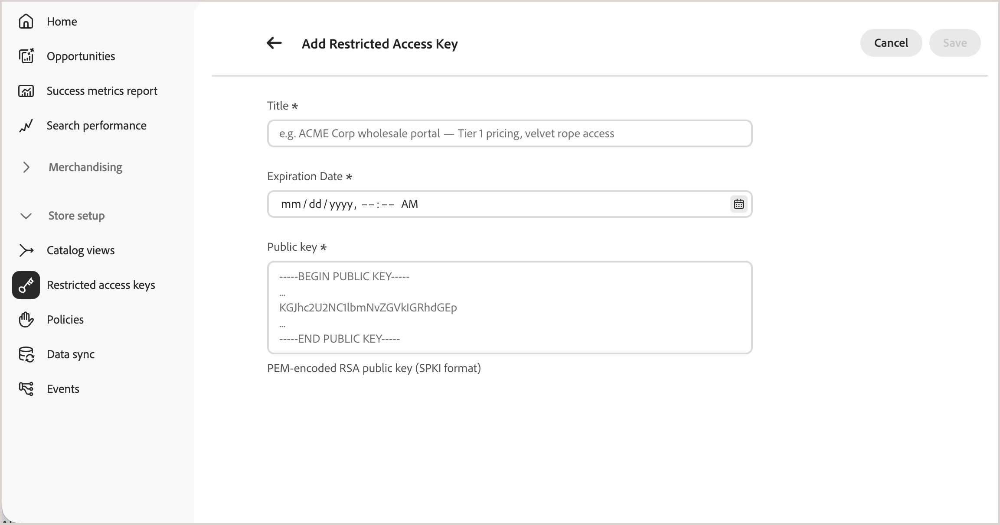

# 受限访问密钥

受限访问密钥允许授权客户端应用程序访问[专用目录视图](catalog-view.md) — 只有携带分配密钥中的有效签名令牌的请求才能检索目录数据。 所有其他请求都将被拒绝，包括来自未明确获得此目录视图访问权限的购物者的请求，以及探测API的脚本。

受限访问密钥通过以下两种方式之一进行设置：

- [!BADGE Private Beta]{type=Caution tooltip="需要Adobe Commerce Optimizer Connector B2B扩展，该扩展当前为私有Beta版。"} **自动，对于B2B共享目录** — 对于与[!DNL Adobe Commerce Optimizer Connector for B2B]集成的部署，连接器配置并分配初始密钥。 然后，您可以通过Commerce管理员管理密钥和密钥分配。 请参阅&#x200B;*Commerce管理指南**中的[目录视图身份验证](https://experienceleague.adobe.com/en/docs/commerce-admin/b2b/shared-catalogs/catalog-views-manage)。

- **手动，对于任何目录视图** — 要自行保护目录视图，例如，对于合作伙伴门户或预发布预览，请执行本主题中从[创建受限访问密钥](#create-a-restricted-access-key)开始的步骤。

## 受限访问关键用例

在[!DNL Adobe Commerce Optimizer]中，**[!UICONTROL Price Book ID]**&#x200B;确定请求能够查看的价格 — 它涉及定价，而不是谁能发出请求。 任何知道目录视图ID和价格手册ID的客户端都可以通过促销API检索该数据。 受限访问密钥添加了一个单独的、互补的控制：它们限定了谁有权访问目录视图，这与适用的价格手册无关。

受限访问密钥通常用于：

- **基于合同的B2B定价** — 限制链接到协议价格手册的目录视图，以便只有适用它的买方可以查询它。 其他收购机构和公众则不能。 对于B2B共享目录，这是自动设置的。 请参阅[密钥管理和轮换](#key-management-and-rotation)。
- **合作伙伴和经销商门户** — 将目录的子集限制为直接与促销API集成的已批准合作伙伴。
- **预发布预览** — 让受信任的内部或合作伙伴系统先预览即将发布的产品，然后再公开显示它们。

## 受限访问密钥的工作方式

受限访问密钥是RSA密钥对的公共组件。 您的客户端应用程序生成并使用此密钥来证明它有权读取专用目录视图。 在此上下文中，_客户端应用程序_&#x200B;是指对购物者进行身份验证的后端系统（例如，[!DNL Adobe Commerce]上的自定义逻辑或第三方后端），而不是店面前端本身。

以下步骤描述了密钥对和签名令牌如何从创建移动到验证不属于B2B共享目录的目录视图。

1. 您的客户端应用程序生成一个RSA密钥对并保留私钥。
1. 您在[!DNL Commerce Optimizer]中将&#x200B;**公共**&#x200B;密钥注册为受限访问密钥。
1. 您的客户端应用程序使用私钥对JSON Web令牌(JWT)进行签名，并将其包含在每个对私有目录视图的请求中。
1. [!DNL Commerce Optimizer]根据已注册公钥验证令牌的签名，如果有效，则返回所请求的目录数据。

## 创建受限访问密钥

>[!NOTE]
>
>此部分和后面的三个部分描述了手动[!DNL Adobe Commerce Optimizer] Studio流程。 如果您将B2B共享目录与[!DNL Adobe Commerce Optimizer Connector B2B extension]一起使用，请从Commerce管理员管理密钥。 请参阅&#x200B;_Adobe Commerce Optimizer连接器_&#x200B;文档中的[受限访问密钥](../../aco-connector/restricted-access-keys.md)。

对于私有目录视图的初始测试，请使用诸如[!DNL OpenSSL]之类的工具生成密钥对。 私钥要保密。 仅将公钥上传到[!DNL Commerce Optimizer]。

```bash
openssl genrsa -out private-key.pem 2048
openssl rsa -in private-key.pem -pubout -out public-key.pem
```

密钥大小必须介于2048和8192位之间。 `public-key.pem`包含您粘贴到以下&#x200B;**[!UICONTROL Public key]**&#x200B;字段中的值。

## 将受限访问密钥添加到[!DNL Commerce Optimizer]

1. 从[!DNL Adobe Commerce Optimizer Studio]的左侧菜单中，转到&#x200B;**[!UICONTROL Store setup]**，然后单击&#x200B;**[!UICONTROL Restricted access keys]**。

   {width="70%" zoomable="yes"}

1. 单击&#x200B;**[!UICONTROL Add Restricted Access Key]**。

1. 输入键详细信息：

   {width="70%" zoomable="yes"}

   - **[!UICONTROL Title]** — 用于标识键的标签，显示在键列表和目录视图键选取器中，例如`ACME Corp wholesale portal — Tier 1 pricing`。
   - **[!UICONTROL Expiration date]** — 停止接受密钥的日期和时间(UTC)，即使对于尚未过期的令牌也是如此。
   - **[!UICONTROL Public key]** — 主体公钥信息(SPKI)格式的PEM编码的RSA公钥，包括`-----BEGIN PUBLIC KEY-----`和`-----END PUBLIC KEY-----`标记。 在整个环境中必须是唯一的。

1. 单击&#x200B;**[!UICONTROL Save]**。

键在创建后不可更改。 要更改任何值，请删除键并创建新键。 请参阅[旋转密钥](#rotate-a-key)以在没有访问中断的情况下执行此操作。

## 将键分配给目录视图

受限访问密钥仅在分配给启用了&#x200B;**[!UICONTROL Catalog Protection]**&#x200B;的目录视图后验证访问。 有关设置步骤，请参阅[保护目录视图](private-catalog-view.md#protect-a-catalog-view)。

## 删除键

1. 在&#x200B;**[!UICONTROL Restricted access keys]**&#x200B;页面上，找到要删除的密钥，然后单击&#x200B;**[!UICONTROL Delete]**。

   如果该键被分配给一个或多个目录视图，则会出现警告，说明依赖该键的客户端应用程序将失去访问权限。 目录视图本身仍受到保护 — 它们不能公开访问。

1. 确认删除。

## 密钥管理和轮换

受限制访问密钥的管理方式为以下两种方式之一，具体取决于您使用目录保护的方式：

- **自动，对于B2B共享目录**—[!BADGE Private Beta]{type=Caution tooltip="需要Adobe Commerce Optimizer Connector B2B扩展，该扩展当前为私有Beta版。"}对于与[!DNL Adobe Commerce Optimizer Connector for B2B]集成的部署，服务会在创建目录视图时自动生成并分配第一个受限访问密钥。 每个目录视图都有自己的键。 之后，您可以从共享目录或公司帐户页面管理每个密钥。 您还可以从Commerce管理员&#x200B;**受限访问密钥**&#x200B;页面（**系统** > **数据传输**）查看和管理密钥。 请参阅[管理目录视图配置](https://experienceleague.adobe.com/en/docs/commerce-admin/b2b/shared-catalogs/catalog-views-manage)。

  共享目录及其分配到的商店视图的每个组合都将显示为单独的目录视图。 投影是连接器针对该组合导出到[!DNL Adobe Commerce Optimizer]的目录视图、策略、价格手册引用和受限访问密钥配置数据。 因此，分配给多个商店视图的共享目录将生成多个目录视图，每个视图都具有自己的键。 编辑或旋转一个目录视图的键而不影响其他目录视图。

  键的默认有效期较长。 如果需要轮换密钥，请在“管理员”中添加替换密钥，并将这两个密钥都保持活动状态，直到删除旧密钥为止。 查看[B2B共享目录更改](/help/aco-connector/get-started.md#monitor-b2b-shared-catalog-changes)。

- **手动，适用于任何目录视图** — 对于与Adobe Commerce后端中的B2B共享目录无关联的目录视图，密钥生成、令牌签名和轮换完全由验证购物者身份的后端客户端应用程序管理。 [!DNL Adobe Commerce Optimizer]不代表您生成或旋转这些密钥。 使用本主题前面介绍的步骤来创建、添加和删除键。 若要旋转键，请参阅[旋转键](#rotate-a-key)。

### 旋转键

要在没有访问中断的情况下旋转键，请注意，目录视图最多可以同时分配三个键：

1. 生成新的密钥对并将新的公钥添加为新的受限访问密钥。
1. 将新键与现有键一起分配给目录视图。
1. 开始使用新私钥签名新令牌以完成密钥滚存。
1. 在新密钥上确认所有客户端应用程序后，删除旧密钥。

## 限制

查看[目录视图和策略限制](../boundaries-limits.md#catalog-views-and-policies)。

## 更多此类内容

- [私有目录视图](private-catalog-view.md) — 了解如何使用受限制的访问密钥保护目录视图。
- [B2B共享目录更改](/help/aco-connector/get-started.md#monitor-b2b-shared-catalog-changes) — 了解[!DNL Adobe Commerce Optimizer Connector]如何自动管理B2B共享目录的密钥。

