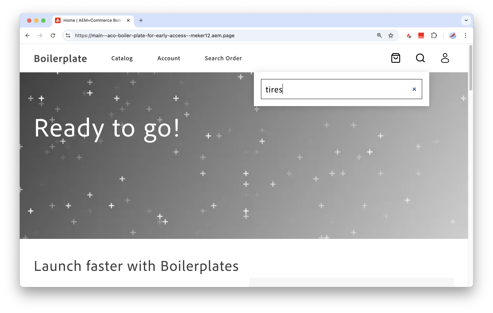

# 设置您的店面

>[!NOTE]
>
>本文档描述了早期访问开发中的产品，并未反映用于正式发布的所有功能。

本教程演示如何设置和使用[由Edge Delivery Services](https://experienceleague.adobe.com/developer/commerce/storefront/get-started/)提供支持的Adobe Commerce店面，以创建由[!DNL Adobe Commerce Optimizer]实例中的数据提供支持的高性能、可扩展且安全的Commerce店面。


## 先决条件

* 确保您拥有可以创建存储库并配置为本地开发的GitHub帐户(github.com)。

* 通过查看Adobe Commerce Storefront文档中的[概述](https://experienceleague.adobe.com/developer/commerce/storefront/get-started)，熟悉与为Adobe Edge Delivery Services创建店面相关的基本工作流程和词汇。
* 设置开发环境


### 设置开发环境

要设置开发环境，请安装所需的Node.js版本和Sidekick浏览器扩展。

#### 安装节点.js

要在本地开发和测试Edge Delivery Services项目上的[!DNL Adobe Commerce Optimizer]店面，您需要安装Node.js版本22.13.1 LTS。

如果需要，请完成以下步骤以安装节点版本管理器(NVM)和所需的Node.js版本。

1. 安装节点版本管理器(NVM)。

   ```bash
   curl -o- https://raw.githubusercontent.com/nvm-sh/nvm/v0.40.1/install.sh | bash
   ```

1. 安装Node.js和NPM。 有关详细信息，请参阅[Node.js](https://nodejs.org/en/)。

   ```bash
   nvm install 22
   ```

   ```bash
   npm install -g npm
   ```

1. 验证安装。

   ```bash
   npm -v
   ```

>[!TIP]
>
>此设置适用于使用[!DNL Adobe Commerce Optimizer]和Adobe Commerce Edge Delivery服务店面进行开发。 可通过适用于Adobe Commerce](https://experienceleague.adobe.com/en/docs/commerce-learn/tutorials/adobe-developer-app-builder/introduction-to-app-builder)的[App Builder和适用于Adobe Developer App Builder](https://experienceleague.adobe.com/en/docs/commerce-learn/tutorials/adobe-developer-app-builder/api-mesh/getting-started-api-mesh)的[API Mesh获得用于扩展和自定义[!DNL Adobe Commerce Optimizer]解决方案的其他资源。 有关访问和使用信息，请联系您的Adobe客户代表。

#### 安装Sidekick

安装Sidekick浏览器扩展以编辑、预览和发布店面内容。 请参阅[Sidekick安装说明](https://www.aem.live/docs/sidekick#installation)。


## 创建您的店面

您为[!DNL Adobe Commerce Optimizer]项目创建的店面是使用Edge Delivery Services店面样板上的Adobe Commerce的自定义版本生成的。 样板是一组文件和文件夹，它们提供了构建店面的起点。

此店面设置流程是专门为[!DNL Adobe Commerce Optimizer]项目自定义的。 该流与Edge Delivery Services Storefront](https://experienceleague.adobe.com/developer/commerce/storefront/get-started/)设置中的标准[Adobe Commerce的流不同。

>[!NOTE]
>
>本教程使用macOS、Chrome和Visual Studio Code作为开发环境。 屏幕会捕捉该设置并提供相应说明。 您可以使用不同的操作系统、浏览器和代码编辑器，但您看到的UI和必须执行的步骤会相应地有所不同。

### 工作流概述

按照以下步骤设置要与Adobe Commerce Optimizer一起使用的店面。

1. **[创建内容文件夹](#step-1-create-a-content-folder)** — 在Google驱动器或Sharepoint中创建共享内容文件夹。 此文件夹包含您的店面的示例内容和资源。

1. **[创建代码存储库](#step-1-create-a-code-repository)** — 从Adobe Commerce +Edge Delivery Services样板模板创建GitHub存储库。 包括源资料库中的所有分支。
1. **[更新店面样板](#step-2-update-the-storefront-boilerplate)** — 更新存储库的`aco`分支上的自定义样板模板，以将内容文件夹连接到店面，并查看店面配置，该配置可将Adobe Commerce Optimizer演示实例中的数据传递到您的店面。
1. **[上传更新的店面样板代码](#step-3-upload-the-updated-boilerplate-code)** — 使用`aco`分支中的更新代码覆盖`main`分支上的代码。
1. **[添加CodeSync应用](#step-4-add-the-aem-code-sync-app)** — 将存储库连接到边缘交付服务。 在完成源代码自定义并准备好将代码推送到`main`分支之前，请勿连接代码同步应用程序。
1. **[预览和发布您的内容](#step-5-preview-and-publish-your-content)** — 使用Sidekick扩展预览网站内容并将其从内容文件夹发布到店面。
1. **[预览您的站点并查看示例数据](#step-6-preview-your-site-and-view-sample-data)** — 连接到您的店面站点以查看[!DNL Adobe Commerce Optimizer]演示实例中的示例内容和数据。
1. **[在本地环境中开发店面](#step-7-develop-the-storefront-in-your-local-environmentdevelop-the-storefront-in-your-local-environment)** — 安装所需的依赖项。 启动本地开发服务器，并更新店面配置以连接到Adobe为您提供的[!DNL Adobe Commerce Optimizer]实例。
1. **[管理网站内容](#step-8-manage-site-content)** — 了解有关更新和管理网站内容的更多信息。

### 步骤1：创建内容文件夹

按照Adobe Commerce店面文档中的说明，在Google云端硬盘或Sharepoint中添加共享内容文件夹，然后添加示例内容。 示例内容包括图像、文本以及组成站点的其他资源。

* [创建并共享Google Drive或Sharepoint文件夹](https://experienceleague.adobe.com/developer/commerce/storefront/get-started/#create-and-share-folder)
* [将示例内容](https://experienceleague.adobe.com/developer/commerce/storefront/get-started/#add-sample-content)加载到您的文件夹中。

### 步骤2：创建代码存储库

使用Edge Delivery Services + Adobe Commerce样板模板在GitHub中创建代码存储库。 此模板为您的店面提供样板代码。

1. 登录您的GitHub帐户。

1. 导航到[aem-boilerplate-commerce](https://github.com/hlxsites/aem-boilerplate-commerce) GitHub存储库。

1. 选择&#x200B;**使用此模板**，然后从下拉菜单中选择&#x200B;**创建新存储库**。

   ![[!DNL Create github repo from storefront boilerplate template]](./assets/storefront-create-github-repo.png){width="700" zoomable="yes"}

   此时将打开存储库配置页面。

   ![[!DNL Configure github repo to pull all branches from boilerplate repo]](./assets/storefront-configure-github-repo.png){width="700" zoomable="yes"}

1. 填写包含以下详细信息的配置表单：

   * **存储库模板**—`hlxsites/aem-boilerplate-commerce`（默认）。
   * **包含所有分支** — 选择包含所有分支的选项。
   * **所有者** — 您的组织或帐户（必填）。
   * **存储库名称** — 新存储库的唯一名称（必填）。
   * **描述** — 存储库的简要描述（可选）。
   * **Public或Private**—Adobe建议使用public（默认）。

1. 选择&#x200B;**创建存储库**。

   一两分钟后，将打开您的新存储库。

   忽略新存储库中显示的任何拉取请求通知。

### 步骤3：更新店面模板

在此部分中，您将完成以下任务：

* 签出存储库的`aco`分支以更新[!DNL Adobe Commerce Optimizer]项目的自定义样板模板
* 通过更新`fstab.yaml`文件以指向您的内容文件夹，将您的内容文件夹连接到店面。
* 查看店面配置文件`config.json`
* 配置Sidekick扩展以编辑、预览和发布共享内容文件夹中的内容。

您需要以下信息来完成这些步骤：

* 步骤2 **中的** GitHub存储库URL— `github.com/{ORG}/{SITE}`

   * `{ORG}`是存储库的组织名称或用户名

   * `{SITE}`是您的存储库名称

* 步骤1 **中的**&#x200B;内容文件夹URL— `https://drive.google.com/drive/folders/{YOUR_FOLDER_ID}`

  `{YOUR_FOLDER_ID}`是使用示例内容数据创建的文件夹的ID。

#### 更新样板代码以连接到您的内容文件夹

1. 将存储库克隆到本地计算机。

   ```bash
   git clone https://github.com/{ORG}/{SITE}.git
   ```

   如果在克隆存储库时遇到错误，请参阅GitHub文档中的[克隆错误疑难解答](https://docs.github.com/en/repositories/creating-and-managing-repositories/troubleshooting-cloning-errors)。

1. 在终端或IDE中打开存储库。

1. 签出`aco`分支

   ```bash
   git checkout aco
   ```

1. 通过将`default-fstab.yaml`文件复制到`fstab.yaml`创建配置文件。

   ```bash
   cp default-fstab.yaml fstab.yaml
   ```

1. 更新店面配置文件以指向您的内容URL。

   1. 打开[fstab.yaml](https://experienceleague.adobe.com/developer/commerce/storefront/get-started/#vocabulary)配置文件。

      ```json
      mountpoints:
       /: {YOUR_MOUNTPOINT_URL}
      
      folders:
       /products/: /products/default
      ```

   1. 将`{YOUR_MOUNTPOINT_URL}`替换为内容管理系统的URL。

      例如，如果您使用的是Google Drive，则更新的代码应如下所示。

      ```json
       mountpoints:
        /: https://drive.google.com/drive/folders/{YOUR_FOLDER_ID}
      ```

   1. 保存文件。

#### 查看数据连接配置

数据连接可在Adobe Commerce Optimizer和店面之间建立通信，从而确保目录数据可无缝地流向店面。 此流程填充各种店面界面，包括[!DNL Adobe Commerce Optimizer]所需的搜索组件、产品列表和产品详细信息页面。

对于初始店面设置，Adobe会提供一个默认配置文件，它使用示例数据连接到Adobe Commerce Optimizer演示实例。

```json
{
  "public": {
    "default": {
      "commerce-core-endpoint": "https://www.aemshop.net/graphql",
      "commerce-endpoint": "https://na1-sandbox.api.commerce.adobe.com/Fwus6kdpvYCmeEdcCX7PZg/graphql",
      "headers": {
        "cs": {
          "ac-channel-id": "9ced53d7-35a6-40c5-830e-8288c00985ad",
          "ac-environment-id": "Fwus6kdpvYCmeEdcCX7PZg",
          "ac-price-book-id": "west_coast_inc",
          "ac-scope-locale": "en-US"
        }
      },
      "analytics": {
        "base-currency-code": "USD",
        "environment": "Production",
        "store-id": 1,
        "store-name": "ACO Demo",
        "store-url": "https://www.aemshop.net",
        "store-view-id": 1,
        "store-view-name": "Default Store View",
        "website-id": 1,
        "website-name": "Main Website"
      }
    }
  }
}
```

查看存储库中的店面配置文件，了解如何建立数据连接。

1. 在代码存储库中，导航到根目录。

1. 打开`config.json`文件。

   在此文件中，以下键值指定要连接到并决定流向店面的数据的Adobe Commerce Optimizer实例：

   * `commerce-endpoint`定义要连接到的Adobe Commerce Optimizer实例。
   * `headers`确定流向店面的数据。
      * `ac-channel-id`设置为`west_coast_inc`
      * `ac-price-book-id`设置为`west_coast_inc`
      * `ac-scope-locale`设置为`en-US`
      * `ac-price-book-id`设置为`west_coast_inc`

   这些值可设置渠道ID、区域设置和价格手册ID，以将目录数据发送到特定的销售渠道，并根据指定的区域设置和价格手册值过滤这些数据。 之后，您将了解如何更改Adobe Commerce Optimizer实例并更新标头，以定义向店面传送的数据。

1. 查看文件后，关闭文件并继续本教程。


#### 配置Sidekick扩展

为Sidekick扩展添加项目配置。 Sidekick用于编辑、预览和发布您的店面内容。 此配置确保您可以使用Sidekick来管理共享内容文件夹中的内容，以及发布到暂存环境和生产环境的站点页面中的内容。

>[!NOTE]
>
>确保已在浏览器中安装[Sidekick扩展](https://www.aem.live/docs/sidekick#installation)。

1. 打开`tools/sidekick/config.json`文件。

   +++Sidekick配置文件

   ```json
   {
     "project": "Boilerplate",
     "plugins": [
       {
         "id": "cif",
         "title": "Commerce",
         "environments": [
           "edit"
         ],
         "url": "https://main--{SITE}--{ORG}.aem.live/tools/picker/dist/index.html",
         "isPalette": true,
         "paletteRect": "top: 54px; left: 5px; bottom: 5px; width: 300px; height: calc(100% - 59px); border-radius: var(--hlx-sk-button-border-radius); overflow: hidden; resize: horizontal;"
       },
       {
         "id": "personalisation",
         "title": "Personalisation",
         "environments": [
           "edit"
         ],
         "url": "https://main--{SITE}--{ORG}.aem.live/tools/segments/dist/index.html",
         "isPalette": true,
         "paletteRect": "top: 54px; left: 5px; bottom: 5px; width: 300px; height: calc(100% - 59px); border-radius: var(--hlx-sk-button-border-radius); overflow: hidden; resize: horizontal;"
       }
     ]
   }
   ```

   有关详细信息，请参阅[Sidekick Library文档](https://www.aem.live/docs/sidekick-library)。

+++

1. 使用GitHub存储库的值更新`url`键值。

   * `{ORG}`是代码存储库的存储库名称或用户名

   * `{SITE}`是存储库名称

1. 保存文件。

### 步骤4：上传更新的样板代码

若要使用自定义店面样板代码，请使用更新覆盖`main`分支上的代码。

1. 在编辑器或IDE中，提交并保存更新后的文件。

   ```bash
   git add .
   ```

   ```bash
   git commit -m "Update storefront boilerplate for Adobe Commerce Optimizer"
   ```

1. 推送`aco`分支上的更改并覆盖`main`分支：

   ```bash
   git push origin aco:main -f
   ```

### 第5步：添加AEM代码同步应用程序

通过将AEM代码同步GitHub应用程序添加到存储库，将您的存储库连接到Edge Delivery Service。

>[!IMPORTANT]
>
>在您将更新的样板代码上传到GitHub存储库的主分支之前，请勿连接代码同步应用程序。

1. 打开[AEM代码同步应用](https://github.com/apps/aem-code-sync)配置页面。

1. 选择&#x200B;**配置**，然后使用包含您创建的存储库的&#x200B;**组织**&#x200B;或&#x200B;**帐户**&#x200B;进行身份验证。

1. 从表单中选择&#x200B;**仅选择存储库**，然后选择您创建的存储库。

1. 选择&#x200B;**安装**&#x200B;以将AEM代码同步应用程序添加到您的存储库。

   您应该会看到一条消息，指出已成功安装应用程序。

### 步骤6：预览和发布内容

要将内容添加到店面，您必须使用Sidekick扩展预览和发布内容。

1. 在Google Drive或Sharepoint中打开您的内容文件夹。

1. 通过单击浏览器工具栏中的Sidekick图标来启用Sidekick 。

   ![[!DNL Turn on Sidekick from browser toolbar]](./assets/storefront-enable-sidekick-toolbar.png){width="700" zoomable="yes"}

1. 使用Sidekick工具栏预览和发布您的内容。

   ![[选择要预览和发布的文件]](./assets/storefront-content-preview-publish.png){width="700" zoomable="yes"}

1. 分别选择每个文件夹中的文件，并使用Sidekick工具栏预览和发布所有文件。

   * **预览** — 将内容上载到暂存环境。 店面暂存URL以`.aem.page`结尾。

   * **发布** — 将内容上传到生产环境。 生产URL以`aem.live`结尾。

有关详细信息，请参阅Adobe Experience Manager [Sidekick](https://www.aem.live/docs/sidekick)文档。

### 步骤7：预览网站

预览您的站点，以验证示例内容和Adobe Commerce Optimizer演示数据是否均可正确显示。

* 从共享内容文件夹中提供了&#x200B;**示例内容**。 它包括页面布局、横幅以及您使用Sidekick发布的其他内容。
* 从[!DNL Adobe Commerce Optimizer]演示实例中提供了&#x200B;**示例数据**。 数据包括产品数据，其中产品属性、图像、产品说明和价格基于店面配置文件`config.json`中指定的值填充。


#### 连接到您的站点以查看示例内容和数据

1. 导航到`https://main--{SITE}--{ORG}.aem.live`以连接到您的站点。

   将`{ORG}`和`{SITE}`替换为样板存储库的组织和名称。

   ![[!DNL ACO storefront site with boilerplate]](./assets/aco-storefront-site-boilerplate.png){width="700" zoomable="yes"}

   如果页面返回404，请确保已使用Sidekick扩展发布内容。 此外，请仔细检查更新的`fstab.yaml`文件是否正在使用内容文件夹的URL。

1. 查看来自Commerce Optimizer演示实例的示例目录数据。

   1. 搜索`tires`以查看可用轮胎产品的下拉列表。

   ![[!DNL Discover Adobe Commerce Optimizer products]](./assets/storefront-site-with-aco-data.png){width="700" zoomable="yes"}

   搜索组件是店面样板代码的一部分。 搜索结果数据将根据店面配置填充。

   1. 按&#x200B;**Enter**&#x200B;查看产品列表页面。

      ![[!DNL View product details page]](./assets/storefront-with-aco-pdp-page.png){width="675" zoomable="yes"}

   1. 通过选择页面上的任何轮胎产品来查看产品详细信息页面。

      如果您浏览店面，请注意某些组件无法正常工作。 例如，将产品添加到购物车会返回错误，并且帐户管理组件不起作用。 这是因为这些组件尚未配置为从Commerce后端接收数据。 Adobe Commerce Optimizer实例中的数据仅填充搜索组件、产品列表和产品详细信息页面。

   1. 探索店面后，继续学习本教程。


### 第8步：在本地环境中开发店面

在本节中，您将尝试在本地开发环境中使用店面配置，方法是将店面连接到Adobe为您提供的[!DNL Adobe Commerce Optimizer]实例。

要建立连接，您需要入门电子邮件中提供的适用于Merchandising Services的GraphQL端点。

```text
https://na1-sandbox.api.commerce.adobe.com/{tenantId}/graphql
```

#### 启动本地开发

1. 在IDE中，检查GitHub代码存储库的主分支。

   ```bash
   git checkout main
   ```

1. 安装所需的依赖项。

   ```bash
   npm install
   ```

1. 启动本地开发服务器。

   ```bash
   npm start
   ```

   样板店面的第一页应在浏览器`http://localhost:3000`中可见。

![[!DNL Configure github repo to pull all branches from boilerplate repo]](./assets/aco-storefront-local-dev-env.png){width="700" zoomable="yes"}


#### 更新店面配置

更新店面配置文件并在本地开发环境中预览更改。


1. 在IDE中，更新storefront配置以连接到Adobe为您提供的[!DNL Adobe Commerce Optimizer]实例。

   1. 打开`config.json`文件。

   1. 使用[!DNL Adobe Commerce Optimizer]实例的端点更新以下值：

      * **`commerce-endpoint`** — 将现有值替换为终结点URL。

        ```json
        "commerce-endpoint": "https://na1-sandbox.api.commerce.adobe.com/{tenantId}/graphql"
        ```

      * **`ac-environment-id`** — 将现有值替换为终结点URL中的租户ID。

        ```json
        "ac-environment-id": "{tenantId}"
        ```

   1. 保存文件。

      如果您的本地预览工作正常，则更新将应用于您的本地店面。

1. 检查站点以查看配置更改的结果。

   1. 在浏览器中，导航到`http://localhost:3000`并刷新页面。

   1. 在店面标题中，单击放大镜以搜索`tires`。

      {width="675" zoomable="yes"}

      请注意，下拉列表不会填充。

   1. 按&#x200B;**Enter**&#x200B;显示“产品列表”页面。

      {width="675" zoomable="yes"}

      搜索不会返回任何结果，因为店面配置文件中的标头使用基于demo实例的标头值。 由于配置指向为您提供的[!DNL Adobe Commerce Optimizer]实例，因此这些值无效。

### 后续步骤

查看[店面和目录管理员端到端用例](./use-case/admin-use-case.md)，了解如何使用[!DNL Adobe Commerce Optimizer]实例中的值更新店面配置以在您的店面中显示内容。

>[!MORELIKETHIS]
>
>* 如果您计划使用不具有Adobe Commerce后端的[!DNL Adobe Commerce Optimizer]，请参阅[Adobe Experience Manager storefront文档](https://experienceleague.adobe.com/developer/commerce/storefront/)以了解有关更新网站内容以及与Commerce前端组件和后端数据集成的更多信息。
></br></br>
>* 如果您计划将[!DNL Adobe Commerce Optimizer]与Adobe Commerce后端一起使用，请参阅[Adobe Commerce Storefront文档](https://experienceleague.adobe.com/developer/commerce/storefront/)，了解如何更新内容并配置店面组件以实现帐户管理、结账和其他功能。
