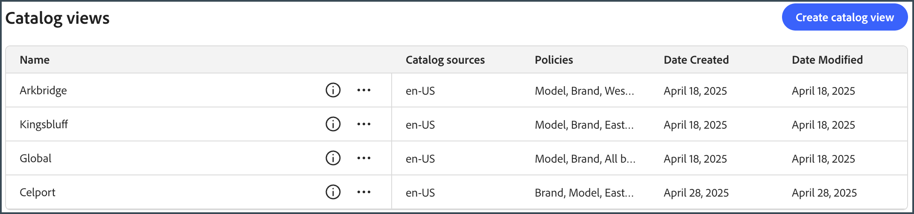

# 店面和目录管理员的端到端用例

此用例基于一个名为Carvelo Automobile的虚构汽车企业集团，该企业集团具有复杂的操作设置。 它演示了如何使用[!DNL Adobe Commerce Optimizer]管理支持多个品牌、经销店和价格手册的目录，同时提供自定义的店面体验。

## 先决条件

此用例专为想要了解如何使用[!DNL Adobe Commerce Optimizer]设置店面和管理目录的管理员和开发人员设计。 它假定您对[!DNL Adobe Commerce Optimizer]及其功能有基本的了解。

**预计完成时间：** 45-60分钟

### 必需的设置

在开始本教程之前，请确保已满足以下先决条件：

- **Adobe Commerce Optimizer实例**
   - 访问Cloud Manager中的测试实例
   - 有关安装说明，请参阅[开始使用](../get-started.md)

- **用户权限**
   - 管理员访问Adobe Admin Console
   - 有关帐户设置，请参阅[用户管理](../user-management.md)
   - 如果您没有访问权限，请联系您的Adobe客户代表。

- **示例数据**
   - 已将Carvelo汽车目录数据加载到实例中
   - 按照[示例目录数据摄取存储库](https://github.com/adobe-commerce/aco-sample-catalog-data-ingestion)中的说明操作
   - 您可以使用包含的`reset.js`脚本在完成之后删除示例数据

- **店面环境**
   - 使用Node.js的本地开发环境
   - 克隆和配置的店面样板项目
   - 有关详细说明，请参阅[店面设置](../storefront.md)

## 让我们开始吧

在此使用案例中，您使用的是以下内容：

1. [!DNL Adobe Commerce Optimizer] UI — 设置目录视图和策略以管理Carvelo用例的复杂目录操作设置。

1. Commerce Storefront — 使用加载到[!DNL Adobe Commerce Optimizer]实例和Commerce Storefront配置文件`fstab.yaml`和`config.json`中的示例目录数据渲染店面。

>[!NOTE]
>
> 通过查看Adobe Commerce Storefront文档中的[探索样板](https://experienceleague.adobe.com/developer/commerce/storefront/get-started/boilerplate-project/)主题来了解店面配置文件。

### 关‌键要点

在本文末尾，您将了解：

- 通过性能和可扩展的目录数据模型了解[!DNL Adobe Commerce Optimizer]的基础知识。
- 了解目录数据模型如何与Adobe构建的与平台无关的店面组件集成。
- 了解如何使用Adobe Commerce Optimizer目录视图和策略来创建自定义目录视图和数据访问过滤器，并将数据发送到由Edge Delivery提供支持的Adobe Commerce店面。

## 业务方案 — Carvelo Automobile

卡韦洛汽车是一个虚拟的汽车集团，拥有复杂的运营结构。


在这张图表中，您会看到Carvelo销售三种品牌的汽车产品。 每个品牌都是不同的子公司：

- Aurora（电动汽车）
- 螺栓(SUV)
- Cruz（混合）

它通过三家经销商销售这些品牌：

- Arkbridge
- 金斯布拉夫
- Celport

这些经销商属于两家不同的母公司：

- 西海岸公司(Arkbridge)
- 东海岸公司(Kingsbluff， Celport)

每家公司都有两个价格手册，用于按特定价格向不同购物者(基础客户、VIP)销售产品。

- `west_coast_inc`和`vip_west_coast_inc`
- `east_coast_inc`和`vip_east_coast_inc`

如您所见，这是一个非常复杂的业务用例。 使用[!DNL Adobe Commerce Optimizer]，商家可以使用单个基本目录支持复杂的业务结构，以联合数据，而无需目录重复，扩展价格手册（超过30k的价格手册），并将所有这些数据提供给Edge Delivery Services店面。

现在您已大致了解业务用例，下面是您在本教程中使用的目标：

>[!BEGINSHADEBOX]

Carvelo希望通过不同的经销商（Arkbridge、Kingsbluff和Celport）跨其三个品牌（Aurora、Bolt和Cruz）销售部件。 Carvelo希望确保经销商只能按各自的许可协议获得正确的部件和价格。

最终，卡韦洛有两个主要目标：

1. 维护一个“全球”网站，该网站具有涵盖所有三个品牌的所有SKU。
1. 根据独特的SKU可见性和每个经销商的每个SKU价格，为经销商建立自己的店面提供途径。 同时使用单个基本目录，可消除目录重复。

>[!ENDSHADEBOX]

## 1.访问[!DNL Adobe Commerce Optimizer]实例

导航到预配置了示例数据的Commerce Optimizer应用程序的URL。 您可以从Commerce Cloud项目的实例详细信息中找到Commerce Optimizer管理器中的URL，也可以从系统管理员处获取该URL。 （请参阅[访问实例](../get-started.md#access-an-instance)。）

启动[!DNL Adobe Commerce Optimizer]时，您会看到以下内容：

![[!DNL Adobe Commerce Optimizer] UI](../assets/user-interface.png)

>[!NOTE]
>
>请参阅[概述](../overview.md)文章以了解[!DNL Adobe Commerce Optimizer] UI的关键组件。

在左侧导航中，展开&#x200B;_存储设置_&#x200B;部分，然后单击&#x200B;**[!UICONTROL Catalog views]**。 请注意，Arkbridge和Kingsbluff经销商已创建目录视图：


>[!NOTE]
>
>您可以暂时忽略&#x200B;**全局**&#x200B;目录视图。

单击信息图标可查看目录视图详细信息。

Arkbridge具有以下策略：

- 品牌
- 模型
- West Coast公司品牌
- Arkbridge部件类别

Kingsbluff具有以下策略：

- 品牌
- 模型
- East Coast公司品牌
- Kingsbluff部件类别

在下一部分中，您将为Celport代理创建目录视图和策略。

## 2.创建策略和目录视图

Carvelo的商务经理需要为属于&#x200B;*East Coast Inc*&#x200B;公司的经销商&#x200B;*Celport*&#x200B;设置一个新店面。 赛尔波特将为Bolt和Cruz品牌销售刹车和悬架产品。


使用[!DNL Adobe Commerce Optimizer]，商务管理器将：

1. 为Celport创建一个名为&#x200B;*Celport部件类别*&#x200B;的新策略，以便仅销售制动和悬架部件。
1. 为Celport店面创建新的目录视图。

   此目录视图使用您新创建的策略&#x200B;*Celport部件类别*&#x200B;和现有的&#x200B;*East Coast Inc品牌*，以确保Celport在与East Coast Inc签署的协议中只能销售Bolt和Cruz品牌。Celport目录视图使用`east_coast_inc`价格手册来支持与品牌许可协议相符的产品定价计划。
1. 更新商务店面配置以使用来自您创建的Celport目录视图的数据。

在本节末尾， Celport将启动并运行，准备销售Carvelo的产品。

### 创建策略

让我们创建一个名为&#x200B;*Celport部件类别*&#x200B;的新策略来过滤Celport经销商销售的SKU，包括制动和悬架部件。

1. 在左边栏中，展开&#x200B;_存储设置_&#x200B;部分，然后单击&#x200B;**[!UICONTROL Policies]**。

1. 单击&#x200B;**[!UICONTROL Create Policy]**。

   此时将显示一个新页面，用于添加策略详细信息。

1. 添加所需的详细信息：

   **名称** = *Celport部件类别*

1. 单击&#x200B;**[!UICONTROL Add Filter]**。

   将显示一个对话框以添加过滤器详细信息。

1. 添加筛选器详细信息：

   - **属性** = *part_category*
   - **运算符** = **IN**
   - **值Source** = **静态**
   - **值** = *制动器*，*暂停*

   >[!IMPORTANT]
   >
   >确保您指定的属性名称与目录中的SKU属性名称完全匹配。

   要了解有关STATIC和TRIGGER值源之间差异的更多信息，请参阅[值源类型](../setup/policies.md#value-source-types)。

1. 在&#x200B;**[!UICONTROL Filter details]**&#x200B;对话框中，单击&#x200B;**[!UICONTROL Save]**。

1. 要启用刚刚创建的筛选器，请单击操作点(...)，然后选择&#x200B;**启用**。

1. 单击&#x200B;**[!UICONTROL Save]**。

   >[!NOTE]
   >
   >如果&#x200B;**[!UICONTROL Save]**&#x200B;按钮未处于活动状态（蓝色），则可能缺少策略名称。 单击&#x200B;*新策略*&#x200B;旁边的铅笔图标进行添加。

1. 通过单击后退箭头返回到策略列表。

   您的新&#x200B;*Celport部件类别*&#x200B;策略将显示在列表中。

**验证此步骤是否正确完成：**

- 策略将显示在策略列表中
- 策略状态显示为已启用（绿色指示器）
- 过滤器详细信息显示“part_category IN（制动、暂停）”
- 策略名称为“Celport部件类别”

### 创建目录视图

为&#x200B;*Celport*&#x200B;经销商创建新的目录视图，并链接以下策略： *East Coast Inc品牌*&#x200B;和&#x200B;*Celport部件类别*。

1. 在左边栏中，展开&#x200B;_存储设置_&#x200B;部分，然后单击&#x200B;**[!UICONTROL Catalog views]**。

   请注意现有的目录视图： *Arkbridge*、*Kingsbluff*&#x200B;和&#x200B;*Global*。

   

1. 单击&#x200B;**[!UICONTROL Add catalog view]**。

1. 填写目录视图详细信息：

   - **名称** = *Celport*
   - **目录源** = *en-US*
   - **策略** （使用下拉列表） = *East Coast Inc品牌*；*Celport部件类别*；*品牌*；*型号*                          
1. 单击&#x200B;**[!UICONTROL Add]**&#x200B;以创建目录视图。

   目录视图页面将更新以显示新的目录视图。

   

1. 获取Celport目录视图ID。

   单击&#x200B;**目录视图**&#x200B;页上Celport目录视图的信息图标。

   

   复制并保存目录视图ID。 当您更新店面配置以向新的Celport目录传送数据时，需要此ID。

   **验证此步骤是否正确完成：**
   - 目录视图名称为“Celport”
   - 目录视图显示4个关联的策略
   - 将显示目录视图ID，并且可以复制它
   - 目录源显示“en-US”

在创建Celport目录视图和相关策略之后，下一步是将店面配置为使用新的Celport目录。

## 3.更新店面

本教程的最后一段涉及更新[您已经创建的](#prerequisite)店面，以将数据交付到新的Celport目录。 在此部分中，您将storefront配置文件中的目录视图ID替换为Celport的目录视图ID。

1. 在本地开发环境中，打开您克隆GitHub存储库的文件夹以及店面样板配置文件。

1. 在文件夹的根目录中，打开`config.json`文件。

   +++config.json代码

   ```json
   {
    "public": {
      "default": {
      "commerce-core-endpoint": "https://www.aemshop.net/graphql",
      "commerce-endpoint": "https://na1-sandbox.api.commerce.adobe.com/Fwus6kdpvYCmeEdcCX7PZg/graphql",
      "headers": {
         "cs": {
            "ac-catalog-view-id": "9ced53d7-35a6-40c5-830e-8288c00985ad",
            "ac-price-book-id": "west_coast_inc",
            "ac-source-locale": "en-US"
           }
         },
         "analytics": {
            "base-currency-code": "USD",
            "environment": "Production",
            "store-id": 1,
            "store-name": "ACO Demo",
            "store-url": "https://www.aemshop.net",
            "store-view-id": 1,
            "store-view-name": "Default Store View",
            "website-id": 1,
            "website-name": "Main Website"
          }
       }
      }
   }
   ```

   请注意，目录视图标题包含以下值：

   - `commerce-endpoint`： `"https://na1-sandbox.api.commerce.adobe.com/Fwus6kdpvYCmeEdcCX7PZg/graphql"`
   - `ac-catalog-view-id`：`"9ced53d7-35a6-40c5-830e-8288c00985ad"`
   - `ac-price-book-id`： `"west_coast_inc"`
   - `ac-source-locale`： `"en-US"`

1. 在`commerce-endpoint`值中，将URL中的租户ID替换为[!DNL Adobe Commerce Optimizer]实例的URL。

   您可以在Commerce Optimizer UI的URL中找到租户ID。 例如，在以下URL中，租户ID为`XDevkG9W6UbwgQmPn995r3`。

   ```text
   https://experience.adobe.com/#/@commerceprojectbeacon/in:XDevkG9W6UbwgQmPn995r3/commerce-optimizer-studio/catalog
   ```

1. 将`ac-catalog-view-id`值替换为您之前复制的Celport目录视图ID。

1. 将`ac-price-book-id`值替换为`"east_coast_inc"`。

   进行这些更改后，`config.json`文件应类似于以下内容，将`ACO-tenant-id`和`celport-catalog-view-id`占位符替换为您的值：

   ```json
   {
     "public": {
        "default": {
        "commerce-core-endpoint": "https://www.aemshop.net/graphql",
        "commerce-endpoint": "https://na1-sandbox.api.commerce.adobe.com/{{ACO-tenant-id}}/graphql",
        "headers": {
            "cs": {
                "ac-catalog-view-id": "{{celport-catalog-view-id}}",
                "ac-price-book-id": "east_coast_inc",
                "ac-source-locale": "en-US"
              }
            },
            "analytics": {
                "base-currency-code": "USD",
                "environment": "Production",
                "store-id": 1,
                "store-name": "ACO Demo",
                "store-url": "https://www.aemshop.net",
                "store-view-id": 1,
                "store-view-name": "Default Store View",
                "website-id": 1,
                "website-name": "Main Website"
             }
         }
     }
   }
   ```

1. 保存文件。

   保存更改后，更新目录配置以使用Carvelo目录视图，该视图已配置为仅销售制动和悬架部件。

## 4.预览店面

现在，您已更新店面配置以使用Celport目录视图，您可以预览店面以查看它如何呈现目录数据。

1. 启动店面以查看您的店面配置创建的Celport特定目录体验。

   1. 从IDE的终端窗口中，启动本地店面预览。

      ```shell
      npm start
      ```

      浏览器打开，显示位于`http://localhost:3000`的本地开发预览。

      如果命令失败或浏览器未打开，请查看Storefront设置主题中有关本地开发的[说明](../storefront.md)。

1. 在浏览器中搜索`brakes`，然后按&#x200B;**Enter**。

   店面会更新以显示显示制动部件的产品列表页面。

   

   单击制动器部件图像以查看产品详细信息以及价格信息，并记录产品价格信息。

1. 搜索`tires`，它是您的[!DNL Adobe Commerce Optimizer]实例上的用例数据中提供的另一个部件类别。

   

   请注意，不会返回任何结果。 这是因为Celport目录视图已配置为仅销售制动和悬架部件。

1. 尝试更新店面配置文件(`config.json`)。

   1. 更改`ac-catalog-view-id`和`ac-price-book`值。

   例如，您可以将目录视图ID更改为Kingsbluff目录视图，将价格手册ID更改为`east_coast_inc`。 您可以通过查看&#x200B;*Kingsbluff部件类别*&#x200B;策略来查看Kingsbluff可用的部件类别。

   1. 保存文件。

      保存文件时，本地店面预览会自动更新。

   1. 使用“搜索”功能在浏览器中预览更改以查找轮胎零件。

      请注意可用的不同部件类型，并注意分配给Kingsbluff目录视图的价格。

   这些实验展示了Adobe Commerce Optimizer的灵活性 — 您可以快速地在不同的目录视图和价格手册之间切换，为不同的受众创建自定义购物体验，而无需复制您的目录数据。

## 故障排除

如果您在本教程中遇到问题，请尝试以下解决方案：

### 策略创建问题

**问题：**&#x200B;保存按钮未处于活动状态

- **解决方案：**&#x200B;请确保已输入策略名称并已填写所有必填字段

**问题：**&#x200B;筛选器未按预期工作

- **解决方案：**&#x200B;验证属性名称是否与目录中的SKU属性完全匹配

### 目录查看问题

**问题：**&#x200B;目录视图未出现在列表中

- **解决方案：**&#x200B;验证是否已启用和正确配置所有关联的策略

### 店面配置问题

**问题：**&#x200B;店面未加载

- **解决方案：**&#x200B;检查您的租户ID和目录视图ID是否在config.json文件中正确输入

**问题：**&#x200B;未显示任何产品

- **解决方案：**&#x200B;验证价格手册ID是否与您的Adobe Commerce Optimizer实例中可用的价格手册ID匹配

**问题：**&#x200B;搜索未返回任何结果

- **解决方案：**&#x200B;确认目录视图策略允许搜索的产品类别

有关其他帮助，请参阅[Adobe Commerce Optimizer文档](../overview.md)或与Adobe支持部门联系。

## 摘要

在本教程中，您已成功：

- 创建了新策略以筛选Celport代理的产品类别
- 使用多个策略设置目录视图以控制产品可见性
- 已配置店面以使用新目录视图
- 通过测试产品可见性和定价验证了配置

## 后续步骤

要继续了解Adobe Commerce Optimizer，请执行以下操作：

- 探索[促销功能](../merchandising/overview.md)以个性化购物体验
- 了解[高级策略配置](../setup/policies.md)
- 为其他经销商设置[其他目录视图](../setup/catalog-view.md)
- 查看[API文档](https://developer.adobe.com/commerce/services/optimizer/)以进行程序化目录管理
- 了解如何为您的Edge Delivery Services店面配置下拉组件，以创建自定义店面体验，用于产品发现、推荐和其他店面功能。 请参阅[Storefront文档](https://experienceleague.adobe.com/developer/commerce/storefront/dropins/all/introduction/)
