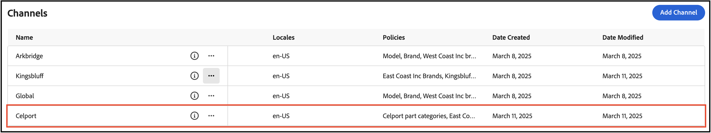

# Carvelo用例

>[!NOTE]
>
>本文档描述了早期访问开发中的产品，并未反映用于正式发布的所有功能。

以下用例演示了如何使用[!DNL Adobe Commerce Optimizer]组织目录以使用单个基础目录匹配零售操作。 还介绍了如何建立由Edge Delivery Services提供支持的店面。

## 前提条件

在了解此用例之前，请确保您已[设置您的店面](../storefront.md)。

## 让我们开始吧

在本例中，您将使用下列工具：

1. [!DNL Adobe Commerce Optimizer] UI — 设置所需的通道和策略以管理复杂的目录操作设置。

1. Commerce店面 — 使用[!DNL Adobe Commerce Optimizer] UI中设置的目录数据以及Commerce店面配置文件`fstab.yaml`和`config.json`渲染店面。

### 重要‌收获

在本文结束时，您将：

- 通过独特的性能和可扩展的目录数据模型了解[!DNL Adobe Commerce Optimizer]的基础知识。
- 了解目录数据模型如何与Adobe构建的与平台无关的店面组件无缝地联系起来。
- 了解如何使用Adobe Commerce Optimizer渠道和策略创建自定义目录视图和数据访问过滤器，并将数据发送到由Edge Delivery提供支持的Adobe Commerce店面。

## 业务方案 — Carvelo Automobile

Carvelo Automobile是一家虚构的汽车企业集团，拥有复杂的运营架构。


在这张图中，您会看到Carvelo销售三个品牌的汽车产品。 每个品牌都是不同的子公司：

- Aurora（电动汽车）
- 螺栓(SUV)
- Cruz（混合）

它通过三家经销商销售这些品牌：

- Arkbridge
- 金斯布拉夫
- Celport

这些经销商属于两家不同的母公司：

- 西海岸公司(Arkbridge)
- 东海岸公司(Kingsbluff， Celport)

每家公司都有两个价格手册，用于按特定价格向不同购物者(基础客户、VIP)销售产品。

- `west_coast_inc`和`vip_west_coast_inc`
- `east_coast_inc`和`vip_east_coast_inc`

如您所见，这是一个非常复杂的业务用例。 使用[!DNL Adobe Commerce Optimizer]，商家可以使用单个基本目录支持复杂的业务结构，以联合数据，而无需目录重复，扩展价格手册（超过30k的价格手册），并将所有这些数据提供给Edge Delivery Services店面。

现在您已大致了解了业务用例，下面是您在学习本教程时的目标：

>[!BEGINSHADEBOX]

Carvelo希望通过不同的经销商（Akbridge、Kingsbluff和Celport）跨三个品牌（Aurora、Bolt和Cruz）销售部件。 Carvelo希望确保各经销商根据各自的许可协议仅能获得正确的部件和价格。

最终，卡韦洛有两个主要目标：

1. 维护一个“全球”网站，该网站具有涵盖所有三个品牌的所有SKU。
1. 根据独特的SKU可见性和每个经销商的每个SKU价格，为经销商建立自己的店面提供途径。

>[!ENDSHADEBOX]

现在，访问您的[!DNL Adobe Commerce Optimizer]实例。

## 1.访问[!DNL Adobe Commerce Optimizer]实例

加入抢先体验计划后，Adobe会发送一封电子邮件，其中提供了用于访问为您提供的l[!DNL Adobe Commerce Optimizer]实例的URL。 此实例已预先配置您成功完成本教程中概述的步骤所需的一切，包括支持Carvelo Automobile使用案例的目录数据。

启动[!DNL Adobe Commerce Optimizer]时，您会看到以下内容：

![[!DNL Adobe Commerce Optimizer] UI](../assets/user-interface.png)

>[!NOTE]
>
>请参阅[概述](../overview.md)文章以了解有关构成[!DNL Adobe Commerce Optimizer] UI的不同部分的更多信息。

在左侧导航中，展开&#x200B;**[!UICONTROL Catalog]**&#x200B;部分并单击&#x200B;**[!UICONTROL Channels]**。 请注意，Arkbridge和Kingsbluff经销商已创建渠道：


>[!NOTE]
>
>您可以暂时忽略&#x200B;**全局**&#x200B;频道。

单击信息图标以查看渠道详细信息。

Arkbridge具有以下策略：

- 品牌
- 模型
- West Coast公司品牌
- Arkbridge部件类别

Kingsbluff具有以下策略：

- 品牌
- 模型
- East Coast Inc品牌
- Kingsbluff部件类别

在下一部分中，您将为Celport代理创建渠道和策略。

## 2.创建策略和渠道

Carvelo的商务经理需要为属于&#x200B;*East Coast Inc*&#x200B;公司的经销商&#x200B;*Celport*&#x200B;设置一个新店面。 赛尔波特将为Bolt和Cruz品牌销售刹车和悬架产品。


使用[!DNL Adobe Commerce Optimizer]，商务经理将：

1. 为Celport创建一个名为&#x200B;*Celport部件类别*&#x200B;的新策略，以仅销售刹车和悬架部件。
1. 为Celport店面创建新渠道。

   此渠道使用您新创建的政策&#x200B;*Celport部件类别*&#x200B;和现有的&#x200B;*East Coast Inc品牌*&#x200B;来确保Celport仅可销售Bolt和Cruz品牌，这是您与East Coast Inc达成的协议的一部分。Celport渠道将使用`east_coast_inc`价格手册来支持与品牌许可协议相符的产品定价计划。
1. 更新Commerce店面配置以使用您创建的Celport渠道中的数据。

在本节末尾，Celport将启动并运行，以销售Carvelo的产品。

### 创建策略

让我们创建一个名为&#x200B;*Celport部件类别*&#x200B;的新策略来过滤Celport经销商销售的SKU，包括制动和悬架部件。

1. 在左侧导航中，展开&#x200B;**[!UICONTROL Catalog]**&#x200B;部分并单击&#x200B;**[!UICONTROL Policies]**。

1. 单击&#x200B;**[!UICONTROL Add Policy]**。

   此时将显示一个新页面，用于添加策略详细信息。

1. 添加所需的详细信息：

   **名称** = *Celport部件类别*

1. 单击&#x200B;**[!UICONTROL Add Filter]**。

   此时会显示一个对话框以添加过滤器详细信息。

1. 添加筛选器详细信息：

   - **属性** = *part_category*
   - **运算符** = **IN**
   - **值Source** = **静态**
   - **值** = *制动器*，*暂停*

   >[!IMPORTANT]
   >
   >确保您指定的属性名称与目录中的SKU属性名称完全匹配。

   要了解有关STATIC和TRIGGER值源之间差异的更多信息，请参阅[值源类型](../catalog/policies.md#value-source-types)。

1. 在&#x200B;**[!UICONTROL Filter details]**&#x200B;对话框中，单击&#x200B;**[!UICONTROL Save]**。

1. 要启用刚刚创建的筛选器，请单击操作点(...)，然后选择&#x200B;**启用**。

1. 单击&#x200B;**[!UICONTROL Save]**。

   >[!NOTE]
   >
   >如果&#x200B;**[!UICONTROL Save]**&#x200B;按钮未处于活动状态（蓝色），则可能缺少策略名称。 单击&#x200B;*新策略*&#x200B;旁边的铅笔图标进行添加。

1. 通过单击后退箭头返回到策略列表。

   您的新&#x200B;*Celport部件类别*&#x200B;策略将显示在列表中。

### 创建渠道

为&#x200B;*Celport*&#x200B;经销商创建新渠道并链接以下策略： *East Coast Inc品牌*&#x200B;和&#x200B;*Celport部件类别*。

1. 在左侧导航栏中，展开&#x200B;**[!UICONTROL Catalog]**&#x200B;部分并单击&#x200B;**[!UICONTROL Channels]**。

   

   请注意现有渠道： *Arkbridge*、*Kingsbluff*&#x200B;和&#x200B;*Global*。

   

1. 单击&#x200B;**[!UICONTROL Add Channel]**。

1. 填写渠道详细信息：

   - **名称** = *Celport*
   - **作用域** = *en-US* （按Enter）
   - **策略** （使用下拉列表） = *East Coast Inc品牌*；*Celport部件类别*；*品牌*；*型号*                          

1. 单击&#x200B;**[!UICONTROL Add]**&#x200B;以创建渠道。

   “渠道”页面将更新以显示新渠道。

   

   >[!NOTE]
   >
   >如果&#x200B;**[!UICONTROL Add]**&#x200B;按钮不是蓝色的，请通过将光标置于&#x200B;**[!UICONTROL Scopes]**&#x200B;部分并按&#x200B;**enter**&#x200B;来确保选择范围。

1. 获取Celport通道ID。

   单击&#x200B;**渠道**&#x200B;页面上Celport渠道的信息图标。

   

   复制并保存渠道ID。 当您更新店面配置以向新的Celport目录传送数据时，需要此ID。

创建Celport渠道和相关策略后，下一步是配置店面以创建新的Celport目录。

## 3.更新店面

本教程的最后一段涉及更新[您已经创建的](#prerequisite)店面，以将数据交付到新的Celport目录。 在此部分中，您会将店面配置文件中的渠道ID替换为Celport的渠道ID。

1. 在本地开发环境中，打开您克隆GitHub存储库的文件夹以及店面样板配置文件。

1. 在文件夹的根目录中，打开`config.json`文件。

   +++config.json代码

   ```json
   {
    "public": {
      "default": {
      "commerce-core-endpoint": "https://www.aemshop.net/graphql",
      "commerce-endpoint": "https://na1-sandbox.api.commerce.adobe.com/Fwus6kdpvYCmeEdcCX7PZg/graphql",
      "headers": {
         "cs": {
            "ac-channel-id": "9ced53d7-35a6-40c5-830e-8288c00985ad",
            "ac-environment-id": "Fwus6kdpvYCmeEdcCX7PZg",
            "ac-price-book-id": "west_coast_inc",
            "ac-scope-locale": "en-US"
           }
         },
         "analytics": {
            "base-currency-code": "USD",
            "environment": "Production",
            "store-id": 1,
            "store-name": "ACO Demo",
            "store-url": "https://www.aemshop.net",
            "store-view-id": 1,
            "store-view-name": "Default Store View",
            "website-id": 1,
            "website-name": "Main Website"
          }
       }
      }
   }
   ```

   请注意，渠道标题包含以下行：

   - `ac-channel-id`：`"9ced53d7-35a6-40c5-830e-8288c00985ad"`
   - `ac-environment-id`： `"Fwus6kdpvYCmeEdcCX7PZg"`
   - `ac-price-book-id`： `"west_coast_inc"`

   +++

1. 将`ac-channel-id`值替换为您之前复制的Celport通道ID。
1. 如果需要，请将`ac-environment-id`值替换为您[!DNL Adobe Commerce Optimizer]实例的租户ID。 您可以在抢先体验计划的入门电子邮件中或通过联系您的Adobe客户代表来查找ID。

   确保`commerce-endpoint`值与[!DNL Adobe Commerce Optimizer]实例的GraphQL终结点匹配。

1. 将`ac-price-book-id`值替换为`"east_coast_inc"`。
1. 保存文件。

保存更改后，将更新目录配置以使用已配置为仅销售制动和悬架部件的Carvelo通道。

1. 启动店面以查看由您的店面配置创建的Celport特定的目录体验。

   1. 从IDE中的终端窗口中，开始本地店面预览。

      ```shell
      npm start
      ```

   浏览器将在`http://localhost:3000`处打开本地开发预览。

   如果命令失败或浏览器未打开，请查看Storefront设置主题中有关本地开发的[说明](../storefront.md)。

   1. 在浏览器中搜索`brakes`，然后按&#x200B;**Enter**。

      店面会更新以显示显示制动部件的产品列表页面。

   

   单击刹车部件图像，查看包含价格信息的产品详细信息并记录产品价格信息。

1. 现在搜索`tires`，它是在[!DNL Adobe Commerce Optimizer]实例上的用例数据中可用的另一个部件类别。

   

   请注意，不会返回任何结果。 这是因为Celport通道已配置为仅销售制动和悬架部件。

1. 尝试更新店面配置文件(`config.json`)。

   1. 更改`ac-channel-id`和`ac-price-book`值。

      例如，您可以将渠道ID更改为Kingsbluff渠道，将价格手册ID更改为`east_coast_inc`。 您可以通过查看&#x200B;*Kingsbluff部件类别*&#x200B;策略来查看Kingsbluff可用的部件类别。

   1. 保存文件。

      保存文件时，本地店面预览会自动更新。

   1. 使用“搜索”功能在浏览器中预览更改以查找轮胎部件。

      请注意不同的可用部件类型，并注意分配给Kingsbluff通道的价格。

      通过更改店面配置文件中的标题值并浏览更新的店面，您可以看到更新目录视图和数据筛选器以自定义店面体验是多么容易。

## 就是这样！

在本教程中，您已了解[!DNL Adobe Commerce Optimizer]如何帮助您使用单个基础目录组织目录以匹配零售运营。 您还学习了如何设置由Edge Delivery Services提供支持的店面。

## 从这里出发的方向

要了解如何使用产品发现和Recommendations为您的客户打造个性化的购物体验，请参阅[促销概述](../merchandising/overview.md)。
