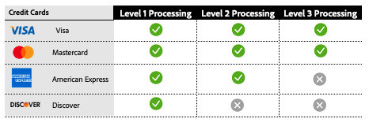

# 2级和3级处理

[!DNL Payment Services]提供高级卡处理功能，以帮助商家优化其支付交易并降低交换费用。 可用的卡处理分为三个级别，每个级别都有不同的交易数据要求。

>[!CAUTION]
>
> [Fastlane](payments-options.md#fastlane-button)订单不包括2级/3级数据、行项目和金额细分。

## 每个处理级别的数据要求

{width="500" zoomable="yes"}

[!DNL Payment Services]收集此数据并提供付款交易的详细报告。

## 按卡网络列出的可用处理级别

{width="500" zoomable="yes"}

有关详细信息，请参阅PayPal开发人员文档中的[付款处理](https://developer.paypal.com/docs/checkout/advanced/processing/){target=_blank}。

### 1级

级别1是最常见的，需要的信息较少，因此与级别2或级别3数据处理的交易相比，通常会产生较高的交换费用，这些数据通常与企业和购买信用卡有关。

### 第2级和第3级

如果Interchange Plus (IC++)上的[!DNL Payment Services]商家向卡网络提供其他交易详情并符合特定资格条件，则他们可能有资格进行第2级/第3级处理。 这些级别对于处理大量购买或公司卡流量的商户尤其有益，因为它们可以显着节省成本。 提供详细的级别2或级别3数据可以：

* 降低处理费用并优化整体成本
* 防止欺诈，降低处理器风险
* 增强交易安全性

查看[什么是IC++?有关详细信息，请参阅PayPal开发人员文档中的](https://www.paypal.com/us/brc/article/what-is-interchange-plus-plus){target=_blank}。

## [!DNL Payment Services]中的级别2和级别3卡付款交易记录

要获得第2级或第3级处理的资格，商家必须发送以前的信息，不过最终决定交易在处理时符合哪个级别的卡网络。

有关详细信息，请参阅PayPal开发人员文档中的[付款处理常见问题解答](https://www.paypal.com/us/cshelp/article/ts2278?_ga=1.131773126.875104296.1712843492){target=_blank}。

默认情况下，[!DNL Payment Services]商家在存储级别禁用级别2和级别3处理。

如果您已经在使用IC++定价，则可以使用2级和3级处理。 要启用此功能，可以通过[命令行界面(CLI](configure-cli.md))执行此操作。

>[!IMPORTANT]
>
>如果您有任何问题，请联系您的[!DNL Payment Services]客户经理。
